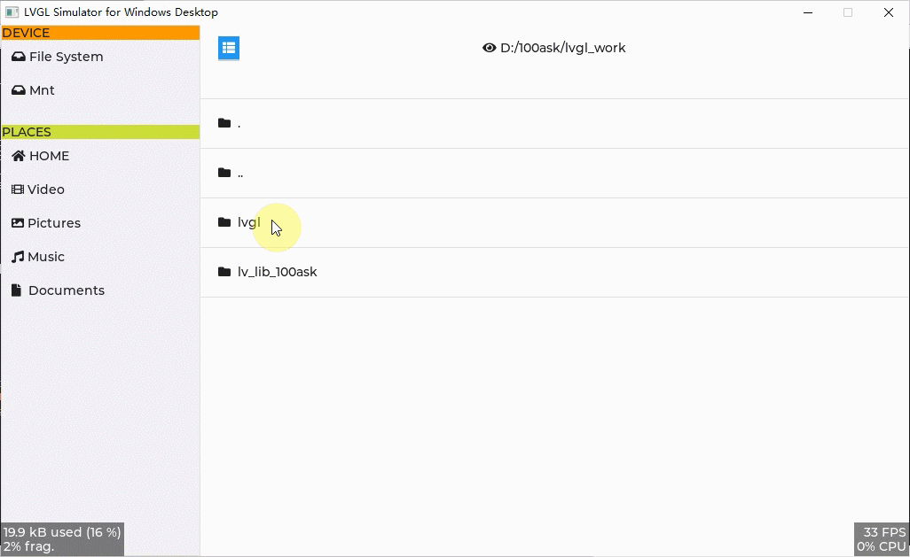

<h1 align="center"> lv_100ask_file_explorer</h1>

lv_100ask_file_explorer is a lightweight implementation of a simple and general file browser based on lvgl.

**English** | [中文](./README_zh.md) |

# Introduction
**lv_100ask_file_explorer** features：

- Lightweight, concise and expandable
- Quick access bar can be cropped
- Custom style
- more todo...

`lv_100ask_file_explorer` is very simple to use, and the subsequent custom expansion functions are also very convenient, so stay tuned for more functions.

# Usage

Refer to the example in **lv_lib_100ask/test/lv_100ask_file_explorer_test**.

# About
This is an open project and contribution is very welcome!
Contact us: smilezyb@163.com