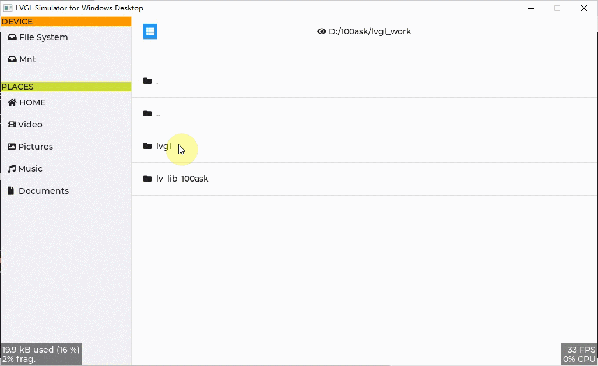

⚠️  lv_100ask_file_explorer已合入LVGL主线仓库，因此 lv_lib_100ask **不再更新** lv_100ask_file_explorer，获取最新源码请移步：

- 文档地址(有中文)：[https://docs.lvgl.io/master/others/file_explorer.html](https://docs.lvgl.io/master/others/file_explorer.html)
- 源码地址：[https://github.com/lvgl/lvgl/pull/3601](https://github.com/lvgl/lvgl/pull/3601)
- 使用示例：[https://docs.lvgl.io/master/others/file_explorer.html#example](https://docs.lvgl.io/master/others/file_explorer.html#example)

<h1 align="center"> lv_100ask_file_explorer</h1>

lv_100ask_file_explorer 是一个基于 lvgl 的简洁、通用的文件浏览器的轻量级实现。

[English](README.md) | **中文** |

# 前言
**lv_100ask_file_explorer** 特性：

- 轻量级、简洁、可拓展性强
- 快速访问栏可裁剪
- 自定义样式风格
- more todo...

`lv_100ask_file_explorer` 使用起来非常简单，后续自定义拓展功能也很方便，更多新功能敬请期待。

# 使用方法

参考 **lv_lib_100ask/test/lv_100ask_file_explorer_test** 的示例。

# 关于我们
这是一个开源的项目，非常欢迎大家参与改进lv_100ask_file_explorer项目！
作者联系邮箱: smilezyb@163.com