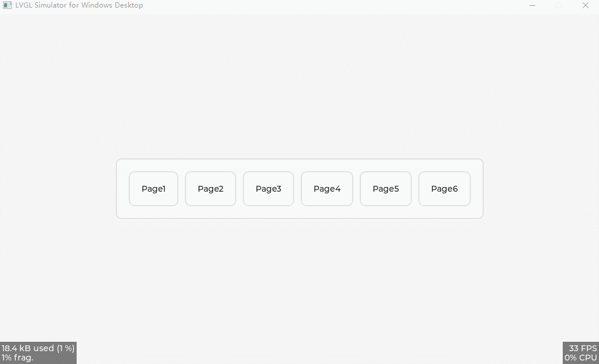

<h1 align="center"> lv_100ask_page_manager</h1>

lv_100ask_page_manager is a lvgl page manager.

**English** | [中文](./README_zh.md) |

# Introduction
**lv_100ask_page_manager** features：

- Support multi-level page switching
- Cross page switching
- Page switching transition animation
- You can specify whether to delete the current page when switching pages (save memory)
- Custom page transition animation (todo)
- Custom page return button (todo)
- Page selector (todo)
- more todo...

`lv_100ask_page_manager` is very simple to use, and the subsequent custom expansion functions are also very convenient, so stay tuned for more functions.

# Usage

Refer to the example in **lv_lib_100ask/test/lv_100ask_page_manager_test**.

# About
This is an open project and contribution is very welcome!
Contact us: smilezyb@163.com