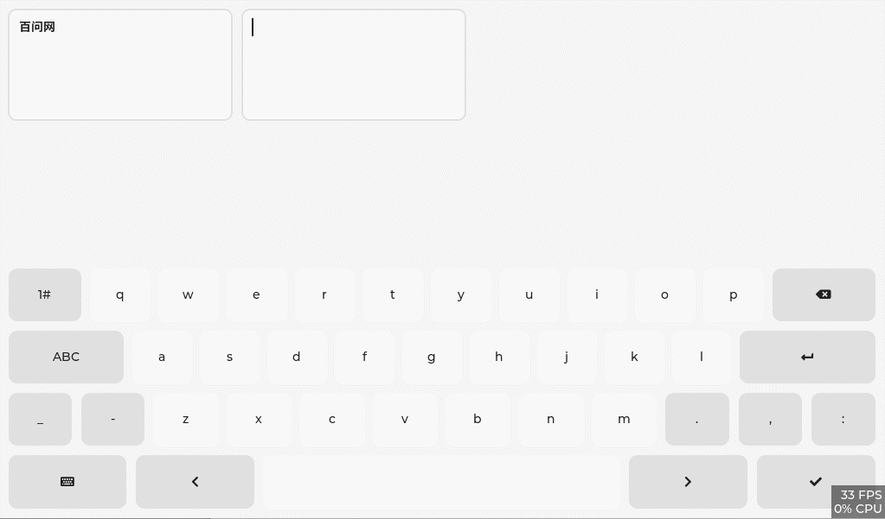

<h1 align="center"> lv_100ask_pinyin_ime</h1>

<p align="center">

</p>

<p align="center">
lv_100ask_pinyin_ime is a custom component written on the basis of lv_keyboard, it is no different from lv_keyboard, but the function of supporting Pinyin input method (Pinyin) is added.
</p>


**English** | [中文](./README_zh.md) |


# Introduction

`lv_100ask_pinyin_ime` is a custom component written on the basis of lv_keyboard (the creation interface is: `lv_100ask_pinyin_ime_create(lv_obj_t *parent));` ), it is no different from [lv_keyboard](https://docs.lvgl.io/master/widgets/extra/keyboard.html), but the function of supporting Pinyin input method (Pinyin) is added.

So we call it: **Support pinyin input method LVGL keyboard (lv_keyboard) widget enhancement plugin**.

Normally, as long as lvgl can run in an environment `lv_100ask_pinyin_ime` can also run! There are two main influencing factors: the size of the font file used and the size of the thesaurus used.

`lv_100ask_pinyin_ime` is very simple to use, and the subsequent custom expansion functions are also very convenient, so stay tuned for more functions.


# Usage
Refer to the example in **lv_lib_100ask/test/lv_100ask_pinyin_ime_test**.

# Custom dictionary
If you don't want to use the built-in Pinyin thesaurus, you can use the custom thesaurus.
Or if you think that the built-in phonetic thesaurus consumes a lot of memory, you can also use a custom thesaurus.

Customizing the thesaurus is very simple.

First, set `LV_100ASK_PINYIN_IME_ZH_CN_PIN_YIN_DICT` to `0` in `lv_lib_100ask_conf.h`

Then, write a thesaurus in the following format.

## Dictionary format
Write your own thesaurus according to the following format:

```c
lv_100ask_pinyin_dict_t your_pinyin_dict[] = {
            { "a", "啊阿呵吖" },
            { "ai", "埃挨哎唉哀皑蔼矮碍爱隘癌艾" },
            { "ba", "芭捌叭吧笆八疤巴拔跋靶把坝霸罢爸扒耙" },
            { "cai", "猜裁材才财睬踩采彩菜蔡" },
            /* ...... */
            { "zuo", "昨左佐做作坐座撮琢柞"},
            {NULL, NULL}

```

**The last item ** must end with '{null, null} ', or it will not work properly.

## Apply new dictionary
After writing a thesaurus according to the above thesaurus format, you only need to call this function to set up and use your Thesaurus:

```c
    lv_obj_t * pinyin_ime = lv_100ask_pinyin_ime_create(lv_scr_act());
    lv_100ask_pinyin_ime_set_dict(pinyin_ime, your_pinyin_dict);
```

# About
This is an open project and contribution is very welcome!
Contact us: smilezyb@163.com