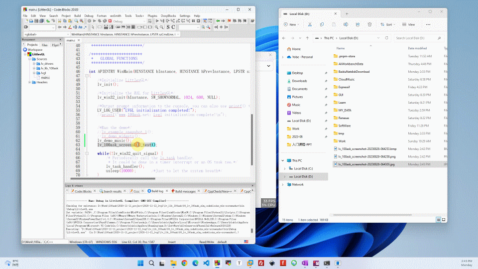

<h1 align="center"> lv_100ask_screenshot</h1>

lv_100ask_screenshot is a screenshot tool based on LVGL.

**English** | [中文](./README_zh.md) |

# Introduction

Video: [https://youtu.be/zR_niKRp0sI](https://youtu.be/zR_niKRp0sI)

**lv_100ask_screenshot** features：

- Save LVGL screen objects (full screen) as image files: lv_scr_act(),layer_sys(),layer_top()
- Capture and save the specified LVGL object and its children as an image file
- Supported save as: BMP, PNG, JPG
- more todo...

`lv_100ask_screenshot` is very simple to use, and the subsequent custom expansion functions are also very convenient, so stay tuned for more functions.

# Usage

Refer to the example in **lv_lib_100ask/test/lv_100ask_screenshot_test**.

# About

This is an open project and contribution is very welcome!

[https://www.100ask.net](https://www.100ask.net)
