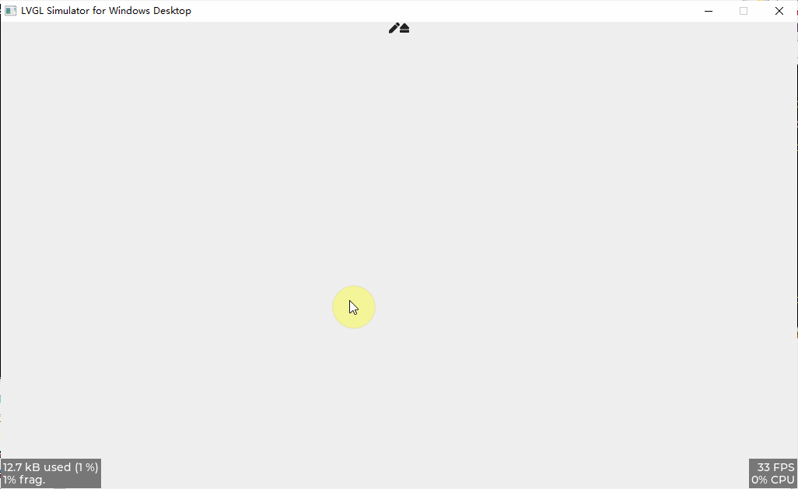

<h1 align="center"> lv_100ask_sketchpad</h1>

lv_100ask_sketchpad is a lvgl page manager.

**English** | [中文](./README_zh.md) |

# Introduction
**lv_100ask_sketchpad** features：

- Custom canvas style
- Custom brush color
- Custom brush size
- more todo...

`lv_100ask_sketchpad` is very simple to use, and the subsequent custom expansion functions are also very convenient, so stay tuned for more functions.

# Usage

Refer to the example in **lv_lib_100ask/test/lv_100ask_sketchpad_test**.

# About
This is an open project and contribution is very welcome!
Contact us: smilezyb@163.com