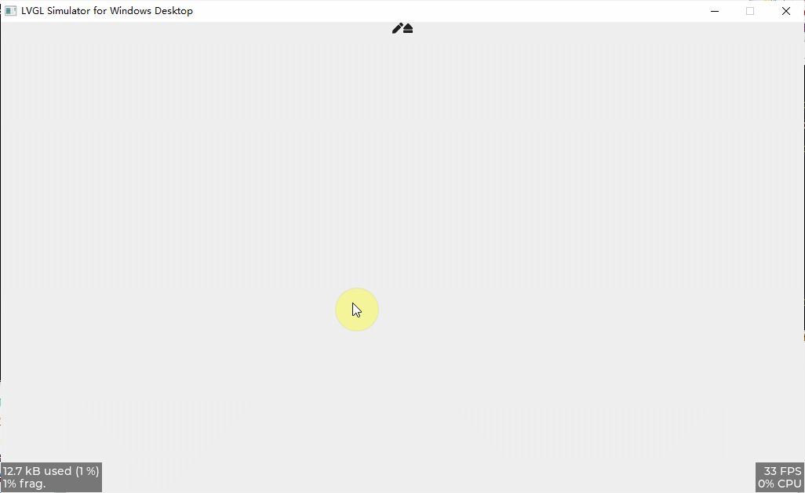

<h1 align="center"> lv_100ask_sketchpad</h1>

lv_100ask_sketchpad 是一个基于 lvgl 的画板。

[English](README.md) | **中文** |

# 前言
**lv_100ask_sketchpad** 特性：

- 自定义画布样式
- 自定义画笔颜色
- 自定义画笔大小
- more todo...

`lv_100ask_sketchpad` 使用起来非常简单，后续自定义拓展功能也很方便，更多新功能敬请期待。

# 使用方法

参考 **lv_lib_100ask/test/lv_100ask_sketchpad_test** 的示例。

# 关于我们
这是一个开源的项目，非常欢迎大家参与改进lv_100ask_sketchpad项目！
作者联系邮箱: smilezyb@163.com