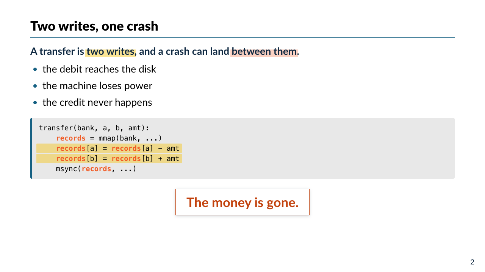
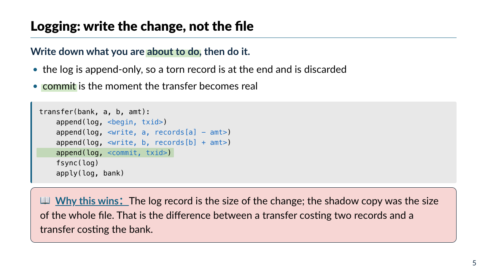
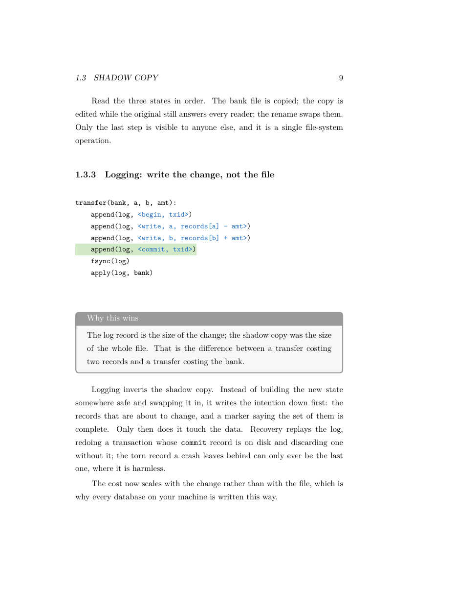
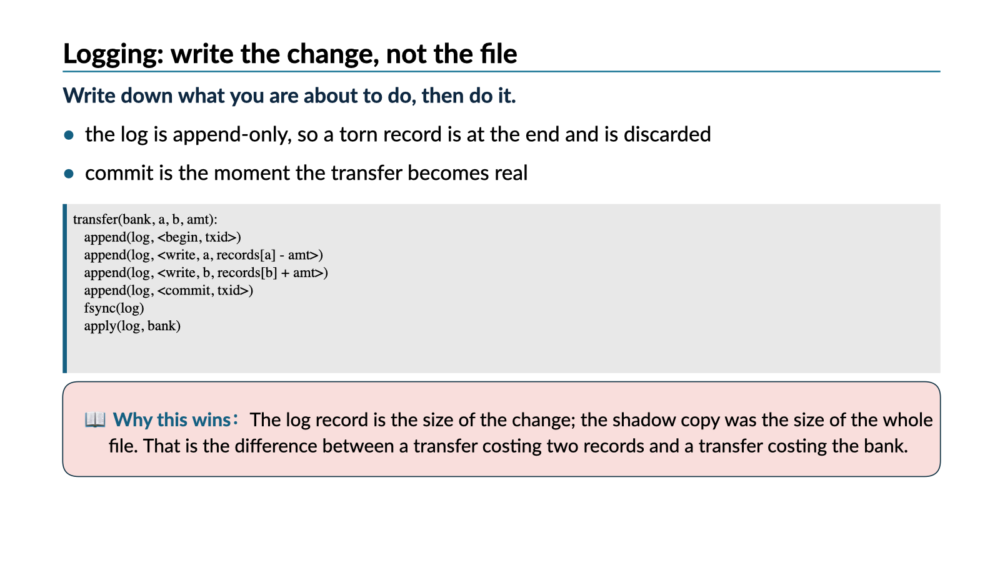
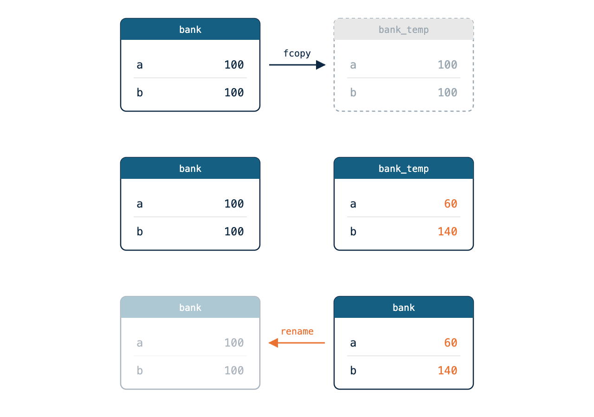
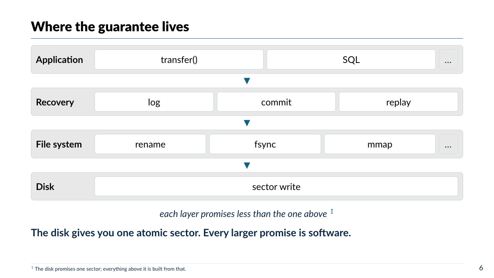
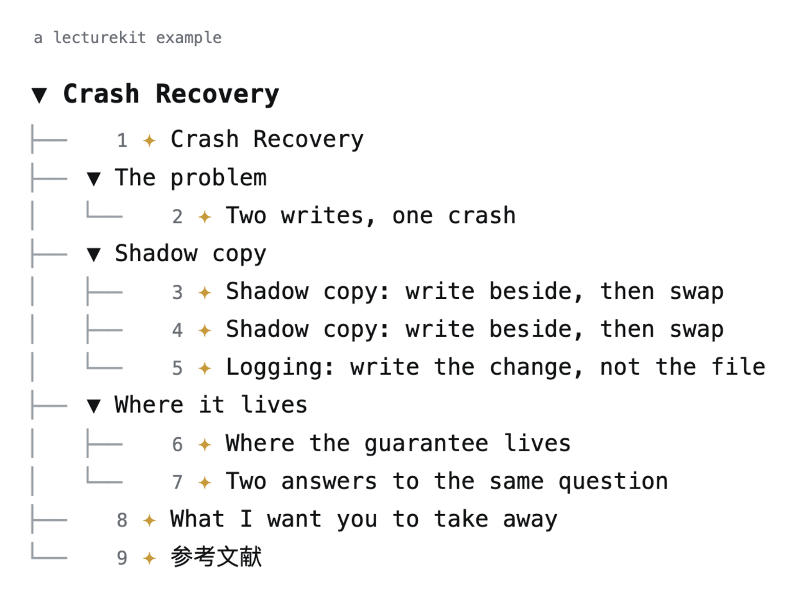

# lecturekit

Write a lecture as Python; render it as a slide deck, an editable PowerPoint,
or a chapter of a LaTeX textbook.

## Quick start

```bash
pip install -e .
scripts/prepare.sh                                      # vendors marp-cli (needs Node)

python3 -m lecturekit.cli view examples/showcase        # open the example deck
python3 -m lecturekit.cli view examples/showcase --watch   # live-reload while editing
python3 -m lecturekit.cli book examples --compile       # the same pages as a book chapter
```

Your own lecture is a directory with `lecture.py` (plus optional `pages.py` and
`assets/`); point `view` at it. To drive one from a Jupyter notebook instead,
see [docs/notebook.md](docs/notebook.md).

## What it looks like

A page is a function that fills a `PageBuilder`. This is the entire source of
the slide under it:

```python
def atomicity(p):
    p.title("Two writes, one crash")
    p.slide("""
A transfer is ==two writes==, and a crash can land ==orange:between them==.
- the debit reaches the disk
- the machine loses power
- the credit never happens
""")
    p.code("pseudo", TRANSFER, mark=[3, 4])
    p.highlight("The money is gone.", tone="orange")
```



No colours, sizes, or positions in the source — `==…==` marks a word, `mark=`
marks a line, the first line is the headline, and the theme decides what that
looks like.

### One page, three targets

The same function, unedited, as a slide, a book page, and a PowerPoint slide
(click for full size). Figures, code, and sidenotes are authored once; only the
running text is written twice, as `p.slide(...)` and `p.prose(...)`.

| deck (`view`) | book (`book`) | PowerPoint (`--to pptx`) |
| --- | --- | --- |
| <a href="docs/images/slide-logging.png"></a> | <a href="docs/images/book-page.png"></a> | <a href="docs/images/pptx-slide.png"></a> |

### More of the vocabulary

`p.frames(a, b, c)` is an animation: the text written once, the figure swapped
under it. All three frames count as one slide.



`arch.layer(title, modules)` says what is stacked on what; the theme draws it.



`p.demo(name, command, output=…)` is a command the lecture runs on stage. Every
target shows the command and the output you recorded, so the page carries its
point on paper too; under `view --watch --demo` the ▶ button runs the real thing
in the lecture directory and streams what comes back into a drawer along the
bottom — a token at a time, so `ollama run` is watched rather than waited for.
Each press opens its own tab in that drawer and the runs go on side by side, so
`ollama serve` can hold one tab while the next talks to it; a tab's ✕ closes
that one run, hiding the drawer leaves them all running, and turning the page
stops them all. The page carries only a
hash of the command, so the browser can ask for one the author wrote and nothing
else.

`view` opens the lecture as its outline. Click a row to jump to that slide,
`←`/`→` to page, `≡ 大纲` to come back.



## Docs

- [docs/dsl.md](docs/dsl.md) — the authoring DSL: tree, blocks, images, tables, footnotes, callouts
- [docs/usage.md](docs/usage.md) — the CLI: `inspect` / `build` / `render` / `view`, PDF/PNG/PPTX export, live preview
- [docs/book.md](docs/book.md) — the book target: many lectures, one LaTeX textbook
- [docs/i18n.md](docs/i18n.md) — teaching one lecture in two languages (`--lang`)
- [docs/notebook.md](docs/notebook.md) — slides inline in a Jupyter notebook
- [docs/theme.md](docs/theme.md) — how one theme feeds every renderer; where to add a target

## Test

```bash
pip install -e ".[dev]"
python3 -m pytest
```
