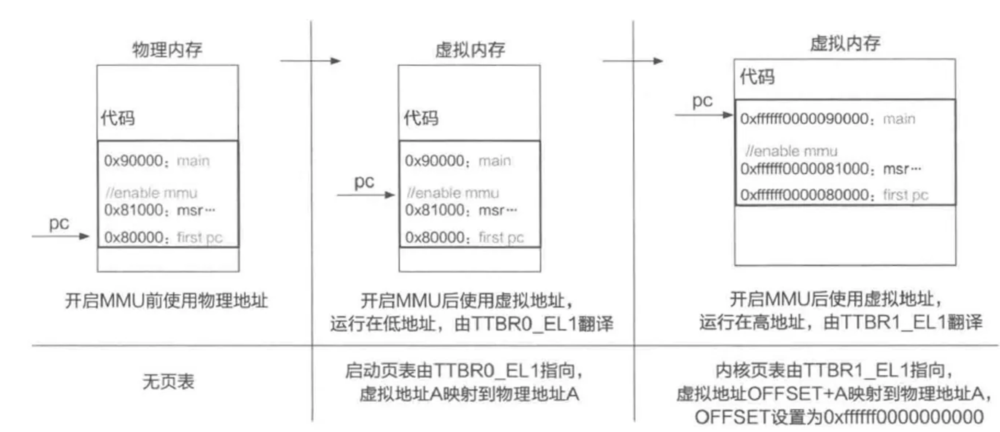

# 教材补充

<aside>

> [!INFO]
> 本章节将从我们lab的配套教材《操作系统原理与实现》（机械工业出版社）入手，补充与lab相对应的相关知识，方便读者更好的吸收与理解。我们会列举出每一个知识点对应的原著章节，便于读者查阅。本章节并不会成为教材内容的简单复述，而是希望提取出与lab内容相关的知识点，阐述他们在ChCore中的体现，进行比对学习，更好地理解我们的ChCore。

</aside>

# 一、ChCore启动与异常向量表初始化

> [!TIP]
> 推荐阅读：3.2   操作系统的硬件运行环境


## 1、特权级别与系统ISA

为了区分应用程序和操作系统的运行权限，CPU为两者提供了不同的特权级别：**用户态和内核态**。ISA（指令集架构）作为CPU向软件提供的接口，也对应地分为用户ISA和系统ISA，在用户态运行的软件只能使用**用户ISA**，在内核态运行的软件则可以**同时使用系统ISA和用户ISA**。

我们举例说明：

（1）通用寄存器、栈寄存器、条件码寄存器、运算指令等，都属于用户ISA

（2）系统ISA则包含系统状态、系统寄存器与系统指令。其中，系统状态包括当前CPU的特权级别、CPU发生错误时引发错误的指令地址、程序运行状态等。存储这些状态的寄存器称为系统寄存器，这些寄存器只能由运行在内核态的软件通过系统指令来访问。

### 案例分析：ARM的特权级别和系统ISA

接下来我们以AArch64为例介绍CPU特权级别和系统ISA的一种具体实现。

在AArch64中的特权级别被称为异常级别（Exception Level, EL），共分为4个级别，具体如下：
    
- EL0：用户态，**应用程序**通常运行在该特权级别。
- EL1：内核态，**操作系统**通常运行在该特权级别。
- EL2：用于虚拟化场景，**虚拟机监控器**通常运行在该特权级别。
- EL3：与**安全特性**TrustZone相关，负责普通世界和安全世界之间的切换。


这里需要注意的一点在于，对于许多ISA来说，当CPU运行在内核态运行用户ISA，一般会使用用户ISA的寄存器（如SP），这也是为什么从用户态切换到内核时，首先需要将用户态寄存器的值保存到内存。但是AArch64的做法是，为一些常用的用户态寄存器在不同特权级提供不同的硬件副本。例如对于栈寄存器SP，AArch64**提供了SP_EL0（用户态）与SP_EL1（内核态）**。其中，用户态在函数调用时使用SP_EL0，无法访问SP_EL1；内核态则使用SP_EL1。但也有权限读写SP_EL0。

AArch64的系统寄存器负责保存硬件系统状态，以及为操作系统提供管理硬件的接口。系统ISA提供了mrs和msr两条特权指令，其作用是从系统寄存器中读取值（获取系统信息）或向系统寄存器中写入值（控制系统状态）。系统ISA的指令只有在特权态才能运行，CPU在执行相关指令前会**先根据PSTATE中的状态来判断是否合法**。例如，当PSTATE记录当前运行级别为EL0时，CPU运行的指令无权访问ELREL1系统寄存器。由于AArch64有多个特权级，因此对于系统寄存器，也需要通过类似的后缀来表明这些寄存器在哪一个特权级下使用，例如TTBR0EL1（一阶段页表基地址寄存器）和TTBR0_EL2（用于虚拟化的二阶段页表基地址寄存器）。

## 2、异常机制与异常向量表

经过ICS的学习，相信我们的读者对于异常机制已经非常熟悉了，这里我们用一张图回顾一下异常控制流


当操作系统发生异常事件导致“下陷”到内核态时，CPU只允许从固定的入口开始执行。为此，操作系统需要提前将代码的入口地址“告诉”处理器。对不同类型的异常事件，CPU通常支持设置不同的入口。这些**入口**通常以一张表的形式记录在内存中，也就是异常向量表，由操作系统负责构造。在系统启动后，操作系统会将**异常向量表的内存地址**写入CPU上的一个特殊寄存器——**异常向量表基地址寄存器**（如AArch64中的VBAR_EL1寄存器），然后开启中断，这样便完成了异常机制的初始化。

> [!CAUTION]
> 有些情况在x86架构中会触发异常，在ARM架构中则不会。例如在进行整数除法时，如果除数是零，就会引入通用寄存器无法表示的无穷大量或无穷小量，因此处理器往往会对除数为零的情况进行特别处理。在x86架构中，除零是异常情况，会下陷到操作系统进行处理；而在AArch64架构中，除零的结果还是零，被视为有效计算。在设计操作系统时，应当考虑到此类硬件设计细节上的区别。
> 

## 3、将目光投向ChCore

经过我们前置知识的铺垫，我们了解到，异常向量表定义了操作系统的入口，因此异常向量表的初始化是启动后立即要做的重要步骤。

在计算机启动时，CPU 执行的第一段代码其实并非 ChCore 的代码。以在树莓派上运行 ChCore为例，在加电后，**主板中的固件和 SD 卡中的 bootloader** 将先后被加载到内存并运行，进行基本的初始化工作。之后，ChCore 的二进制文件将被 bootloader 加载到内存中约定好的位置，这时才从头开始执行 ChCore 的代码。

这里我们的读者可能会疑惑：bootloader是什么？有什么作用呢？

> [!INFO]
> **Bootloader**就像是电脑的“**启动助手**”，它的工作是帮助电脑从关机状态启动到操作系统。想象一下，你有一个复杂的拼图游戏，Bootloader就是那个帮你把拼图的第一块放好的人。
> 

> [!INFO]
> **Bootloader的作用**：Bootloader的主要任务是从存储设备（如硬盘、SD卡）中加载操作系统到内存中，并开始执行操作系统的代码。它确保操作系统能够顺利启动。
> 

> [!INFO]
> **Bootloader的例子**：在树莓派上，Bootloader就是那个从SD卡中读取ChCore操作系统的小程序。它把ChCore加载到内存中，然后告诉CPU从哪里开始执行ChCore的代码。
> 

```nasm
1 _start:
2 mrs x8, mpidr_el1
3 and x8, x8, #0xFF
4 cbz x8, primary
5
6 /* Code for secondary core */
7 ...
8 /* Init exception vector */
9 bl set_exception_vector
10 ...
11
12 primary:
13 /* Code for primary core */
14 /* init UART, Virtual Memory mapping in C */
15 ...
16 /* Init exception vector */
17 adr x0, el1_vector
18 msr vbar_el1,x0
19 ...
20
21 /* Exception Table */
22 el1_vector:
23 /* entry for other type of exception */
24...
25
26 /* entry for synchronous exception from ELO */
27 align 7   // 128 bytes for each entry
28 b sync_e10_64
29
30 /* entry for interrupt from ELO */
31 align 7  //128 bytes for each entry
32 b irq_el0_64
33
34 /* entry for other type of exception */
35 ...
```

如代码片段所示，ChCore起始位置的代码为_start，这便是进入ChCore时执行的第一段代码。在多核机器中，所有核心都会同时开始执行_start，ChCore 需要选择某个 CPU 核心作为主要核心（通常是第一个）来初始化操作系统，同时其他核心将被暂时阻塞。AArch64为我们提供了**MPIDR这个系统寄存器来获取当前CPU 核心的编号**。

通过系统指令 mrs x8，mpidr_el1 来读取 MPIDR 的值，然后判断当前核心是否为主核。**主核进入初始化流程**，其他核心等待主核完成初始化。

这里主要关注其中对异常向量表的初始化。在上述代码中，异常向量表存放在el1_vector代表的位置。在AArch64中，异常向量表中的每一项都可以存放128字节的指令，但ChCore**只存放了一条跳转指令**，用于跳转到不同异常事件对应的处理函数。例如，对于来源于用户态的同步异常，内核将跳转到sync_el0_64，并在其中保存通用寄存器，根据异常的详细信息进行不同的处理；对于异步异常（即中断），内核将跳转到irq_el0_64，并执行相应的处理。

在编译ChCore时，异常向量表的内容已按照AArch64的布局在二进制文件中构造好了。在启动阶段，异常向量表便作为二进制文件的一部分被bootloader直接加载到内存中。因此，进入内核后，ChCore只需要将异常向量表的起始地址放入指定的系统寄存器，便可完成异常向量表的初始化工作。

上述代码中，ChCore将el1_vector代表的异常向量表起始地址，通过msr指令存储到VBAR_ELl寄存器中。之后发生异常事件时，处理器便能跳转到VBAR_ELl寄存器指向的异常向量表中对应的表项，并跳转到操作系统内核进行处理。

## 4、系统调用的优化

- 在上文中，我们讲述了通过异常机制实现系统调用，但是这种方法实现的系统调用需要执行特权级别切换、上下文保存等操作，十分费时。如何绕过费时的异常机制来实现系统调用呢？
- 第一种方法是**将一部分数据以只读的形式共享给应用**，但如果系统调用需要修改内核中的变量或者在运行过程中需要读取更多内核数据，这种方法就不适用了。
- 第二种方法是应用以“向某一内存页写入请求”的方式发起系统调用，并通过**轮询**等待系统调用完成，内核同样通过轮询来等待用户的请求，然后执行系统调用，并将系统调用的返回值写入同一块内存页以表示完成。

<aside>

- 关键点在于：内核**独占一个CPU核心**，这个核心一直在内核态运行，而其他CPU核心一直在用户态运行。
</aside>

面临的问题及解决方法

（1）如何处理顺序处理时延问题？——让**多个CPU核心同时运行在内核态**并轮询用户的请求

（2）只有一个CPU核心时该怎么办？——轮询改为**批处理**。即当CPU运行在用户态时，应用程序一次发起多个系统调用请求，同样将请求和参数写入共享内存页，然后CPU切换到内核态，内核一次性将所有系统调用处理完，把结果写入共享内存页，再切换回用户态运行。

<aside>


批处理的优点不在于时延，而在于**系统的整体吞吐率**：即降低系统整体的特权级的切换次数从而增加单位时间内的有效工作量。

</aside>

# 二、ChCore虚拟内存管理

> [!TIP]
> 推荐阅读：4.1-4.3  虚拟内存管理
> 

## 1、CPU的职责：内存地址翻译

### 1、地址翻译

CPU中的**内存管理单元(MMU)**负责地址翻译：应用进程在CPU核心上运行期间，使用的虚拟地址会由MMU进行翻译。当需要访问物理内存时，MMU翻译出来的物理地址将会通过总线传到物理内存，从而完成物理内存读写请求。
       
现代CPU中常包含转址旁路缓存(Translation Lookaside Buffer,TLB)作为加速地址翻译的部件(TLB是MMU 内部的硬件单元）。

### 2、分页机制

页表：操作系统为每个应用进程构造的一张记录从虚拟页到物理页的映射关系表；

页表基地址寄存器：存储页表的起始地址，在AArch64平台中称为TTBR。

在页表机制下，每个虚拟地址由两部分组成：第一部分标识虚拟地址的虚拟页号；第二部分标识虚拟地址的页内偏移。在地址翻译过程中，MMU首先解析得到虚拟地址中的虚拟页号，并通过虚拟页号去该应用进程的页表中找到对应条目，然后取出条目中存储的物理页号，最后用该物理页号对应的物理页起始地址加上虚拟地址的页内偏移，得到最终的物理地址。

### 3、多级页表

为压缩页表大小，MMU采用了多级页表。前面提到，在使用简单的单级页表时，一个虚拟地址将被划分为两部分——虚拟页号和页内偏移。当使用k级页表时，一个虚拟地址的虚拟页号将被进一步地划分成k个部分（虚拟页号0，……，虚拟页号i，0≤i<k),其中虚拟页号i对应该虚拟地址在第i级页表中的索引。当任意一级页表中的某一个条目为空时，该条目对应的下一级页表不需要存在，依次类推，接下来的页表同样不需要存在。因此，多级页表的设计极大减少了页表占用的空间大小。换句话说，多级页表允许整个页表结构中出现“空洞”，而单级页表则需要每一项都实际存在。通常，应用进程的虚拟地址空间中绝大部分的虚拟地址都不会被使用，所以多级页表通常具有很多“空洞”，从而能够极大地节约所占空间。

AArch64体系结构下一般为虚拟地址低48位参与地址翻译，页表级数为4级，虚拟页大小为4KB。

### 4、页表项与大页

中间级的页表项直接指向物理页时，其指向的是大页（比下一级页表项指向的物理页大小更大）。此外页表项也可以存储一些属性位，允许操作系统设置读写等权限。若实际访问所需权限和页表项中设置的权限不一致，则MMU会在地址翻译中出发访问异常。下图为页表项格式


### 5、TLB：页表的缓存

为了减少多级页表下地址翻译过程中的访存次数， MMU 引入转址旁路缓存（TranslationLookaside Buffer， TLB）部件来加速地址翻译的过程。具体来说， TLB缓存了虚拟页号到物理页号的映射关系。我们可以把 TLB 简化成存储着键值对的哈希表，其中键是虚拟页号，值是物理页号。MMU 会先把虚拟页号作为键去查询 TLB中的缓存项，若找到则可直接获得对应的物理页号而无须再查询页表。我们称通过TLB能够直接完成地址翻译的过程为TLB命中（TLB Hit），反之为TLB不命中（TLB Miss）。

## 2、操作系统的职责：管理页表映射

CPU在上电启动后会默认使用物理地址，这是因为MMU的地址翻译功能还未开启，而操作系统则负责在初始化过程中启用该功能。一旦启用MMU地址翻译，CPU会根据页表对指令执行中涉及的地址进行翻译，即认为这些地址都是虚拟地址，因而操作系统和应用进程在后续运行中都是使用虚拟地址。因此，操作系统除了需要为每个应用进程设置页表外，也需要为自己配置页表。

通常，操作系统为自己配置的页表具有两个特点：

第一，操作系统一般使用高虚拟地址，比如对于AArch64来说，操作系统使用高16位为1的虚拟地址；应用进程使用低虚拟地址，在AArch64中即为高16位为0的虚拟地址。

第二，操作系统一般会一次性将全部物理内存映射到虚拟地址空间中。映射方式为直接映射（Direct Mapping），即虚拟地址=物理地址+固定偏移。操作系统所使用的虚拟地址空间也称为**内核地址空间**。通过上述固定偏移的页表映射方式，操作系统能够在内核地址空间中很方便地在物理地址和虚拟地址之间进行转换。当操作系统需要访问一个物理地址时，仅需要访问该物理地址加上固定偏移的虚拟地址即可。

下图为AArch64体系结构下的操作系统页表和应用进程页表


## 3、ChCore虚拟内存管理

### 1、ChCore内核页表初始化

由于需要为应用程序提供虚拟内存抽象，操作系统启动期间会启用MMU。在启用后，MMU也会对操作系统执行期间使用的地址进行翻译，因此操作系统在启用MMU之前需要首先初始化自己的页表。
        
通常，操作系统对页表的配置分为两个阶段：第一阶段是启动初期，此时操作系统运行在低地址区域，页表将虚拟地址映射为完全相同的物理地址（VA=PA）；第二阶段是在跳转到高地址运行后，页表将虚拟地址映射为物理地址加上固定偏移（VA=PA+偏移量）。

```cpp
1 BEGIN_FUNC(_start) 
2   //内核运行的第一条指令：获取CPUID
3 mrs x8, mpidr_el1 
4 and x8, x8, #0xFF 
5   //若当前是0号CPU，则跳转到主CPU初始化处执行
6 cbz x8, primary 
7 ...
8 
9 primary: 
10
11  //设置特权级别为EL1，即进入内核态执行
12 bl change_el_to_ell 
13
14  //设置内核启动期间的栈桢
15 adr x0, boot_cpu_stack 
16 add x0, x0, #INIT_STACK_SIZE 
17 mov sp, x0 
18
19  //调用C代码编写的初始化函数
20 bl init 
21
22  //init函数不返回，控制流不会到这里
23 b .
24 END_FUNC(_start) 
25
26
27 void init(void) 
28{
29 ...
30 
31  //初始化内核页表 
32 init_kernel_pt(); 
33
34  //启用MMU 
35 el1_mmu_activate(); 
36
37  //该函数位于高地址，且不返回
38 do_other_initialization(); 
39
40  //控制流不会到这里
41 }
```

延续上一节的代码，当判断为主核时，进入主核的初始化流程。

ChCore第一步会先把CPU特权级别设置为EL1（对应内核态），然后设置栈桢并调用C代码编写的初始化函数。

现在我们将目光放到下面的init函数上。在该函数中，ChCore首先配置自己的页表(init_kernel_pt函数)，其中会配置两份页表(boot_ttbr0_10负责 低地址范围的映射，而boot_ttbr1_10对应高地址范围的映射），然后启用MMU。

操作系统启动时的第一条指令一般在较低的地址，这是来自硬件/固件的要求。应用程序通常使用低地址，而操作系统使用高地址，所以操作系统启动期间需要跳转到高地址运行。因而ChCore在启用MMU后，会跳转到高地址继续执行剩余的初始化操作，此后将使用TTBR1_EL1中存储的页表进行翻译。

> [!HINT]
> 对于高地址范围（TTBR1_EL1对应的翻译），操作系统通常选择固定偏移（虚拟地址等于物理地址加上固定偏移）的映射方式，原因有两个：第一，两条在物理地址上相邻存储但跨越两个物理页的指令，要求对应的虚拟页也相邻，固定偏移映射是能满足该要求的最简单的方式；第二，操作系统通过简单的算术运算即可完成虚拟地址和物理地址之间的转换。
> 

```cpp
1 #define SCTLR_EL1M (1)
2
3 BEGIN_FUNC(el1_mmu_activate)
4 ...
5 
6 //设置页表基地址寄存器
7 adrp x8, boot_ttbr0_10 
8 msr ttbroel1, x8 
9 adrp x8, boot_ttbr110 
10 msr ttbr1el1, x8 
11 ...
12 
13 mrs x8, sctlr_el1 
14 ...
15 orr x8, x8, #SCTLR_EL1_M 
16 msr sctlr_el1, x8 
17 isb 
18 
19 ...
20 END_FUNC(e11_mmu_activate) 
```

上面这段代码展示了如何启用MMU，el1_mmu_activate函数首先在两个页表基地址寄存器中写入页表基地址，然后将系统寄存器sctlr_el1的第0位设置为1，即SCTLR_EL1_M位，从而开启MMU。

注意，从启动第一条指令到el1_mmu_activate 函数中的isb指令之间，MMU都未开启，ChCore使用的是物理地址；而从isb指令开始，由于MMU已经开启，指令地址也会经过地址翻译。假设isb指令的上一条msr指令所在的物理地址是0x81000（即存放在物理内存中的位置），那么isb指令的物理地址则是0x81004。

CPU在执行msr指令时，PC中存放的指令地址是0x81000，由于MMU尚未启用，CPU是通过物理地址0x81000取出该指令的。CPU执行完msr指令后，PC中存放的指令地址是0x81004（准备执行isb指令），由于MMU已经启用，CPU中的MMU会对PC中的地址进行地址翻译（把0x81004作为虚拟地址），而isb指令的物理地址是0x81004，所以页表中的地址映射需要虚拟地址与物理地址完全相同。

下图展示了ChCore的启动过程：先使用物理过程，在使用经由启动页表翻译的虚拟地址，之后使用经由内核页表翻译的虚拟地址。



### 2、ChCore内存管理

```cpp
1 struct vmspace
2 //vmregion链表
3 struct list_head vmr_list;
4 //页表基地址（虚拟地址）
5 vaddr_t *pgtbl;
6 //用于修改地址空间的并发控制
7 struct lock vmspace_lock
8
9 ...
10 };
```

上述代码片段给出了虚拟地址空间vmspace结构体中的三个成员变量。
        
vmr_list是链表头，指向一个由虚拟地址区域组成的链表。应用进程的虚拟空间最大可达2^48，但是往往其中大部分都是未被使用的区域。ChCore将一个应用地址空间内**有效使用**的虚拟地址区域保存在该链表里。
        
gtbl存储着这个虚拟地址空间对应的页表基地址。需要注意的是，pgtbl存储的地址是虚拟地址，由操作系统使用；对应的物理地址填在页表基地址寄存器中，由MMU使用。ChCore在映射内核地址空间的时候，会保证内核虚拟地址和真正映射的物理地址之间相差一个固定的偏移量（直接映射）。因此，ChCore很容易根据pgtbl这个虚拟地址计算出真正应该写入页表基地址寄存器中的物理地址（在vmspace 中记录页表基地址的物理地址也是可行的，因为直接映射使虚拟地址和物理地址之间的转换变得很方便）。

```cpp
1 struct vmregion {
2 //链表中的一个节点，存储着prev和next指针
3 struct list_head node; 
4 //区域起始地址 
5 vaddr_t start; 
6 //区域大小 
7 size_t size; 
8 //访问权限 
9 vmr_prop_t perm; 
10 //对应的物理内存对象
11 struct pmobject *pmo; 
12 }； 
```

上述代码给出了虚拟地址区域vmregion结构体中的成员变量。其中，成员变量 node将不同的vmregion对象连成链表，成员变量 start 和size分别标识该虚拟内存区域的起始地址和区域大小，成员变量perm标识该区域的读、写、执行权限，最后一个成员变量pmo标识映射到该区域的物理内存对象。实验内核采用简单的映射关系，只有一个物理内存对象映射到一个虚拟内存区域。

ChCore实验内核以对象的形式进行物理内存资源的管理。物理内存对象pmobject分为不同的类型，由type成员标识，包含以下类型。

> [!INFO]
> PMO—DATA：课程实验中常用的类型，表示一段连续物理内存区域，即连续的物理页。在该类型中，成员变量start和size分别表示对应物理内存区域的起始地址和总大小。创建该类型的对象会立即进行物理内存分配，该类型的对象通常建被用来映射给虚拟地址空间中的代码和数据区域，映射后不会发生缺页异常。
>
> PMO—ANONYM：该类型的物理内存对象同样表示物理页的集合，但是不要求物理型页连续。分配该类型的对象不会立即触发物理内存分配，而是在访问时通过缺页型异常进行按需分配，其中成员变量radix将记录所有分配的物理页。虚拟地址空间中的堆区域适合映射该类型的物理内存对象。
>
> PMO—SHM：该类型的物理内存对象用于实现应用进程之间的共享内存，即不同虚拟地址空间中的虚拟内存区域可以映射到同一个物理内存对象。成员变量refcnt表示对象的引用计数，当计数为0时，即可回收对应的物理内存资源。
>
> PMO—USER_PAGER：表示对应的虚拟内存区域由用户态进行管理。
>

> [!SUCCESS]
> 至此，教材附加阅读内容部分到此结束，希望能对你的学习有所裨益！
>
