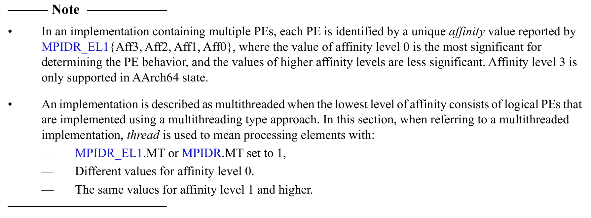

# 内核启动

## 目录

- [内核启动](#内核启动)
  - [目录](#目录)
  - [多内核启动及设置](#多内核启动及设置)
    - [总览](#总览)
    - [启动 CPU 0 号核](#启动-cpu-0-号核)
    - [如何让内核依次启动？](#如何让内核依次启动)
      - [0号核](#0号核)
      - [非0号核](#非0号核)
      - [后续操作](#后续操作)
    - [内核启动时的设置](#内核启动时的设置)
      - [关于栈的设置](#关于栈的设置)
      - [bss段清零](#bss段清零)
      - [切换内核异常级别](#切换内核异常级别)
      - [启用MMU](#启用mmu)
      - [初始化串口输出](#初始化串口输出)

> [!INFO]
> QEMU模拟器中，当kernel映像文件被bootloader加载到内存中后，内核会被直接带到预先设置好的地址，即 `_start` 函数（0x80000），我们将从这里逐步启动CPU的核心，并做一些必要的设置

> [!WARNING]
> 这部分内容是源码解析的一部分，在完成Lab1后，再阅读这部分内容。

让我们把目光放到 `start.S` 文件上，这里是内核启动的开始：

## 多内核启动及设置

### 总览

对于多内核的chcore系统，我们在启动内核的时候通常会让一个内核进入启动流程，让其他内核先进行等待，待该内核完成基本的初始化之后，再让其他核心进行这些流程

> [!NOTE]
> 通俗理解，就是“排好队，一个一个来”

### 启动 CPU 0 号核

既然是排队，那么总要有一个先后顺序，我们在chcore中的策略是让0号核心先启动，看代码如下：

```nasm
BEGIN_FUNC(_start)
 mrs x8, mpidr_el1
 and x8, x8, #0xFF
 cbz x8, primary
```

关于 `mpidr_el1` 这样的系统寄存器，可以在lab文档里给到的manual里查到相关信息（备注：更方便的手段是先询问llm，然后再在manual里面求证即可）：



由此我们得知，mpidr_el1寄存器存储的是CPU核心的**唯一标识符**，这里我们使用它来区分不同的核心，逻辑如下：

- 读取系统寄存器的值到 x8
- 与 `0xFF` 进行与操作，即保留低8位，是一个mask操作，这样可以去除掉高位的不必要的信息
- 将得到的值与0比较，若相等，则跳转到 `primary` 标签，进行后续操作

### 如何让内核依次启动？

继续浏览start.S，根据上文的逻辑，在判断出当前CPU是否为0号核心之后，0号核心与非0号核心需要执行的操作是不同的

但是如何让0号核和其他核区别开来，做好自己的启动工作呢？这里给出一个大概的逻辑

#### 0号核

注意到此时代码跳转到了primary标签

```nasm
primary:

 /* Turn to el1 from other exception levels. */
 bl  arm64_elX_to_el1

 /* Prepare stack pointer and jump to C. */
 adr  x0, boot_cpu_stack
 add  x0, x0, #INIT_STACK_SIZE
 mov  sp, x0

 b  init_c

 /* Should never be here */
 b .
```

关于**降低异常级别**的部分会在下面提到，我们现在只需要站在**宏观的视角**理解0号核干了什么：

- 从其他的异常级别降低到1
- 为跳转到C语言部分代码做设置栈的准备
- 跳转到init_c
- 代码的最后是一个死循环，如果前面发生了故障可以将内核卡死在这里，注意到注释也提到了“Should never be here”

#### 非0号核

非0号核在cbz指令判断失败后，会按照顺序继续执行下面的代码，如下所示：

```nasm
 /* Wait for bss clear */
wait_for_bss_clear:
 adr x0, clear_bss_flag
 ldr x1, [x0]
 cmp     x1, #0
 bne wait_for_bss_clear

...

 /* Turn to el1 from other exception levels. */
 bl  arm64_elX_to_el1

 /* Prepare stack pointer and jump to C. */
 mov x1, #INIT_STACK_SIZE
 mul x1, x8, x1
 adr  x0, boot_cpu_stack
 add x0, x0, x1
 add x0, x0, #INIT_STACK_SIZE
 mov sp, x0

wait_until_smp_enabled:
 /* CPU ID should be stored in x8 from the first line */
 mov x1, #8
 mul x2, x8, x1
 ldr x1, =secondary_boot_flag
 add x1, x1, x2
 ldr x3, [x1]
 cbz x3, wait_until_smp_enabled

 /* Set CPU id */
 mov x0, x8
 b  secondary_init_c

 /* Should never be here */
 b .
```

这里的代码采用了**轮询**的手段，通俗的讲，就是反复检查相关条件是否满足。CPU不断检查 `clear_bss_flag` 与 `secondary_boot_flag` 数组里的内容，若收到信号，则执行对应操作。

> [!TIP]
> 更多信息可以参考[轮询的维基百科](https://en.wikipedia.org/wiki/Polling_(computer_science))。

二者具体的操作逻辑不细讲，概括如下：

- bss段清零后，同样执行降低内存级别的操作，随后设置栈
- 这一段完成后继续等待信号，收到通知后即设置CPU id并跳转到这部分内核对应的c代码

#### 后续操作

内核进行完毕初始设置后，即进入 `init_c.c` 部分的代码，在c代码的程序中继续完成相关设置：

- 叫醒其他核
- 清理bss段数据
- 初始化串口
- 设置mmu
- 注意这里不同内核执行的函数不一样，有高低贵贱之分

```c
void init_c(void)
{
 /* Clear the bss area for the kernel image */
 clear_bss();

 /* Initialize UART before enabling MMU. */
 early_uart_init();
 uart_send_string("boot: init_c\r\n");

 wakeup_other_cores();

 /* Initialize Kernell Page Table. */
 uart_send_string("[BOOT] Install kernel page table\r\n");
 init_kernel_pt();

 /* Enable MMU. */
 el1_mmu_activate();
 uart_send_string("[BOOT] Enable el1 MMU\r\n");

 /* Call Kernel Main. */
 uart_send_string("[BOOT] Jump to kernel main\r\n");
 start_kernel(secondary_boot_flag);

 /* Never reach here */
}

void secondary_init_c(int cpuid)
{
 el1_mmu_activate();
 secondary_cpu_boot(cpuid);
}
```

### 内核启动时的设置

上一部分我们对多内核启动的全部过程有了一个大概的了解，而这一部分则主要讲解内核在启动过程中的具体设置，包括汇编与C代码中的重要函数

事实上，它们是相互交错运行的，共同为新生伊始的CPU内核配置好相关设置

#### 关于栈的设置

```nasm
/* Prepare stack pointer and jump to C. */
 adr  x0, boot_cpu_stack
 add  x0, x0, #INIT_STACK_SIZE
 mov  sp, x0
```

代码中的设置部分是将栈指针的内容准备（获取栈的基地址，计算栈顶地址）好后，直接移动到sp寄存器中，即完成了栈的设置

栈是系统用来存储局部变量、函数参数、返回地址、寄存器值的重要部分，若不设置这一部分，sp寄存器会指向随机地址，对系统的后续行为是毁灭性的打击

#### bss段清零

.bss段用于存储未初始化的全局变量和静态变量，将这部分值统一设置为0

若没有这一部分操作，则会让全局变量和静态变量的0初始值受到破坏

假如遇到程序或内核操作需要用到默认为0的全局变量，未初始化bss段数据的行为将会导致相应的操作出现bug

这一部分的代码在 `init_c.c` 中，可自行阅读

#### 切换内核异常级别

上面分析 `start.S` 代码时，我们遇到了 `arm_elX_to_el1` 函数，其作用是将内核的异常级别从el3降低到el1。相关代码在同目录 `tool.S` 文件中，我们现在对其进行考察与分析：

```nasm
BEGIN_FUNC(arm64_elX_to_el1)
 mrs x9, CurrentEL

 // Check the current exception level.
 cmp x9, CURRENTEL_EL1
 beq .Ltarget
 cmp x9, CURRENTEL_EL2
 beq .Lin_el2
 // Otherwise, we are in EL3.

 // Set EL2 to 64bit and enable the HVC instruction.

  ...

 // Set the return address and exception level.
 adr x9, .Ltarget
 msr elr_el3, x9
 mov x9, SPSR_ELX_DAIF | SPSR_ELX_EL1H
 msr spsr_el3, x9

.Lin_el2:
 // Disable EL1 timer traps and the timer offset.
 // Disable stage 2 translations.
 // Disable EL2 coprocessor traps.
 // Disable EL1 FPU traps.

  ...

 // Check whether the GIC system registers are supported.
 mrs x9, id_aa64pfr0_el1
 and x9, x9, ID_AA64PFR0_EL1_GIC
 cbz x9, .Lno_gic_sr

 // Enable the GIC system registers in EL2, and allow their use in EL1.
 // Disable the GIC virtual CPU interface.
 
  ...
  
.Lno_gic_sr: // No GIC System Registers

 // Set EL1 to 64bit.

  ...

 // Set the return address and exception level.
 adr x9, .Ltarget
 msr elr_el2, x9
 mov x9, SPSR_ELX_DAIF | SPSR_ELX_EL1H
 msr spsr_el2, x9

 isb
 eret

.Ltarget:
 ret
END_FUNC(arm64_elX_to_el1)
```

（部分细节处的琐碎设置代码已略去，看注释即可）

纵观全局，我们的源码符合lab文档里“没有直接写死从el3到el1”的逻辑，而是降低异常级别的行动分成了数个步骤来执行：

- 先获取当前异常级别
- 若级别是el3，则直接往下执行
- 若级别是el2/el1，则跳转到相应的部分，总体上是3→2→1的逻辑
- 在最后调用 `eret` 指令，正式调整内核级别


对于 eret 指令，这是一个用来从高级别跳转到低级别的指令，执行它需要我们设置两个寄存器：

- `elr_elx`：异常链接寄存器，保存跳转级别后执行的指令地址

> [!HINT]
> 在这里即为 `.target` 标签

- `spsr_elx`：保存的程序状态寄存器，包含异常返回后的异常级别

> [!HINT]
> 在这里即为 `SPSR_ELX_DAIF | SPSR_ELX_EL1H`。
> 由于我们需要将异常级别控制在el1，这里我们的设置是直接将相关宏做或操作后赋值


关于代码的其他部分，可以阅读注释作初步了解，深入学习可以结合llm与教材

#### 启用MMU

如果你看过 `init_c.c` 文件，会发现我们在内核启动是还需要进行启动页表的相关配置。关于页表的具体配置较为复杂，会在另一篇解析单独讲解，这里主要讲解启用MMU的部分

启用MMU部分的代码同样在 `tool.S` 文件中，相关代码如下：

```nasm
BEGIN_FUNC(el1_mmu_activate)
 stp     x29, x30, [sp, #-16]!
 mov     x29, sp

 bl invalidate_cache_all

 /* Invalidate TLB */
 /* Initialize Memory Attribute Indirection Register */
 /* Initialize TCR_EL1 */
 /* set cacheable attributes on translation walk */
 /* (SMP extensions) non-shareable, inner write-back write-allocate */
 /* Write ttbr with phys addr of the translation table */

  ...
 
 mrs     x8, sctlr_el1
 /* Enable MMU */
 orr     x8, x8, #SCTLR_EL1_M
 /* Disable alignment checking */
 bic     x8, x8, #SCTLR_EL1_A
 bic     x8, x8, #SCTLR_EL1_SA0
 bic     x8, x8, #SCTLR_EL1_SA
 orr     x8, x8, #SCTLR_EL1_nAA
 /* Data accesses Cacheable */
 orr     x8, x8, #SCTLR_EL1_C
 /* Instruction access Cacheable */
 orr     x8, x8, #SCTLR_EL1_I
 /* Writable eXecute Never */
 orr     x8, x8, #SCTLR_EL1_WXN
 msr     sctlr_el1, x8

 ldp     x29, x30, [sp], #16
 ret
END_FUNC(el1_mmu_activate)
```

这时候我们的内核异常级别已经降低到el1，而启用MMU的操作同样是通过为系统寄存器进行相应的赋值（即硬件与软件的相互配合），代码中则是通过不断配置相关的字段来实现的，对于这里的源码，我们执行的操作如下：

- 启用MMU，即`M`字段，这个是必须的
- 禁用内存对齐检查，即`A，SA0，SA，nAA`字段
- 启用指令与数据缓存，即`C，I`字段
- 启用写保护，即`WXN`字段，可写页但不可执行

#### 初始化串口输出

同样是 `init_c.c` 中的操作，我们需要对树莓派的UART串口进行初始化启用，从而使kernel能输出字符

具体的实现在 uart.c 文件中，代码结构如下所示：

```c
   #if USE_mini_uart == 1
   
   // Mini UART代码
   void early_uart_init(void) { ... }
   static unsigned int early_uart_lsr(void) { ... }
   static void early_uart_send(unsigned int c) { ... }
   
   #else
   
   // PL011代码
   void early_uart_init(void) { ... }
   static unsigned int early_uart_fr(void) { ... }
   static void early_uart_send(unsigned int c) { ... }
   
   #endif
   
   void uart_send_string(char *str) {
  int i;
  for (i = 0; str[i] != '\0'; i++) {
   if (str[i] == '\n')
   early_uart_send('\r');
  early_uart_send(str[i]);
  }
 }
```

其中上半部分的代码内容涉及到硬件的操作，如设置引脚、波特率等，我们无需了解。而这里的条件编译结构则为我们提供了两种uart——`mini uart` 与 `主uart`，同时二者对外的字符串发送接口是一样的，对外部保持了统一与抽象屏障

下半部分则是对字符串的具体发送工作，逻辑很简单——使用一个循环溜过去即可，遇到字符串结束符 `\0` 即停止

代码中在 `\n` 前方添加 `\r` 是为了兼容不同终端的换行处理。例如，在早期的Mac OS中，使用的是Carriage Return（CR），即 `\r` 作为换行符

> [!SUCCESS]
> 至此，内核启动部分的源码解析全部结束，页表映射的部分将在接下来的文章中讲述，希望对你的学习进步有所裨益！
