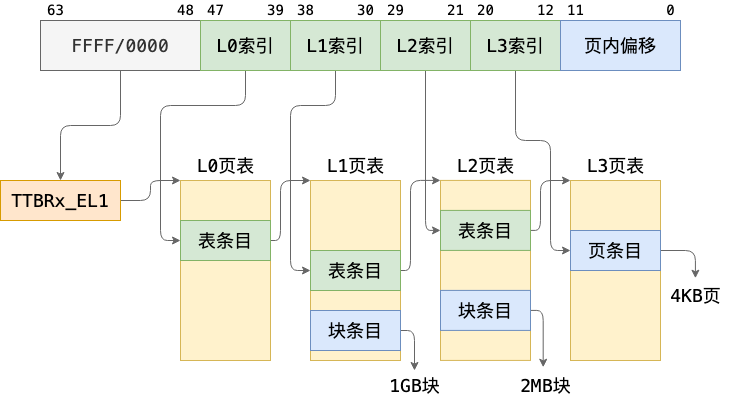
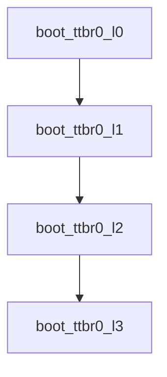

# 页表映射

## 目录

- [页表映射](#页表映射)
  - [复习：页表结构](#复习页表结构)
    - [页表基址寄存器](#页表基址寄存器)
    - [页表地址翻译](#页表地址翻译)
    - [Chcore的物理地址空间分布](#chcore的物理地址空间分布)
  - [Chcore页表映射](#chcore页表映射)
    - [总览](#总览)
    - [宏定义与数据结构声明](#宏定义与数据结构声明)
      - [内存区域划分](#内存区域划分)
      - [页表项数组定义](#页表项数组定义)
      - [页表控制属性描述符](#页表控制属性描述符)
      - [提取索引辅助函数](#提取索引辅助函数)
    - [页表地址映射](#页表地址映射)
      - [低地址映射](#低地址映射)
      - [高地址映射](#高地址映射)
      - [配置本地外设内存映射](#配置本地外设内存映射)

> [!INFO]
> chcore内核启动的最后一步是完成**页表的地址映射工作**。在前文中，我们于tool.S（被init_c.c调用）中启用了MMU以及相关配置，但具体的页表映射工作尚未提及，本节内容即为对chcore页表映射内容的源码解析

> [!WARNING]
> 这部分内容是源码解析的一部分，在完成Lab1后，再阅读这部分内容。

参考源码文件：`mmu.c` ，与init_c.c同目录


## 复习：页表结构

### 页表基址寄存器

在 AArch64 架构的 EL1 异常级别存在两个页表基址寄存器：`ttbr0_el1` 和 `ttbr1_el1`，分别用作虚拟地址空间**低地址和高地址**的翻译。而关于高低地址的具体范围则由由 `tcr_el1` 翻译控制寄存器控制。

一般情况下，我们会将 `tcr_el1` 配置为高低地址各有 48 位的地址范围，即：

- `0x0000_0000_0000_0000`～`0x0000_ffff_ffff_ffff` 为低地址
- `0xffff_0000_0000_0000`～`0xffff_ffff_ffff_ffff` 为高地址

### 页表地址翻译

有了页表基址寄存器的知识，我们再来看chcore是如何翻译地址的。chcore中页表的地址翻译采取了**多级页表**的形式，如下图所示：



所谓多级页表，是一种内存管理技术，用于虚拟内存系统中将虚拟地址映射到物理地址。它通过**多级层次结构**来减少页表所占用的内存空间，并提高页表的查找效率。

> [!NOTE]
> 在多级页表结构中，虚拟地址被分割成多个字段，每个字段对应不同级别的页表索引。最顶层的页表包含指向下一级页表的指针，而每一层页表都包含指向更详细页表或物理内存页的指针。

在Chcore中，页表一共分为4级：从L0-L2都是对下一级别索引的指针，一直到最后一级L3，才指向具体到页（以4KB粒度）

### Chcore的物理地址空间分布

如下图所示，这是我们后面页表映射时确定物理地址的重要信息


接下来，就让我们一起看看具体的页表映射源码吧！

## Chcore页表映射

### 总览

先总览代码，获取一个对源码的大致印象与结构

```c
    #include <common/macro.h>
    #include "image.h"
    #include "boot.h"
    #include "consts.h"
    
    typedef unsigned long u64;
    typedef unsigned int u32;
    
    /* Physical memory address space: 0-1G */
    #define PHYSMEM_START   (0x0UL)
    #define PERIPHERAL_BASE (0x3F000000UL)
    #define PHYSMEM_END     (0x40000000UL)
    
    /* The number of entries in one page table page */
    #define PTP_ENTRIES 512
    /* The size of one page table page */
    #define PTP_SIZE 4096
    #define ALIGN(n) __attribute__((__aligned__(n)))
    u64 boot_ttbr0_l0[PTP_ENTRIES] ALIGN(PTP_SIZE);
    u64 boot_ttbr0_l1[PTP_ENTRIES] ALIGN(PTP_SIZE);
    u64 boot_ttbr0_l2[PTP_ENTRIES] ALIGN(PTP_SIZE);
    u64 boot_ttbr0_l3[PTP_ENTRIES] ALIGN(PTP_SIZE);
    
    u64 boot_ttbr1_l0[PTP_ENTRIES] ALIGN(PTP_SIZE);
    u64 boot_ttbr1_l1[PTP_ENTRIES] ALIGN(PTP_SIZE);
    u64 boot_ttbr1_l2[PTP_ENTRIES] ALIGN(PTP_SIZE);
    u64 boot_ttbr1_l3[PTP_ENTRIES] ALIGN(PTP_SIZE);
    
    #define IS_VALID (1UL << 0)
    #define IS_TABLE (1UL << 1)
    #define IS_PTE   (1UL << 1)
    
    #define PXN            (0x1UL << 53)
    #define UXN            (0x1UL << 54)
    #define ACCESSED       (0x1UL << 10)
    #define NG             (0x1UL << 11)
    #define INNER_SHARABLE (0x3UL << 8)
    #define NORMAL_MEMORY  (0x4UL << 2)
    #define DEVICE_MEMORY  (0x0UL << 2)
    #define RDONLY_S       (0x2UL << 6)
    
    #define SIZE_2M (2UL * 1024 * 1024)
    #define SIZE_4K (4UL * 1024)
    
    #define GET_L0_INDEX(x) (((x) >> (12 + 9 + 9 + 9)) & 0x1ff)
    #define GET_L1_INDEX(x) (((x) >> (12 + 9 + 9)) & 0x1ff)
    #define GET_L2_INDEX(x) (((x) >> (12 + 9)) & 0x1ff)
    #define GET_L3_INDEX(x) (((x) >> (12)) & 0x1ff)
    
    extern int boot_cpu_stack[PLAT_CPU_NUMBER][INIT_STACK_SIZE];
    
    void init_kernel_pt(void)
    {
            u64 vaddr = PHYSMEM_START;
    
            /* TTBR0_EL1 0-1G */
            boot_ttbr0_l0[GET_L0_INDEX(vaddr)] = ((u64)boot_ttbr0_l1) | IS_TABLE
                                                 | IS_VALID | NG;
            boot_ttbr0_l1[GET_L1_INDEX(vaddr)] = ((u64)boot_ttbr0_l2) | IS_TABLE
                                                 | IS_VALID | NG;
    
            boot_ttbr0_l2[GET_L2_INDEX(vaddr)] = ((u64)boot_ttbr0_l3) | IS_TABLE
                                                 | IS_VALID | NG;
    
            /* first 2M, including .init section */
            for (; vaddr < SIZE_2M; vaddr += SIZE_4K) {
                    boot_ttbr0_l3[GET_L3_INDEX(vaddr)] =
                            (vaddr) | UXN /* Unprivileged execute never */
                            | PXN /* Privileged execute never */
                            | ACCESSED /* Set access flag */
                            | NG /* Mark as not global */
                            | INNER_SHARABLE /* Sharebility */
                            | NORMAL_MEMORY /* Normal memory */
                            | IS_PTE | IS_VALID;
    
                    /*
                     * Code in init section(img_start~init_end) should be mmaped as
                     * RDONLY_S due to WXN
                     * The boot_cpu_stack is also in the init section, but should
                     * have write permission
                     */
                    if (vaddr >= (u64)(&img_start) && vaddr < (u64)(&init_end)
                        && (vaddr < (u64)boot_cpu_stack
                            || vaddr >= ((u64)boot_cpu_stack)
                                                + PLAT_CPU_NUMBER
                                                          * INIT_STACK_SIZE)) {
                            boot_ttbr0_l3[GET_L3_INDEX(vaddr)] &= ~PXN;
                            boot_ttbr0_l3[GET_L3_INDEX(vaddr)] |=
                                    RDONLY_S; /* Read Only*/
                    }
            }
    
            /* Normal memory: PHYSMEM_START ~ PERIPHERAL_BASE */
            /* Map with 2M granularity */
            for (; vaddr < PERIPHERAL_BASE; vaddr += SIZE_2M) {
                    boot_ttbr0_l2[GET_L2_INDEX(vaddr)] =
                            (vaddr) /* low mem, va = pa */
                            | UXN /* Unprivileged execute never */
                            | ACCESSED /* Set access flag */
                            | NG /* Mark as not global */
                            | INNER_SHARABLE /* Sharebility */
                            | NORMAL_MEMORY /* Normal memory */
                            | IS_VALID;
            }
    
            /* Peripheral memory: PERIPHERAL_BASE ~ PHYSMEM_END */
            /* Map with 2M granularity */
            for (vaddr = PERIPHERAL_BASE; vaddr < PHYSMEM_END; vaddr += SIZE_2M) {
                    boot_ttbr0_l2[GET_L2_INDEX(vaddr)] =
                            (vaddr) /* low mem, va = pa */
                            | UXN /* Unprivileged execute never */
                            | ACCESSED /* Set access flag */
                            | NG /* Mark as not global */
                            | DEVICE_MEMORY /* Device memory */
                            | IS_VALID;
            }
    
            /* TTBR1_EL1 0-1G */
            /* BLANK BEGIN */
            vaddr = KERNEL_VADDR + PHYSMEM_START;
            boot_ttbr1_l0[GET_L0_INDEX(vaddr)] = ((u64)boot_ttbr1_l1) | IS_TABLE
                                                 | IS_VALID;
            boot_ttbr1_l1[GET_L1_INDEX(vaddr)] = ((u64)boot_ttbr1_l2) | IS_TABLE
                                                 | IS_VALID;
    
            /* Normal memory: PHYSMEM_START ~ PERIPHERAL_BASE
             * The text section code in kernel should be mapped with flag R/X.
             * The other section and normal memory is mapped with flag R/W.
             * memory layout :
             * | normal memory | kernel text section | kernel data section ... |
             * normal memory |
             */
    
            boot_ttbr1_l2[GET_L2_INDEX(vaddr)] = ((u64)boot_ttbr1_l3) | IS_TABLE
                                                 | IS_VALID;
    
            /* the kernel text section was mapped in the first
             * L2 page table in boot_ptd_l1 now.
             */
            BUG_ON((u64)(&_text_end) >= KERNEL_VADDR + SIZE_2M);
            /* _text_start & _text_end should be 4K aligned*/
            BUG_ON((u64)(&_text_start) % SIZE_4K != 0
                   || (u64)(&_text_end) % SIZE_4K != 0);
    
            for (; vaddr < KERNEL_VADDR + SIZE_2M; vaddr += SIZE_4K) {
                    boot_ttbr1_l3[GET_L3_INDEX(vaddr)] =
                            (vaddr - KERNEL_VADDR) | UXN /* Unprivileged execute
                                                            never */
                            | PXN /* Priviledged execute never*/
                            | ACCESSED /* Set access flag */
                            | INNER_SHARABLE /* Sharebility */
                            | NORMAL_MEMORY /* Normal memory */
                            | IS_PTE | IS_VALID;
                    /* (KERNEL_VADDR + TEXT_START ~ KERNEL_VADDR + TEXT_END) was
                     * mapped to physical address (PHY_START ~ PHY_START + TEXT_END)
                     * with R/X
                     */
                    if (vaddr >= (u64)(&_text_start) && vaddr < (u64)(&_text_end)) {
                            boot_ttbr1_l3[GET_L3_INDEX(vaddr)] &= ~PXN;
                            boot_ttbr1_l3[GET_L3_INDEX(vaddr)] |=
                                    RDONLY_S; /* Read Only*/
                    }
            }
    
            for (; vaddr < KERNEL_VADDR + PERIPHERAL_BASE; vaddr += SIZE_2M) {
                    /* No NG bit here since the kernel mappings are shared */
                    boot_ttbr1_l2[GET_L2_INDEX(vaddr)] =
                            (vaddr - KERNEL_VADDR) /* high mem, va = kbase + pa */
                            | UXN /* Unprivileged execute never */
                            | PXN /* Priviledged execute never*/
                            | ACCESSED /* Set access flag */
                            | INNER_SHARABLE /* Sharebility */
                            | NORMAL_MEMORY /* Normal memory */
                            | IS_VALID;
            }
    
            /* Peripheral memory: PERIPHERAL_BASE ~ PHYSMEM_END */
            /* Map with 2M granularity */
            for (vaddr = KERNEL_VADDR + PERIPHERAL_BASE;
                 vaddr < KERNEL_VADDR + PHYSMEM_END;
                 vaddr += SIZE_2M) {
                    boot_ttbr1_l2[GET_L2_INDEX(vaddr)] =
                            (vaddr - KERNEL_VADDR) /* high mem, va = kbase + pa */
                            | UXN /* Unprivileged execute never */
                            | PXN /* Priviledged execute never*/
                            | ACCESSED /* Set access flag */
                            | DEVICE_MEMORY /* Device memory */
                            | IS_VALID;
            }
    
            /*
             * Local peripherals, e.g., ARM timer, IRQs, and mailboxes
             *
             * 0x4000_0000 .. 0xFFFF_FFFF
             * 1G is enough (for Mini-UART). Map 1G page here.
             */
            vaddr = KERNEL_VADDR + PHYSMEM_END;
            boot_ttbr1_l1[GET_L1_INDEX(vaddr)] = PHYSMEM_END | UXN /* Unprivileged
                                                                      execute never
                                                                    */
                                                 | PXN /* Priviledged execute
                                                          never*/
                                                 | ACCESSED /* Set access flag */
                                                 | DEVICE_MEMORY /* Device memory */
                                                 | IS_VALID;
    }
```

结合注释信息可知，这部分代码主要分为两部分：

- 宏定义与数据结构声明：这部分定义了后面页表配置时相应属性对应的宏以及多级页表中会用到的数据结构；此外，宏定义中还包括内存区域划分与页表大小等信息
- 页表地址映射：即 `init_kernel_pt()` 函数，我们的页表映射工作即在此完成，也是我们源码解析的重点所在

### 宏定义与数据结构声明

这一部分主要介绍代码中的宏定义与页表配置相关的数据结构定义

#### 内存区域划分

如下方代码所示：

```c
/* Physical memory address space: 0-1G */
#define PHYSMEM_START   (0x0UL)
#define PERIPHERAL_BASE (0x3F000000UL)
#define PHYSMEM_END     (0x40000000UL)
```

这三行代码声明的宏将我们要映射的物理地址（一共1G）分为了两部分：普通的RAM内存区域与外设映射区域，其中 `UL`  表示 `unsigned long`

其中前者很好理解，就是内核自身的RAM内存，关于后者“外设映射”，可以理解为是在这部分地址开始映射各种硬件外设，例如：

- GPIO控制器
- UART串口
- 中断控制器
- 定时器
- USB控制器等

总体的内存结构即如下图所示：

```
0x00000000 +-----------------+ <- PHYSMEM_START
           |                 |
           |    普通内存区域   |
           |                 |
0x3F000000 +-----------------+ <- PERIPHERAL_BASE
           |                 |
           |    外设映射区域   |
           |                 |
0x40000000 +-----------------+ <- PHYSMEM_END
```

#### 页表项数组定义

如下方代码所示：

```c
/* The number of entries in one page table page */
#define PTP_ENTRIES 512
/* The size of one page table page */
#define PTP_SIZE 4096
#define ALIGN(n) __attribute__((__aligned__(n)))
u64 boot_ttbr0_l0[PTP_ENTRIES] ALIGN(PTP_SIZE);
u64 boot_ttbr0_l1[PTP_ENTRIES] ALIGN(PTP_SIZE);
u64 boot_ttbr0_l2[PTP_ENTRIES] ALIGN(PTP_SIZE);
u64 boot_ttbr0_l3[PTP_ENTRIES] ALIGN(PTP_SIZE);

u64 boot_ttbr1_l0[PTP_ENTRIES] ALIGN(PTP_SIZE);
u64 boot_ttbr1_l1[PTP_ENTRIES] ALIGN(PTP_SIZE);
u64 boot_ttbr1_l2[PTP_ENTRIES] ALIGN(PTP_SIZE);
u64 boot_ttbr1_l3[PTP_ENTRIES] ALIGN(PTP_SIZE);
```

其中数组部分比较好理解，看名称：ttbrx即表示页表基址寄存器，lx表示具体的页表级数（0-3），而数组大小即为定义好的512，是页表页的入口条数

这里再说说这一行代码：

```c
#define ALIGN(n) __attribute__((__aligned__(n)))
```

这行代码定义了一个**对齐属性的宏**：`__attribute__((__aligned__(n)))` 是GCC编译器的一个特殊属性声明，它告诉编译器将变量或数据结构按照n字节边界对齐

例如下面这行声明代码：

```c
u64 boot_ttbr0_l0[PTP_ENTRIES] ALIGN(PTP_SIZE);
```

这里 ALIGN(PTP_SIZE) 其中 PTP_SIZE = 4096，意味着这个数组将被对齐到4KB边界

而关于为什么需要对齐，这便涉及到硬件架构要求和性能优化的相关知识了，感兴趣的可以自己多查阅了解阅读

#### 页表控制属性描述符

如下方代码所示：

```c
#define IS_VALID (1UL << 0)
#define IS_TABLE (1UL << 1)
#define IS_PTE   (1UL << 1)

#define PXN            (0x1UL << 53)
#define UXN            (0x1UL << 54)
#define ACCESSED       (0x1UL << 10)
#define NG             (0x1UL << 11)
#define INNER_SHARABLE (0x3UL << 8)
#define NORMAL_MEMORY  (0x4UL << 2)
#define DEVICE_MEMORY  (0x0UL << 2)
#define RDONLY_S       (0x2UL << 6)
```

这部分定义了页表的属性描述符，在配置页表的时候，我们可以通过将待配置的地址与之进行或运算（即 `|` ）  即可

而页表属性的具体含义通常与内存访问权限等相关，具体见下，亦可以自行做更多了解：

- `UXN` : 用户模式（非特权态）下不可执行
- `PXN` : 特权模式（特权态）下不可执行
- `RDONLY_S` : 只读访问
- `INNER_SHARABLE` : 内部可共享
- `NORMAL_MEMORY/DEVICE_MEMORY` : 内存类型标识
- `NG` : 非全局页面标识

#### 提取索引辅助函数

如下方代码所示：

```c
#define GET_L0_INDEX(x) (((x) >> (12 + 9 + 9 + 9)) & 0x1ff)
#define GET_L1_INDEX(x) (((x) >> (12 + 9 + 9)) & 0x1ff)
#define GET_L2_INDEX(x) (((x) >> (12 + 9)) & 0x1ff)
#define GET_L3_INDEX(x) (((x) >> (12)) & 0x1ff)
```

这部分是用于将虚拟地址提取出对应位置的索引的辅助函数，从L0到L3都有。其中各个数字的含义如下：

- 12: 页内偏移位数（4KB页面 = 2^12）
- 9: 每级页表索引的位数（512个表项 = 2^9）
- 0x1ff: 9位掩码（二进制：111111111），是一个mask操作

绝知此事要躬行，我们假设有一个虚拟地址：

```
位数:   |   9位   |   9位   |   9位   |   9位   |   12位   |
内容:   | L0索引  | L1索引   | L2索引  | L3索引  | 页内偏移  |
```

那么各辅助函数的功能即如下所述：

- `GET_L0_INDEX`: 右移39位，获取最高的9位
- `GET_L1_INDEX`: 右移30位，获取第二个9位
- `GET_L2_INDEX`: 右移21位，获取第三个9位
- `GET_L3_INDEX`: 右移12位，获取第四个9位

### 页表地址映射

工欲善其事，必先利其器。上面的介绍为我们解析配置页表部分的源码扫清了障碍，现在，我们正式进入 `init_kernel_pt()` 函数，来对chcore的页表映射逻辑一窥究竟

浏览代码不难发现，本函数主要分为两大块：低地址映射与高地址映射，前者为用户态，后者为内核态，分别由相应的页表基址寄存器控制。其中各自具体配置手段相似，区别在于内核态配置时需要加上相应的偏移量，否则配置就是乱的

#### 低地址映射

我们将详细讲解这一部分，对于后面的高地址映射，我们将只说明不同的地方，其余大体上是相似的

- 首先是设置**多级页表之间的链接关系**

```c
        u64 vaddr = PHYSMEM_START;

        /* TTBR0_EL1 0-1G */
        boot_ttbr0_l0[GET_L0_INDEX(vaddr)] = ((u64)boot_ttbr0_l1) | IS_TABLE
                                             | IS_VALID | NG;
        boot_ttbr0_l1[GET_L1_INDEX(vaddr)] = ((u64)boot_ttbr0_l2) | IS_TABLE
                                             | IS_VALID | NG;

        boot_ttbr0_l2[GET_L2_INDEX(vaddr)] = ((u64)boot_ttbr0_l3) | IS_TABLE
                                             | IS_VALID | NG;
```

这里将vaddr设置为最开始的物理内存起始，然后进行了相应的链接关系配置



这里完成了初始化工作后，后面便开始了具体的配置

- 初始2M内存，以4KB粒度映射，注意这里包含`.init`部分，需要做特殊处理

```c
        /* first 2M, including .init section */
        for (; vaddr < SIZE_2M; vaddr += SIZE_4K) {
                boot_ttbr0_l3[GET_L3_INDEX(vaddr)] =
                        (vaddr) | UXN /* Unprivileged execute never */
                        | PXN /* Privileged execute never */
                        | ACCESSED /* Set access flag */
                        | NG /* Mark as not global */
                        | INNER_SHARABLE /* Sharebility */
                        | NORMAL_MEMORY /* Normal memory */
                        | IS_PTE | IS_VALID;

                /*
                 * Code in init section(img_start~init_end) should be mmaped as
                 * RDONLY_S due to WXN
                 * The boot_cpu_stack is also in the init section, but should
                 * have write permission
                 */
                if (vaddr >= (u64)(&img_start) && vaddr < (u64)(&init_end)
                    && (vaddr < (u64)boot_cpu_stack
                        || vaddr >= ((u64)boot_cpu_stack)
                                            + PLAT_CPU_NUMBER
                                                      * INIT_STACK_SIZE)) {
                        boot_ttbr0_l3[GET_L3_INDEX(vaddr)] &= ~PXN;
                        boot_ttbr0_l3[GET_L3_INDEX(vaddr)] |=
                                RDONLY_S; /* Read Only*/
                }
        }
```

主体的配置过程其实就是这样的：

```
相应的页表级[辅助函数获取索引(vaddr)] = (vaddr) | 一大堆属性
```

这里还要注意一下`for`循环的末尾，有一个对`.init`部分内存的特殊设置—— `RDONLY_S` ，即只读

- 配置普通RAM内存与外设内存

```c
        /* Normal memory: PHYSMEM_START ~ PERIPHERAL_BASE */
        /* Map with 2M granularity */
        for (; vaddr < PERIPHERAL_BASE; vaddr += SIZE_2M) {
                boot_ttbr0_l2[GET_L2_INDEX(vaddr)] =
                        (vaddr) /* low mem, va = pa */
                        | UXN /* Unprivileged execute never */
                        | ACCESSED /* Set access flag */
                        | NG /* Mark as not global */
                        | INNER_SHARABLE /* Sharebility */
                        | NORMAL_MEMORY /* Normal memory */
                        | IS_VALID;
        }

        /* Peripheral memory: PERIPHERAL_BASE ~ PHYSMEM_END */
        /* Map with 2M granularity */
        for (vaddr = PERIPHERAL_BASE; vaddr < PHYSMEM_END; vaddr += SIZE_2M) {
                boot_ttbr0_l2[GET_L2_INDEX(vaddr)] =
                        (vaddr) /* low mem, va = pa */
                        | UXN /* Unprivileged execute never */
                        | ACCESSED /* Set access flag */
                        | NG /* Mark as not global */
                        | DEVICE_MEMORY /* Device memory */
                        | IS_VALID;
        }
```

不难发现总体上的代码逻辑是相似的，那如何区分不同的内存呢？——通过页表属性即可

在这一部分我们以2M的粒度对普通内存+外设内存完成了映射，注意在2M粒度下，我们的页表级是L2

#### 高地址映射

总体上和低地址映射是相似的，不同之处在于二者之间有一个偏移量，因此我们在配置高地址映射的时候需要加上这一部分，它由相应的页表基址寄存器控制。在代码中，即为 `KERNEL_VADDR`  ，定义在 image.h 头文件中

这里我们只举一个例子来说明这一点，就不全部讲解了

```c
/* TTBR1_EL1 0-1G */
        /* BLANK BEGIN */
        vaddr = KERNEL_VADDR + PHYSMEM_START;
        
     ...

        for (; vaddr < KERNEL_VADDR + PERIPHERAL_BASE; vaddr += SIZE_2M) {
                /* No NG bit here since the kernel mappings are shared */
                boot_ttbr1_l2[GET_L2_INDEX(vaddr)] =
                        (vaddr - KERNEL_VADDR) /* high mem, va = kbase + pa */
                        | UXN /* Unprivileged execute never */
                        | PXN /* Priviledged execute never*/
                        | ACCESSED /* Set access flag */
                        | INNER_SHARABLE /* Sharebility */
                        | NORMAL_MEMORY /* Normal memory */
                        | IS_VALID;
        }

    ...
```

以配置普通RAM内存这一段为例，这里初始化 `vaddr` 时即加上了对应的偏移量，在 `for` 循环中也有相应的体现，这便是高地址映射时不同的地方

#### 配置本地外设内存映射

注意到1G-4G这部分内存还没有用到，这部分是留给配置本地外设用的。在chcore中，我们只配置了1G，但是这是足够的，如下方代码所示，这也是页表映射的最后一段：

```c
        /*
         * Local peripherals, e.g., ARM timer, IRQs, and mailboxes
         *
         * 0x4000_0000 .. 0xFFFF_FFFF
         * 1G is enough (for Mini-UART). Map 1G page here.
         */
        vaddr = KERNEL_VADDR + PHYSMEM_END;
        boot_ttbr1_l1[GET_L1_INDEX(vaddr)] = PHYSMEM_END | UXN /* Unprivileged
                                                                  execute never
                                                                */
                                             | PXN /* Priviledged execute
                                                      never*/
                                             | ACCESSED /* Set access flag */
                                             | DEVICE_MEMORY /* Device memory */
                                             | IS_VALID;
```

1G的内存配置是便直接使用L1级别的页表了，这也体现了多级页表的特点

> [!SUCCESS]
> 至此，页表映射部分的源码解析全部结束，希望对你学习进步有所裨益！
