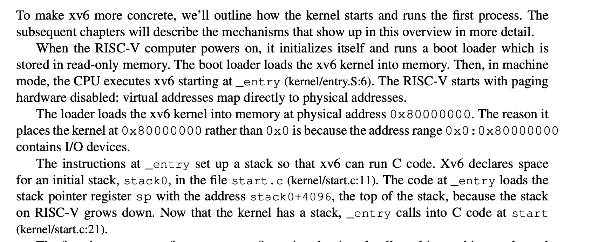
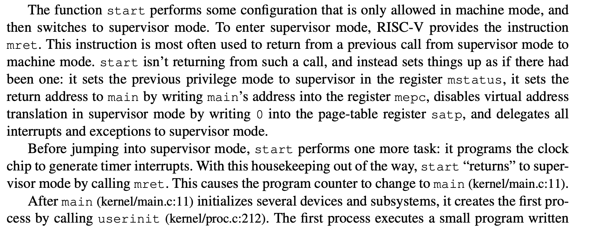
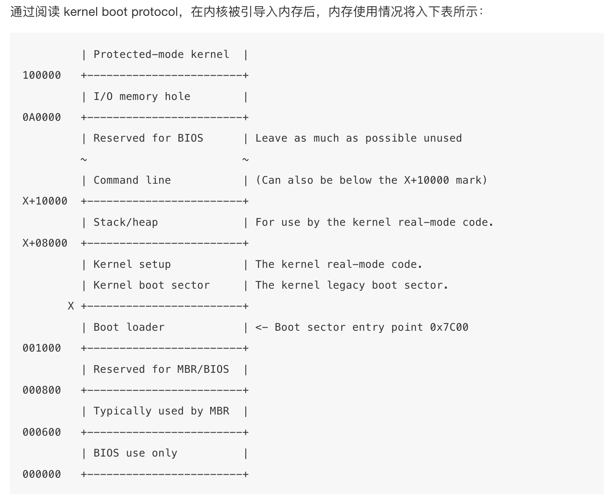

# 拓展阅读与思考

## 前情提要

Lab 1 主要介绍Chcore 启动过程中的 工作 ，这些工作包括 启动cpu 0号核，切换异常级别 ，跳转到第一行C代码 ，初始化串口输出 ，启用MMU ，配置页表。

而在其他的系统之中，有不少的异同点，在下文之中我们将选取几个代表性的系统做对比分析

## 下文大纲

1. 我们将把 SJTU Chcore 系统 与 MIT xv6 系统进行比较，分析内核启动的相通点与不同点并探讨可能的问题。
2. 我们将基于 Linux 介绍执行系统内核代码前，bootloader相关的粗略工作。

## 正文

## Part 1 : Chcore 和 XV6 的对比

### Part 1.1：基本分析

我们先看一下 xv6 book 关于启动过程中的工作：



我们先不讨论内核代码在加载到内存之前系统做的工作，我们首先比较两个系统第一步执行内核代码的不同之处。对于Xv6而言，它的第一步是直接建立stack。而由Chcore文档我们知道进入内核第一步是通过一系列代码只让一个CPU Core工作，而其他CPU Core停止执行初始化工作 然后这��个CPU core切换异常级别接下来才是建立stack。那为什么xv6 会直接建立stack？我们接着看代码。两个系统在建立了stack都跳转到内核的第一行C代码进行初始化。

我们先看一下 xv6 book 关于这个过程中的工作：



第一句话解释了为什么xv6不是在建立stack之前切换异常级别：因为start级别中的代码只能在machine mode中执行，执行完之后再切换到supervisor mode。machine mode 相当于EL3，supervisor mode 相当于 EL2。我们接着看，我们使用一个指令切换到supervisor mode同时start 函数结束后将会返回到main.c 中（细节自行了解）。main.c 也是进行初始化工作，我们接着看代码：

```c
#include "types.h"
#include "param.h"
#include "memlayout.h"
#include "riscv.h"
#include "defs.h"

volatile static int started = 0;

// start() jumps here in supervisor mode on all CPUs.
void
main()
{
  if(cpuid() == 0){
    consoleinit();
    printfinit();
    printf("\n");
    printf("xv6 kernel is booting\n");
    printf("\n");
    kinit();         // physical page allocator
    kvminit();       // create kernel page table
    kvminithart();   // turn on paging
    procinit();      // process table
    trapinit();      // trap vectors
    trapinithart();  // install kernel trap vector
    plicinit();      // set up interrupt controller
    plicinithart();  // ask PLIC for device interrupts
    binit();         // buffer cache
    iinit();         // inode table
    fileinit();      // file table
    virtio_disk_init(); // emulated hard disk
    userinit();      // first user process
    __sync_synchronize();
    started = 1;
  } else {
    while(started == 0)
      ;
    __sync_synchronize();
    printf("hart %d starting\n", cpuid());
    kvminithart();    // turn on paging
    trapinithart();   // install kernel trap vector
    plicinithart();   // ask PLIC for device interrupts
  }

  scheduler();        
}
```

main.c代码的结构好像似曾相识，仔细一看，这不就是和Chcore 中CPU Core启动一样吗！到此我们发现了内核代码的 consistent design。而在真实世界中linux也如此但也更复杂（链接：https://xinqiu.gitbooks.io/linux-inside-zh/content/Initialization/linux-initialization-4.html，我也未明白linux 内核的mode change故未放上链接）。

我们接着看 main.c 代码大体逻辑与Chcore相同 : 先初始化console (类比Chcore中的 uart_init),然后便开始启用MMU 并 初始化页表。这部分只拓展Lab1相关部分故不分析后面部分。

我们接下来看Xv6的页表初始化（地址映射），Xv6 内���映射相关代码代码与Chcore 中设置高地址页表思路相同，相关代码放在文章末尾。

#### Part 1.2：一个问题

看完之后我们可能会有问题，虽然虽然两个系统都会进行以上CPU core启动顺序相关工作，但代码位置却并不相同，我们下面分析一下这是为什么。那我们便要好好看下Chcore Lab1文档中的思考题12（在一开始我们暂停了三个其他核心的执行，根据现有代码简要说明它们什么时候会恢复执行。思考为什么一开始只让 0 号核心执行初始化流程？）

我们先看代码：

```c
#include <common/asm.h>

.extern arm64_elX_to_el1
.extern boot_cpu_stack
.extern secondary_boot_flag
.extern secondary_init_c
.extern clear_bss_flag
.extern init_c

BEGIN_FUNC(_start)
	mrs	x8, mpidr_el1
	and	x8, x8,	#0xFF
	cbz	x8, primary

	/* Wait for bss clear */
wait_for_bss_clear:
	adr	x0, clear_bss_flag
	ldr	x1, [x0]
	cmp     x1, #0
	bne	wait_for_bss_clear

	/* Set cntkctl_el1 to enable cntvct_el0.
         * Enable it when you need to get current tick
         * at EL0, e.g. Running aarch64 ROS2 demos
	mov	x10, 0b11
	msr	cntkctl_el1, x10 */

	/* Turn to el1 from other exception levels. */
	bl 	arm64_elX_to_el1

	/* Prepare stack pointer and jump to C. */
	mov	x1, #0x1000
	mul	x1, x8, x1
	adr 	x0, boot_cpu_stack
	add	x0, x0, x1
	add	x0, x0, #0x1000
        mov	sp, x0

wait_until_smp_enabled:
	/* CPU ID should be stored in x8 from the first line */
	mov	x1, #8
	mul	x2, x8, x1
	ldr	x1, =secondary_boot_flag
	add	x1, x1, x2
	ldr	x3, [x1]
	cbz	x3, wait_until_smp_enabled

	/* Set CPU id */
	mov	x0, x8
	bl 	secondary_init_c

primary:
	/* Turn to el1 from other exception levels. */
	bl 	arm64_elX_to_el1

	/* Prepare stack pointer and jump to C. */
	adr 	x0, boot_cpu_stack
	add 	x0, x0, #0x1000
	mov 	sp, x0

	bl 	init_c

	/* Should never be here */
	b	.
END_FUNC(_start)

```

以上代码有两部分我们应该注意：wait_for_bss_clear 和 wait_until_smp_enabled。当第一个CPU core执行到 init.c 的时候会调用clear_bss 将clear_bss_flag 设置为0 然后其他CPU core 会切换异常级别并建立stack但会停在wait_until_smp_enabled这部分。第一个CPU core 继续执行 init.c 中的代码（初始化串口输出，配置页表，启用MMU,然后调用start_kernel 跳转到main.c ）第一个CPU Core 在main.c 中执行完时钟，调度器，锁的初始化后其他CPU Core 开始初始化。故答案应是在多核系统中，时钟、调度器和锁是多个核心共享的资源。在初始化时，如果多个核心同时访问这些资源，可能会引发竞争条件或未定义的行为。

接着看XV6代码：

```jsx

review : the order is entry.S -> init.c -> main.c

entry.S:
        # qemu -kernel loads the kernel at 0x80000000
        # and causes each hart (i.e. CPU) to jump there.
        # kernel.ld causes the following code to
        # be placed at 0x80000000.
.section .text
.global _entry
_entry:
        # set up a stack for C.
        # stack0 is declared in start.c,
        # with a 4096-byte stack per CPU.
        # sp = stack0 + (hartid * 4096)
        la sp, stack0
        li a0, 1024*4
        csrr a1, mhartid
        addi a1, a1, 1
        mul a0, a0, a1
        add sp, sp, a0
        # jump to start() in start.c
        call start
spin:
        j spin
      
start.c:
// entry.S jumps here in machine mode on stack0.
void
start()
{
  // set M Previous Privilege mode to Supervisor, for mret.
  unsigned long x = r_mstatus();
  x &= ~MSTATUS_MPP_MASK;
  x |= MSTATUS_MPP_S;
  w_mstatus(x);

  // set M Exception Program Counter to main, for mret.
  // requires gcc -mcmodel=medany
  w_mepc((uint64)main);

  // disable paging for now.
  w_satp(0);

  // delegate all interrupts and exceptions to supervisor mode.
  w_medeleg(0xffff);
  w_mideleg(0xffff);
  w_sie(r_sie() | SIE_SEIE | SIE_STIE | SIE_SSIE);

  // configure Physical Memory Protection to give supervisor mode
  // access to all of physical memory.
  w_pmpaddr0(0x3fffffffffffffull);
  w_pmpcfg0(0xf);

  // ask for clock interrupts.
  timerinit();

  // keep each CPU's hartid in its tp register, for cpuid().
  int id = r_mhartid();
  w_tp(id);

  // switch to supervisor mode and jump to main().
  asm volatile("mret");
}

// ask each hart to generate timer interrupts.
void
timerinit()
{
  // enable supervisor-mode timer interrupts.
  w_mie(r_mie() | MIE_STIE);
  
  // enable the sstc extension (i.e. stimecmp).
  w_menvcfg(r_menvcfg() | (1L << 63)); 
  
  // allow supervisor to use stimecmp and time.
  w_mcounteren(r_mcounteren() | 2);
  
  // ask for the very first timer interrupt.
  w_stimecmp(r_time() + 1000000);
}

main.c:

#include "types.h"
#include "param.h"
#include "memlayout.h"
#include "riscv.h"
#include "defs.h"

volatile static int started = 0;

// start() jumps here in supervisor mode on all CPUs.
void
main()
{
  if(cpuid() == 0){
    consoleinit();
    printfinit();
    printf("\n");
    printf("xv6 kernel is booting\n");
    printf("\n");
    kinit();         // physical page allocator
    kvminit();       // create kernel page table
    kvminithart();   // turn on paging
    procinit();      // process table
    trapinit();      // trap vectors
    trapinithart();  // install kernel trap vector
    plicinit();      // set up interrupt controller
    plicinithart();  // ask PLIC for device interrupts
    binit();         // buffer cache
    iinit();         // inode table
    fileinit();      // file table
    virtio_disk_init(); // emulated hard disk
    userinit();      // first user process
    __sync_synchronize();
    started = 1;
  } else {
    while(started == 0)
      ;
    __sync_synchronize();
    printf("hart %d starting\n", cpuid());
    kvminithart();    // turn on paging
    trapinithart();   // install kernel trap vector
    plicinithart();   // ask PLIC for device interrupts
  }

  scheduler();        
}
```

 经以上分析后可知，在Chcore内核代码的start.S中设置CPU Core 启动顺序是因为BSS 和 时钟，调度器，锁的初始化。然后我们看Xv6 中的main.c 中的代码正好包含时钟，调度器，锁的初始化工作（Xv6 并没有与清理BSS相关的代码，故不考虑），故Xv6代码会在这里设置CPU Core 启动顺序 即通过 cpuid() == 0 与 while(started == 0)两个控制语句使得只有0号CPU Core 可以执行相关初始化并在初始化结束之后将started设置为1来让其他CPU Core并行开始初始化。而之前的entry.S 以及 init.c 中的代码是可以让CPU Core并行���行的，故没必要在之前设置CPU Core 启动顺序。

#### Part 1.3：一个假设

按照Xv6的思路我们可以改写Chcore 代码：我们不必要在start.s 设置CPU Core 启动顺序，CPU Core可以并行进行切换异常级别，建立stack ，跳转到init.c 。init.c 中可以并行的代码依然放在init.c ,不能并行的放在main.c 中，然后main.c 采用Xv6 写法。反之我们可以改写Xv6。

以下是相关伪代码：

```c
start.S:
BEGIN_FUNC(_start)

	/* Turn to el1 from other exception levels. */
	bl 	arm64_elX_to_el1

	/* Prepare stack pointer and jump to C. */
	adr 	x0, boot_cpu_stack
	add 	x0, x0, #INIT_STACK_SIZE
	mov 	sp, x0

	b 	init_c

	/* Should never be here */
	b	.
END_FUNC(_start)

init.c:

void init_c(void)
{
	//maybe some other initalize work
	early_uart_init();
	uart_send_string("boot: init_c\r\n");

	uart_send_string("[BOOT] Jump to kernel main\r\n");
	start_kernel(secondary_boot_flag);//jump to main

	/* Never reach here */
}

main.c:

volatile static int started = 0;

// start() jumps here in supervisor mode on all CPUs.
void
main()
{
  if(cpuid() == 0){
	  clear_bss();
		init_kernel_pt();
		el1_mmu_activate();
		//other work is not listed here 
    started = 1;
  } else {
    while(started == 0)
      ;
	 	init_kernel_pt();
		el1_mmu_activate();
	  //other work is not listed here 
  
  }
```

需注意上述这是设计的想法，具体还与架构等底层有关，故上述想法可能错误。只是希望读者可以从上述讲解中体会到操作系统设计的相通点并提出自己的思考。相关架构知识放在文章末尾。

### Part 2 内核代码在被加载到内存之前到那些事

#### Part 2.1：BIOS之前的故事

由于Chcore文档并未过多讲述执行内核代码之前的事，我们将基于Linux讲述执行内核代码之前的工作，以下描述主要讲述大体流程，细节并未十分完善。

需要注意的一点是，内核代码很重要，但它并不是一开始就执行的，因为有一些非常基本的初始化工作要做，这主要与硬件有关。在Linux中，我们按下按钮，主板会从电池获取信号，然后启动CPU，CPU 则复位寄存器的所有数据，并设置每个寄存器的预定值，并且在 CPU 寄存器中定义了如下预定义数据：

```jsx
IP          0xfff0
CS selector 0xf000
CS base     0xffff0000
```

而且CS base + IP = `0xfffffff0` ， 这个地方是 [复位向量(Reset vector)](http://en.wikipedia.org/wiki/Reset_vector) 。 这是CPU在重置后期望执行的第一条指令的内存地址。它包含一个 [jump](http://en.wikipedia.org/wiki/JMP_%28x86_instruction%29) 指令，这个指令通常指向BIOS入口点。

注：CPU将在实模式下执行，此模式下MMU并未启用，寻址方式为：`PhysicalAddress = Segment * 16 + Offset` 。

#### Part 2.2：BIOS的故事

然后CPU会跳转到 BIOS 的入口，BIOS 开始工作（初始化和检查硬件和寻找可引导设备）（BIOS 会检查配置并尝试根据设备在配置中的顺序找到设备中的引导扇区（通常是该设备的第一个扇区），而引导扇区始终包含主引导记录（MBR），MBR 通常有 446 个字节用于存储引导代码，64 个字节用于存储分区表，最后两个字节用于检查该设备是否为可引导设备），并且我们必须注意到，只要我们开始执行引导代码，BIOS 就已经将系统的控制权移交给引导代码了。

注：关于MBR的一些细节

如果我们只考虑下面三者的相对顺序同时忽视其他可能的细节，通常disk分区大致如下：

- **扇区 0**：存放 **MBR（主引导记录）** 或 **UEFI 引导程序**。
- **扇区 1 到 N**：存放 **核心映像**，也就是操作系统的引导程序或内核映像。这个区域通常存储引导所需的文件，它在启动时会被加载到内存的高地址。
- **扇区 N+1**：开始存放 **第一个可用分区**，这个分区用于存储操作系统的文件系统，如 Windows 的 NTFS 或 Linux 的 EXT4 等。

文章末尾将补充关于**核心映像**加载到内存的高地址的由来。

#### Part 2.3：引导代码

在现实世界中，要启动 Linux 系统，有多种引导程序可以选择。比如 [GRUB 2](https://www.gnu.org/software/grub/) 和 [syslinux](http://www.syslinux.org/wiki/index.php/The_Syslinux_Project)。Linux内核通过 [Boot protocol](http://lxr.free-electrons.com/source/Documentation/x86/boot.txt?v=3.18) 来定义应该如何实现引导程序。在这里我们只介绍 GRUB 2。现在我们已经选择一个可引导设备并将控制权移到引导扇区中的引导代码（通常称为 Boot.img），这个引导代码只做了一些非常基本的初始化工作，然后跳转到 GRUB 2 的核心映像并执行代码（将内核代码和文件系统驱动程序放入内存然后初始化控制台等），执行完代码后会调用 grub_menu_execute_entry 函数列出可用的系统供选择，当选择一个系统时，grub_menu_execute_entry 会调用 boot 命令来引导所选系统即将所选系统的内核代码加载到内存中，在内核被引导入内存后，内存使用情况将入下表所示：



所以当 bootloader 完成任务，将执行权移交给 kernel，kernel 的代码从以下地址开始执行：

```
0x1000 + X + sizeof(KernelBootSector) + 1
个人以为应该是 X + sizeof(KernelBootSector) + 1 因为 X 已经是一个具体的物理地址了，不是一个偏移
```

上面的公式中， `X` 是 kernel bootsector 被引导入内存的位置。在我的机器上， `X` 的值是 `0x10000`，到这里，引导程序完成它的使命，并将控制权移交给了 Linux kernel。

> [!TIP]
> 本节参考链接：https://xinqiu.gitbooks.io/linux-inside-zh/content/Booting/linux-bootstrap-1.html

## 文章末尾补充内容

### Part 3 :页表配置代码

#### Part 3.1:XV6 页表配置代码

```jsx
// Make a direct-map page table for the kernel.
pagetable_t
kvmmake(void)
{
  pagetable_t kpgtbl;

  kpgtbl = (pagetable_t) kalloc();
  memset(kpgtbl, 0, PGSIZE);

  // uart registers
  kvmmap(kpgtbl, UART0, UART0, PGSIZE, PTE_R | PTE_W);

  // virtio mmio disk interface
  kvmmap(kpgtbl, VIRTIO0, VIRTIO0, PGSIZE, PTE_R | PTE_W);

  // PLIC
  kvmmap(kpgtbl, PLIC, PLIC, 0x4000000, PTE_R | PTE_W);

  // map kernel text executable and read-only.
  kvmmap(kpgtbl, KERNBASE, KERNBASE, (uint64)etext-KERNBASE, PTE_R | PTE_X);

  // map kernel data and the physical RAM we'll make use of.
  kvmmap(kpgtbl, (uint64)etext, (uint64)etext, PHYSTOP-(uint64)etext, PTE_R | PTE_W);

  // map the trampoline for trap entry/exit to
  // the highest virtual address in the kernel.
  kvmmap(kpgtbl, TRAMPOLINE, (uint64)trampoline, PGSIZE, PTE_R | PTE_X);

  // allocate and map a kernel stack for each process.
  proc_mapstacks(kpgtbl);
  
  return kpgtbl;
}

// Initialize the one kernel_pagetable
void
kvminit(void)
{
  kernel_pagetable = kvmmake();
}

// add a mapping to the kernel page table.
// only used when booting.
// does not flush TLB or enable paging.
void
kvmmap(pagetable_t kpgtbl, uint64 va, uint64 pa, uint64 sz, int perm)
{
  if(mappages(kpgtbl, va, sz, pa, perm) != 0)
    panic("kvmmap");
}
```

#### Part 3.2:Chcore 页表配置代码

这部分内容可以参考源码解析部分的文章

### Part 4:架构补充知识

#### Part 4.1:**细粒度的汇编控制与编译器的自动优化**

- **ARM架构的汇编**：ARM汇编指令在某些情况下比x86更加细粒度，特别是在多核并发编程中，对于缓存一致性和内存屏障的控制。ARM架构可能需要开发者在汇编层面显式地插入内存屏障指令，以确保不同线程之间的操作顺序（例如`dmb`、`dsb`等）。而在x86架构上，由于它的强一致性（即大多数情况下，内存操作的顺序已经得到硬件的保证），开发者通常无需关心指令的顺序，编译器和处理器会自动处理。
- **编译器支持**：为了应对这些低级别的内存操作，编译器往往提供一些内置函数（如`__sync_synchronize()`）来强制执行内存屏障操作，确保在多线程环境下不同线程之间的可见性和顺序性。在ARM平台上，编译器需要支持这些内置的同步原语，或者开发者需要手动插入相应的内存屏障指令。

#### Part 4.2: **内存模型：强一致性 vs. 弱一致性**

- **x86的强一致性**：x86架构（尤其是较新版本）通常采用强一致性的内存模型，也就是说，指令的执行顺序对于程序员来说是更直观的，硬件会确保内存操作的顺序与程序代码的顺序尽量一致。在这种架构下，许多并发相关的问题（例如数据竞争）能够通过简单的同步原语或内存屏障得到有效解决。
- **ARM的弱一致性**：与x86不同，ARM架构通常采用弱一致性模型，这意味着在没有显式同步指令的情况下，**处理器的内存访问可能会乱序执行，这对于多核处理器尤其重要。**在ARM上，如果你不显式地插入内存屏障，可能会遇到数据的"可见性"问题。例如，某些写操作可能不会立即对其他核心可见，从而导致程序出现潜在的并发错误。因此，ARM汇编通常需要开发者更加关注如何通过内存屏障指令来保证不同线程之间的操作顺序。

#### Part 4.3: **__sync_synchronize()与兼容性**

- `__sync_synchronize()`是一个编译器内置的内存屏障函数，主要用来确保在它之前的所有操作在它之后的操作之前完成。它可以帮助开发者避免一些由于内存重排引起的问题。在x86架构上，这个函数通常会被翻译成适当的内存屏障指令（如`mfence`或`sfence`）。然而，ARM架构可能会有不同的实现方式，依赖于不同的编译器（如GCC或Clang）以及ARM的具体实现（例如v7、v8或更高版本）来选择合适的指令（例如`dmb`、`dsb`）。
- 如果编译器没有自动插入正确的同步原语，开发者可能需要手动插入ARM汇编指令来保证多线程同步。这就涉及到开发者对平台底层细节的了解，特别是在不同架构上实现内存屏障的细节。

### Part 5:**核心映像**加载到内存的高地址的由来：

#### Part 5.1:**内核映像加载位置的历史变化**

- **早期的内核加载位置：**
在早期的 Linux 系统中，内核映像通常被加载到 **低地址**，大约在 1MB 左右的地方。这是因为当时的硬件架构（比如 x86）内存较小，CPU 的物理地址空间和虚���地址空间通常都相对较小，且操作系统通常从较低的内存地址开始加载。内核从低内存加载的方式也较为简单，因为这时候没有复杂的内存管理机制。
- **现代 Linux 内核加载位置：**
随着硬件技术的发展，尤其是 64 位系统的普及和内存容量的增大，现代的 Linux 系统通常将内核加载到 **高地址**。这种做法使得内核能够充分利用现代处理器的 **虚拟内存机制**，同时也能避免与用户空间的内存发生冲突。具体的高地址位置通常是由硬件架构、内核配置以及引导加载程序来决定。

#### Part 5.2: **内核加载位置的当前做法**

在 **现代 64 位 Linux 系统** 中，内核映像通常被加载到一个 **高位地址**，例如：

- 在 **x86_64** 架构上，内核通常被加载到 **0x1000000（16MB）** 或更高的位置。这个位置是在内存的 **高端**，远离用户空间和其他内核空间，避免了地址冲突，并允许操作系统更灵活地管理内存。
- 在 **ARM64** 或其他架构上，内核的加载位置也类似，通常会在系统启动时由引导程序（如 **U-Boot**）和系统固件（如 **UEFI**）决定，并根据内存大小和硬件要求来分配。

#### Part 5.3:**为什么从低地址到高地址变化？**

- **支持更大的内存空间**：现代的计算机通常具有大量的 RAM，使用高位地址加载内核可以让内核直接与硬件提供的高地址空间对接，避免内核与低位内存（如用户空间和系统堆栈等）发生冲突。
- **虚拟内存支持**：现代系统的虚拟内存支持允许内核在虚拟地址空间中管理和映射更大的内存区域。高位地址加载使得内核可以在虚拟地址中灵活地划分内存，并减少碎片化问题。
- **更高效的内存管理**：将内核映像加载到高位地址有助于现代内存管理技术（如 **PAE**、**x86_64**、**NUMA** 等）能够更好地工作，尤其是在需要管理大内存和多核处理器的环境下。
- **避免地址冲突**：将内核映像加载到高位地址可以防止与用户空间的内存区域发生冲突。特别是对于需要动态分配内存的内核，这种方法有助于减少发生冲突的风险。

#### Part 5.4: **Linux 内核加载位置的可配置性**

虽然现代 Linux 系统的内核通常会被加载到高位地址，但这并不是固定不变的，也不是硬件强制的。实际上，Linux 内核的加载位置是可以通过引导程序来配置的。例如：

- **引导加载程序（如 GRUB）** 会提供一个位置，用于将内核映像加载到内存中。这个位置可以根据需要进行配置，��别是在某些嵌入式系统中，可能会有特殊的要求。
- **内核配置**：Linux 内核的配置中可以指定内核映像的加载地址。这通常是通过内核的启动选项或者配置文件来决定的。
- **物理和虚拟内存管理**：内核的加载地址与物理和虚拟内存的管理密切相关，可能会根据硬件架构、内存管理策略等不同而有所不同。

#### Part 5.5: **Linux 文档中的内核加载地址**

根据 **Linux 文档** 和内核源代码（如 **Documentation/x86/boot.rst** 和 **arch/arm/boot/dts** 中的文档），现代系统中内核加载的地址是有标准的。例如，Linux 在启动时会读取引导加载程序指定的地址，并且根据系统的配置，使用一个默认的加载地址。

在 **x86_64** 架构中，常见的加载地址是 `0x1000000`（16MB），而对于 **ARM64** 系统，内核加载的地址可能是 `0x40008000`（64MB）。但这也取决于引导加载程序和系统配置，具体情况可以通过内核的启动配置和引导程序的选项进行调整。

### Part 6:自己动手！

> [!TIP]
> 如果你想要自己写boot sector 或 了解更多内容推荐[os-tutorial](https://github.com/cfenollosa/os-tutorial/tree/master/01-bootsector-barebones)，大概需要30mins - 45 mins。

> [!SUCCESS]
> 到这里，你已经完成了机器启动部分全部附加内容的学习！请继续保持你的学习热情和探索精神，ChCore的世界还等待你去探索。
