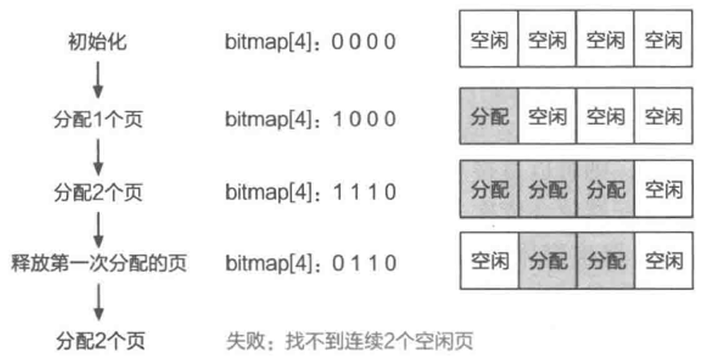
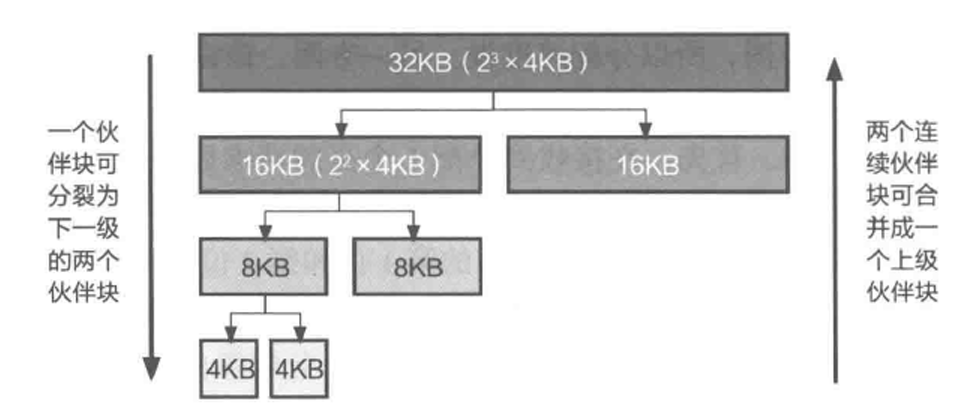
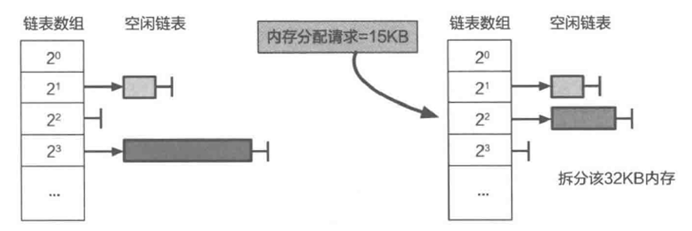
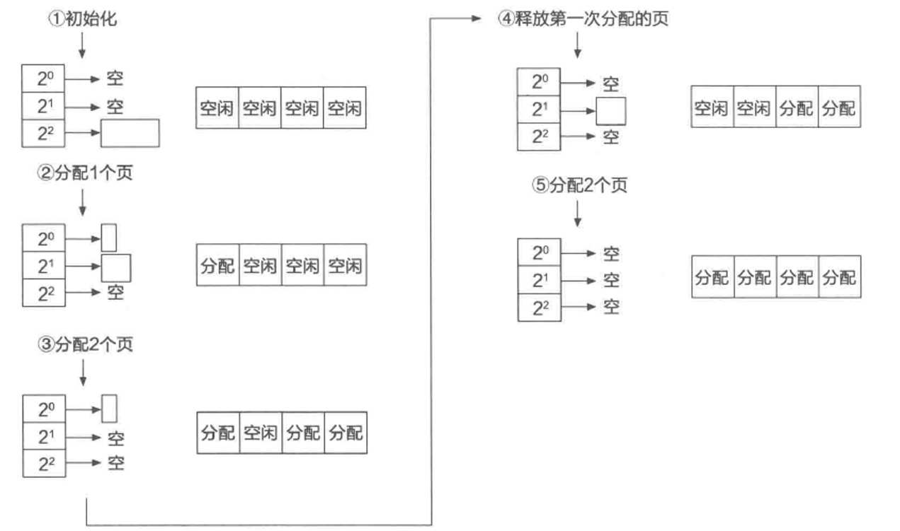
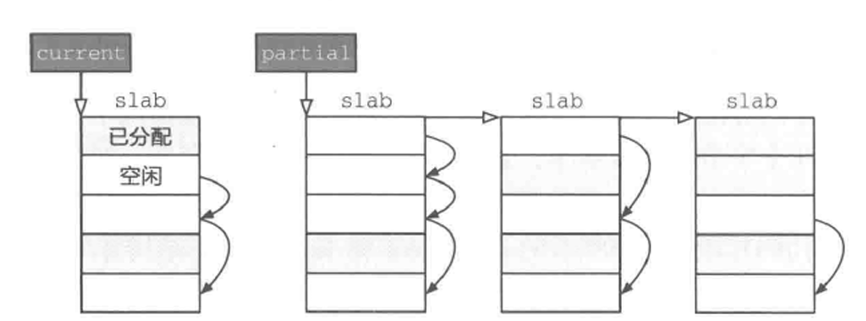
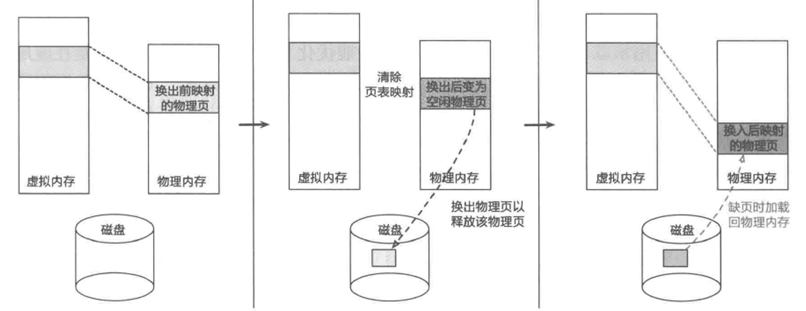
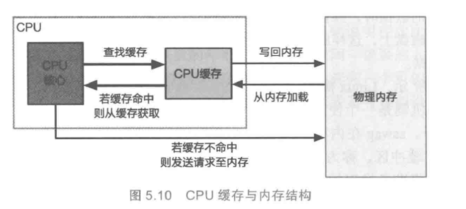
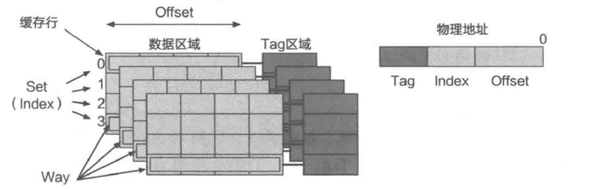
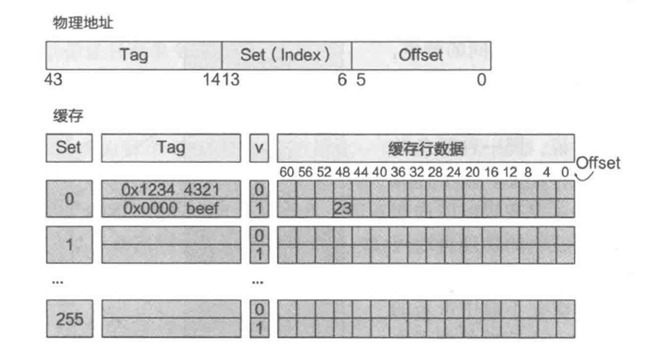

<script>
MathJax = {
  tex: {
    inlineMath: [['$', '$'], ['\\(', '\\)']]
  }
};
</script>
<script src="https://cdn.jsdelivr.net/npm/mathjax@3/es5/tex-chtml.js"></script>
# 教材补充
## [1. 操作系统是如何管理物理内存资源的？](#操作系统是如何管理物理内存资源的)
- [1.1 内存碎片](#内存碎片)
- [1.2 基于位图的连续物理页分配方法](#基于位图的连续物理页分配方法)
- [1.3 伙伴系统原理](#伙伴系统原理)
- [1.4 ChCore中伙伴系统的实现](#chcore中伙伴系统的实现)
- [1.5 SLAB分配器的基本设计](#slab分配器的基本设计)
- [1.6 常用的空闲链表](#常用的空闲链表)

## [2. 操作系统如何获得更多物理内存资源？](#操作系统如何获得更多物理内存资源)
- [2.1 换页机制](#换页机制)
- [2.2 页替换策略](#页替换策略)
- [2.3 页表项中的访问位与页替换策略实现](#页表项中的访问位与页替换策略实现)
- [2.4 利用虚拟内存抽象节约物理内存资源](#利用虚拟内存抽象节约物理内存资源)

## [3. 性能导向的内存分配扩展机制](#性能导向的内存分配扩展机制)
- [3.1 缓存结构](#缓存结构)
- [3.2 物理内存分配与CPU缓存](#物理内存分配与cpu缓存)
- [3.3 多核与内存分配](#多核与内存分配)
- [3.4 非一致内存访问（NUMA架构）](#非一致内存访问numa架构)

## 操作系统是如何管理物理内存资源的？

<aside>
💡

> 在本节中，我们先要了解操作系统的物理分配内存设计的两个评价维度，即减少资源浪费和追求优秀性能，优秀的物理内存分配器要做到两方面兼顾。
有了这样的评价标准，接下来，我们介绍基于位图的连续物理页分配方法，这是一种我们方便理解的简单分配器，从中我们可以初窥物理页分配的具体实现。
但是这种方法存在着诸多缺点，显然无法满足我们的需求，于是我们需要寻求更加高效的物理页分配方法，这就引出了我们本节的重点——伙伴系统原理。我们会详细向你介绍伙伴系统原理的具体内容，并结合代码分析ChCore中对于伙伴系统原理的实现。
但是走到这里并没有万事大吉，因为伙伴系统的最小分配单位是一个物理页（4KB），大多数情况下会产生较多的内部碎片，浪费很多内存，因此为了分配小内存，开发人员设计了另外一套内存分配机制——SLAB分配器。
除了上述两种内存分配方法，还有其他基于不同空闲链表的内存分配方法，我们将在最后为你介绍三种常见的空闲链表。
> 
</aside>

### 内存碎片

我们知道操作系统的物理内存分配需要兼顾优秀的性能和减少资源浪费。前者主要是尽可能降低分配延迟和节约CPU资源，后者主要是考虑内存碎片问题。内存碎片又分为外部碎片和内部碎片。

- 外部碎片：多次分配和回收之后，物理内存上的空闲部分处于离散分布的状态，可能导致系统存在足够的空闲内存，却无法满足内存分配请求。
- 内部碎片：分配内存大于实际使用内存。二者都会造成内存浪费现象。

### 基于位图的连续物理页分配方法

- 基本思想：初始化一个位图，每一位对应一个物理页，若为0则表明相应的物理页空闲，反之则为已分配；在分配时查找位图，找到为0的位，分配相应的物理页，并且把该位设置为1。若分配连续的物理页，则只需要查找连续n位为0的位置，在位图中把相应的物理页标记为1，并返回其中起始物理页的地址即可。

```cpp
1 // 共有 N 个 4K 物理页，位图中的每一个对应一个页
2 bit bitmap[N];
3
4 void init_allocator(void)
5 {
6    int i;
7    for (i = 0; i < N; ++i)
8    bitmap[i] = 0;
9 }
10
11 // 分配 n 个连续的物理页
12 u64 alloc_pages(u64 n)
13 {
14    int i, j, find;
15
16    for (i = 0; i < N; ++i) {
17    find = 1;
18
19    // 从第 i 个物理页开始判断连续 n 个页是否空闲
20    for (j = 0; j < n; ++j) {
21        if (bitmap[i+j] != 0) {
22        find = 0；
23        break;
24        }
25    }
26
27    if (find) {
28    // 将找到的连续 n 个物理页标记为已分配
29    for (j = i; j < i+n; ++j)
30    bitmap[j] = 1;
31    // 返回第 i 个物理页的起始地址
32    return FREE_MEM_START + i * 4K;
33    }
34 }
35
36 // 分配失败
37 return NULL;
38 }
39
40 // 释放 n 个连续的物理页
41 void free_pages(u64 addr,u64 n)
42 {
43     int page_idx;
44     int i;
45
46     // 计算待释放的起始页索引
47     page_idx=(addr-FREE_MEM_START)/4K;
48
49     for(i=0;i<n;++i){
50         bitmap[page_idx+i]=0;
51     }
52 }
```

这种简单分配器可以实现我们的基本需求，但是在前文介绍的两个评价维度上都存在不足。

- 分配速度慢，需要依次查询整个位图。
- 导致外部碎片问题



如图所示，如果先分配一个页，再分配连续的两个页，此时回收第一次分配的一个页，就会导致出现两块独立的空闲块，当有一个2个页的内存请求到达时就会产生失败。

### 伙伴系统原理

*伙伴系统原理在现代操作系统中被广泛地用于分配连续的物理内存页。*



- 基本思想
将物理内存划分成连续的块，以块作为基本单位进行分配。每个块都有一个或多个连续的物理页组成，物理页的数量必须是2的n次幂。
当一个请求需要分配m个物理页时，伙伴系统将寻找一个大小合适的块，该块包含$2^n$ 个物理页，且满足$2^{n-1} < m \leq 2^n$ 。
在处理分配请求的过程中，如果没有合适大小的块，我们可以找到更大的块，将其分裂成两半，即两个小一号的块，这两个块互为伙伴。分裂得到的块可以继续分裂，直到得到一个大小合适的块去服务相应的分配请求。在一个块释放后，分配器会找到其伙伴块，若伙伴块也处于空闲状态，则将这两个伙伴块进行合并，形成一个大一号的空闲块，然后继续尝试向上合并。由于分裂操作和合并操作都是级联的，因此能够很好地缓解外部碎片的问题。



伙伴系统的实现需要用到上图所示的空闲链表数组。全局有一个有序数组，数组中的每一项指向一个空闲链表，每条链表将其对应大小的空闲块连接起来（一个链表中的空闲块大小相同）。当接收到分配请求之后，伙伴分配器首先算出应该分配多大的空闲块，然后查找对应的空闲链表。

- 在上述例子中，我们有一个15KB的内存分配请求，我们计算出应该取一个16KB的块，我们定位到对应的链表，发现该链表为空，因此我们查找下一个更大的链表，于是取出空闲块进行分裂操作，获得两个16KB大小的空闲块，其中一个用于服务请求，另一个依然作为空闲块插入空闲的链表中。

当接收到释放块的请求时，分配器首先找到待释放块的伙伴块。如果伙伴块处于非空闲状态，则将被释放的块直接插入对应大小的空闲链表中，即完成释放；如果伙伴块处于空闲状态，则将两个块进行合并，当成一个完整的块释放，并重复该过程。值得注意的是，在合并过程中寻找伙伴块的方法非常高效。

- 互为伙伴的两个块，它们的内存地址仅有一位不同，且该位由块大小决定。所以在已知一个内存块地址的前提下，只需要翻转该地址中的一位就可以得到其伙伴块的地址，从而能够快速判断是否需要合并。举例来说，块 A（0～8KB）和块 B（8～16KB）互为伙伴块，它们的物理地址分别是 0x0 和 0x2000，根据 直接映射方式，它们在内核地址空间中的虚拟地址分别为固定偏移 +0x0 和固定偏移 +0x2000，仅有第 13 位不同，而块大小是 8KB。

### ChCore中伙伴系统的实现

```cpp
struct physical_page {
    // 是否已经分配
    int allocated;
    // 所属伙伴块大小的幂次
    int order;
    // 用于维护空闲链表，把该页放入/移出空闲链表时使用
    list_node node;
};

// 伙伴系统的空闲链表数组
list free_lists[BUDDY_MAX_ORDER];
```

上面展示了表示物理页的结构体，其中每个结构体对应一个物理页。

```cpp
// 伙伴系统初始化
void init_buddy(struct physical_page *start_page, u64 page_num)
{
    int order;
    int index;
    struct physical_page *page;

    // 初始化物理页结构体数组
    for (index = 0; index < page_num; ++index) {
        page = start_page + index;
        // 标记成已分配
        page->allocated = 1;
        page->order = 0;
    }

    // 初始化伙伴系统的各空闲链表
    for (order = 0; order < BUDDY_MAX_ORDER; ++order) {
        init_list(&(free_lists[order]));
    }

    // 通过释放物理页的接口把物理页插入伙伴系统的空闲链表
    for (index = 0; index < page_num; ++index) {
        page = start_page + index;
        buddy_free_pages(page);
    }
}
```

上面展示了伙伴系统的初始化函数`init_buddy`，他会依次初始化每个`physical_page`结构体。在这个过程中，每个结构体会被标记为已分配（`allocated` 设置为 1）且所属伙伴块仅有一个物理页（`order` 设置为 0）。之后，调用`init_list`来初始化各个大小的空闲链表。然后，`init_buddy` 函数将利用物理页释放接口依次释放每个物理页（函数中最后一个 `for` 循环），在释放每个物理页的过程中，空闲的伙伴块会被级联地合并，并且插入伙伴系统相应的空闲链表中。

```cpp
// 分配伙伴块：2^order 数量的连续 4K 物理页
struct page *buddy_alloc_pages(u64 order)
{
    int cur_order;
    struct list_head *free_list;
    struct page *page = NULL;

    // 搜寻伙伴系统中的各空闲链表
    for (cur_order = order; cur_order < BUDDY_MAX_ORDER; ++cur_order) {
        free_list = &(free_lists[cur_order]);
        if (!list_empty(free_list)) {
            // 从空闲链表中取出一个伙伴块
            page = get_one_entry(free_list);
            break;
        }
    }

    // 若取出的伙伴块大于所需大小，则进行分裂
    page = split_page(order, page);
    // 标记已分配。示意代码忽略分配失败的情况
    page->allocated = 1;
    return page;
}

// 释放伙伴块
void buddy_free_pages(struct page *page)
{
    int order;
    struct list_head *free_list;

    // 标记成空闲
    page->allocated = 0;
    // (尝试)合并伙伴块
    page = merge_page(page);

    // 把合并后的伙伴块放入对应大小的空闲链表
    order = page->order;
    free_list = &(free_lists[order]);
    add_one_entry(free_list, page);
}
```

上述代码介绍了`buddy_alloc_pages`和`buddy_free_pages`的实现逻辑。

`buddy_alloc_pages` 接收 `order` 参数，用于分配 `2^order` 个连续物理页。

- `order`：表示需要分配的块大小为 `2^order` 个物理页（例如 `order=3` 表示分配 8 个页）。
- `free_list`：指向不同大小空闲链表的指针。
- `page`：最终返回的分配块。
- 第一个`for`循环的作用是从 `order` 对应的链表开始查找，若为空则尝试更大的块（如 `order+1`）。找到非空链表后，调用 `get_one_entry` 取出一个空闲块。如果取出的块大小大于所需（例如分配 2 个页但取出的是 8 个页的块），则递归分裂成更小的块。分裂后，将多余的块插入对应链表（例如分裂出 4 个页的块插入 order=2 的链表）。
- 仅将分配块的第一个物理页标记为已分配，而不修改其余页对应的 `physical_page` 结构体。这能够减少内存修改操作从而提升性能，而这么做可行的原因是这些页在被分配后不位于伙伴系统的任一空闲链表中（因此不会被再次分配）。

函数 `buddy_free_pages`释放内存块，并尝试合并伙伴块以减少碎片。

- 将被释放块的第一个页标记为空闲，然后检查伙伴块（相邻且大小相同的块）是否空闲，若空闲则合并成更大的块。合并过程可能递归进行，直到无法合并为止。根据合并后块的大小（`order`），将其插入对应的空闲链表。



在我们学习了上述实现之后，我们对比一下我们在“基于位图的连续物理页分配方法”小节中给出的例子。

当接收到分配 **1 个物理页** 的请求时，`buddy_alloc_pages` 函数会对上述 4 页的空闲块进行级联拆分：首先将 4 页块拆分为两个 **2 页块，然后**进一步将其中一个 2 页块拆分为两个 **1 页块**。分配其中一个 1 页块后，空闲链表中剩余一个 **2 页块** 和一个 **1 页块**。

接下来，当收到分配 **2 个连续物理页** 的请求时，伙伴系统直接返回剩余的 2 页块。

当释放首次分配的 1 页块时，系统会检查其伙伴块：若伙伴块（另一个 1 页块）也处于空闲状态，则将两者合并为一个 **2 页块**，并插入对应链表。

最后，若再次请求分配 **2 个连续物理页**，伙伴系统可直接提供合并后的 2 页块。从而完美避免了外部碎片的问题。

### SLAB分配器的基本设计

*SLAB分配器用于在操作系统中分配小内存。*

本节介绍一种常用的SLAB分配器——SLUB。

SLUB分配器将从伙伴系统分配的大块内存进一步细分成小块内存进行管理。块大小通常为 2^*n* 字节（3≤*n*<12，如 8B、16B、...、4KB）。支持自定义大小以优化内部碎片（例如根据实际需求设置 96B 或 128B）。对于每一种块大小，SLUB分配器都会使用独立的内存资源池进行分配。下面我们介绍内存资源池的相关知识。



如上图所示。SLUB 分配器向伙伴系统中请求一定大小的物理内存块（一个或多个连续的物理页），并将获得的物理内存块作为一个 `slab`。

- `slab` 会被划分成等长的小块内存，并且将其内部空闲的小块内存组织成空闲链表的形式。

一个内存资源池会维护两个指针，分别是`current`和`partial`。

- `current`指针指针仅指向一个 `slab`，所有的分配请求都将从该指针指向的 `slab` 中获得空闲内存块。`partial`指针指向由所有拥有空闲块的 `slab` 组成的链表。
- 分配流程：
1、根据请求大小，找到能满足需求且块大小最接近的内存资源池。
2、从 `current` 指针指向的 slab 中取出第一个空闲块返回。
3、**若当前 slab 无剩余空闲块（全部分配完）**：
            a. 从 `partial` 指针指向的链表中取出一个 slab。
            b. 将该 slab 设为新的 `current` 指针指向的 slab。
        **若 `partial` 链表为空**：
            a. 向伙伴系统申请新的物理内存块，生成新 slab。
            b. 将新 slab 设为 `current` 指针指向的 slab。
- 释放流程：
1、将被释放的内存块插入对应 slab 的空闲链表。
2、**若该 slab 原本已全部分配（释放前无空闲块）**：
                将该 slab 移动到 `partial` 指针指向的链表。
**若该 slab 完全空闲（所有块均被释放）**：
                将整个 slab 返还给伙伴系统。
3、如何找到释放块所属的slab？可以在slab头部加入元数据并且使得slab头部具有对其属性。

### 常用的空闲链表

- 隐式空闲链表将所有内存块（包括空闲和已分配的）串联在一个链表中。每个块的头部存储了块的大小和空闲状态信息，通过块大小可以定位到下一个块的位置。分配时需**遍历**整个链表找到第一个足够大的空闲块，若块过大则分割使用；释放时会检查相邻块是否空闲并进行合并。其优点是实现简单，无需额外空间存储指针，但分配效率较低，时间复杂度与总块数正相关，且容易产生外部碎片。
- 显式空闲链表仅将**空闲块**串联在链表中，每个空闲块通过前驱（prev）和后继（next）指针连接，指针直接存储在空闲块的数据区域。分配时只需遍历空闲块，找到合适块后分割使用；释放时插入链表并检查合并相邻块。由于仅需处理空闲块，分配效率高于隐式链表（时间复杂度与空闲块数正相关），尤其在内存使用率高时优势明显，但需依赖指针维护链表结构。
- 分离空闲链表在显式链表基础上进一步优化，通过维护多个显式链表，每个链表管理特定大小范围的内存块（如8B、16B等）。分配时根据请求大小选择对应链表，若当前链表无合适块则向上查找更大的块链表，分割后的剩余部分插入对应链表；释放时合并相邻块后按大小归位。其优势在于分配速度快（搜索范围缩小）、内存利用率高（近似最优匹配），且支持并发操作。这是显式链表的进阶形式，适用于高性能场景，但实现复杂度更高，需维护多个链表及分链策略。

| **类型** | **管理对象** | **时间复杂度** | **碎片控制** | **适用场景** |
| --- | --- | --- | --- | --- |
| **隐式空闲链表** | 所有内存块 | O(总块数) | 弱（需手动合并） | 简单场景，内存需求不频繁 |
| **显式空闲链表** | 仅空闲块 | O(空闲块数) | 中等 | 内存使用率高，分配频繁 |
| **分离空闲链表** | 分大小管理空闲块 | O(1) ~ O(分链数) | 强（分链优化） | 高性能、高并发系统 |
## 操作系统如何获得更多物理内存资源？

<aside>
💡

本节概要
物理内存不够用时怎么办？——换页机制
如何选择页面进行替换？——页替换策略
如何利用虚拟内存抽象节约物理内存？——内存去重/内存压缩

</aside>

### 换页机制



- **基本思想**：当物理内存容量不足时，操作系统会将一些物理页的内容写入磁盘等大容量存储设备中，从而回收这些物理页以供其他进程使用。
- **换出（Swap Out）**：当操作系统需要回收某个物理页时，会将该页的内容写入磁盘，并在页表中移除对应的虚拟页映射，同时记录该物理页在磁盘上的位置。
- **缺页异常**：当进程访问一个已被换出的虚拟页时，由于页表中没有映射，CPU会触发缺页异常。
- **换入（Swap In）**：操作系统的缺页异常处理函数会分配一个新的物理页，将磁盘上的数据重新加载到该物理页中，并在页表中建立虚拟页到物理页的映射。之后，进程可以从触发异常的指令处继续执行。

**操作系统是用完所有物理页才进行换页的吗？**——可能造成资源紧张时许多物理页分配操作都需要先进行换页，从而造成分配延时高的问题。
**解决方法？**——设置阈值。

- 当空闲物理页数量小于低水位线时，择机进行换页操作，目标是把空闲物理页数量恢复到高水位线；当空闲物理页数量低于最小水位线时，则立即进行换页操作，且批量换出。

**换页机制使得操作系统能够获取更多物理内存资源，是否牺牲了什么作为代价呢？**——磁盘操作会带来性能损失。

**如何减少换页机制带来的性能损失？**——预取机制。

- **基本思想**：预取机制通过在应用进程发生缺页异常之前，提前将可能需要的内存页换入物理内存，从而避免因磁盘操作导致的性能下降。
- **实现方式**：操作系统需要预测应用进程在执行过程中可能会访问哪些内存页。一种常见的预测方法是基于空间局部性特征，即假设进程在访问某个内存页后，可能会继续访问相邻的下一个内存页。
- **操作步骤**：当操作系统需要换入某个内存页时，会同时将相邻的下一个内存页一并换入，以提前准备可能需要的资源。
- 如果预取机制预测准确，可以减少应用进程发生缺页异常的次数，从而提升系统性能；如果预测不准确，预取机制可能会导致不必要的换入操作，占用磁盘读取带宽和内存资源，反而拖累系统性能。

操作系统如何判断页表中没有映射是由于按需页面分配导致的还是换页导致的呢？

——操作系统通过在页表项中做标记来区分这两种情况：

- **按需页面分配**：页表项内容为0，表示该虚拟页从未被分配过物理页。
- **换页机制**：页表项的第0位（最低位）设置为0，表示该页已被换出，其余位记录页面在磁盘上的位置。

### 页替换策略

*页替换策略依据硬件所提供的页面访问信息来猜测哪些页面应该被换出，从而最小化缺页异常的发生次数以提升性能。*

- **MIN/OPT策略**：MIN策略（又称最优策略）选择未来最长时间内不会被访问的页面进行换出。虽然理论上是最优的，但由于无法预知未来的页面访问顺序，实际中难以实现，主要用于衡量其他替换算法的优劣。
- **FIFO策略**：FIFO（先入先出）策略选择最先进入内存的页面进行换出。它维护一个队列记录页面进入顺序，简单且开销低，但性能通常不佳，因为页面进入顺序与使用频率无关。
- **Second Chance策略**：这是FIFO策略的改进版本，增加了访问标志位。如果页面被访问过，则将其标志位清零并移到队尾，避免立即换出。该策略在考虑页面访问信息后，通常优于FIFO策略。
- **LRU策略**：LRU（最近最少使用）策略选择最久未被访问的页面进行换出。它基于局部性原理，认为最近频繁访问的页面未来也可能被频繁访问。实现上需要维护一个按访问时间排序的链表，开销较大。
- **时钟算法策略**：时钟算法将页面排成环形，使用一个指针检查页面的访问标志位。如果页面未被访问过，则换出；否则清零标志位并移动指针。相比Second Chance策略，时钟算法实现更高效。
- **随机替换策略**：随机替换策略任意选择一个页面进行换出。它不需要维护页面访问信息，实现简单，但通常会导致更多的缺页异常，性能不如其他策略。

### 页表项中的访问位与页替换策略实现

```cpp
 // 在 physical_page 结构体中新增成员变量
struct physical_page {
    ...
    // 记录该物理页被映射到哪些页表项（称为反向映射）
    list pgtbl_entries;
};

struct physical_page pages[NUM_PHYSICAL_PAGE];

void add_mapping(u64 pgtbl, u64 va, u64 pa)
{
    ...
    // 记录物理页被填写到哪个页表项
    struct physical_page *page = &pages[pa/PAGE_SIZE];
    add_one_entry(page->pgtbl_entries, pgtbl_entry);
}

// 参数是需要换出的物理页数量
void scan_and_swap(int num_page_to_swap)
{
    int swap;

    // 获取需要遍历的物理页区间（例如物理页号为 0 ~ 1000 的区间）
    scan_range = get_scan_range();

    while (num_page_to_swap != 0) {
        for i in scan_range:
            swap = 1;
            list pgtbl_entries = pages[i]->pgtbl_entries;

            // 利用 for_each_pte 宏遍历某物理页反向映射中的每个页表项
            for_each_pte(pgtbl_entry, pgtbl_entries) {
                if (is_accessed(pgtbl_entry)) {
                    // 将页表项中的访问位清零
                    clear_access(pgtbl_entry);
                    swap = 0;
                }
            }

            if (swap) {
                // 把第 i 个物理页换出
                swap_out(i);
                --num_page_to_swap;
            }
    }
    tlb_flush();
}
```

通过`scan_and_swap`函数，系统会将未被访问的物理页交换出去，避免频繁访问未使用的物理页。为提高效率，只有访问过的虚拟页才会被映射，且当TLB缓存翻译后，MMU会更新页表项，避免重复访问未使用的页，从而减少内存访问冲突。

### 利用虚拟内存抽象节约物理内存资源

- **内存去重**：基于写时拷贝机制，操作系统通过扫描内存中内容相同的物理页面（如全零页），将多个虚拟页面映射到同一物理页，并释放冗余物理页以节省内存。该功能对用户透明，但可能因写入时触发缺页异常和内存拷贝导致性能下降。例如，Linux的KSM（Kernel Same-page Merging）支持跨进程或进程内的页面合并，属于共享内存的一种实现。
- **内存压缩**：在内存资源不足时，操作系统将“近期较少使用”的内存页数据压缩存储于内存中（而非换出到磁盘），以快速释放空间。访问时直接解压即可恢复，减少了磁盘I/O延迟。例如，Linux的zswap机制将待换出数据压缩后暂存于内存缓冲区，通过延迟或批量处理磁盘操作提升效率，同时压缩降低了读写数据量，兼顾了内存利用率和响应速度。

## 性能导向的内存分配扩展机制

<aside>
💡

> 本节概要
为什么需要CPU缓存？CPU缓存的结构是怎样的？
物理内存中的数据远大于CPU缓存的大小，采用何种策略进行物理页分配呢？
多核和NUMA对于内存分配有什么影响？
> 
</aside>

*相比于 CPU 执行的速度，内存访问速度是非常缓慢的：一条算术运算指令可能只需要一个或几个时钟周期即可完成，而一次内存访问则可能需要花费上百个时钟周期。如果每条内存读写指令都需要通过总线访问物理内存，那么 CPU 与物理内存之间的数据搬运可能成为显著的性能瓶颈。*

*为了降低访存的开销，现代 CPU 内部通常包含 CPU 缓存（CPU Cache），用于存放一部分物理内存中的数据。访问 CPU 缓存比访问物理内存快很多，一般最快只需要几个时钟周期。当 CPU 需要向物理内存写入数据时，可以直接写在 CPU 缓存之中；当 CPU 需要从物理内存读取数据时，可以先在 CPU 缓存中查找，如果没找到再去物理内存中获取，并且把取回的数据放入缓存中，以便加速下次读取。由于程序在运行时访问物理内存数据通常具有局部性（包括时间局部性和空间局部性），因此缓存能够有效提升 CPU 访问物理内存数据的性能。*



### 缓存结构

1、CPU缓存中包含若干条**缓存行**和**每条缓存行相应的状态信息。**

- **缓存行**：CPU 缓存的基本单位，通常为 64 字节。CPU 以缓存行为粒度读取和写回物理内存中的数据。
- **状态信息**：每条缓存行包含状态信息，包括：
    - **有效位（Valid Bit）**：表示该缓存行是否有效。
    - **标记地址（Tag Address）**：标识该缓存行对应的物理地址。
    - **其他信息**：可能包括缓存行的其他状态信息。

2、典型的CPU缓存结构



- **物理地址划分**：物理地址在逻辑上分为三段：
    - **Tag**：标记地址，用于标识缓存行对应的物理地址。
    - **Set（Index）**：组索引，用于确定缓存行所在的组。
    - **Offset**：偏移量，用于确定缓存行内的具体位置。
- **组（Set）和路（Way）**：
    - **组（Set）**：物理地址的 Set 段能表示的最大数目称为组。例如，如果 Set 段的位数是 8，那么对应的 CPU 缓存的组数就是 256（2^8）。
    - **路（Way）**：每组中支持的最大缓存行数目（最多的 Tag 数）称为路。例如，如果每组最多支持 4 个不同的 Tag，那么该 CPU 缓存被称为 4 路组相联（4-Way Set Associative）。

3、缓存寻址

***以Cortex-A57 CPU（AArch64架构）的L1数据缓存为例**，介绍CPU缓存查找的一般过程。*

- **缓存参数**：
    - 物理地址长度为44位。
    - 缓存大小为32KB，缓存行大小为64字节。
    - 256组，2路组相联缓存。
- 下面假设要读取以物理地址0x2FBBC030开始的4个字节的物理内存数据。



- **Offset**：每行缓存64字节，需要6位（2^6 = 64）。
- **Set**：256组，需要8位（2^8 = 256）。
- **Tag**：剩余的位数，44 - 6 - 8 = 30位。

所以，地址0x2FBBCC030可以分解为：

- **Tag**：0xBEEF
- **Set**：0x0
- **Offset**：0x30（十进制为48）

从而如图所示，本例中取出的4字节字为23。

- 注意，如果在寻址过程中，虽然Set和Tag都匹配上了，但是Valid为0，那么该缓存行是无效的，需从物理内存搬运相应数据到CPU缓存中。

4、CPU缓存行何时写回物理内存？第一，存在专门的硬件指令负责写回某缓存行；第二，若某组中的缓存行状态都为有效状态且被修改过，而CPU需要在该组中加载新的缓存行进行读写，此时CPU会首先选择该组中已有的某缓存行写回物理内存（空出一个缓存行）。

### 物理内存分配与CPU缓存

- CPU缓存比物理内存快得多，但容量有限。当物理内存中的数据被频繁访问时，如果能尽量存放在CPU缓存中，就能显著提高性能。然而，缓存容量有限，当缓存满了时，CPU会选择替换某些缓存行，这可能导致缓存冲突。
- **缓存着色技术**：将物理页标记为不同的颜色，确保分配给连续虚拟内存页的物理页不会引起缓存冲突。这样，当程序访问这些连续的虚拟内存页时，它们的数据都能在缓存中找到，避免了缓存不命中带来的性能损失。
- 举例说明，假设缓存可以容纳4个连续的物理页，操作系统会将第1到第4个物理页分别标记为4种不同的颜色，然后第5到第8个物理页再重复这4种颜色，以此类推。这样做的结果是，物理页的分配虽然变得复杂了，但如果能准确预测应用的内存访问模式，就能有效提升内存访问性能。FreeBSD和Solaris等操作系统已经采用了这种机制。

### 多核与内存分配

- 多核CPU中，每个核心可以同时运行不同的应用，这些应用在需要操作系统分配内存时，可能会导致多个核心同时调用内存分配接口。为了避免重复分配同一块内存，最初的方法是使用锁机制，确保只有一个核心可以进行内存分配，但这会导致其他核心等待，降低性能。
- 为了解决这个问题，操作系统开发人员提出了为每个CPU核心建立独立的内存分配器的方法。例如，如果有4个CPU核心，就初始化4个SLAB分配器，每个核心使用自己的分配器。这样，多个核心可以同时进行内存分配，不会互相干扰，从而充分发挥多核CPU的优势，提高系统的整体性能。

### 非一致内存访问（NUMA架构）

- **NUMA架构的背景**：多核和多处理器系统引入多个内存控制器，以解决单一内存控制器的性能瓶颈。
- **NUMA架构的组成**：每个处理器或处理器的一部分核心组成一个NUMA节点，节点内的核心可以快速访问本地内存，但访问远端内存时延较高。
- **NUMA架构的复杂性**：现代服务器可能有多个NUMA节点，节点之间的连接可能不是直接的，导致访问时延差异更加复杂。
- 在NUMA架构下，操作系统需要优化内存分配以减少远程访问的开销。现代操作系统通常采用两种策略：一是提供NUMA感知的内存分配接口，让应用显式指定内存分配位置；二是对于未显式使用这些接口的应用，操作系统会根据线程运行的节点，尽量将内存分配在本地节点，如果本地内存不足，再考虑邻近节点。

Linux提供了三种内存分配模式：绑定模式、优先模式和交错模式。绑定模式将内存分配绑定到指定的NUMA节点，优先模式在分配失败时尝试从最近的节点分配内存，交错模式则以页为单位从多个节点交错分配内存。Linux还提供了libnuma库，封装了NUMA相关的系统调用，包括`numa_alloc_onnode`、`numa_alloc_local`和`numa_alloc_interleaved`接口，分别用于在指定节点、本地节点和交错模式下分配内存。此外，`numa_free`接口用于释放通过上述接口分配的内存，防止内存泄漏。这些策略和工具对于理解NUMA架构下的内存管理非常有帮助，尤其是对于多核系统上的高性能计算应用。