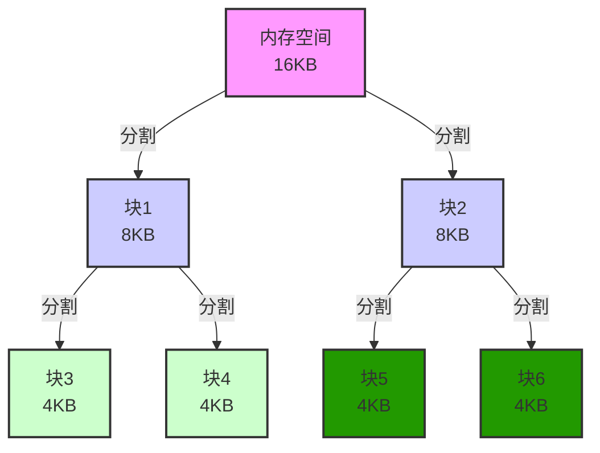
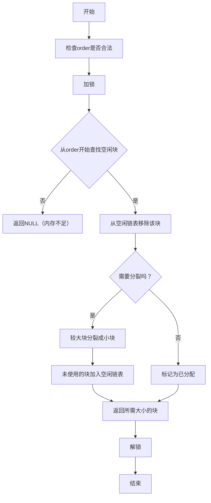
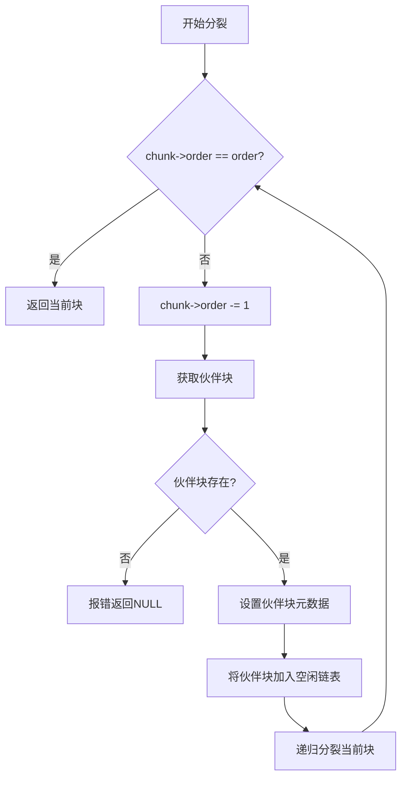
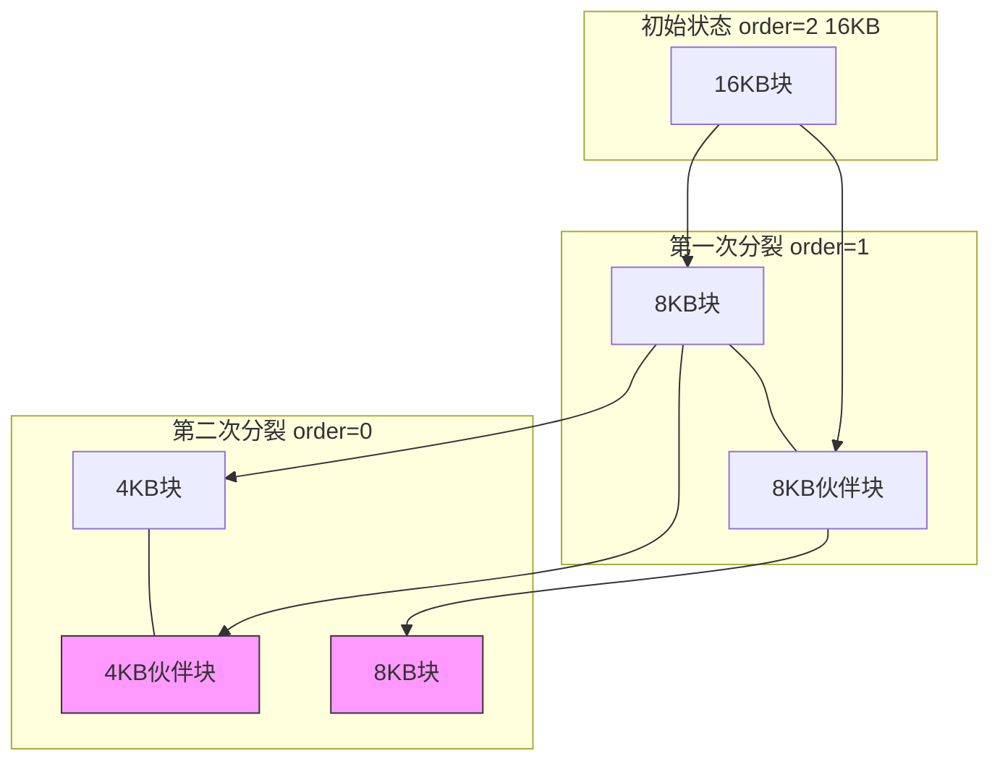
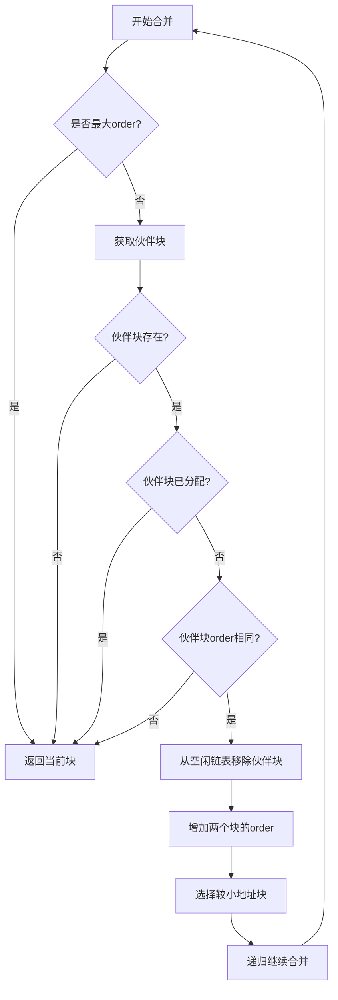
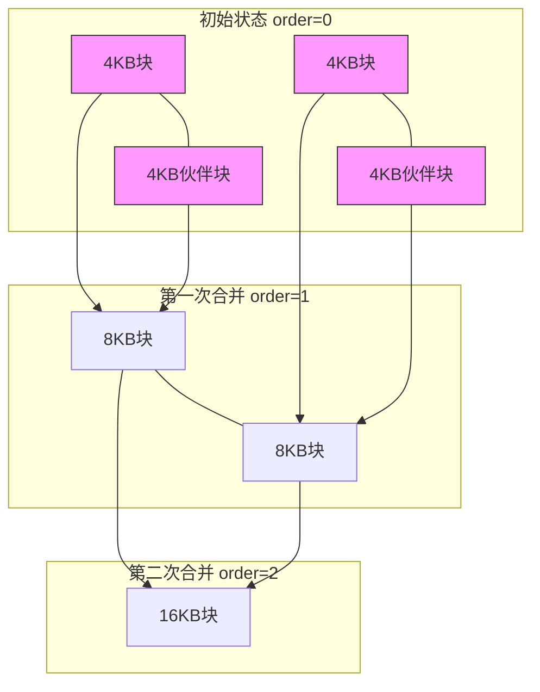
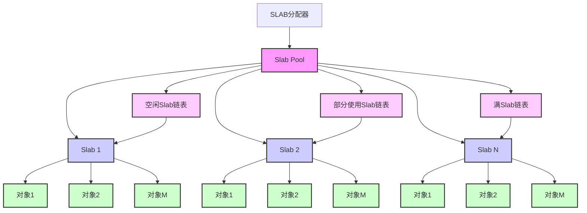
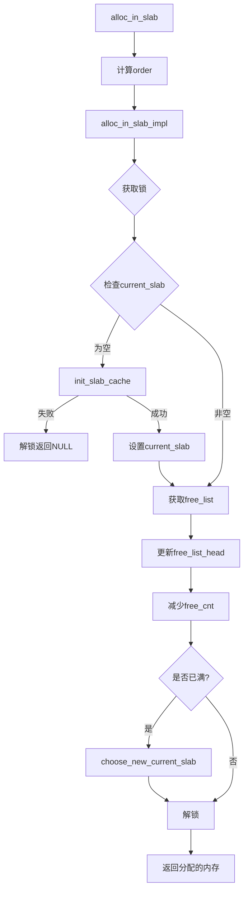

[Buddy System 伙伴系统](#buddy-system-伙伴系统)
  * [回顾：为什么需要伙伴系统](#为什么需要伙伴系统)
    * [外部碎片与内部碎片](#外部碎片与内部碎片)
    * [伙伴系统的设计理念](#伙伴系统的设计理念)
  * [Chcore伙伴系统的设计](#chcore伙伴系统的设计)
    * [核心数据结构](#核心数据结构)
      * [page](#page)
      * [phys_mem_pool](#phys_mem_pool)
    * [核心函数接口](#核心函数接口)
  * [Chcore源码对伙伴系统的具体实现](#chcore源码对伙伴系统的具体实现)
    * [init_buddy](#init_buddy)
    * [get_buddy_chunk](#get_buddy_chunk)
    * [buddy_get_pages](#buddy_get_pages)
    * [buddy_free_pages](#buddy_free_pages)
    * [spilt_chunk](#spilt_chunk)
    * [merge_chunk](#merge_chunk)

[SLab分配器](#slab分配器)
  * [回顾：SLab分配器的设计理念](#slab分配器的设计理念)
    * [基本结构](#基本结构)
    * [SLab的内部组织](#slab的内部组织)
  * [Chcore中SLab分配器的设计](#chcore中slab分配器的设计)
    * [核心数据结构](#核心数据结构-1)
      * [slab_pointer](#slab_pointer)
      * [slab_header](#slab_header)
      * [slab_slot_list](#slab_slot_list)
    * [核心函数接口](#核心函数接口-1)
  * [Chcore源码对SLab功能的具体实现](#chcore源码对slab功能的具体实现)
    * [init_slab](#init_slab)
    * [alloc_in_slab](#alloc_in_slab)
    * [free_in_slab](#free_in_slab)

[Kmalloc & Kfree](#kmalloc与kfree)
  * [kmalloc](#kmalloc)
  * [kfree](#kfree)
# Buddy System 伙伴系统
Buddy System，即**伙伴系统**，被广泛应用于分配连续的物理内存页。本节内容将：

- 回顾伙伴系统的基础知识与设计理念
- 分析Chcore源码对伙伴系统的代码实现与架构
- 解析Chcore源码对伙伴系统操作相关函数的具体实现

## 为什么需要伙伴系统

面对进程多种多样的内存分配请求，自然需要一个精良的分配器设计来承担这样宏伟的责任。许多分配器无不在**内存碎片（无法被利用的内存）**的困扰下捉襟见肘，而伙伴系统则在一定程度上解决了普通简易分配器会带来的内存碎片问题，尤其是在**分配连续内存**的情况下。

### 外部碎片与内部碎片

- 外部碎片：单个空闲内存部分小于分配请求的内存大小
- 内部碎片：分配内存大于实际内存导致的内存碎片

Buddy System将通过合并与级联的设计来避免这些困扰

### 伙伴系统的设计理念

伙伴系统设计理念即基于**伙伴块进行分裂与合并**，主要可概括为以下几点：

- 物理内存划为块为单位分配内存，每个块由连续物理页组成，大小为2^n个物理页（便于分裂与合并）
- 大块可根据分配需求分裂为小块，两个相同的小块可合并为大块，大块分裂出的两个小块即称作伙伴
- 分配时根据需求选择块，若这样的空闲块不存在，则找大块分裂；释放内存时查看其伙伴，若伙伴也空闲则直接合并

如下图所示，相同颜色的块即表示伙伴块



由此一来，基于Buddy System的分配模式便可确保每时每刻的空闲块都是最大的，这样可以避免外部碎片；同时基于分配请求来寻找空闲块分配的操作又尽可能减小了内部碎片的大小。尽量避免了较大内存碎片的产生

## Chcore伙伴系统的设计

### 核心数据结构

核心数据结构，即 `page` 和 `phys_mem_pool` ，如下所示为源码：

```c
#define N_PHYS_MEM_POOLS 3

/* The following two are defined in mm.c and filled by mmparse.c. */
extern paddr_t physmem_map[N_PHYS_MEM_POOLS][2];
extern int physmem_map_num;

/* All the following symbols are only used locally in the mm module. */

/* `struct page` is the metadata of one physical 4k page. */
struct page {
        /* Free list */
        struct list_head node;
        /* Whether the correspond physical page is free now. */
        int allocated;
        /* The order of the memory chunck that this page belongs to. */
        int order;
        /* Used for ChCore slab allocator. */
        void *slab;
        /* The physical memory pool this page belongs to */
        struct phys_mem_pool *pool;
};

struct free_list {
        struct list_head free_list;
        unsigned long nr_free;
};

/*
 * Supported Order: [0, BUDDY_MAX_ORDER).
 * The max allocated size (continous physical memory size) is
 * 2^(BUDDY_MAX_ORDER - 1) * 4K.
 * Given BUDDY_MAX_ORDER is 14, the max allocated chunk is 32M.
 */
#define BUDDY_PAGE_SIZE     (0x1000)
#define BUDDY_MAX_ORDER     (14)

/* One page size is 4K, so the order is 12. */
#define BUDDY_PAGE_SIZE_ORDER (12)

/* Each physical memory chunk can be represented by one physical memory pool. */
struct phys_mem_pool {
        /*
         * The start virtual address (for used in kernel) of
         * this physical memory pool.
         */
        vaddr_t pool_start_addr;
        unsigned long pool_mem_size;

        /*
         * The start virtual address (for used in kernel) of
         * the metadata area of this pool.
         */
        struct page *page_metadata;

        /* One lock for one pool. */
        struct lock buddy_lock;

        /* The free list of different free-memory-chunk orders. */
        struct free_list free_lists[BUDDY_MAX_ORDER];

        /*
         * This field is only used in ChCore unit test.
         * The number of (4k) physical pages in this physical memory pool.
         */
        unsigned long pool_phys_page_num;
};

/* Disjoint physical memory can be represented by several phys_mem_pools. */
extern struct phys_mem_pool global_mem[N_PHYS_MEM_POOLS];
```

#### page

在chcore中，一个 `page` 结构体即表示一个实际的4KB大小的物理内存页，我们来看它的具体成员组成：

- `struct list_head node`  ：是用于维护空闲链表的节点，当我们需要把这个页移入/移出空闲链表时，就会使用到这个节点
- `int allocated` ：表示该页是否被分配
- `int order` ：表示该页所属的块的阶数（即2^n的n）
- `struct phys_mem_pool *pool` ：表示该页所隶属的内存池

另外还有slab，这个会在下文讲解slab分配器的时候具体解析

#### phys_mem_pool

chcore里的内存池即表示一整块连续的物理内存，也就是伙伴系统概念中所提到的整个空闲链表背后所属于的大的连续内存块。所以相应的，它就需要维护链表数组以及其所包含的所有页表元数据。我们还是来看看它的具体成员组成：

- `vaddr_t pool_start_addr` ：内存池表示内存的起始地址
- `unsigned long pool_mem_size` ：内存池表示的内存大小
- `struct page *page_metadata` ：一个页表数组，包含了这个内存块里的所有页表
- `struct lock buddy_lock` ：内存池的锁，用于并行化
- `struct free_list free_lists[BUDDY_MAX_ORDER]` ：空闲链表数组，这里的order最大为14，故有14个这样的链表，可以依次表示4KB到32MB的内存

### 核心函数接口

即伙伴系统用于实际操作这些数据结构的函数，这里先大概介绍一下接口，下文再深入研究其实现：

```c
void init_buddy(struct phys_mem_pool *, struct page *start_page,
                vaddr_t start_addr, unsigned long page_num);

static struct page *get_buddy_chunk(struct phys_mem_pool *pool,
                                    struct page *chunk)
                                    
static struct page *split_chunk(struct phys_mem_pool *pool, int order,
                                struct page *chunk)
                                
static struct page *merge_chunk(struct phys_mem_pool *pool, struct page *chunk)

struct page *buddy_get_pages(struct phys_mem_pool *, int order);

void buddy_free_pages(struct phys_mem_pool *, struct page *page);

void *page_to_virt(struct page *page);

struct page *virt_to_page(void* ptr);

unsigned long get_free_mem_size_from_buddy(struct phys_mem_pool *);

unsigned long get_total_mem_size_from_buddy(struct phys_mem_pool *);
```

从上到下的函数接口依次的功能为：

- `init_buddy` ：初始化伙伴系统，包括其链表数组，页表元数据数组等
- `get_buddy_chunk` ：根据指定内存池和内存块（的起始页表项）找到其伙伴块
- `split_chunk` ：分裂内存块
- `merge_chunk` ：合并伙伴内存块
- `buddy_get_pages` ：查询并获取指定内存池和阶数的内存块
- `buddy_free_pages` ：释放指定内存池的内存块
- `page_to_virt` ：获取给定内存块（page_metadata）的虚拟地址，这是因为page类的指针指向的是 `page_metadata` 而非实际地址
- `virt_to_page` ：根据给定虚拟地址找到相应的内存块（page_metadata），和上面的函数互为逆操作
- `get_free_mem_size_from_buddy` ：获取给定内存池中当前可用的内存总量
- `get_total_mem_size_from_buddy` ：获取给定内存池的总大小

## Chcore源码对伙伴系统的具体实现

上一部分我们从上层的视角讲解了伙伴系统的原理以及Chcore中伙伴系统的架构，这一部分我们则从下层的视角，来分析上文提到的函数接口以及Buddy System核心功能的具体实现

本节主要着重分析对伙伴系统的初始化以及对伙伴块的操作函数的讲解，而受限于篇幅，辅助函数本处不做解析，感兴趣者可自行阅读

### init_buddy

#### 源码

```c
/*
 * The layout of a phys_mem_pool:
 * | page_metadata are (an array of struct page) | alignment pad | usable memory
 * |
 *
 * The usable memory: [pool_start_addr, pool_start_addr + pool_mem_size).
 */
void init_buddy(struct phys_mem_pool *pool, struct page *start_page,
                vaddr_t start_addr, unsigned long page_num)
{
        int order;
        int page_idx;
        struct page *page;

        BUG_ON(lock_init(&pool->buddy_lock) != 0);

        /* Init the physical memory pool. */
        pool->pool_start_addr = start_addr;
        pool->page_metadata = start_page;
        pool->pool_mem_size = page_num * BUDDY_PAGE_SIZE;
        /* This field is for unit test only. */
        pool->pool_phys_page_num = page_num;

        /* Init the free lists */
        for (order = 0; order < BUDDY_MAX_ORDER; ++order) {
                pool->free_lists[order].nr_free = 0;
                init_list_head(&(pool->free_lists[order].free_list));
        }

        /* Clear the page_metadata area. */
        memset((char *)start_page, 0, page_num * sizeof(struct page));

        /* Init the page_metadata area. */
        for (page_idx = 0; page_idx < page_num; ++page_idx) {
                page = start_page + page_idx;
                page->allocated = 1;
                page->order = 0;
                page->pool = pool;
        }

        /* Put each physical memory page into the free lists. */
        for (page_idx = 0; page_idx < page_num; ++page_idx) {
                page = start_page + page_idx;
                buddy_free_pages(pool, page);
        }
}
```

#### 解析

这个函数主要负责初始化我们的伙伴系统，它将接受的参数用于初始化一个特定的内存池，并为之设置相应页表数组和空闲链表数组等。你可能会好奇，这些参数本身又是怎么来的？这便涉及到对整个物理内存系统的初始化，可以移步 `mm.c` 文件的 `mm_init` 函数及相关辅助函数作进一步的学习

根据抽象屏障原则，我们这里只需要关心它是如何初始化一个内存池即可

我们根据注释分析得到实际上的内存池内存布局：

```
内存池的布局：
+--------------------------------------------------------------------
|     页面元数据区域        |    对齐填充     |      实际可用内存区域      |
| (struct page 数组)      |    (未使用)     |    (用于分配的物理内存)    |
+------------------------+-------------------------------------------
```

源码的工作可以分成三个阶段：

- 初始化物理内存池：根据传入的参数设置物理内存池的相应数据成员，这里的 `BUDDY_PAGE_SIZE` 是0x1000，也即4KB
- 初始化空闲链表：用一个for循环将每个阶的空闲链表均初始化，这里首先将每个链表的空闲数设为0，同时用初始化函数 `init_list_head` 将这个链表节点的首尾都连到自己身上
- 初始化页表元数据：先用 `memset` 将这块内存全部清零；再用for循环溜一遍，利用指针运算初始化每个页表相应数据；最后再依次free每个物理页表，这里自然会涉及到后面的merge操作，并最终得到一个全部空闲的内存池

可以看见，chcore中实际的设计和书上提到的基本一致，不过书上的介绍做了一定的简化

### get_buddy_chunk

找呀找呀找朋友，找到一个伙伴块

#### 源码

```c
static struct page *get_buddy_chunk(struct phys_mem_pool *pool,
                                    struct page *chunk)
{
        vaddr_t chunk_addr;
        vaddr_t buddy_chunk_addr;
        int order;

        /* Get the address of the chunk. */
        chunk_addr = (vaddr_t)page_to_virt(chunk);
        order = chunk->order;
        /*
         * Calculate the address of the buddy chunk according to the address
         * relationship between buddies.
         */
        buddy_chunk_addr = chunk_addr
                           ^ (1UL << (order + BUDDY_PAGE_SIZE_ORDER));

        /* Check whether the buddy_chunk_addr belongs to pool. */
        if ((buddy_chunk_addr < pool->pool_start_addr)
            || ((buddy_chunk_addr + (1 << order) * BUDDY_PAGE_SIZE)
                > (pool->pool_start_addr + pool->pool_mem_size))) {
                return NULL;
        }

        return virt_to_page((void *)buddy_chunk_addr);
}
```

#### 解析

由伙伴块的定义可知，互为伙伴的两个块，它们的内存地址仅有一位不同，且该位由order决定

于是这块代码的核心便在于如何由位运算得到伙伴块的地址，首先，我们有：

```
块A的伙伴是块B = 块A的地址 ^ size
块B的伙伴是块A = 块B的地址 ^ size
```

于是我们可以由order和BUDDY_PAGE_SIZE_ORDER（这里是12，因为一个页的大小是4KB）得到size的大小：

```c
(1UL << (order + BUDDY_PAGE_SIZE_ORDER))
```

再做一个异或，就得到了相应的伙伴块地址。接下来的事情，就交给辅助函数！

### buddy_get_pages

现在让我们看看一次完整的向伙伴系统申请内存的流程是怎样的！

#### 源码

```c
struct page *buddy_get_pages(struct phys_mem_pool *pool, int order)
{
        int cur_order;
        struct list_head *free_list;
        struct page *page = NULL;

        if (unlikely(order >= BUDDY_MAX_ORDER)) {
                kwarn("ChCore does not support allocating such too large "
                      "contious physical memory\n");
                return NULL;
        }

        lock(&pool->buddy_lock);

        /* Search a chunk (with just enough size) in the free lists. */
        for (cur_order = order; cur_order < BUDDY_MAX_ORDER; ++cur_order) {
                free_list = &(pool->free_lists[cur_order].free_list);
                if (!list_empty(free_list)) {
                        /* Get a free memory chunck from the free list */
                        page = list_entry(free_list->next, struct page, node);
                        list_del(&page->node);
                        pool->free_lists[cur_order].nr_free -= 1;
                        page->allocated = 1;
                        break;
                }
        }

        if (unlikely(page == NULL)) {
                kdebug("[OOM] No enough memory in memory pool %p\n", pool);
                goto out;
        }

        /*
         * Split the chunk found and return the start part of the chunck
         * which can meet the required size.
         */
        page = split_chunk(pool, order, page);

out:
        unlock(&pool->buddy_lock);
        return page;
}
```

#### 解析

纵览代码，我们可以绘制该函数执行的流程图：



重点可以看看伙伴系统是如何查找满足要求的空闲块的：

```c
        /* Search a chunk (with just enough size) in the free lists. */
        for (cur_order = order; cur_order < BUDDY_MAX_ORDER; ++cur_order) {
                free_list = &(pool->free_lists[cur_order].free_list);
                if (!list_empty(free_list)) {
                        /* Get a free memory chunck from the free list */
                        page = list_entry(free_list->next, struct page, node);
                        list_del(&page->node);
                        pool->free_lists[cur_order].nr_free -= 1;
                        page->allocated = 1;
                        break;
                }
        }
```

从查询要求提供的order开始，一级一级向上查找，如果没有则向上加一级，如果有则操作链表，取出这块空闲块，并同时设置空闲链表的相应参数，退出循环

一个可能的例子如下：

```
假设要申请 order=2 (16KB) 的内存：

1. 先查找 order=2 的空闲链表
2. 如果没有，查找 order=3 的空闲链表
3. 如果没有，继续查找更大的空闲链表
4. 直到找到可用的内存块或达到最大阶数
```

至于裂开的操作，我们马上就会讲到

### buddy_free_pages

和get操作类似，我们现在来看看free操作是如何进行的

#### 源码

```c
void buddy_free_pages(struct phys_mem_pool *pool, struct page *page)
{
        int order;
        struct list_head *free_list;

        lock(&pool->buddy_lock);

        BUG_ON(page->allocated == 0);
        /* Mark the chunk @page as free. */
        page->allocated = 0;
        /* Merge the freed chunk. */
        page = merge_chunk(pool, page);

        /* Put the merged chunk into the its corresponding free list. */
        order = page->order;
        free_list = &(pool->free_lists[order].free_list);
        list_add(&page->node, free_list);
        pool->free_lists[order].nr_free += 1;

        unlock(&pool->buddy_lock);
}
```

#### 解析

get还需要查询是否有空闲块，而free则简单多了——直接设置参数后merge即可！最后不要使用链表操作将这个块放进内存池的空闲链表里

同样的，加锁和去锁在这里也少不了，它们是并发安全性的保证

下面我们就讲解裂开和合并的具体实现，也是伙伴系统最关键的地方

### spilt_chunk

#### 源码

```c
static struct page *split_chunk(struct phys_mem_pool *pool, int order,
                                struct page *chunk)
{
        struct page *buddy_chunk;
        struct list_head *free_list;

        /*
         * If the @chunk's order equals to the required order,
         * return this chunk.
         */
        if (chunk->order == order)
                return chunk;

        /*
         * If the current order is larger than the required order,
         * split the memory chunck into two halves.
         */
        chunk->order -= 1;

        buddy_chunk = get_buddy_chunk(pool, chunk);
        /* The buddy_chunk must exist since we are spliting a large chunk. */
        if (buddy_chunk == NULL) {
                BUG("buddy_chunk must exist");
                return NULL;
        }

        /* Set the metadata of the remaining buddy_chunk. */
        buddy_chunk->order = chunk->order;
        buddy_chunk->allocated = 0;

        /* Put the remaining buddy_chunk into its correspondint free list. */
        free_list = &(pool->free_lists[buddy_chunk->order].free_list);
        list_add(&buddy_chunk->node, free_list);
        pool->free_lists[buddy_chunk->order].nr_free += 1;

        /* Continue to split current chunk (@chunk). */
        return split_chunk(pool, order, chunk);
}
```

#### 解析

注意该函数接受的参数： `order` 指的是最后要得到的内存块的order，这一点也可以在上面申请内存的函数中对该函数的调用发现

函数整体上采用**尾递归**的设计，每次执行时先判断边界条件，随后再进行具体的单次分裂的操作

下面是对于其逻辑的具体分析：



以将16KB分裂为4KB为例，我们可以用一个示意图来描述这个过程。此处粉色块表示被加入空闲链表的伙伴块，白色块表示继续递归分裂的块，直到拿到我们想要的块



最后我们再来看合并块的实现

### merge_chunk

#### 源码

```c
/* The most recursion level of merge_chunk is decided by the macro of
 * BUDDY_MAX_ORDER. */
static struct page *merge_chunk(struct phys_mem_pool *pool, struct page *chunk)
{
        struct page *buddy_chunk;

        /* The @chunk has already been the largest one. */
        if (chunk->order == (BUDDY_MAX_ORDER - 1)) {
                return chunk;
        }

        /* Locate the buddy_chunk of @chunk. */
        buddy_chunk = get_buddy_chunk(pool, chunk);

        /* If the buddy_chunk does not exist, no further merge is required. */
        if (buddy_chunk == NULL)
                return chunk;

        /* The buddy_chunk is not free, no further merge is required. */
        if (buddy_chunk->allocated == 1)
                return chunk;

        /* The buddy_chunk is not free as a whole, no further merge is required.
         */
        if (buddy_chunk->order != chunk->order)
                return chunk;

        /* Remove the buddy_chunk from its current free list. */
        list_del(&(buddy_chunk->node));
        pool->free_lists[buddy_chunk->order].nr_free -= 1;

        /* Merge the two buddies and get a larger chunk @chunk (order+1). */
        buddy_chunk->order += 1;
        chunk->order += 1;
        if (chunk > buddy_chunk)
                chunk = buddy_chunk;

        /* Keeping merging. */
        return merge_chunk(pool, chunk);
}
```

#### 解析

有了对分裂块过程的了解，那么合并块理解起来就更简单了：同样是基于尾递归的实现，每次执行时先判断当前块是否已经达到最大的阶数or它的伙伴已经不在了，然后再执行相应操作，最后递归处理

我们以一张示例图结束伙伴块之间的羁绊



注意这里判断伙伴块阶数相同的操作，实际上是看伙伴块是否**依然作为一个整体空闲着存在**，而不是已经裂开了

同样以4KB——16KB为例，介绍一次典型的合并过程



这样便完成了对merge操作的实现的介绍与解析

# SLab分配器

Buddy System负责分配连续的物理内存页，但是如果系统遇到了小内存分配的需求，比如仅仅数十个字节的结构体等，这时候若继续使用伙伴系统，由于其最少只能分配4KB的内存，便会造成严重的内部碎片问题。而SLab分配器（SLub）便是专用于小内存分配的，它和Buddy System一起构成了Chcore的物理内存管理系统

本节内容承接上文，为大家介绍Chcore中SLab分配器的设计与具体实现，主要还是包括三个部分：

- 回顾SLab分配器的基础知识与设计理念
- 分析Chcore源码对SLab的代码实现与架构
- 解析Chcore源码对SLab操作相关函数的具体实现

## SLab分配器的设计理念

SLab专用于小内存的分配。和伙伴系统不同，SLab本身不涉及对内存块的合并与分裂，而是通过一个个不同的SLab池，来分配不同固定大小的内存块，并且在SLab池内部使用链表结构串起一个个SLab，SLab内部又使用空闲链表的结构，便可以对所有的空闲内存块进行管理和分配

#### 基本结构

- SLab是一个内存分配器，主要用于分配小块内存（32字节到2048字节之间）
- 整个系统维护了多个不同大小的 `slab_pool`  ，每个池对应特定大小的内存块
- 内存大小按2的幂次方划分：32, 64, 128, 256, 512, 1024, 2048字节（从2^5到2^11）

#### SLab的内部组织

每个 `slab_pool` 由多个slab组成，每个slab又具有以下特点：

- 固定大小为128KB（`SIZE_OF_ONE_SLAB`）
- 包含一个 `slab_header`（位于slab开始处）
- 剩余空间被划分为大小相等的对象槽（`slots`）
- 使用空闲链表（`free_list`）管理未分配的对象槽
- 每个 `slab_pool` 有current和partial指针，分别指向当前slab以及总的slab链表组

#### **SLab的工作流程**

- 当请求分配内存时，SLAB分配器会首先从**部分使用Slab链表**中查找是否有可用的对象
- 如果没有，它会从**空闲Slab链表**中取出一个slot，并将其移动到**部分使用Slab链表**
- 如果空闲链表也为空（即partial为空），则会从内存中（即伙伴系统）分配一个新的slab，然后进行上一步操作
- 当释放内存块时，如果一个slab中的所有slots都被释放，则该slab会被移动到**空闲Slab链表**

有如下示意图以供参考



这里的对象即为内存块，在Chcore实现中用slot表示，下面会提到。实际的SLab分配器的设计可能用到full_slab链表也可能不会，具体根据其实现确定
- **问题：怎么找到释放块所属的slab，一种方式是维护一个额外的full slab组，另一种方式是让slab的内存地址对齐，并在slab头部加上元数据实现**

```c
struct slab_pointer {
        struct slab_header *current_slab;
        struct list_head partial_slab_list;
};
```

在chcore之中采用的是内存对齐+元数据的方式，具体而言，元数据为：

- 在每一个slab块的开头，维护一个其中内存槽slot的free list head
- 在每一个内存槽slot之中，存一个next_free的指针
- slab由buddy sys分配，保证slab header地址按 page 对齐

这样，当我想要free addr时, 可以找到对应的page, 进而找到slab header, 进而得到free_list，最后在free_list之中插入这个slot, 然后由这个slab的空闲slot个数判断是否是 full → partial, partial→free, 从而进行插入partial list或者把slab空间归还给buddy sys的操作

```c
/*
 * order range: [SLAB_MIN_ORDER, SLAB_MAX_ORDER]
 * ChCore prepares the slab for each order in the range.
 */
#define SLAB_MIN_ORDER (5)
#define SLAB_MAX_ORDER (11)

/* The size of one slab is 128K. */
#define SIZE_OF_ONE_SLAB (128*1024)

/* slab_header resides in the beginning of each slab (i.e., occupies the first slot). */
struct slab_header {
        /* The list of free slots, which can be converted to struct slab_slot_list. */
        void *free_list_head;
        /* Partial slab list. */
        struct list_head node;

        int order;
        unsigned short total_free_cnt; /* MAX: 65536 */
        unsigned short current_free_cnt;
};

/* Each free slot in one slab is regarded as slab_slot_list. */
struct slab_slot_list {
        void *next_free;
};

struct slab_pointer {
        struct slab_header *current_slab;
        struct list_head partial_slab_list;
};

/* All interfaces are kernel/mm module internal interfaces. */
void init_slab(void);
void *alloc_in_slab(unsigned long, size_t *);
void free_in_slab(void *addr);
unsigned long get_free_mem_size_from_slab(void);
```

```c
static void try_insert_full_slab_to_partial(struct slab_header *slab)
{
        /* @slab is not a full one. */
        if (slab->current_free_cnt != 0)
                return;

        int order;
        order = slab->order;

        list_append(&slab->node, &slab_pool[order].partial_slab_list);
}
static void try_return_slab_to_buddy(struct slab_header *slab, int order)
{
        /* The slab is whole free now. */
        if (slab->current_free_cnt != slab->total_free_cnt)
                return;

        if (slab == slab_pool[order].current_slab)
                choose_new_current_slab(&slab_pool[order], order);
        else
                list_del(&slab->node);

        /* Clear the slab field in the page structures before freeing them. */
        set_or_clear_slab_in_page(slab, SIZE_OF_ONE_SLAB, false);
        free_pages_without_record(slab);
}
void free_in_slab(void *addr)
{
        struct page *page;
        struct slab_header *slab;
        struct slab_slot_list *slot;
        int order;

        slot = (struct slab_slot_list *)addr;
        // 拿到对应的page
        page = virt_to_page(addr);
        if (!page) {
                kdebug("invalid page in %s", __func__);
                return;
        }

        slab = page->slab;
        order = slab->order;
        lock(&slabs_locks[order]);
        // 检查是否是full -> partial(通过header中slot的free cnt)
        try_insert_full_slab_to_partial(slab);

#if ENABLE_DETECTING_DOUBLE_FREE_IN_SLAB == ON
        /*
         * SLAB double free detection: check whether the slot to free is
         * already in the free list.
         */
        if (check_slot_is_free(slab, slot) == 1) {
                kinfo("SLAB: double free detected. Address is %p\n",
                      (unsigned long)slot);
                BUG_ON(1);
        }
#endif

        slot->next_free = slab->free_list_head;
        slab->free_list_head = slot;
        slab->current_free_cnt += 1;

        try_return_slab_to_buddy(slab, order);

        unlock(&slabs_locks[order]);
}

```

**这里有一个很巧妙的类似union的设计**

slot 是显式空闲链表的好处在于，在空闲时，slot的空间可以用来维护信息，例如

```c
struct slab_slot_list {
        void *next_free; // 此处8字节
};
```

但并没有影响slot的个数，缓存行和页的对齐

**因为当实际alloc的时候，刚好这个slot不再是空闲链表的成员，不再需要它的信息**

**所以可以直接返回slot的地址给调用者，覆盖掉这个next_free也没有任何关系**

```c
void *alloc_in_slab(unsigned long size, size_t *real_size)
{
				// real_size仅作统计用, 和slab无关
        int order;

        BUG_ON(size > order_to_size(SLAB_MAX_ORDER));

        order = (int)size_to_order(size);
        if (order < SLAB_MIN_ORDER)
                order = SLAB_MIN_ORDER;

#if ENABLE_MEMORY_USAGE_COLLECTING == ON
        if (real_size)
                *real_size = 1 << order;
#endif
				// 这里直接返回了这个slot的指针
        return alloc_in_slab_impl(order);
}
```

值得借鉴的还有alloc_in_slab_impl的lazy init

```c
static void *alloc_in_slab_impl(int order)
{
        struct slab_header *current_slab;
        struct slab_slot_list *free_list;
        void *next_slot;

        lock(&slabs_locks[order]);
			  // 这里做了一个lazy init, 不仅在资源上获得了一定的优势, 还简化了整体init模块的逻辑，
			  // 把内部实现的部分全部放到了内部接口里面，保持外界的无感知，即为"高内聚低耦合"
        current_slab = slab_pool[order].current_slab;
        /* When serving the first allocation request. */
        if (unlikely(current_slab == NULL)) {
                current_slab = init_slab_cache(order, SIZE_OF_ONE_SLAB);
                if (current_slab == NULL) {
                        unlock(&slabs_locks[order]);
                        return NULL;
                }
                slab_pool[order].current_slab = current_slab;
        }

        free_list = (struct slab_slot_list *)current_slab->free_list_head;
        BUG_ON(free_list == NULL);

        next_slot = free_list->next_free;
        current_slab->free_list_head = next_slot;

        current_slab->current_free_cnt -= 1;
        /* When current_slab is full, choose a new slab as the current one. */
        if (unlikely(current_slab->current_free_cnt == 0))
                choose_new_current_slab(&slab_pool[order], order);

        unlock(&slabs_locks[order]);

        return (void *)free_list;
}

```

最后的init函数就很简单了

```c
void init_slab(void)
{
        int order;

        /* slab obj size: 32, 64, 128, 256, 512, 1024, 2048 */
        for (order = SLAB_MIN_ORDER; order <= SLAB_MAX_ORDER; order++) {
                lock_init(&slabs_locks[order]);
                slab_pool[order].current_slab = NULL;
                init_list_head(&(slab_pool[order].partial_slab_list));
        }
        kdebug("mm: finish initing slab allocators\n");
}
```

梳理一下最终的实现逻辑:

预留空间(全局变量): 各个order的slab组的结构体array和对应的lock

init:

- 初始化 32~ 2048 字节为slot的各个slab, 每一个slab为 `SIZE_OF_ONE_SLAB=128K` 大小，初始化对应的锁，对全局变量的slab array的 `free_list_head` `current_slab` `partial_slab_list` 初始化

alloc:

- 判断参数正确性
- 如果current slab为null，为第一次分配，调用 `init_slab_cache` 进行初始化，从buddy system之中拿 `SIZE_OF_ONE_SLAB` 大小的空间，之后在第一个slot处初始化头元数据（总slot数量，slab order, free_list_head, 当前空闲slot数量），然后循环将每个slot的next_free指向下一个
- 拿锁，从current slab的free list之中拿走第一个slot，空闲块数量-=1，修改free list头指针
- 如果此时current slab是full, 从partial_slab_list之中拿一个过来作为新current
- 放锁，返回slot的地址

free:

- 从addr拿到page和其他slab头信息
- 拿锁，将free的slot头插回slab的free list
- 如果slab原先是full，放回partial; 如果现在是空，放回buddy sys(如果是current, 先选择新current)
- 放锁

## Chcore中SLab分配器的设计

同伙伴系统一样，这部分主要介绍Chcore中SLab分配器实现的核心数据结构和函数接口

### 核心数据结构

先上代码，看看有哪些数据结构

```c
/*
 * order range: [SLAB_MIN_ORDER, SLAB_MAX_ORDER]
 * ChCore prepares the slab for each order in the range.
 */
#define SLAB_MIN_ORDER (5)
#define SLAB_MAX_ORDER (11)

/* The size of one slab is 128K. */
#define SIZE_OF_ONE_SLAB (128*1024)

/* slab_header resides in the beginning of each slab (i.e., occupies the first slot). */
struct slab_header {
        /* The list of free slots, which can be converted to struct slab_slot_list. */
        void *free_list_head;
        /* Partial slab list. */
        struct list_head node;

        int order;
        unsigned short total_free_cnt; /* MAX: 65536 */
        unsigned short current_free_cnt;
};

/* Each free slot in one slab is regarded as slab_slot_list. */
struct slab_slot_list {
        void *next_free;
};

struct slab_pointer {
        struct slab_header *current_slab;
        struct list_head partial_slab_list;
};

/* slab_pool is also static. We do not add the static modifier due to unit test.
 */
struct slab_pointer slab_pool[SLAB_MAX_ORDER + 1];
static struct lock slabs_locks[SLAB_MAX_ORDER + 1];

```

Chcore中的SLab分配器设定大体服从书上的安排，以内存池为单元，先看宏定义：

- `SLAB_MIN_ORDER & SLAB_MIN_ORDER` ：表示SLab分配器可以操作的内存块大小，从2^5到2^11字节
- `SIZE_OF_ONE_SLAB` ：表示每个slab的大小，在Chcore中是128KB

接下来我们再分析其核心数据结构的实现：

#### slab_pointer

即Chcore中表示slab池的数据结构，这个也可以在下面对 `slab_pool` 的定义中看见。其数据成员即我们之前介绍的current和partial指针，在这里以 `slab_header` 和 `list_head` 的形式出现

#### slab_header

是Chcore中代表一个个具体的slab的对象，其成员包含：

- `void *free_list_head` ：内部空闲slot的链表
- `struct list_head node` ：partial中表示自身的节点，如何由节点反过来得到其处于的slab？内存地址对齐+slab元数据
- `int order` ：该slab的阶数
- `total_free_cnt & current_free_cnt` ：总的空闲块数 & 当前空闲块数

最后是slot自身

#### slab_slot_list

仅包含一个 `void *next_free` 指针，它们串起来得到每个slab内部的空闲块链表

### 核心函数接口

Chcore的SLab分配器的实现包含了较多的辅助函数，这里只介绍重要的几个接口：

```c
void init_slab(void);
void *alloc_in_slab(unsigned long, size_t *);
void free_in_slab(void *addr);
```

从上到下函数接口的功能依次为：

- `init_slab` ：初始化SLab分配器
- `alloc_in_slab` ：在slab中申请分配内存
- `free_in_slab` ：释放相应的内存

## Chcore源码对SLab功能的具体实现

同伙伴系统一样，这部分解析Chcore源码对SLab功能函数的具体实现，主要内容即为上面部分提到的三个函数，其中又会涉及到其他辅助函数，根据重要程度串起来讲解

### init_slab

#### 源码

```c
void init_slab(void)
{
        int order;

        /* slab obj size: 32, 64, 128, 256, 512, 1024, 2048 */
        for (order = SLAB_MIN_ORDER; order <= SLAB_MAX_ORDER; order++) {
                lock_init(&slabs_locks[order]);
                slab_pool[order].current_slab = NULL;
                init_list_head(&(slab_pool[order].partial_slab_list));
        }
        kdebug("mm: finish initing slab allocators\n");
}
```

#### 解析

初始化函数和伙伴系统比起来简单了许多，直接用一个for循环去过一遍所有slab池即可：

- 初始化 32~ 2048 字节为slot的各个slab, 每一个slab为 `SIZE_OF_ONE_SLAB=128K` 大小
- 初始化对应的锁
- 对全局变量的slab array的  `current_slab` `partial_slab_list` 初始化

### alloc_in_slab

#### 源码

```c
void *alloc_in_slab(unsigned long size, size_t *real_size)
{
        int order;

        BUG_ON(size > order_to_size(SLAB_MAX_ORDER));

        order = (int)size_to_order(size);
        if (order < SLAB_MIN_ORDER)
                order = SLAB_MIN_ORDER;

#if ENABLE_MEMORY_USAGE_COLLECTING == ON
        if (real_size)
                *real_size = 1 << order;
#endif

        return alloc_in_slab_impl(order);
}

static void *alloc_in_slab_impl(int order)
{
        struct slab_header *current_slab;
        struct slab_slot_list *free_list;
        void *next_slot;

        lock(&slabs_locks[order]);

        current_slab = slab_pool[order].current_slab;
        /* When serving the first allocation request. */
        if (unlikely(current_slab == NULL)) {
                current_slab = init_slab_cache(order, SIZE_OF_ONE_SLAB);
                if (current_slab == NULL) {
                        unlock(&slabs_locks[order]);
                        return NULL;
                }
                slab_pool[order].current_slab = current_slab;
        }

        free_list = (struct slab_slot_list *)current_slab->free_list_head;
        BUG_ON(free_list == NULL);

        next_slot = free_list->next_free;
        current_slab->free_list_head = next_slot;

        current_slab->current_free_cnt -= 1;
        /* When current_slab is full, choose a new slab as the current one. */
        if (unlikely(current_slab->current_free_cnt == 0))
                choose_new_current_slab(&slab_pool[order], order);

        unlock(&slabs_locks[order]);

        return (void *)free_list;
}

static void choose_new_current_slab(struct slab_pointer *pool, int order)
{
        struct list_head *list;

        list = &(pool->partial_slab_list);
        if (list_empty(list)) {
                pool->current_slab = NULL;
        } else {
                struct slab_header *slab;

                slab = (struct slab_header *)list_entry(
                        list->next, struct slab_header, node);
                pool->current_slab = slab;
                list_del(list->next);
        }
}
```

#### 解析

注意到源码将参数检查和核心实现分为了两部分，其中核心实现单独用了一个辅助函数，对外的接口则为 `alloc_in_slab` 本身

二者视作一起看，其核心逻辑如下：

- 参数检查，确保order符合范围，太大则报错，太小则向上补到最小值
- 加锁，确保并发安全性
- 若current为空，则为首次分配，需要先init一下（注意这里是直接使用的内部接口，保持了外界的无感知，也简化了这里的代码逻辑）
- 随后直接从current的slab的空闲链表中取出一块slot作为返回值，同时处理相应字段，如空闲块数量减一，修改list_head等
- 若当前slab已满，则换新的slab，通过 choose_new_current_slab 进行操作，方式依然是通过定义好的list操作宏直接操作相应的链表
- 解锁，完成分配

逻辑图可以作如下参考，便于理解阅读：



### free_in_slab

最后是free的操作，为slab拼上最后一块拼图

#### 源码

```c
void free_in_slab(void *addr)
{
        struct page *page;
        struct slab_header *slab;
        struct slab_slot_list *slot;
        int order;

        slot = (struct slab_slot_list *)addr;
        page = virt_to_page(addr);
        if (!page) {
                kdebug("invalid page in %s", __func__);
                return;
        }

        slab = page->slab;
        order = slab->order;
        lock(&slabs_locks[order]);

        try_insert_full_slab_to_partial(slab);

#if ENABLE_DETECTING_DOUBLE_FREE_IN_SLAB == ON
        /*
         * SLAB double free detection: check whether the slot to free is
         * already in the free list.
         */
        if (check_slot_is_free(slab, slot) == 1) {
                kinfo("SLAB: double free detected. Address is %p\n",
                      (unsigned long)slot);
                BUG_ON(1);
        }
#endif

        slot->next_free = slab->free_list_head;
        slab->free_list_head = slot;
        slab->current_free_cnt += 1;

        try_return_slab_to_buddy(slab, order);

        unlock(&slabs_locks[order]);
}
```

#### 解析

整体上还是走的“获取信息——转到相应object——根据情况分类讨论作对应操作”

梳理一下 `free_in_slab` 的实现逻辑：

- 处理参数，通过地址转换拿到slot、page、slab等对象
- 上锁
- 检查现在的slab是否是full的，如果是，那么在free前还得把它放回partial
- 进行free操作，即把链表头插回来、设置slab空闲链表、以及空闲数加一
- 检查现在的slab是否是空的，如果是，那么物归原主——还给buddy大人
- 解锁，完成free全部操作

至此，SLab分配器源码解析结束

# Kmalloc与Kfree
有了Buddy System和SLab分配器，我们便能够去做真正的分配内存与释放内存的操作了——也即malloc和free。本部分源码解析即讲解Chcore的内核中kmalloc/kfree，这里的k表示kernel，即专用于内核空间分配/释放的函数

直接上源码！

## 源码

### kmalloc

```c
void *kmalloc(unsigned long size)
{
        size_t real_size;
        void *ret;
        ret = _kmalloc(size, true, &real_size);
        return ret;
}

/* Currently, BUG_ON no available memory. */
void *_kmalloc(size_t size, bool is_record, size_t *real_size)
{
        void *addr;
        int order;

        if (unlikely(size == 0))
                return ZERO_SIZE_PTR;

        if (size <= SLAB_MAX_SIZE) {
                addr = alloc_in_slab(size, real_size);
#if ENABLE_MEMORY_USAGE_COLLECTING == ON
                if(is_record && collecting_switch) {
                        record_mem_usage(*real_size, addr);
		}
#endif
        } else {
                if (size <= BUDDY_PAGE_SIZE)
                        order = 0;
                else
                        order = size_to_page_order(size);
                addr = get_pages(order);
        }

        return addr;
}
```

### kfree

```c
void kfree(void *ptr)
{
        _kfree(ptr, true);
}

void _kfree(void *ptr, bool is_revoke_record)
{
        struct page *page;

        if (unlikely(ptr == ZERO_SIZE_PTR))
                return;

        page = virt_to_page(ptr);
#if ENABLE_MEMORY_USAGE_COLLECTING == ON
        if (collecting_switch && is_revoke_record) {
                revoke_mem_usage(ptr);
	}
#endif
        if (page && page->slab)
                free_in_slab(ptr);
        else if (page && page->pool)
                buddy_free_pages(page->pool, page);
        else
                kwarn("unexpected state in %s\n", __func__);
}
```

## 解析

有了之前Buddy System和SLab提供的接口，实现这两个函数便简单多了，参数检查过后，直接用一个分支结构即可解决

### kmalloc

- 参数检查
- 看需要分配的size大小，若小于 SLAB_MAX_SIZE 则使用SLab分配器的接口分配内存
- 若大于，则使用伙伴系统的接口分配内存（包装在 get_pages 函数里的，这里没有列出）
- 返回分配得到的地址指针

### kfree

- 参数检查
- 根据地址拿到它所属的page
- 看page的属性，如果它有slab，则说明是slab里的page，交由slab接口处理
- 如果它有pool，则说明是伙伴系统的page，交由伙伴系统接口处理

## 总结

至此，物理内存管理部分的源码解析已经全部结束，希望能对你的学习有所裨益！