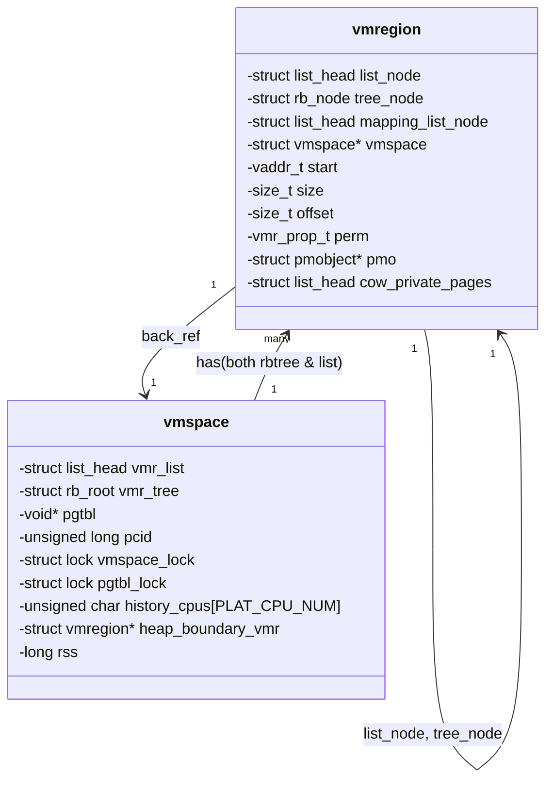

# 目录

- [页表管理](#页表管理)
  - [核心数据结构](#核心数据结构)
  - [函数功能实现](#函数功能实现)
    - [接口定义](#接口定义)
    - [源码解析](#源码解析)
- [缺页管理](#缺页管理)
  - [ARM异常机制](#arm异常机制)
    - [异常类型](#异常类型)
    - [处理逻辑](#处理逻辑)
  - [缺页异常源码解析](#缺页异常源码解析)
  - [VMR & PMO](#vmr--pmo)

# 页表管理
本节内容讲解Chcore页表管理部分的源码（不包括缺页管理，缺页管理单独讲解），我们将从Chcore页表管理的核心数据结构讲起，并进一步解析其页表管理的函数实际实现

## 核心数据结构

Chcore中表示页表的核心数据结构如下方源码所示：

```c
/* page_table_entry type */
typedef union {
        struct {
                u64 is_valid        : 1,
                    is_table        : 1,
                    ignored1        : 10,
                    next_table_addr : 36,
                    reserved        : 4,
                    ignored2        : 7,
                    PXNTable        : 1,   // Privileged Execute-never for next level
                    XNTable         : 1,   // Execute-never for next level
                    APTable         : 2,   // Access permissions for next level
                    NSTable         : 1;
        } table;
        struct {
                u64 is_valid        : 1,
                    is_table        : 1,
                    attr_index      : 3,   // Memory attributes index
                    NS              : 1,   // Non-secure
                    AP              : 2,   // Data access permissions
                    SH              : 2,   // Shareability
                    AF              : 1,   // Accesss flag
                    nG              : 1,   // Not global bit
                    reserved1       : 4,
                    nT              : 1,
                    reserved2       : 13,
                    pfn             : 18,
                    reserved3       : 2,
                    GP              : 1,
                    reserved4       : 1,
                    DBM             : 1,   // Dirty bit modifier
                    Contiguous      : 1,
                    PXN             : 1,   // Privileged execute-never
                    UXN             : 1,   // Execute never
                    soft_reserved   : 4,
                    PBHA            : 4;   // Page based hardware attributes
        } l1_block;
        struct {
                u64 is_valid        : 1,
                    is_table        : 1,
                    attr_index      : 3,   // Memory attributes index
                    NS              : 1,   // Non-secure
                    AP              : 2,   // Data access permissions
                    SH              : 2,   // Shareability
                    AF              : 1,   // Accesss flag
                    nG              : 1,   // Not global bit
                    reserved1       : 4,
                    nT              : 1,
                    reserved2       : 4,
                    pfn             : 27,
                    reserved3       : 2,
                    GP              : 1,
                    reserved4       : 1,
                    DBM             : 1,   // Dirty bit modifier
                    Contiguous      : 1,
                    PXN             : 1,   // Privileged execute-never
                    UXN             : 1,   // Execute never
                    soft_reserved   : 4,
                    PBHA            : 4;   // Page based hardware attributes
        } l2_block;
        struct {
                u64 is_valid        : 1,
                    is_page         : 1,
                    attr_index      : 3,   // Memory attributes index
                    NS              : 1,   // Non-secure
                    AP              : 2,   // Data access permissions
                    SH              : 2,   // Shareability
                    AF              : 1,   // Accesss flag
                    nG              : 1,   // Not global bit
                    pfn             : 36,
                    reserved        : 3,
                    DBM             : 1,   // Dirty bit modifier
                    Contiguous      : 1,
                    PXN             : 1,   // Privileged execute-never
                    UXN             : 1,   // Execute never
                    soft_reserved   : 4,
                    PBHA            : 4,   // Page based hardware attributes
                    ignored         : 1;
        } l3_page;
        u64 pte;
} pte_t;

/* page_table_page type */
typedef struct {
	pte_t ent[PTP_ENTRIES];
} ptp_t;
```

共有两种数据结构，分别是：

- `pte_t` ：即页表项，表示一个具体的页表
- `ptp_t` ：即页表页，我们可以看见它是由一个 `pte_t` 的数组构成的结构体

我们这里重点看一下 `pte_t` 的定义——它采用了bit-fields和union的语法

所谓bit-fields，即

```
type member_name : bit_width
```

每个字段后面的数字表示该字段占用的位数，编译器会自动将这些字段打包到一个u64中，字段的总位数不能超过基础类型（这里是u64）的大小，由此我们可以总结该数据结构的特点：

- 使用union来表示不同类型的页表项
- 支持4种格式：`table`（指向下级页表）、`l1_block`、`l2_block`（大页）和`l3_page`（4KB页）
- 通过bit-field精确控制每个控制位的位置
- 允许以不同方式解释同一块内存，可以直接访问原始值或者结构化的字段

这时候还有一个问题，不同架构所用到的页表项是不一样的，所以我们需要一个通用页表项来处理：

```c
/**
 * @brief Architecture-independent PTE structure, containing some useful
 * information which is shared by all architectures.
 *
 * This struct can be used to write architecture-independent code to parse
 * or manipulate PTEs.
 */
struct common_pte_t {
        /** Physical Page Number */
        unsigned long ppn;
        /** ChCore VMR permission, architecture-independent */
        vmr_prop_t perm;
        unsigned char
                /** This PTE is valid or not */
                valid : 1,
                /** This PTE is accessed by hardware or not */
                access : 1,
                /** This PTE is written by hardware or not */
                dirty : 1, _unused : 4;
};
```

它是一个架构无关的页表项抽象，主要作用是提供一个统一的接口来处理不同架构的页表项

在函数实现中，我们会有相应的辅助函数来提供将页表项和通用页表项之间转换的功能，如下例所示

```c
// 从架构相关的PTE转换为通用PTE
void parse_pte_to_common(pte_t *pte, unsigned int level, struct common_pte_t *ret)
{
    switch (level) {
    case L3:
        ret->ppn = pte->l3_page.pfn;           // 提取物理页号
        ret->perm = 0;
        ret->perm |= (pte->l3_page.UXN ? 0 : VMR_EXEC);    // 转换执行权限
        ret->perm |= __ap_to_vmr_prot(pte->l3_page.AP);    // 转换访问权限
        ret->perm |= (pte->l3_page.attr_index == DEVICE_MEMORY ? 
                     VMR_DEVICE : 0);           // 转换内存属性
        ret->access = pte->l3_page.AF;         // 转换访问标志
        ret->dirty = pte->l3_page.DBM;         // 转换脏页标志
        ret->valid = pte->l3_page.is_valid;    // 转换有效位
        break;
    }
}

// 从通用PTE更新到架构相关PTE，不过这里目前还只支持L3级别的更新
void update_pte(pte_t *dest, unsigned int level, struct common_pte_t *src)
{
    switch (level) {
    case L3:
        dest->l3_page.pfn = src->ppn;          // 更新物理页号
        dest->l3_page.AP = __vmr_prot_to_ap(src->perm);    // 更新访问权限
        dest->l3_page.UXN = ((src->perm & VMR_EXEC) ?      // 更新执行权限
                          AARCH64_MMU_ATTR_PAGE_UX :
                          AARCH64_MMU_ATTR_PAGE_UXN);
        dest->l3_page.is_valid = src->valid;   // 更新有效位
        dest->l3_page.AF = src->access;        // 更新访问标志
        dest->l3_page.DBM = src->dirty;        // 更新脏页标志
        break;
    }
}
```

## 函数功能实现

正如我们的Lab文档所提到的，内核启动阶段所做的事情只是配置了一个粗粒度的页表系统。而实际操作系统所需要的页表管理则远不止于此。我们需要一个更细粒度的页表实现，提供映射、取消映射、查询等功能。而这些功能在源码中则以各种接口（接口在 `mmu.h` 中）呈现，并在 `page_table.c` 中实现

还是先看看接口是怎么定义的，再来看实现

### 接口定义

```c
int map_range_in_pgtbl_kernel(void *pgtbl, vaddr_t va, paddr_t pa,
		       size_t len, vmr_prop_t flags);
int map_range_in_pgtbl(void *pgtbl, vaddr_t va, paddr_t pa,
		       size_t len, vmr_prop_t flags, long *rss);
int unmap_range_in_pgtbl(void *pgtbl, vaddr_t va, size_t len, long *rss);
int query_in_pgtbl(void *pgtbl, vaddr_t va, paddr_t *pa, pte_t **entry);
int mprotect_in_pgtbl(void *pgtbl, vaddr_t va, size_t len, vmr_prop_t prop);
```

从上到下介绍一遍；

- `map_range_in_pgtbl` ：页表映射函数，又分为内核态与用户态，但是实现逻辑基本是一样的，因此在源码中会用一个common辅助函数来实现
- `unmap_range_in_pgtbl` ：取消页表映射函数
- `query_in_pgtbl` ：页表查询函数
- `mprotect_in_pgtbl` ：页表权限修改函数

### 源码解析

#### map_range_in_pgtbl

我们先对比一下两个函数的接口以及源码

```c
int map_range_in_pgtbl_kernel(
    void *pgtbl,        // 页表基地址
    vaddr_t va,         // 要映射的虚拟地址起始位置
    paddr_t pa,         // 要映射的物理地址起始位置
    size_t len,         // 映射长度
    vmr_prop_t flags    // 映射属性（读/写/执行权限等）
)

int map_range_in_pgtbl(
    void *pgtbl,        // 页表基地址
    vaddr_t va,         // 虚拟地址起始位置
    paddr_t pa,         // 物理地址起始位置
    size_t len,         // 映射长度
    vmr_prop_t flags,   // 映射属性
    long *rss           // 常驻集大小计数器
)
```

可以看到，非内核的页表映射函数还多了一个rss计数器，它的作用是跟踪用户进程的内存使用情况

再来看其实现，会发现都用到了一个common函数：

```c
/* Map vm range in kernel */
int map_range_in_pgtbl_kernel(void *pgtbl, vaddr_t va, paddr_t pa,
		       size_t len, vmr_prop_t flags)
{
	return map_range_in_pgtbl_common(pgtbl, va, pa, len, flags,
                                         KERNEL_PTE, NULL);
}

/* Map vm range in user */
int map_range_in_pgtbl(void *pgtbl, vaddr_t va, paddr_t pa,
		       size_t len, vmr_prop_t flags, long *rss)
{
	return map_range_in_pgtbl_common(pgtbl, va, pa, len, flags,
                                         USER_PTE, rss);
}
```

那么关键就在这个 `map_range_in_pgtbl_common` 函数，我们学习学习它的源码实现

```c
static int map_range_in_pgtbl_common(void *pgtbl, vaddr_t va, paddr_t pa, size_t len,
                       vmr_prop_t flags, int kind, long *rss)
{
        s64 total_page_cnt;
        ptp_t *l0_ptp, *l1_ptp, *l2_ptp, *l3_ptp;
        pte_t *pte;
        int ret;
        int pte_index; // the index of pte in the last level page table
        int i;

        BUG_ON(pgtbl == NULL); // alloc the root page table page at first
        BUG_ON(va % PAGE_SIZE);
        total_page_cnt = len / PAGE_SIZE + (((len % PAGE_SIZE) > 0) ? 1 : 0);

        l0_ptp = (ptp_t *)pgtbl;

        l1_ptp = NULL;
        l2_ptp = NULL;
        l3_ptp = NULL;

        while (total_page_cnt > 0) {
                // l0
                ret = get_next_ptp(l0_ptp, L0, va, &l1_ptp, &pte, true, rss);
                BUG_ON(ret != 0);

                // l1
                ret = get_next_ptp(l1_ptp, L1, va, &l2_ptp, &pte, true, rss);
                BUG_ON(ret != 0);

                // l2
                ret = get_next_ptp(l2_ptp, L2, va, &l3_ptp, &pte, true, rss);
                BUG_ON(ret != 0);

                // l3
                // step-1: get the index of pte
                pte_index = GET_L3_INDEX(va);
                for (i = pte_index; i < PTP_ENTRIES; ++i) {
                        pte_t new_pte_val;

                        new_pte_val.pte = 0;
                        new_pte_val.l3_page.is_valid = 1;
                        new_pte_val.l3_page.is_page = 1;
                        new_pte_val.l3_page.pfn = pa >> PAGE_SHIFT;
                        set_pte_flags(&new_pte_val, flags, kind);
                        l3_ptp->ent[i].pte = new_pte_val.pte;

                        va += PAGE_SIZE;
                        pa += PAGE_SIZE;
                        if (rss)
                                *rss += PAGE_SIZE;
                        total_page_cnt -= 1;
                        if (total_page_cnt == 0)
                                break;
                }
        }

        dsb(ishst);
        isb();

        /* Since we are adding new mappings, there is no need to flush TLBs. */
        return 0;
}
```

总体上就是参数检查——计算需要映射的总页数——开while循环开始映射

```c
// 一次循环可以映射的最大页数
最大映射数 = PTP_ENTRIES - pte_index
           = 512 - (va >> 12 & 0x1FF)
```

数据结构关系如下：

```
L0页表 -> L1页表 -> L2页表 -> L3页表 -> 物理页面
   |        |         |         |
 512项    512项     512项     512项
```

下面是详细的函数执行逻辑：

- 参数检查，并计算需要映射的总页数，这里的方式是向上取整
- 初始化页表指针，为后面的大循环做准备
- 进入while循环，依次获取四级页表的页表页，其本质就是位运算，可以回顾一下机器启动部分关于页表映射的讲解
- 获取到L3页表的索引，并尽可能多的去映射，映射时需要设置其页表项字段以及更新rss和页表页数组
- 重复while循环直到映射完毕，并建立数据和指令同步屏障

这里再来明晰一下while循环的作用：因为每个L3级别的页表页只能映射2^9=512个页表项，因此当映射需求较大的时候就需要多轮循环才能映射完毕

我们假设某次映射需求有2000个页表项需要被映射，那么会发生如下事情：

```c
// 假设要映射2000个页面（约8MB）
初始：total_page_cnt = 2000

第一次外层循环：
  - 找到第一个L3页表
  - 从pte_index开始映射
  - 假设pte_index = 100
  - 可以映射412个页面(512-100)
  - total_page_cnt = 1588

第二次外层循环：
  - 找到/创建下一个L3页表
  - 从索引0开始映射
  - 可以映射512个页面
  - total_page_cnt = 1076

... 循环继续 ...
```

循环会一直执行，直到完成所有映射需求或者遇到错误（如内存不足）

#### unmap_in_range_pgtbl

还是先上源码

```c
int unmap_range_in_pgtbl(void *pgtbl, vaddr_t va, size_t len, long *rss)
{
        s64 total_page_cnt; // must be signed
        s64 left_page_cnt_in_current_level;
        ptp_t *l0_ptp, *l1_ptp, *l2_ptp, *l3_ptp;
        pte_t *pte;
        vaddr_t old_va;

        int ret;
        int pte_index; // the index of pte in the last level page table
        int i;

        BUG_ON(pgtbl == NULL);

        l0_ptp = (ptp_t *)pgtbl;

        total_page_cnt = len / PAGE_SIZE + (((len % PAGE_SIZE) > 0) ? 1 : 0);
        while (total_page_cnt > 0) {
                old_va = va;
                // l0
                ret = get_next_ptp(l0_ptp, L0, va, &l1_ptp, &pte, false, NULL);
                if (ret == -ENOMAPPING) {
                        left_page_cnt_in_current_level =
                                (L0_PER_ENTRY_PAGES
                                 - GET_L1_INDEX(va) * L1_PER_ENTRY_PAGES);
                        total_page_cnt -=
                                (left_page_cnt_in_current_level
                                                 > total_page_cnt ?
                                         total_page_cnt :
                                         left_page_cnt_in_current_level);
                        va += left_page_cnt_in_current_level * PAGE_SIZE;
                        continue;
                }

                // l1
                ret = get_next_ptp(l1_ptp, L1, va, &l2_ptp, &pte, false, NULL);
                if (ret == -ENOMAPPING) {
                        left_page_cnt_in_current_level =
                                (L1_PER_ENTRY_PAGES
                                 - GET_L2_INDEX(va) * L2_PER_ENTRY_PAGES);
                        total_page_cnt -=
                                (left_page_cnt_in_current_level
                                                 > total_page_cnt ?
                                         total_page_cnt :
                                         left_page_cnt_in_current_level);
                        va += left_page_cnt_in_current_level * PAGE_SIZE;
                        continue;
                }

                // l2
                ret = get_next_ptp(l2_ptp, L2, va, &l3_ptp, &pte, false, NULL);
                if (ret == -ENOMAPPING) {
                        left_page_cnt_in_current_level =
                                (L2_PER_ENTRY_PAGES
                                 - GET_L3_INDEX(va) * L3_PER_ENTRY_PAGES);
                        total_page_cnt -=
                                (left_page_cnt_in_current_level
                                                 > total_page_cnt ?
                                         total_page_cnt :
                                         left_page_cnt_in_current_level);
                        va += left_page_cnt_in_current_level * PAGE_SIZE;
                        continue;
                }

                // l3
                // step-1: get the index of pte
                pte_index = GET_L3_INDEX(va);
                for (i = pte_index; i < PTP_ENTRIES; ++i) {
                        if (l3_ptp->ent[i].l3_page.is_valid && rss)
                                *rss -= PAGE_SIZE;

                        l3_ptp->ent[i].pte = PTE_DESCRIPTOR_INVALID;
                        va += PAGE_SIZE;
                        total_page_cnt -= 1;
                        if (total_page_cnt == 0)
                                break;
                }
                recycle_pgtable_entry(l0_ptp, l1_ptp, l2_ptp, l3_ptp, old_va, rss);
        }

        dsb(ishst);
        isb();

        return 0;
}
```

整体逻辑和map时候的逻辑相似，只是在while大循环里，多了一个“跳过未映射区域”的操作，这样可以避免不必要的页表遍历，减少unmap的用时和资源开销

```c
// 举例：如果L2级别未映射
// L2_PER_ENTRY_PAGES = 512 * 512 = 262144
// 可以一次跳过大量未映射页面
left_page_cnt_in_current_level = L1_PER_ENTRY_PAGES - ...
```

而在L3部分真正解除映射的代码，又会涉及到如下操作：

- 判断页面是否有效，有效则更新为无效，并更新rss计数器
- 回收掉无效的页表项，即 `recycle_pagtable_entry` 函数，其实现即用到了之前提到的kfree等

同样的，假设我们有解除映射的页表需求，可能的工作流程示例如下：

```c
// 假设要解除映射1000000个页面
初始：total_page_cnt = 1000000

// 情况1：遇到未映射区域
if (L2未映射) {
    跳过整个L2范围
    更新total_page_cnt
    继续下一个区域
}

// 情况2：找到映射区域
在L3页表中：
    解除映射
    更新RSS
    尝试回收页表页
```

#### query_in_pgtbl

和上面两个函数一样，查询函数的实现逻辑是换汤不换药的，但是需要添加相应的特色内容，以满足查询本身的需求

注意后两个参数是输出

```c
int query_in_pgtbl(
    void *pgtbl,        // 页表基地址
    vaddr_t va,         // 要查询的虚拟地址
    paddr_t *pa,        // 输出：对应的物理地址
    pte_t **entry       // 输出：对应的页表项（可选）
)
```

```c
/*
 * Translate a va to pa, and get its pte for the flags
 */
int query_in_pgtbl(void *pgtbl, vaddr_t va, paddr_t *pa, pte_t **entry)
{
        /* On aarch64, l0 is the highest level page table */
        ptp_t *l0_ptp, *l1_ptp, *l2_ptp, *l3_ptp;
        ptp_t *phys_page;
        pte_t *pte;
        int ret;

        // L0 page table
        l0_ptp = (ptp_t *)pgtbl;
        ret = get_next_ptp(l0_ptp, L0, va, &l1_ptp, &pte, false, NULL);
        if (ret < 0)
                return ret;

        // L1 page table
        ret = get_next_ptp(l1_ptp, L1, va, &l2_ptp, &pte, false, NULL);
        if (ret < 0)
                return ret;
        else if (ret == BLOCK_PTP) {
                *pa = virt_to_phys((vaddr_t)l2_ptp) + GET_VA_OFFSET_L1(va);
                if (entry)
                        *entry = pte;
                return 0;
        }

        // L2 page table
        ret = get_next_ptp(l2_ptp, L2, va, &l3_ptp, &pte, false, NULL);
        if (ret < 0)
                return ret;
        else if (ret == BLOCK_PTP) {
                *pa = virt_to_phys((vaddr_t)l3_ptp) + GET_VA_OFFSET_L2(va);
                if (entry)
                        *entry = pte;
                return 0;
        }

        // L3 page table
        ret = get_next_ptp(l3_ptp, L3, va, &phys_page, &pte, false, NULL);
        if (ret < 0)
                return ret;

        *pa = virt_to_phys((vaddr_t)phys_page) + GET_VA_OFFSET_L3(va);
        if (entry)
                *entry = pte;
        return 0;
}
```

整体上除了一级一级页表往下查询+错误处理之外，还添加了一个额外的步骤——支持大页映射查询，如果发现相应的高级页表页是一个大页，那么则直接通过大页基地址+页内偏移得到最终返回值

同样的，如果一路成功到了L3页表页，那么说明我们要查询的就是个基本的4KB小页，直接同样操作获取物理地址就行。相当于该函数一共支持三种页面大小：

- 1GB (L1 block)
- 2MB (L2 block)
- 4KB (L3 page)

#### mprotect_in_pgtbl

最后我们再来看看修改页表权限的操作是如何实现的，上源码

```c
int mprotect_in_pgtbl(void *pgtbl, vaddr_t va, size_t len, vmr_prop_t flags)
{
        s64 total_page_cnt; // must be signed
        ptp_t *l0_ptp, *l1_ptp, *l2_ptp, *l3_ptp;
        pte_t *pte;
        int ret;
        int pte_index; // the index of pte in the last level page table
        int i;

        BUG_ON(pgtbl == NULL);
        BUG_ON(va % PAGE_SIZE);

        l0_ptp = (ptp_t *)pgtbl;

        total_page_cnt = len / PAGE_SIZE + (((len % PAGE_SIZE) > 0) ? 1 : 0);
        while (total_page_cnt > 0) {
                // l0
                ret = get_next_ptp(l0_ptp, L0, va, &l1_ptp, &pte, false, NULL);
                if (ret == -ENOMAPPING) {
                        total_page_cnt -= L0_PER_ENTRY_PAGES;
                        va += L0_PER_ENTRY_PAGES * PAGE_SIZE;
                        continue;
                }

                // l1
                ret = get_next_ptp(l1_ptp, L1, va, &l2_ptp, &pte, false, NULL);
                if (ret == -ENOMAPPING) {
                        total_page_cnt -= L1_PER_ENTRY_PAGES;
                        va += L1_PER_ENTRY_PAGES * PAGE_SIZE;
                        continue;
                }

                // l2
                ret = get_next_ptp(l2_ptp, L2, va, &l3_ptp, &pte, false, NULL);
                if (ret == -ENOMAPPING) {
                        total_page_cnt -= L2_PER_ENTRY_PAGES;
                        va += L2_PER_ENTRY_PAGES * PAGE_SIZE;
                        continue;
                }

                // l3
                // step-1: get the index of pte
                pte_index = GET_L3_INDEX(va);
                for (i = pte_index; i < PTP_ENTRIES; ++i) {
                        /* Modify the permission in the pte if it exists */
                        if (!IS_PTE_INVALID(l3_ptp->ent[i].pte))
                                set_pte_flags(
                                        &(l3_ptp->ent[i]), flags, USER_PTE);

                        va += PAGE_SIZE;
                        total_page_cnt -= 1;
                        if (total_page_cnt == 0)
                                break;
                }
        }

        return 0;
}
```

看过了上面的源码后，这部分源码就显得很亲切了，和unmap如出一辙的跳过未映射区域的操作

最后唯一更改的地方仅仅是L3的循环，将之前的unmap操作换成了调用 `set_pte_flag` 函数，即完成了对页表权限的修改

```c
static int set_pte_flags(pte_t *entry, vmr_prop_t flags, int kind)
{
        BUG_ON(kind != USER_PTE && kind != KERNEL_PTE);

        /*
         * Current access permission (AP) setting:
         * Mapped pages are always readable (No considering XOM).
         * EL1 can directly access EL0 (No restriction like SMAP
         * as ChCore is a microkernel).
         */
        entry->l3_page.AP = __vmr_prot_to_ap(flags);
       
        if (kind == KERNEL_PTE) {
                // kernel PTE
                if (!(flags & VMR_EXEC))
			                  // 如果没有指定flags任意权限（读,写,...）或者此段虚拟内存没有执行权限
			                  // pte权限设置为内核不可执行
                        entry->l3_page.PXN = AARCH64_MMU_ATTR_PAGE_PXN;
                // 内核kind下pte user不可执行
                entry->l3_page.UXN = AARCH64_MMU_ATTR_PAGE_UXN;
        } else {
                // User PTE
                if (!(flags & VMR_EXEC))
                        entry->l3_page.UXN = AARCH64_MMU_ATTR_PAGE_UXN;
                // EL1 cannot directly execute EL0 accessiable region.
                // user kind下内核亦不可执行
                entry->l3_page.PXN = AARCH64_MMU_ATTR_PAGE_PXN;
        }

        // Set AF (access flag) in advance.
        entry->l3_page.AF = AARCH64_MMU_ATTR_PAGE_AF_ACCESSED;
        // Mark the mapping as not global
        entry->l3_page.nG = 1;
        // Mark the mappint as inner sharable
        entry->l3_page.SH = INNER_SHAREABLE;
        // Set the memory type
        if (flags & VMR_DEVICE) {
                entry->l3_page.attr_index = DEVICE_MEMORY;
                entry->l3_page.SH = 0;
        } else if (flags & VMR_NOCACHE) {
                entry->l3_page.attr_index = NORMAL_MEMORY_NOCACHE;
        } else {
                entry->l3_page.attr_index = NORMAL_MEMORY;
        }

#ifdef CHCORE_OPENTRUSTEE
        if (flags & VMR_TZ_NS) {
                entry->l3_page.NS = AARCH64_MMU_ATTR_PAGE_NS_NON_SECURE;
        }
#endif /* CHCORE_OPENTRUSTEE */

        return 0;
}
```

其中几个安全名词

**SMAP（Supervisor Mode Access Prevention）：**SMAP是ARM架构中的一项安全功能，可防止管理模式（类似于EL1）在未经适当检查的情况下直接访问用户模式内存（类似于EL0）。这有助于防止特权提升攻击，其中在EL0处运行的恶意程序可能尝试访问属于EL1处的OS的敏感数据。声明“No restriction like SMAP”意味着，在这种配置中，EL1可以直接访问EL0内存，而不受通常的SMAP限制。这是另一个重大的安全风险。

**XOM（仅执行内存）：**XOM是一种内存保护功能，可防止代码从标记为仅数据的内存区域执行。这是一种重要的安全机制，可以缓解缓冲区溢出攻击和其他攻击者可能试图将恶意代码注入数据区的漏洞。声明“No considering XOM”意味着，在这个特定的配置中，系统*不*强制执行仅限内存的限制。这是一个重大的安全风险。

之后

`query_in_pgtbl`、`map_range_in_pgtbl_common`、`unmap_range_in_pgtbl`

就是软件遍历pagetable的n重循环（n=levels），在中间判断 valid 和是否 超级块（block/table） 即可
# 缺页管理
本节内容讲解Chcore中对缺页异常的处理，同时也会拓展ARM异常相关的知识。由于缺页异常会涉及到进程的虚拟地址区域 （VMR/VMA）和物理内存对象（PMO）的相关知识，所以我们也会对这部分作相应的解析，以帮助大家学习。本节内容顺序如下：

- ARM异常基础知识
- 缺页异常函数的源码解析
- VMR和PMO相关源码解析

## ARM异常机制

### 异常类型

ARM将异常分为同步异常和异步异常两大类。同步异常是由指令执行直接引发的，例如系统调用、页面错误或非法指令等，这类异常具有**确定性**，每次执行到特定指令时都会触发。而异步异常包括硬件中断（IRQ）、快速中断（FIQ）和错误（ERROR），它们与当前指令无关，通常由**外部事件或硬件故障**引起

arm 把异常分成几种 SYNC，IRQ，FIQ，ERROR

这几个名字都很抽象，先讲SYNC同步异常

什么是同步异常？arm的手册给出的定义是：确定性的(每次执行到那个指令就会产生)，由执行或尝试执行指令引发的，按照预期产生的; 而异步异常则是非确定性，非指令性的，预期之外的

例如电源被踹了一脚断电了，或者时钟定时触发中断，这是异步异常

而访问了不该访问的指令，没有权限或者EL不对，（捕获浮点错误时的）除0，这些是可以溯源到某条指令上的，是同步异常

EL1t和EL1h分别用于实际内核和虚拟机hypervisor模式

对于异步异常，又可以分成中断和错误，最终的概述如下

- **sync**: 同步异常，如系统调用或页面错误。
- **irq**: 硬件中断请求（IRQ），由外部设备生成的中断。
- **fiq**: 快速中断请求（FIQ），用于更高优先级的中断处理。
- **error**: 处理其他类型的错误，如未定义指令或故障。

linux ref: https://www.cnblogs.com/charliechen114514-blogs/p/18455517

### 处理逻辑

缺页异常说到底也是ARM异常的一个子集，在学习缺页异常之前，不妨先看看整体的异常管理设计逻辑是什么样的

根据异常类型和当前的执行模式（内核态或用户态），设计相应的处理逻辑：

- **同步异常处理逻辑**：
    - **用户态（EL0）触发的同步异常**：
        - **目标**：不能直接让内核崩溃，必须妥善处理
        - **处理方式**：根据异常类型回调对应的处理逻辑。例如，对于页面错误，可以实现需求分页或COW机制
    - **内核态（EL1）触发的同步异常**：
        - **目标**：尝试修复一些提前设计的机制和可以处理的操作，其他情况应导致系统崩溃
        - **处理方式**：对于可修复的异常，执行相应的修复逻辑；对于不可修复的异常，记录错误信息并触发系统崩溃
- **中断处理逻辑**：
    - **目标**：快速响应并处理外部设备的中断请求
    - **处理方式**：调用中断处理逻辑，完成中断处理后返回到中断发生前的状态
- **错误处理逻辑**：
    - **目标**：处理不可恢复的错误，确保系统稳定性
    - **处理方式**：记录错误信息并触发系统崩溃（panic），以便进行后续的调试和分析

落实到实现本身，则需要根据当前的异常级别寄存器（EL0或EL1）来区分内核态和用户态，并在异常发生时保存上下文信息。

于是对于同步异常，就可以通过特定寄存器（如FAR_ELx）获取产生异常的指令地址，从而进行调试和分析

## 缺页异常源码解析

有了对ARM异常机制与处理逻辑的基本了解，我们就可以进一步分析 `do_page_fault` 的源码了

可以参考代码中的注释，英文为自带的，中文为附加的助于理解的

```c
void do_page_fault(u64 esr, u64 fault_ins_addr, int type, u64 *fix_addr)
{
        vaddr_t fault_addr;
        int fsc; // fault status code
        int wnr;
        int ret;
				// 从far_el1寄存器读取汇编
        fault_addr = get_fault_addr();
        // #define GET_ESR_EL1_FSC(esr_el1) (((esr_el1) >> ESR_EL1_FSC_SHIFT) & FSC_MASK)
        fsc = GET_ESR_EL1_FSC(esr);
        switch (fsc) {
        case DFSC_TRANS_FAULT_L0:
        case DFSC_TRANS_FAULT_L1:
        case DFSC_TRANS_FAULT_L2:
        case DFSC_TRANS_FAULT_L3: {
				// 地址转换错误，根据vma进行进一步处理，也就是缺页异常
                ret = handle_trans_fault(current_thread->vmspace, fault_addr);
                if (ret != 0) {
                // 没有正确处理
                        /* The trap happens in the kernel */
                        if (type < SYNC_EL0_64) {
                        // EL1 的 type, 表示内核态的异常，跳转到no_context标签
                                goto no_context;
                        }
												// 用户态的异常处理失败，打印信息后退出
                        kinfo("do_page_fault: faulting ip is 0x%lx (real IP),"
                              "faulting address is 0x%lx,"
                              "fsc is trans_fault (0b%b),"
                              "type is %d\n",
                              fault_ins_addr,
                              fault_addr,
                              fsc,
                              type);
                        kprint_vmr(current_thread->vmspace);

                        kinfo("current_cap_group is %s\n",
                                        current_cap_group->cap_group_name);

                        sys_exit_group(-1);
                }
                break;
        }
        case DFSC_PERM_FAULT_L1:
        case DFSC_PERM_FAULT_L2:
        case DFSC_PERM_FAULT_L3:
        // 权限错误
                wnr = GET_ESR_EL1_WnR(esr); 
                // WnR, ESR bit[6]. Write not Read. The cause of data abort.
                if (wnr) {
                //写权限错误
                        ret = handle_perm_fault(
                                current_thread->vmspace, fault_addr, VMR_WRITE);
                } else {
                //读权限错误
                        ret = handle_perm_fault(
                                current_thread->vmspace, fault_addr, VMR_READ);
                }

                if (ret != 0) {
                        /* The trap happens in the kernel */
                        if (type < SYNC_EL0_64) {
                                goto no_context;
                        }
                        sys_exit_group(-1);
                }
                break;
        case DFSC_ACCESS_FAULT_L1:
        case DFSC_ACCESS_FAULT_L2:
        case DFSC_ACCESS_FAULT_L3:
        // Access faults：没有access bit的pte，此处还不支持处理，仅打印信息
                kinfo("do_page_fault: fsc is access_fault (0b%b)\n", fsc);
                BUG_ON(1);
                break;
        default:
        //默认处理流程，指遇到了奇奇怪怪的的错误，且系统当前还不支持处理它们
        //因此这里的处理流程就是打印错误相关的信息，然后触发内核panic终止之
                kinfo("do_page_fault: faulting ip is 0x%lx (real IP),"
                      "faulting address is 0x%lx,"
                      "fsc is unsupported now (0b%b)\n",
                      fault_ins_addr,
                      fault_addr,
                      fsc);
                kprint_vmr(current_thread->vmspace);

                kinfo("current_cap_group is %s\n",
                      current_cap_group->cap_group_name);

                BUG_ON(1);
                break;
        }

        return;
// no_context 这一名称来源于内核的异常处理流程。
// 当内核检测到异常发生在内核态时，它发现没有“用户态上下文”
//（即不是用户程序引发的异常），因此称之为 no_context
// 这只是一个逻辑分支，用于区分内核态异常的处理流程
no_context:
        kinfo("kernel_fault: faulting ip is 0x%lx (real IP),"
              "faulting address is 0x%lx,"
              "fsc is 0b%b\n",
              fault_ins_addr,
              fault_addr,
              fsc);
        __do_kernel_fault(esr, fault_ins_addr, fix_addr);
}
static void __do_kernel_fault(u64 esr, u64 fault_ins_addr, u64 *fix_addr)
{
        kdebug("kernel_fault triggered\n");
        // 内核态page fault的时候，查表尝试修复，修复不了就终止内核
        if (fixup_exception(fault_ins_addr, fix_addr)) {
                return;
        }

        BUG_ON(1);

        sys_exit_group(-1);
}
```

对于这里好多种的switch分支，再统一分类说明一下：

**转换错误（Translation Fault）**

```c
case DFSC_TRANS_FAULT_L0:
case DFSC_TRANS_FAULT_L1:
case DFSC_TRANS_FAULT_L2:
case DFSC_TRANS_FAULT_L3:
```

这组错误表示**页表项不存在**，也就是本文的核心**缺页异常**，常见场景：

- 第一次访问堆区新分配的内存
- 访问未映射的内存区域
- 栈增长时的新页面访问

**权限错误（Permission Fault）**

```c
case DFSC_PERM_FAULT_L1:
case DFSC_PERM_FAULT_L2:
case DFSC_PERM_FAULT_L3:
```

这组错误表示**访问权限不足**，常见场景：

- 写入只读内存（如代码段）
- 执行不可执行的内存
- 用户态访问内核内存

**访问错误（Access Fault）**

```c
case DFSC_ACCESS_FAULT_L1:
case DFSC_ACCESS_FAULT_L2:
case DFSC_ACCESS_FAULT_L3:
```

这组错误表示**硬件级别的访问失败**，常见场景：

- 访问未对齐的地址
- 硬件级别的内存访问限制
- TLB（页表缓存）相关错误

后面几种不必过多了解，感兴趣的可以进一步阅读相关源码

接下来我们学习VMR和PMO的相关代码，之后再回过头来梳理一遍我们的缺页异常处理流程

## VMR & PMO

回顾Lab文档，我们知道：

> 在 ChCore 中，一个进程的虚拟地址空间由多段“虚拟地址区域”（VMR，又称 VMA）组成，一段 VMR 记录了这段虚拟地址对应的“物理内存对象”（PMO），而 PMO 中则记录了物理地址相关信息。因此，想要处理缺页异常，首先需要找到当前进程发生页错误的虚拟地址所处的 VMR，进而才能得知其对应的物理地址，从而在页表中完成映射。
> 

我们先来看看VMR的数据结构是如何设计的（已经添加了详细的注释）：

```c
/* 
 * vmregion表示一个虚拟地址空间中的连续内存区域
 * 例如：代码段、数据段、堆、栈等
 */
struct vmregion {
        /* 作为vmspace.vmr_list的节点，用于顺序遍历所有vmregion */
        struct list_head list_node;
        
        /* 作为vmspace.vmr_tree的节点，用于按地址快速查找vmregion */
        struct rb_node tree_node;
        
        /* 作为PMO的mapping_list的节点，用于跟踪所有映射到此PMO的vmregion */
        struct list_head mapping_list_node;

        /* 指向此vmregion所属的虚拟地址空间 */
        struct vmspace *vmspace;
        
        /* 此内存区域的起始虚拟地址 */
        vaddr_t start;
        
        /* 此内存区域的大小（字节数）*/
        size_t size;
        
        /* 在对应物理内存对象(PMO)中的偏移量 */
        size_t offset;
        
        /* 访问权限标志（如：可读、可写、可执行等）*/
        vmr_prop_t perm;
        
        /* 指向此区域对应的物理内存对象 */
        struct pmobject *pmo;
        
        /* 写时复制(CoW)机制中的私有页面链表 */
        struct list_head cow_private_pages;
};

/* 
 * vmspace表示一个完整的虚拟地址空间
 * 通常对应一个进程的整个地址空间
 */
struct vmspace {
        /* vmregion链表的头节点，用于顺序遍历所有内存区域 */
        struct list_head vmr_list;
        
        /* vmregion红黑树的根节点，用于快速查找特定地址所在的内存区域 */
        struct rb_root vmr_tree;

        /* 指向此地址空间的页表根节点 */
        void *pgtbl;
        
        /* 进程上下文ID，用于避免TLB冲突 */
        unsigned long pcid;

        /* 用于保护vmregion操作（增删改）的锁 */
        struct lock vmspace_lock;
        
        /* 用于保护页表操作的锁 */
        struct lock pgtbl_lock;

        /* 
         * TLB刷新相关：
         * 记录此vmspace在哪些CPU核心上运行过
         * 用于确定需要在哪些CPU上进行TLB刷新
         */
        unsigned char history_cpus[PLAT_CPU_NUM];

        /* 指向堆区域的边界vmregion，用于堆的动态扩展 */
        struct vmregion *heap_boundary_vmr;

        /* 
         * 记录已映射的物理内存大小（Resident Set Size）
         * 受pgtbl_lock保护
         */
        long rss;
};
```

其实就是 vmregion 包含在 vmspace 里的关系，类比一本书和书里的不同章节

以下是示意图便于理解：



观察其设计不难发现一个“奇怪”的现象，那就是它同时维护了双向链表和红黑树的数据结构

这两种数据结构各有优劣，但若同时出现，则是一种“以空间换时间”的策略，以集众数据结构之长。虽然维护两套数据结构需要额外的内存空间和更新开销，但却能够在不同场景下都获得最优的性能表现。从缓存的视角上看，在扫描时，list能保证新插入的项被优先遍历，有更强的TLB亲和性，而红黑树的设计则保证了在查找特定元素时稳定的时间发挥。这种设计在Linux中同样被广泛采用

举两个例子分别说明两种情况，以下代码均出自chcore中vma的操作函数的源码

#### 链表的情况

```c
static void free_vmregion(struct vmregion *vmr)
{
        struct cow_private_page *cur_record = NULL, *tmp = NULL;

        // 使用链表遍历所有CoW私有页面
        for_each_in_list_safe (cur_record, tmp, node, &vmr->cow_private_pages) {
                free_cow_private_page(cur_record);
        }
        list_del(&vmr->mapping_list_node);
        kfree((void *)vmr);
}
```

例如在freeVMR时，这种遍历的操作需求就很适合用链表来实现

#### 红黑树的情况

```c
struct vmregion *find_vmr_for_va(struct vmspace *vmspace, vaddr_t addr)
{
        struct vmregion *vmr;
        struct rb_node *node;

        // 使用红黑树快速查找地址对应的VMR
        node = rb_search(
                &vmspace->vmr_tree, 
                (const void *)addr, 
                cmp_vmr_and_va);

        if (unlikely(node == NULL))
                return NULL;

        vmr = rb_entry(node, struct vmregion, tree_node);
        return vmr;
}
```

涉及到查找的时候，就该红黑树大显神通了，利用封装好的函数和宏，兼具效率与代码可读性

#### PMO

在地址空间vmr中，还需要保证虚拟内存地址和物理地址的映射，从而避免查进程自身空间的页表，不需要保持内核页表和每个进程页表的项的对应。这就轮到PMO发挥作用的时候了，我们看看其数据结构的设计

```c
/* This struct represents some physical memory resource */
struct pmobject {
        paddr_t start;
        size_t size;
        pmo_type_t type;
        /* record physical pages for on-demand-paging pmo */
        struct radix *radix;
        /*
         * The field of 'private' depends on 'type'.
         * PMO_FILE: it points to fmap_fault_pool
         * others: NULL
         */
        void *private;
        struct list_head mapping_list;
};
```

这里使用了start和size的结构，支持copy-on-writing和on demand paging。具体而言，声明时，只需要记录pmo 的start+size，在pmo之中维护访问过的/没访问的物理地址集合，在出现pagefault的时候分配，并更新这个集合就行。而对于如何维护这个集合的问题，chcore采用了radix-tree的形式，在Linux中也有相似应用

> 在 Linux 内核中，radix tree（或其改进版本 xarray）被用于管理 page cache 和内存对象（如 PMO，Physical Memory Object）时的地址到页面映射。这种选择的背后是对性能、功能和扩展性的权衡
> 

似乎只用bitmap也能达到一样的效果，那么为什么不用bitmap呢？这是因为radix tree管理的pmo的地址空间通常是**很大一段稀疏的**（启用on demand paging）。这对bitmap非常不友好，而radix tree对稀疏和懒分配有很好的支持。此外，bitmap只能标记存在与否，而radix tree可以存指针，从而达到更灵活的元数据管理

#### 回顾trans_fault的处理

有了VMR&PMO的知识，我们就可以进一步研究之前处理地址转换错误（也就是缺页异常）的时候的细节操作了：

```c
int handle_trans_fault(struct vmspace *vmspace, vaddr_t fault_addr)
{
        struct vmregion *vmr;
        struct pmobject *pmo;
        paddr_t pa;
        unsigned long offset;
        unsigned long index;
        int ret = 0;

        /*
         * Grab lock here.
         * Because two threads (in same process) on different cores
         * may fault on the same page, so we need to prevent them
         * from adding the same mapping twice.
         */
        lock(&vmspace->vmspace_lock);
        vmr = find_vmr_for_va(vmspace, fault_addr);

        if (vmr == NULL) {
                kinfo("handle_trans_fault: no vmr found for va 0x%lx!\n",
                      fault_addr);
                dump_pgfault_error();
                unlock(&vmspace->vmspace_lock);

#if defined(CHCORE_ARCH_AARCH64) || defined(CHCORE_ARCH_SPARC)
                /* kernel fault fixup is only supported on AArch64 and Sparc */
                return -EFAULT;
#endif
                sys_exit_group(-1);
        }

        pmo = vmr->pmo;
        /* Get the offset in the pmo for faulting addr */
        offset = ROUND_DOWN(fault_addr, PAGE_SIZE) - vmr->start + vmr->offset;
        vmr_prop_t perm = vmr->perm;
        switch (pmo->type) {
        case PMO_ANONYM:
        case PMO_SHM: {
                /* Boundary check */
                BUG_ON(offset >= pmo->size);

                /* Get the index in the pmo radix for faulting addr */
                index = offset / PAGE_SIZE;

                fault_addr = ROUND_DOWN(fault_addr, PAGE_SIZE);

                pa = get_page_from_pmo(pmo, index);
                if (pa == 0) {
                        /*
                         * Not committed before. Then, allocate the physical
                         * page.
                         */
                        void *new_va = get_pages(0);
                        long rss = 0;
                        if (new_va == NULL) {
                                unlock(&vmspace->vmspace_lock);
                                return -ENOMEM;
                        }
                        pa = virt_to_phys(new_va);
                        BUG_ON(pa == 0);
                        /* Clear to 0 for the newly allocated page */
                        memset((void *)phys_to_virt(pa), 0, PAGE_SIZE);
                        /*
                         * Record the physical page in the radix tree:
                         * the offset is used as index in the radix tree
                         */
                        kdebug("commit: index: %ld, 0x%lx\n", index, pa);
                        commit_page_to_pmo(pmo, index, pa);

                        /* Add mapping in the page table */
                        lock(&vmspace->pgtbl_lock);
                        map_range_in_pgtbl(vmspace->pgtbl,
                                           fault_addr,
                                           pa,
                                           PAGE_SIZE,
                                           perm,
                                           &rss);
                        vmspace->rss += rss;
                        unlock(&vmspace->pgtbl_lock);
                } else {
                        /*
                         * pa != 0: the faulting address has be committed a
                         * physical page.
                         *
                         * For concurrent page faults:
                         *
                         * When type is PMO_ANONYM, the later faulting threads
                         * of the process do not need to modify the page
                         * table because a previous faulting thread will do
                         * that. (This is always true for the same process)
                         * However, if one process map an anonymous pmo for
                         * another process (e.g., main stack pmo), the faulting
                         * thread (e.g, in the new process) needs to update its
                         * page table.
                         * So, for simplicity, we just update the page table.
                         * Note that adding the same mapping is harmless.
                         *
                         * When type is PMO_SHM, the later faulting threads
                         * needs to add the mapping in the page table.
                         * Repeated mapping operations are harmless.
                         */
                        if (pmo->type == PMO_SHM || pmo->type == PMO_ANONYM) {
                                /* Add mapping in the page table */
                                long rss = 0;
                                lock(&vmspace->pgtbl_lock);
                                map_range_in_pgtbl(vmspace->pgtbl,
                                                   fault_addr,
                                                   pa,
                                                   PAGE_SIZE,
                                                   perm,
                                                   &rss);
                                vmspace->rss += rss;
                                unlock(&vmspace->pgtbl_lock);
                        }
                }

                if (perm & VMR_EXEC) {
                        arch_flush_cache(fault_addr, PAGE_SIZE, SYNC_IDCACHE);
                }

                break;
        }
        case PMO_FILE: {
                unlock(&vmspace->vmspace_lock);
                fault_addr = ROUND_DOWN(fault_addr, PAGE_SIZE);
                handle_user_fault(pmo, ROUND_DOWN(fault_addr, PAGE_SIZE));
                BUG("Should never be here!\n");
                break;
        }
        case PMO_FORBID: {
                kinfo("Forbidden memory access (pmo->type is PMO_FORBID).\n");
                dump_pgfault_error();

                unlock(&vmspace->vmspace_lock);
                sys_exit_group(-1);
                break;
        }
        default: {
                kinfo("handle_trans_fault: faulting vmr->pmo->type"
                      "(pmo type %d at 0x%lx)\n",
                      vmr->pmo->type,
                      fault_addr);
                dump_pgfault_error();

                unlock(&vmspace->vmspace_lock);
                sys_exit_group(-1);
                break;
        }
        }

        unlock(&vmspace->vmspace_lock);
        return ret;
}
```

结合这个处理函数，我们就可以构建出chcore对缺页异常整体的处理了：

- 发生缺页异常，触发 `do_page_fault` 函数
- 异常在switch分支中被归类为 `DFSC_TRANS_FAULT_LX` ，且会根据是否是内核态的错误作进一步的处理
- 函数获取当前的虚拟地址和vmspace，将异常转发给 `handle_trans_faults` 函数
- 有了上述二物，处理函数用红黑树查找到具体的vmregion，并得到对应的PMO
- 根据PMO的类型作进一步的处理：如匿名页面和共享内存  `PMO_ANONYM, PMO_SHM` 、文件映射   `PMO_FILE` 、禁止访问的内存  `PMO_FORBID`

> 这里同时需要注意可能出现并发的pagefault,其语义处理根据不同type发生变化：如果是同个进程的多个线程，且类型为 `PMO_ANONYM` ，那只需要第一个线程更新radix即可; 如果是跨进程的线程，则需要各自更新
> 
- 对于匿名/共享内存，需要查询其在radix tree中是否已经存在记录。如果存在，就只需要在自己的页表中设置页表映射; 否则为这个on demand paging的页面分配空间并更新

> 在PHO_SHM共享内存的时候，多个进程的物理页面是相同的， 即各自的vma引用同一个pmo。所以并发场景下后来的线程会出现pa已经在radix之中存在的情况
> 
- 刷新指令缓存，处理完毕

至此，缺页管理部分的源码解析也到此结束，希望能对你的学习有所裨益！