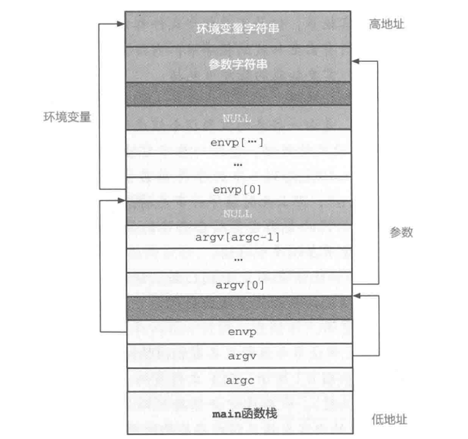
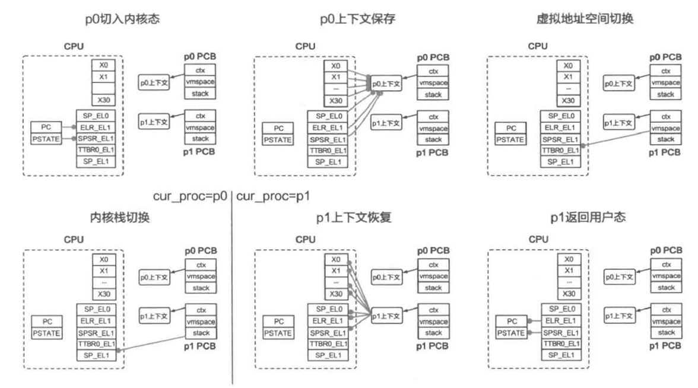
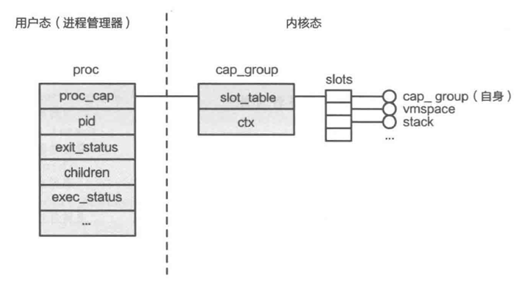
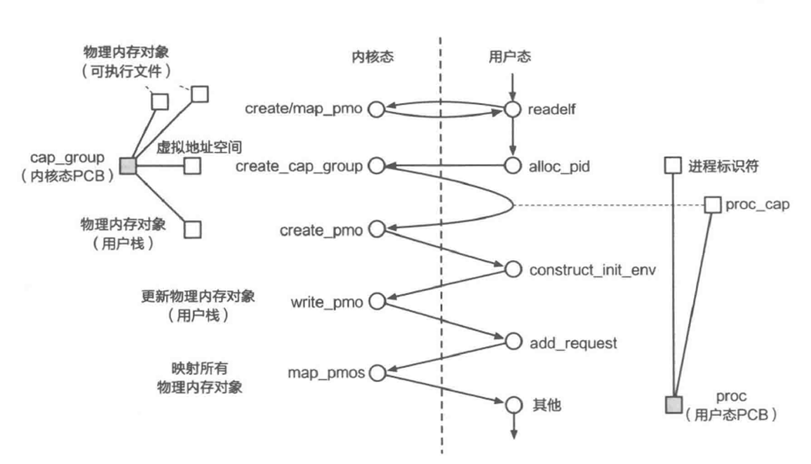
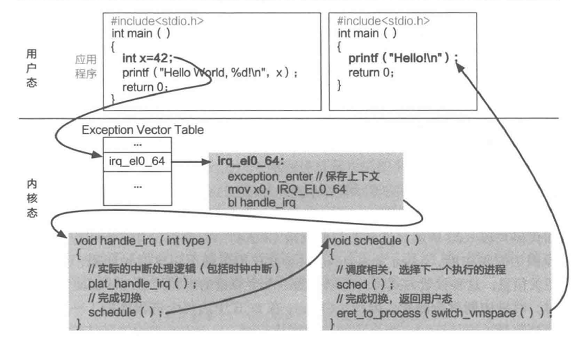
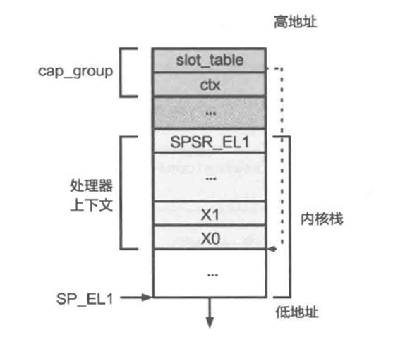
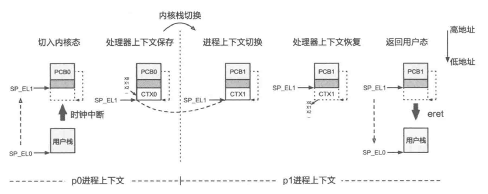
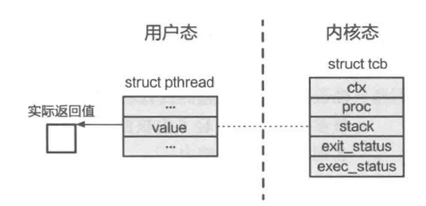
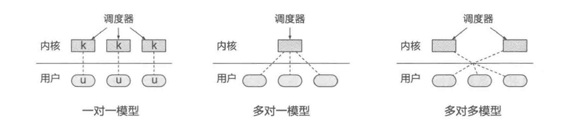

<aside>
💡

操作系统对于处理器资源的抽象是**进程和线程**。
**进程**就是运行中的程序，他为程序提供了独享的处理器资源，从而简化了程序的编写。
但是，一个进程只能运行在单个核心之上，在“多核”架构成为主流的当下，仅仅利用一个进程来处理任务显然无法充分利用计算资源。另外，由于进程包含的内容较多，且共享数据比较困难，基于多进程的方法会造成性能问题。因此，我们考虑在进程内部引入可并行的多个执行单元，并使其在不同核心上独立执行，即**线程**。

</aside>

# 一、进程

## 1、宏内核视角

### 1、进程的内部表示——PCB

进程控制块（PCB）是一个结构体，包含着与进程相关的关键信息。

```cpp
1 // PCB结构实现
2 struct process {
3    // 虚拟地址空间
4    struct vmspace *vmspace;
5    // 进程标识符
6    int pid;
7    // 子进程列表
8    pcb_list *children;
9    // 包含的线程列表
10   tcb_list *threads;
11   // 包含的线程总数
12   int thread_cnt;
13 };
```

在引入线程之前，进程是操作系统进行资源分配和调度执行的单位，但引入线程之后，线程成为操作系统进行调度执行的单位，而进程主要负责资源管理。因此，与调度执行相关的信息（处理器上下文和执行状态）都从PCB中移入了PCB，而与资源管理相关的信息（比如虚拟地址空间）依然保存在PCB中。另外，内核栈和退出状态也与执行相关，因此进程不再维护，改为由线程维护。

### 2、进程创建的实现

- 创建PCB。
- 虚拟内存初始化。
- 内核栈初始化。内核会预先分配物理页，作为进程的内核栈。
- 加载可执行文件到内存。其中，Linux中可执行文件格式为**可执行和可链接格式（ELF）**
- 初始化用户栈及运行环境。



- 处理器上下文初始化。
大部分寄存器从未使用过，直接赋值为0，但是，由于特殊寄存器（PC,PSTATE,SP）保存了与硬件状态相关的信息，需要专门考虑。
其中PC和PSTATE可以借由硬件机制，通过修改ELR_EL1来实现。SP则可以直接将用户栈的栈顶地址写入SP_EL0。

### 3、进程退出的实现

```cpp
//进程退出的伪代码实现
void process_exit(int status)
{
    // 销毁上下文结构
    destroy_ctx(curr_proc->ctx);
    // 销毁虚拟地址空间
    destroy_vmspace(curr_proc->vmspace);
    // 保存退出状态
    curr_proc->exit_status = status;
    // 标记进程为退出状态
    curr_proc->is_exit = TRUE;

    // 告知内核选择下个需要执行的进程
    schedule();
}
```

注：我们假设内核维护着curr_proc变量，并总是指向当前正在运行的进程PCB。

schedule函数涉及内核的调度模块，即选择下一个需要执行的进程，我们在后文介绍其实现方法。

### 4、进程等待的实现

```cpp
//进程等待的伪代码实现
void process_waitpid(int id, int *status)
{
    // 如果没有子进程，直接返回
    if (!curr_proc->children)
        return;
    while (TRUE) {
        bool not_exist = TRUE;
        // 扫描子进程列表，寻找对应进程
        for (struct process *proc : curr_proc->children) {
            if (proc->pid == id) {
                // 标记已找到的对应进程，并检查其是否已经退出
                not_exist = FALSE;
                if (proc->is_exit) {
                    // 若发现该进程已经退出，记录其退出状态
                    *status = proc->exit_status;
                    // 销毁该进程的内核栈
                    destroy_kern_stack(proc->stack);
                    // 回收进程的 PCB 并返回
                    destroy_process(proc);
                    return;
                } else {
                    // 如果没有退出，则调度下个进程执行
                    schedule();
                }
            }
        }
        // 如果子进程列表中不存在该进程，则立即退出
        if (not_exist)
            return;
    }
}
```

**核心逻辑**

父进程等待指定子进程退出并回收其资源：

1. 若当前进程无子进程，直接返回
2. 循环检查子进程列表：
    - 遍历所有子进程，寻找 PID 匹配的目标进程
    - **若找到目标进程**：
        - 若目标已退出 → 记录退出状态、释放内核栈和 PCB → 结束等待
        - 若目标未退出 → 主动让出 CPU（触发调度），等待下次检查
    - **若未找到目标进程** → 立即结束等待

### 5、进程睡眠的实现

```cpp
//进程睡眠的伪代码实现
void process_sleep(int seconds)
{
    struct *date start_time = get_time();  //获取当前时间作为睡眠起始时间
    while (TRUE) {
        struct *date cur_time = get_time();
        if (time_diff(cur_time, start_time) < seconds)
            schedule();      //如果时间未到，调度下一个进程执行
        else
            return;      //时间已到，立即返回
    }
}
```

这个实现也很好理解，我们首先通过 `get_time()` 获取当前时间并存储在 `start_time` 中，作为基准点。然后进入一个无限循环 `while (TRUE)`，在循环中再次调用 `get_time()` 获取当前时间并存储在 `cur_time` 中。通过 `time_diff(cur_time, start_time)` 计算当前时间与开始时间的差值，如果差值小于 `seconds`，则调用 `schedule()` 函数将当前进程挂起，让其他进程运行。如果差值大于或等于 `seconds`，则退出循环，函数返回，表示进程的睡眠时间结束。

### 6、进程执行状态及其管理

首先，我们用一张图展示进程的五状态模型。


- **新生（New）状态**：`process_create` 被调用时，内核分配一个PCB，创建新进程，但初始化未完成，不能执行程序。
- **就绪（Ready）状态**：`process_create` 完成后，进程准备好执行，但可能需要等待调度器选择。
- **运行（Running）状态**：调度器选择进程执行时，状态变为运行，之前运行的进程暂停，回到就绪状态。如果进程调用 `schedule` 函数，也会回到就绪状态。
- **僵尸（Zombie）状态**：子进程退出后，父进程调用 `process_waitpid` 获取退出状态，子进程的PCB未立即销毁，资源未完全回收。
- **终止（Terminated）状态**：进程退出，所有资源被操作系统回收，进入最终状态。

此外，内核还可以引入**阻塞（Blocked）**状态。

- **阻塞（Blocked）状态：**需要在内核中等待，无法马上回到用户态执行的进程。

### 7、进程切换

进程切换的主要流程包括：原进程进入内核态→保存原进程的处理器上下文→切换进程上下文（切换虚拟地址空间和内核栈）→回复目标进程的处理器上下文→目标进程返回用户态。

进程的处理器数据结构包含以下寄存器中的值：

- 所有通用寄存器（X0 ~ X30）。
- 特殊寄存器中的用户栈寄存器 SP_EL0，需要手动保存以恢复栈顶地址。
- 系统寄存器中的 ELR_EL1 和 SPSR_EL1，用于保存程序计数器和处理器状态，确保在进程切换后正确恢复。

进程切换的触发方式分为主动和被动两种。主动切换是指进程主动放弃 CPU 资源，通过调用 process_exit、process_waitpid、process_sleep 等系统调用，最终调用 schedule 函数，使操作系统调度下一个进程执行。被动切换则是由操作系统强制触发，通常基于硬件中断实现，如时钟中断，控制流转移到内核，进行切换。下面我们用一张图来展示进程切换的全过程。



- **第一步**：p0从用户态进入内核态，通过系统调用、异常、中断等方法。硬件自动将PC和PSTATE寄存器的值分别保存到ELR_EL1和SPSR_EL1寄存器中。
- **第二步**：内核获取p0的处理器上下文结构，并将这些寄存器的值依次保存到处理器上下文中。
- **第三步**：内核获取p1的页表基地址，存储到TTBR0_EL1寄存器中，完成虚拟地址空间的切换。可能需要刷新TLB，防止后续执行时的地址翻译错误。
- **第四步**：内核将SP_EL1切换到进程p1私有的内核栈顶地址，完成内核栈的切换。内核不再访问与p0相关的数据，可以将curr_proc设置为p1，完成进程上下文的切换。
- **第五步**：内核从p1的PCB中获取其处理器上下文结构，并依次恢复到前述寄存器中。
- **第六步**：内核执行eret指令返回用户态，硬件自动将ELR_EL1和SPSR_EL1寄存器中的值恢复到PC和PSTATE中，p1恢复执行。

## 2、微内核视角——ChCore的进程管理

*在宏内核中，与进程相关的数据结构（如 PCB）均放在内核中，管理接口也以系统调用的形式暴露给用户，核心功能全部在内核中完成。但在微内核中，包括进程管理在内的操作系统功能被拆分并移入用户态，因此与宏内核存在较大不同。*

### 1、进程管理器与分离式PCB

ChCore操作系统采用了微内核设计，将功能分解并以模块形式移到用户态。进程管理功能也被移到用户态，形成了进程管理器（Process Manager）。用户进行进程管理操作时，实际上是调用了进程管理器，再由它与内核交互，实现进程管理。这种设计使进程控制块（PCB）从集中式变为分离式，PCB被分为内核态和用户态两部分。



- PCB内核态部分：cap_group
ChCore 的PCB 在内核态的部分称为 cap_group，是**能力组（Capability group）**的简称。由于程序运行过程中需要不同类型的资源（如 CPU 和内存等），为了便于对资源进行管理，ChCore 对内核资源进行了抽象，每种资源对应一种类型的**对象（Object）**，而访问某个具体对象所需的“凭证”就是**能力（Capability）**。由于 ChCore 将进程作为资源分配和管理的基本单位，因此进程自然也就成为拥有若干能力的**“能力组”——cap_group**。
ChCore 的 cap_group 只包含两部分：存放对象的 slot_table 和处理器上下文 ctx。其中，slot_table 包含一个对象数组 slots，维护进程所持有的全部对象，包括它自身（进程本身也是对象）、虚拟地址空间、用户栈对应的物理内存等。而这些对象在数组中的偏移量就是它们对应的能力。另外，ChCore PCB 中的处理器上下文与宏内核 PCB 中保存的处理器上下文结构相同。
- PCB用户态部分：proc
保存了进程创建、退出、等待等功能所需的信息，还保存了与cap——group对应的能力proc_cap，便于进程操作的实现。

### 2、ChCore的进程操作：以进程创建为例

```cpp
//ChCore中进程创建（spawn）的伪代码实现
int spawn(char *path, ...)
{
    // 根据指定的文件路径，加载需要执行的文件（同时创建相关物理内存对象PMO）
    struct user_elf *elf = readelf(path);

    // 进程管理器获取一个新的pid作为进程标识符
    int pid = alloc_pid();
    // 创建进程（包括创建PCB、虚拟地址空间、处理器上下文和内核栈）
    int new_process_cap = create_cap_group(pid, path, ...);

    // 为用户栈创建物理内存对象PMO
    int stack_cap = create_pmo(...);
    // 利用数组构造初始执行环境
    char init_env[ENV_SIZE];
    construct_init_env(init_env, elf, ...);
    // 更新执行环境到栈对应的PMO中
    write_pmo(stack_cap, init_env, ...);

    // 构建请求，用于映射栈对应的PMO
    struct pmo_map_request requests[MAX_REQ_SIZE];
    add_request(requests, stack_cap, STACK_VADDR, ...);
    // 构建请求，用于映射可执行文件中需要加载的段对应的PMO
    for (struct user_elf_seg seg: elf->loadable_segs)
        add_request(requests, seg.pmo, seg.p_vaddr, ...);

    // 完成上述PMO的实际映射
    map_pmos(new_process_cap, requests, ...);
    // 完成其他部分的初始化（包括proc结构体）并返回
    ...
}
```

上述代码展示了ChCore中进程创建的伪代码实现，其步骤依次为：可执行文件加载、创建进程、分配用户栈、初始化用户栈、映射虚拟内存。需要注意，spawn并不是系统调用，而是处于用户态的系统服务提供的接口。下图展示了spawn函数的控制流在用户态和内核态之间切换的全过程。



从图中可以看出，当需要分配更多内核资源，或是需要对内核资源进行修改时，就要使用系统调用进入内核，其他功能都可以在用户态完成。

### 3、ChCore的进程切换实现

本节主要以时钟中断的处理为例详细介绍ChCore中进程被动切换的步骤。



- 中断发生时，无论当前进程在用户态执行什么代码，处理器都会保存状态并陷入内核态。
- 通过`exception_enter`函数保存处理器的上下文。
- 调用`handle_irq`函数执行时钟中断的具体逻辑。
- 调用`schedule`函数，其中`sched`选择下一个需要执行的进程。
- 通过`eret_to_process`切换到目标进程，并返回用户态执行。

下面我们逐个步骤详细分析。



ChCore中进程切换相关的数据结构

- **处理器上下文保存**

如上图所示，进程的处理器上下文位于其内核栈的底部，因此对其的保存只需将需要保存的寄存器值依次放入进程对应的内核栈中即可。代码实现如下。

```cpp
1 .macro exception_enter
2     sub sp, sp, #ARCH_EXEC_CONT_SIZE
3     // 保存通用寄存器（x0-x29）
4     stp x0, x1, [sp, #16 * 0]
5     stp x2, x3, [sp, #16 * 1]
6     stp x4, x5, [sp, #16 * 2]
7     ...
8     stp x28, x29, [sp, #16 * 14]
9     // 保存 x30 和上文提到的三个特殊寄存器：sp_el0, elr_el1, spsr_el1
10    mrs x21, sp_el0
11    mrs x22, elr_el1
12    mrs x23, spsr_el1
13    stp x30, x21, [sp, #16 * 15]
14    stp x22, x23, [sp, #16 * 16]
15 .endm
```

先使用 `stp` 指令将通用寄存器 `x0` 到 `x29` 的值存储到栈中，每个寄存器占用 8 个字节，偏移量以 16 为单位。再使用 `mrs` 指令将特殊寄存器 `sp_el0`、`elr_el1` 和 `spsr_el1` 的值加载到寄存器 `x21`、`x22` 和 `x23` 中，并将这些值也存储到栈中。

- **中断处理与进程调度**
操作系统通过 `exception_enter` 进入中断处理函数 `handle_irq`。

```cpp
//ChCore时钟中断处理逻辑
void plat_handle_irq(void)
{
    u32 cpuid = 0;
    unsigned int irq_src, irq;
    // 获取当前CPU及其中断原因
    cpuid = smp_get_cpu_id();
    irq_src = get32(core_irq_source[cpuid]);
    irq = 1 << ctzl(irq_src);

    // 根据不同原因进行处理
    switch (irq) {
        case INT_SRC_TIMER3:
            // 更新下一次时钟中断间隔
            asm volatile ("msr cntv_tval_el0, %0" : : "r" (cntv_tval));
            // 更新剩余的时间片数量
            if (curr_proc->budget > 0)
                curr_proc->budget--;
            break;

        // 处理其他中断
        case ...:
    }
    return;
}
```

`handle_irq` 调用 `plat_handle_irq` 处理具体中断逻辑，获取当前 CPU 的ID和中断类型。
若中断为时钟中断，`plat_handle_irq` 会更新下一次时钟间隔，并维护进程调度信息。
系统将 CPU 时间划分为等长的时间片（time slice），每个进程的 PCB 中记录剩余时间片（`budget`）。
进程被调度时，`budget` 初始化为 `DEFAULT_BUDGET`；每次时钟中断触发，当前进程的 `budget` 减一。
当 `budget` 减至 0 时，暂停当前进程，由调度器选择下一个进程执行。

```cpp
int sched(void)
{
    // 如果 curr_proc 不为空，且时间片还未用尽，则直接返回
    if (curr_proc && curr_proc->budget != 0)
        return 0;

    // 已经用尽，选择下个进程执行
    curr_proc = pick_next();
    // 将选中的进程执行状态变为运行
    curr_proc->exec_status = RUNNING;
    // 为下个进程配置时间片数量，然后返回
    curr_proc->budget = DEFAULT_BUDGET;
    return 0;
}
```

在这之后，`handle_irq` 调用 `schedule` 函数并进入 `sched` 函数中，执行调度相关逻辑。`sched` 利用操作系统的调度器选取下一个需要执行的进程，作为切换的目标进程。上面展示了一种基于时间片数量的简单 `sched` 实现方法。
首先，ChCore 需要判断 `curr_proc` 是否为空，这是因为在主动切换的情况下，前一个执行的进程可能已经调用了 `process_exit`，不可能再次被调度，所以在 `process_exit` 中会将 `curr_proc` 设为空。
然后，`ChCore` 会读取其剩余时间片数量 `budget`，若时间片还有剩余则不需要切换，直接返回，否则执行调度策略，选择下一个进程，并将 `curr_proc` 指向该进程对应的 PCB。最后，ChCore 为下个要执行的进程配置时间片，然后返回。需要注意的是，虽然这里 `curr_proc` 已经被切换了，但此时内核还处于原进程的上下文中，直到下一个步骤（虚拟地址空间和内核栈切换），这种设计主要还是出于简化实现的考虑。

注意：对于陷入等待的进程，在其等待的条件满足之前，不应调度他们执行，否则只会浪费CPU资源。因此，ChCore要求这些系统调用在进入`schedule`之前，将当前进程拥有的时间片设置为0，表明放弃之后的时间片，请求内核调度下一个进程执行。

- **虚拟地址空间与内核栈切换**

在调度逻辑完成后，内核会调用 `switch_vmspace` 函数，该函数有两个主要步骤，具体实现见下方代码片段。

第一步是切换虚拟地址空间。具体操作是从目标进程的 PCB 中获取页表基地址，将其转换为物理地址，然后设置到 TTBR0_EL1 寄存器中，从而切换到目标进程的虚拟地址空间。

第二步是返回目标进程的处理器上下文地址，这个地址将作为参数传递给 `eret_to_process` 函数。

```cpp
//switch_vmspace函数的实现
void* switch_vmspace(void)
{
    // 切换虚拟地址空间：获取页表所在物理地址并设置
    set_ttbr0_el1(
        virt_to_phys(curr_proc->vmspace->pgtbl));
    // 返回处理器上下文所在地址
    return curr_proc->ctx;
}
```

接下来，`eret_to_process` 函数会将目标进程的处理器上下文地址从 X0 寄存器移动到 SP_EL1 栈寄存器，从而完成内核栈的切换。这一步是因为处理器上下文固定存储在内核栈的底部，所以切换到上下文地址实际上就是切换到了对应的内核栈。

切换完成后，SP_EL1 栈寄存器的地址变成了目标进程的处理器上下文地址，这为恢复执行做好了准备。

```cpp
//eret_to_process函数的实现
BEGIN_FUNC(eret_to_process)
// 函数原型: void eret_to_process(u64 sp)
// 内核栈切换
mov sp, x0
// 进程切换的剩余步骤
exception_exit
END_FUNC(eret_to_process)
```

- **处理器上下文恢复及返回用户态**

```cpp
1 .macro exception_exit
2     // 恢复 x30 和三个特殊寄存器
3     ldp x22, x23, [sp, #16 * 16]
4     ldp x30, x21, [sp, #16 * 15]
5     msr sp_el0, x21
6     msr elr_el1, x22
7     msr spsr_el1, x23
8     // 恢复通用寄存器 x0-x29
9     ldp x0, x1, [sp, #16 * 0]
10    ...
11    ldp x28, x29, [sp, #16 * 14]
12    add sp, sp, #ARCH_EXEC_CONT_SIZE
13    eret
14 .endm
```

`eret_to_process` 调用 `exception_exit` 完成进程切换的剩余步骤，`exception_exit` 的实现与 `exception_enter` 是对应的，它将内核栈中的值恢复到寄存器中，然后通过 `add` 指令将内核栈变为空，最后调用 `eret` 指令返回用户态执行。
最后，我们用一张图来展示ChCore中从进程p0切换到进程p1过程中数据结构的变化。



内核栈切换完成后，ChCore只访问p1的状态，这表明内核栈切换是从p0到p1的上下文切换节点。返回用户态时，进程的内核栈总是空的，因为操作系统已经处理完中断或系统调用，无需保存栈帧。因此，进程进入内核态时，可以直接在内核栈底部保存处理器上下文，确保处理器上下文地址固定在内核栈底。

## 3、案例分析：Linux的进程创建

### 1、经典的进程创建方法：fork

```cpp
//fork的伪代码实现
int fork(void)
{
    // 创建一个新的 PCB，用于管理新进程
    struct process *new_proc = alloc_process();
    // 虚拟内存初始化：初始化页表基地址
    new_proc->vmspace->pgtbl = alloc_page();
    // 虚拟内存初始化：将当前进程（父进程）PCB 中的页表完整拷贝一份
    copy_vmspace(new_proc->vmspace, curr_proc->vmspace);
    // 内核栈初始化
    init_kern_stack(new_proc->stack);
    // 上下文初始化：将父进程 PCB 中的处理器上下文完整拷贝一份
    copy_context(new_proc->ctx, curr_proc->ctx);
    // 返回
}
```

操作系统通过`fork`和`exec`系统调用实现进程创建的职责分离：

- **`fork`的作用**：基于现有进程创建子进程的“骨架”，复制父进程的PCB（进程控制块），生成一个可运行的新进程，但不执行新程序。
- **`exec`的作用**：在`fork`的基础上，替换子进程的执行内容，载入新可执行文件，重新初始化PCB（如虚拟地址空间、参数等），为其填充“血肉”。

两者的组合将进程的“创建框架”与“内容加载”分离，兼顾了进程管理的灵活性和效率。

但是fork的设计存在许多问题。

- **复杂性**：`fork` 的实现随着操作系统功能的增加变得越来越复杂。由于 `fork` 需要复制父进程的状态，每当操作系统增加新功能或扩展进程控制块（PCB）时，`fork` 的实现也需要相应修改，这增加了维护难度。POSIX 标准列出了调用 `fork` 时的 25 种特殊情况，这些情况需要开发者小心处理，增加了使用的不便性。
- **性能问题**：`fork` 的性能较差，因为它需要创建父进程的完整副本。随着进程状态的增加，`fork` 的性能会进一步下降。尽管写时拷贝技术可以减少内存拷贝，但对于内存需求较大的应用，建立页表中的内存映射仍然需要大量时间，导致 `fork` 的效率无法满足需求。
- **安全隐患**：`fork` 存在潜在的安全漏洞。由于 `fork` 创建的子进程与父进程的虚拟地址空间布局完全相同，这为攻击者提供了便利。攻击者一旦了解了父进程的虚拟地址空间布局，就可以直接攻击所有由 `fork` 创建的子进程，从而绕过随机性带来的安全防护。
- 除了上述问题，`fork` 还存在其他缺点，如可扩展性差、与异构硬件不兼容、线程不安全等。因此，Linux 提出了多种替代方案，包括 `vfork`、`spawn` 和 `clone` 等，以解决 `fork` 的这些问题。

### 2、限定场景：vfork

```cpp
//vfork的伪代码实现
int vfork(void)
{
    struct process *new_proc = alloc_process();
    new_proc->vmspace->pgtbl = curr_proc->vmspace->pgtbl;
    init_kern_stack(new_proc->stack);
    copy_context(new_proc->ctx, curr_proc->ctx);
    while (!exec_or_exit(new_proc))
        schedule();
}
```

vfork仍从父进程中创建子进程，但不会为子进程单独创建地址空间，子进程将与父进程共享同一地址空间。为保证正确性，vfork会使父进程在内核中等待，直到子进程调用exec创建自己独立的地址空间或者退出为止。

- 与fork相比，vfork省去了一次页表拷贝，因此其性能有明显提升。但是，vfork的使用场景相对受限，只适用于进程创建后立即使用exec的场景。

### 3、合二为一：posix_spawn

posix_spawn的实现方式：

- `posix_spawn` 调用 `vfork` 创建一个子进程。
- 子进程进入一个专门的准备阶段，根据调用者提供的参数进行配置。
- 子进程调用 `exec`，加载可执行文件并执行。

由于子进程调用了 `exec`，父进程也能从 `vfork` 中返回。`posix_spawn` 在创建进程后会立即调用 `exec`，因此非常适合使用 `vfork`。在较新版本的 Linux 中，`posix_spawn` 的性能明显优于 `fork` 和 `exec` 的组合，主要得益于 `vfork` 减少的页表拷贝。

```cpp
//posix_spawn的伪代码实现
int posix_spawn(pid_t *pid, const char *path,
                const posix_spawnattr_t *attrp,
                char *const argv[],
                char *const envp[])
{
    //先执行vfork创建一个新进程
    int ret = vfork();
    if (ret == 0) {
        //子进程：在exec之前，根据参数对其进行配置
        prepare_exec(attrp, ...);
        exec(path, argv, envp);
    } else {
        //父进程：将子进程的pid设置到传入的参数中
        *pid = ret;
        return 0;
    }
}

```

`但是，posix_spawn` 不能完全替代 `fork` 。虽然 `posix_spawn` 提供了 `exec` 之前的准备阶段来配置子进程，但它提供的参数表达能力有限，而 `fork+exec` 则有任意多种配置的可能。因此，`posix_spawn` 是一种比 `fork` 效率更高但灵活性较低的进程创建方式。

### 4、精密控制：rfork/clone

`clone` 的过程与 `fork` 比较相似，也是从已有进程中创建一份拷贝。但相比 `fork` 对父进程的所有结构一概进行复制，`clone` 允许应用传入参数 `flags`，指定应用不需要复制的部分。下面的代码片段中举了两个例子：应用可以设定 `CLONE_VM` 以避免复制内存，允许子进程与父进程使用相同的地址空间；同时可以设定 `CLONE_VFORK`，使父进程在内核中等待，直到子进程退出或调用 `exec`。也就是说，在设定了 `CLONE_VFORK` 和 `CLONE_VM` 之后，`clone` 的行为与 `vfork` 相似，如果都不设定则和 `fork` 相似。除以上两个标志位以外，`flags` 还包含其他标志以“精密控制”进程的创建过程，从而使 `clone` 具备了各种功能，其应用场景因此比 `fork` 更加广泛（如用于创建线程）。

```cpp
//clone的伪代码实现
int clone(..., int flags, ...)
{
    // 创建一个新的 PCB，用于管理新进程
    struct process *new_proc = alloc_process();

    // 如果设置了 CLONE_VM，则直接使用父进程的页表，否则拷贝一份
    if (flags & CLONE_VM) {
        new_proc->vmspace->pgtbl = curr_proc->vmspace->pgtbl;
    } else {
        new_proc->vmspace->pgtbl = alloc_page();
        copy_vmspace(new_proc->vmspace, curr_proc->vmspace);
    }

    // 内核栈初始化
    init_kern_stack(new_proc->stack);

    // 上下文初始化：将父进程 PCB 中的上下文完整拷贝一份
    copy_context(new_proc->ctx, curr_proc->ctx);

    // 如果设置了 CLONE_VFORK，则使父进程在内核中等待
    if (flags & CLONE_VFORK) {
        while (!exec_or_exit(new_proc))
            schedule();
    }

    // 返回
}

```

# 二、线程

## 1、线程的实现：内核数据结构

由于每个线程都可以独立执行，因此操作系统需要为它们分别维护处理器上下文结构。前面介绍的 PCB 结构只能保存一个处理器上下文，因此很难满足同一进程中多个线程的需要。内核因而为线程设计了专门的数据结构——线程控制块（Thread Control Block，TCB）。除处理器上下文外，TCB 内还包含以下内容：

- **所属进程**。为方便内核管理进程及其包含的线程，TCB 往往包含指向其所属进程 PCB 的指针。
- **内核栈**。由于每个线程都是可独立执行的单元，操作系统为它们分别分配了内核栈。
- **线程退出状态**。与进程类似，线程在退出时也可以使用整型变量表示其退出状态。
- **线程执行状态**。由于线程是调度的基本单元，它也拥有与进程相似的执行状态，调度器通过查看线程的执行状态进行调度。
- **`is_detached` 字段。**标识线程是否分离。线程退出时，如果 `is_detached` 为 `TRUE`，则直接销毁 TCB；否则，需要等待其他线程调用 `join` 来回收资源。

下面给出一种简单的TCB结构实现。

```cpp
// 一种简单的 TCB 结构实现
enum exec_status {NEW, READY, RUNNING, ZOMBIE, TERMINATED};

struct tcb {
    // 处理器上下文
    struct context *ctx;
    // 所属进程
    struct process *proc;
    // 内核栈
    void *stack;
    // 退出状态（用于与 exit 相关的实现）
    int exit_status;
    // 执行状态
    enum exec_status exec_status;
     // 分离相关
    bool is_detached;
};
```

## 2、线程的实现：管理接口

下面给出pthreads部分重要的线程管理接口：创建、退出、等待（合并）和分离。

```cpp
// 线程创建
int pthread_create(pthread_t *restrict thread,
                   pthread_attr_t *restrict attr,
                   void *(*start_routine)(void *),
                   void *restrict arg);

// 线程退出
void pthread_exit(void *retval);

// 线程等待 / 合并
int pthread_join(pthread_t thread, void **retval);

// 线程分离
int pthread_detach(pthread_t thread);
```

### 1、线程创建

由于线程包含的内容本来就比较少，也不需要载入新的可执行文件，因此可直接提供 `thread_create` 接口，同时完成创建和执行功能。

从下面的伪代码片段可以看出，线程创建的过程与前面介绍的 `process_create` 比较相似，但进行了简化。首先，线程创建需要分配管理线程的数据结构——TCB，类似 `process_create` 中的 PCB 创建。之后，线程需要初始化内核栈和处理器上下文（主要是 PC 和 SP）并设置参数，这部分在 `process_create` 中也有体现。除此之外，线程还需要维护与所属进程之间的关系，便于操作系统的后续管理。不过，`thread_create` 不包括虚拟地址空间初始化、可执行文件载入、用户栈分配等过程，这也使得线程的创建要比进程简单得多。

```cpp
int thread_create(u64 stack, u64 pc, void *arg)
{
    // 创建一个新的 TCB，用于管理新线程
    struct tcb *new_thread = alloc_thread();
    // 内核栈初始化
    init_kern_stack(new_thread->stack);

    // 创建线程的处理器上下文
    new_thread->ctx = create_thread_ctx();
    // 初始化线程的处理器上下文（主要包括用户栈和 pc）
    init_thread_ctx(new_thread, stack, pc);

    // 维护进程与线程之间的关系
    new_thread->proc = curr_proc;
    add_thread(curr_proc->threads, new_thread);
    // 设置参数
    set_arg(new_thread, arg);
    // 返回
}

```

### 2、线程退出

```cpp
void thread_exit(int status) {
    // 获取线程的所属进程
    struct process *curr_proc = curr_thread->proc;

    // 存储返回值
    curr_thread->status = status;

    // 销毁上下文
    destroy_thread_context(curr_thread->ctx);

    // 从进程的列表中移除当前线程
    remove_thread(curr_proc->threads, curr_thread);
    curr_proc->thread_cnt--;

    // 如果进程中不再包含任何线程，则销毁 TCB 和进程
    if (curr_proc->thread_cnt == 0) {
        destroy_thread(curr_thread);
        process_exit(curr_proc);
    }

    // 如果是分离线程，则直接销毁其 TCB
    if (thread->is_detached)
        destroy_thread(curr_thread);

    // 告知内核选择下个需要执行的线程
    schedule();
}
```

如上述代码片段，总结线程退出实现步骤如下：

- 获取当前线程所属的进程。
- 存储线程的返回值。
- 销毁线程的处理器上下文。
- 从进程的线程列表中移除当前线程，并减少线程计数。
- 如果进程中没有其他线程，销毁当前线程的 TCB 和所属进程。
- 如果是分离线程，直接销毁其 TCB。
- 调用调度函数选择下一个需要执行的线程。

### 3、线程等待和分离

线程管理中的 `thread_join` 接口类似于进程等待功能，用于线程间的合并操作。当一个线程调用 `thread_join` 并指定需要监控的线程时，调用线程会等待目标线程退出。一旦目标线程退出，`thread_join` 返回，并将目标线程的返回值传递给调用线程。如果目标线程退出但没有其他线程调用 `thread_join`，则目标线程会进入僵尸状态。`thread_join` 的功能较为单一，仅监控指定线程的退出事件，而 `wait` 和 `waitpid` 可以监控任意子进程的多种事件。`pthread_join` 与 `thread_join` 类似，但扩展了返回值的类型。

线程分离接口 `thread_detach` 允许线程自行回收资源，适用于无法调用 `thread_join` 的场景，如 Web 服务器。`thread_detach` 通过设置线程的 `is_detached` 标志为 `TRUE`，使得线程退出时可以直接回收其 TCB，无需其他线程调用 `join`。如果线程处于分离状态，`join` 操作对其无效。

### 4、线程切换

线程切换的过程与进程切换大致相同，其工作流包括：

- **原线程进入内核态**：当线程需要进行切换时，首先会从用户态进入内核态。这通常是由系统调用或中断触发的。
- **保存原线程的处理器上下文**：内核会保存当前线程的处理器上下文，包括程序计数器、寄存器等信息。这些信息会被保存在当前线程的线程控制块（TCB）中。
- **切换线程上下文**：内核会选择一个新的线程来执行，并将当前线程的状态设置为就绪或等待状态。这个过程涉及到更新内核中的线程调度信息。
- **恢复目标线程的处理器上下文**：内核会从目标线程的TCB中恢复其处理器上下文，包括程序计数器、寄存器等信息。这使得目标线程能够从上次停止的地方继续执行。
- **目标线程返回用户态**：恢复上下文后，目标线程会从内核态返回用户态，继续执行其任务。

与进程切换相比，线程切换的主要区别在于：

- **虚拟地址空间**：进程切换时，如果切换到一个不同的进程，通常需要切换虚拟地址空间。而线程切换时，如果两个线程属于同一个进程，则不需要切换虚拟地址空间，因为它们共享相同的地址空间。
- **内核栈**：线程切换时，内核栈的切换相对简单，因为线程共享同一个进程的内核栈。而进程切换时，可能需要切换到完全不同的内核栈。

### 5、内核态线程与用户态线程

如下图所示，pthread 与线程相关的数据结构实际上被拆分成两部分：内核结构（tcb）依然保存与线程相关的重要信息（如所属进程和处理器上下文），这些信息不可被用户直接访问；其他信息则保存在用户态的数据结构（pthread）中，内核并不知晓这些数据与该线程的关系。



由于线程在内核态和用户态的执行实际上拥有较强的独立性，我们可以将其视为两类线程。**内核态线程（Kernel Level Thread）**是由内核创建并直接管理的线程，内核维护了与之对应的数据结构——TCB。而**用户态线程（User Level Thread）**是由用户态的线程库创建并管理的线程，其对应的数据结构保存在用户态，内核并不知晓该线程的存在，也不对其进行管理。由于内核只能管理内核态线程，其调度器只能对内核态线程进行调度，因此用户态线程如果想要执行，就需要“绑定”到相应的内核态线程才能执行。

一般来说，多线程模型分为以下三类。



- **一对一模型**：每个用户态线程对应一个内核态线程，两者关系紧密，看起来像是同一个线程的两个部分。当内核态线程被调度执行时，其对应的用户态线程也会被执行。这种模型中，用户态线程和内核态线程一一对应，关系非常紧密。`pthread` 采用的就是这种模型。
- **多对一模型**：多个用户态线程映射到一个内核态线程。在这种模型下，进程只分配一个内核态线程，多线程环境由用户态线程库实现。这种模型减轻了内核的压力，因为线程的创建和管理都在用户态进行。
- **多对多模型 (M:N)**：允许用户自定义进程中包含的内核态线程数量，用户态线程映射到不同的内核态线程执行。这种模型既突破了多对一模型的可扩展性限制，又减少了资源开销。

# 三、纤程

以 pthreads 为代表的**一对一线程模型**通过绑定用户态线程与内核态线程，实现了内核功能的支持（如线程同步），但其局限性随应用需求多样化逐渐显现：

- **调度优化不足**：复杂应用可能包含大量异构线程（计算、网络、I/O等），应用自身对线程语义的理解可能优于内核调度器的通用策略。
- **创建开销大**：线程创建需内核介入，耗时长，对短时任务（微秒级）的延迟影响显著。
- **切换性能低**：线程切换涉及内核态操作，性能开销高，尤其影响高交互性任务（如网络收发）。

因此，业界重新关注**用户态线程（Fiber）**，通过将调度权交还应用层，以降低开销并提升灵活性，适应现代高性能、高并发的需求。

## 1、POSIX的纤程支持：ucontext

POSIX用来支持纤程的是ucontext.h中的接口：

```cpp
#include <ucontext.h>

int getcontext(ucontext_t *ucp);
int setcontext(const ucontext_t *ucp);
void makecontext(ucontext_t *ucp, void (*func)(), int argc, ...);
```

`getcontext`保存当前纤程的上下文，`setcontext`切换到另一个纤程的上下文，`makecontext`设置纤程的上下文并从指定地址开始执行。这些上下文都在用户态保存，不涉及内核的TCB。

## 2、纤程切换

纤程切换是合作式的，通过`yield`接口主动让出CPU资源，而线程切换是抢占式的，依赖操作系统通过中断实现。

在用户态下，`setcontext`函数用于纤程切换，性能更好，因为它只恢复通用寄存器，不涉及内核态和用户态的切换，且通过间接跳转指令完成PC切换，减少了开销。

```cpp
ENTRY(__setcontext)
...
// 恢复被调用者保存的通用寄存器
ldp x18, x19, [x0, register_offset + 18 * SZREG]
ldp x20, x21, [x0, register_offset + 20 * SZREG]
ldp x22, x23, [x0, register_offset + 22 * SZREG]
ldp x24, x25, [x0, register_offset + 24 * SZREG]
...
// 恢复用户栈
ldr x2, [x0, sp_offset]
mov sp, x2
// 恢复浮点寄存器及参数
...
// 恢复PC并返回
ldr x16, [x0, pc_offset]
br x16
```
