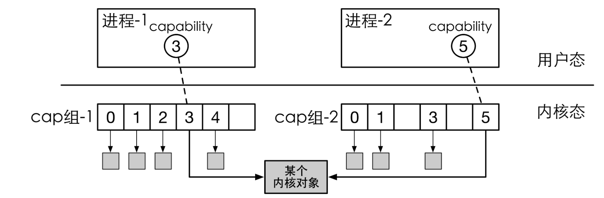
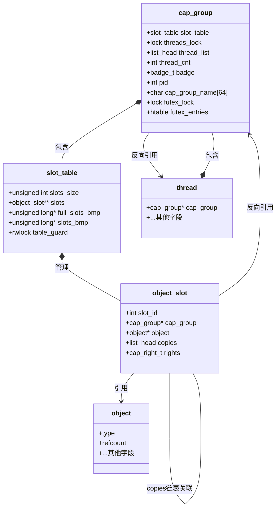
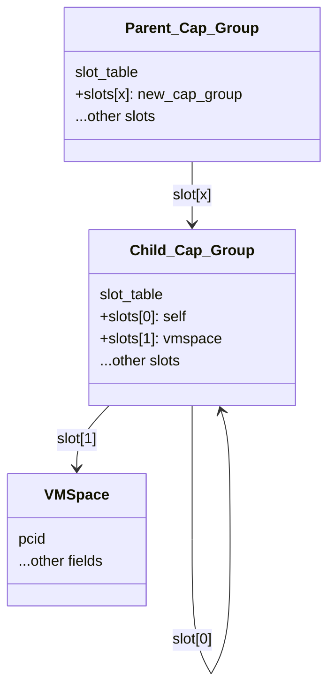
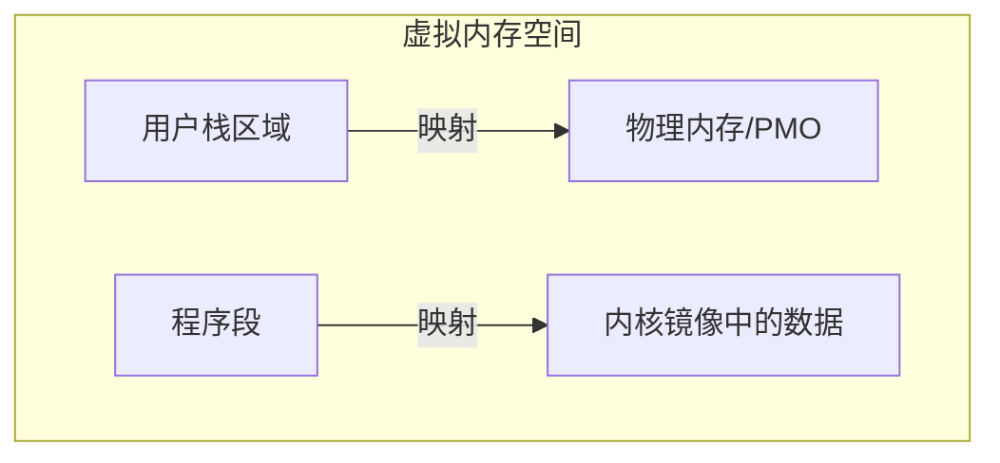
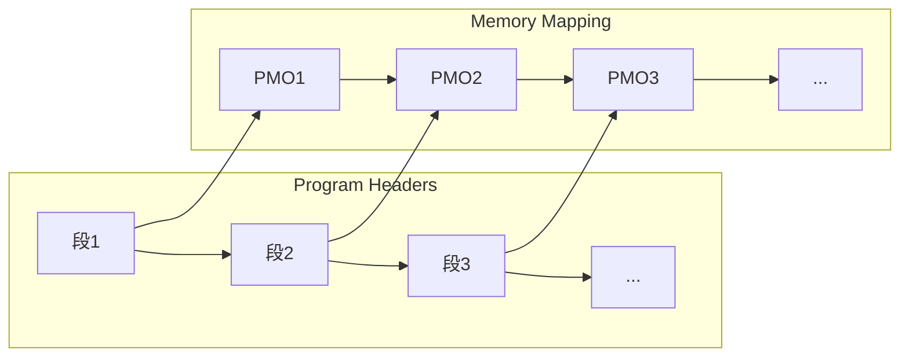
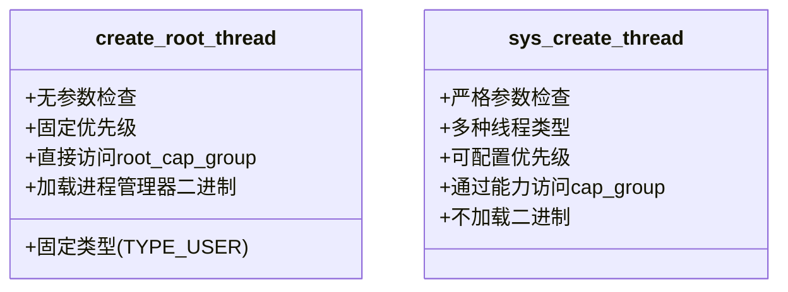

本部分内容主要讲解Chcore中进程/线程管理的部分。从能力组机制的作用，到其具体的实现，再到其具体落实到线程管理的过程。

# 能力组机制

## 能力组的概念

### 能力

我们知道，在Chcore中，系统资源的管理分配是通过将一切系统资源都视作Object（对象）来实现的。而能力，则是一种访问控制机制，可以理解为"带有权限的引用"。它包含两个基本要素：

- 对象的引用（指向要访问的资源）
- 对该对象的权限（允许进行什么操作）

由此我们便可以理解文档中提到的“能力组本身只是一个包含指向object的指针的数组”

### 能力组

> 文档告诉我们：
>
> 1. 所有进程/线程都有一个独立的能力组，拥有一个全局唯一ID (**Badge**)
> 2. 所有对象（包括进程或**能力组**本身）都属于一个或多个能力组当中，也就是说子进程与线程将属于父进程的能力组当中，在某个能力组的对象拥有一个能力组内的能力ID(**cap**)。
> 3. 对象可以共享，即单个对象可以在多个能力组中共存，同时在不同cap_group中可以有不同的**cap**
> 4. 对所有对象的取用和返还都使用引用计数进行追踪。当引用计数为0后，当内核垃圾回收器唤醒后，会自动回收.
> 5. 能力组内的能力具有权限，表明该能力是否能被共享(CAP_RIGHT_COPY)以及是否能被删除(CAP_RIGHT_REVOKE)



### Linux中的应用

此事在Linux之中亦有记载……

ref: <https://www.cnblogs.com/sparkdev/p/11417781.html>

wiki上的简单名词介绍 <https://en.wikipedia.org/wiki/Capability-based_operating_system>

tl;dr 能力组是为安全而生的进程“部分root”的机制，例如你可以在用户态运行/bin/ping

## 数据结构实现

说到这里，我们可以看看Chcore代码中对几个相关数据结构的实现：

```c
struct object {
        u64 type;
        u64 size;
        struct list_head copies_head; // 指向同一对象的slots链表
       // ...其他字段
};

struct object_slot {
    int slot_id;                    // 槽位ID
    struct cap_group *cap_group;    // 所属的能力组，反向引用
    struct object *object;          // 指向实际对象
    struct list_head copies;        // 指向同一对象的复制槽位链表
    cap_right_t rights;            // 对对象的访问权限
}

struct slot_table {
    unsigned int slots_size;        // 槽位表大小
    struct object_slot **slots;     // 槽位数组
    unsigned long *full_slots_bmp;  // 完全填满的槽位位图
    unsigned long *slots_bmp;       // 槽位使用位图
    struct rwlock table_guard;      // 读写锁保护
}

struct cap_group {
    struct slot_table slot_table;   // 槽位表
    struct lock threads_lock;       // 线程列表锁
    struct list_head thread_list;   // 线程列表
    int thread_cnt;                 // 线程计数
    badge_t badge;                  // 全局唯一标识
    int pid;                        // 进程ID
    // ... 其他字段
}

```

结合中文注释一步一步看下来就能理解文档的意思了：

- 能力组本身，即 `cap_group` ，通过 `slot_table` 引用一系列的 `object_slot` 进而得到对对象的引用，也就是“指向object指针的数组”
- 能力本身，即 `object_slot` ，指的即是包含了权限的内核对象的引用，如文件描述符，网络连接等，通过上述指针关系，一步步从属于能力组的安排
- 那么object在多个能力组之间的共享又是如何实现的？便在于 `object` 中对能力组的反向引用，从而得到一个具体的对象所属于的不同能力组
- 同样的， `cap_group` 里的 `thread_list` 同样是对线程的又一个反向引用，即实现了不同线程之间共享能力组的操作。举例：假设父进程p持有一系列内核对象的资源，例如文件描述符等，那p的线程以及子进程皆应该有文件描述符等资源

## 概念关系图

由此我们可以画出这些概念在Chcore代码中的关系图，有点绕，但是确实如此



## object虚函数表

最后，由于object实际上只是一切内存对象的基类，所以在实际析构的时候，还需要根据对象的类型选择对应的析构函数。因此在Chcore中，还可以看见用C语言写的“虚函数表”，从而用结构体实现了OOP的部分特性：

```c
const obj_deinit_func obj_deinit_tbl[TYPE_NR] = {
        [0 ... TYPE_NR - 1] = NULL,
        [TYPE_CAP_GROUP] = cap_group_deinit,
        [TYPE_THREAD] = thread_deinit,
        [TYPE_CONNECTION] = connection_deinit,
        [TYPE_NOTIFICATION] = notification_deinit,
        [TYPE_IRQ] = irq_deinit,
        [TYPE_PMO] = pmo_deinit,
        [TYPE_VMSPACE] = vmspace_deinit,
#ifdef CHCORE_OPENTRUSTEE
        [TYPE_CHANNEL] = channel_deinit,
        [TYPE_MSG_HDL] = msg_hdl_deinit,
#endif /* CHCORE_OPENTRUSTEE */
        [TYPE_PTRACE] = ptrace_deinit
};
```

针对这样的数据结构, capability.c之中小心地实现了 `cap_group` 的复制，释放，传递等函数，之中由于基于引用计数的所有权的复杂性+并发+为了性能降低锁的粒度，代码并不是非常可读，感兴趣的读者可以自行深入研究

## 能力组创建

现在我们再来看Chcore是如何具体创建能力组的。在main函数中，系统将首先调用`create_root_cap_group`创建第一个 `cap_group` 进程，并在 `root_cap_group` 中创建第一个线程

此外，用户程序也可以通过 `sys_create_cap_group` 系统调用创建一个全新的 `cap_group`

### create_root_cap_group

先看源码：

```c
/* This is for creating the first (init) user process. */
struct cap_group *create_root_cap_group(char *name, size_t name_len)
{
        struct cap_group *cap_group;
        struct vmspace *vmspace;
        cap_t slot_id;

        cap_group = obj_alloc(TYPE_CAP_GROUP, sizeof(*cap_group));
        if (!cap_group) {
                kwarn("failed alloc cap_group in %s\n", __func__);
                return NULL;
        }
        cap_group_init(cap_group,
                       BASE_OBJECT_NUM,
                       /* Fixed badge */ ROOT_CAP_GROUP_BADGE);

        slot_id = cap_alloc(cap_group, cap_group);
        BUG_ON(slot_id != CAP_GROUP_OBJ_ID);

        vmspace = obj_alloc(TYPE_VMSPACE, sizeof(*vmspace));
        if (!vmspace) {
                kwarn("failed alloc vmspace in %s\n", __func__);
                return NULL;
        }

        /* fixed PCID 1 for root process, PCID 0 is not used. */
        vmspace_init(vmspace, ROOT_PROCESS_PCID);

        slot_id = cap_alloc(cap_group, vmspace);
        BUG_ON(slot_id != VMSPACE_OBJ_ID);

        /* Set the cap_group_name (process_name) for easing debugging */
        memset(cap_group->cap_group_name, 0, MAX_GROUP_NAME_LEN + 1);
        if (name_len > MAX_GROUP_NAME_LEN)
                name_len = MAX_GROUP_NAME_LEN;
        memcpy(cap_group->cap_group_name, name, name_len);

        root_cap_group = cap_group;
        return cap_group;
}
```

从上往下看，函数逻辑依次是：

- 创建 `cap_group` 对象，并分配 slot 槽位
- 创建 `vmspace` 对象，并分配 slot 槽位
- 为 `cap_group` 命名，这里包含名字长度检查等操作
- 设置根能力组，即 `root_cap_group` 为此能力组，结束函数

不难注意到一个有趣的事情：那就是这里的能力组本身同样是内核对象，因此指向自己的指针也被放在了 `slot_table` 里。而这则是由于root能力组的特殊性决定的——它没有父进程，是系统中的第一个能力组，因此需要建立初始的能力权限管理机制，即自身作为自身的权力来源，进而作为整个系统的权限起点

而普通的能力组创建，则需严格遵守能力组权限的要求，权限来自父进程

### sys_root_cap_group

这里的 `sys_create_cap_group` ，则作为一个syscall 的handler呈现

```c
const void *syscall_table[NR_SYSCALL] = {
    // ...
        [CHCORE_SYS_create_cap_group] = sys_create_cap_group,
```

传入的 `*unsigned* *long* *cap_group_args_p`*  就是用户态进程传递过来的在其vm下的，指向`sys_create_cap_group` 这个 syscall 的**参数**的指针。在函数具体执行中会将其转换为需要的参数

明白了这个之后，它的逻辑就比较自然了

- 用户态的指针不可信，校验其地址空间是否伸进kernel，是否有创建权限
- copy 用户态的数据到内核（ 这里的拷贝是没有传递用户态的页表的，在现代OS之中，内核态页表包含用户态的页表项，所以 `copy_from_user` 只是一个简单的memcpy而已）
- 类似上面的逻辑，alloc新的cap_group对象，cap_init初始化，根据传入的参数给几个属性赋值
- 新cap_group应该带上默认的cap, 即cap_group和vmspace

内存布局如下：



# 创建第一个进程/线程

在Chcore的main函数中，内核会通过调用 `create_root_thread` 函数来创建第一个进程与线程，这部分内容我们就来研究该函数，同时简单讲解一下对初始化线程上下文的函数 `init_thread_ctx`

在Lab文档里已经写了关于 `create_root_thread` 函数的流程图，所以这里着重研究源码的细节相关

## create_root_thread

这部分源码很长

```c
/*
 * The root_thread is actually a first user thread
 * which has no difference with other user threads
 */
void create_root_thread(void)
{
        struct cap_group *root_cap_group;
        cap_t thread_cap;
        struct thread *root_thread;
        char data[8];
        int ret;
        cap_t stack_pmo_cap;
        struct thread *thread;
        struct pmobject *stack_pmo;
        struct vmspace *init_vmspace;
        vaddr_t stack;
        vaddr_t kva;
        struct process_metadata meta;

        /*
         * Read from binary.
         * The msg and the binary of of the init process(procmgr) are linked
         * behind the kernel image via the incbin instruction.
         * The binary_procmgr_bin_start points to the first piece of info:
         * the entry point of the init process, followed by eight bytes of data
         * that stores the mem_size of the binary.
         */

        memcpy(data,
               (void *)((unsigned long)&binary_procmgr_bin_start
                        + ROOT_ENTRY_OFF),
               sizeof(data));
        meta.entry = (unsigned long)be64_to_cpu(*(u64 *)data);

        memcpy(data,
               (void *)((unsigned long)&binary_procmgr_bin_start
                        + ROOT_FLAGS_OFF),
               sizeof(data));
        meta.flags = (unsigned long)be64_to_cpu(*(u64 *)data);

        memcpy(data,
               (void *)((unsigned long)&binary_procmgr_bin_start
                        + ROOT_PHENT_SIZE_OFF),
               sizeof(data));
        meta.phentsize = (unsigned long)be64_to_cpu(*(u64 *)data);

        memcpy(data,
               (void *)((unsigned long)&binary_procmgr_bin_start
                        + ROOT_PHNUM_OFF),
               sizeof(data));
        meta.phnum = (unsigned long)be64_to_cpu(*(u64 *)data);

        memcpy(data,
               (void *)((unsigned long)&binary_procmgr_bin_start
                        + ROOT_PHDR_ADDR_OFF),
               sizeof(data));
        meta.phdr_addr = (unsigned long)be64_to_cpu(*(u64 *)data);

        root_cap_group = create_root_cap_group(ROOT_NAME, strlen(ROOT_NAME));

        BUG_ON(!root_cap_group);

        init_vmspace = obj_get(root_cap_group, VMSPACE_OBJ_ID, TYPE_VMSPACE);

        BUG_ON(!init_vmspace);

        /* Allocate and setup a user stack for the init thread */
        stack_pmo_cap = create_pmo(ROOT_THREAD_STACK_SIZE,
                                   PMO_ANONYM,
                                   root_cap_group,
                                   0,
                                   &stack_pmo,
                                   PMO_ALL_RIGHTS);
        BUG_ON(stack_pmo_cap < 0);

        ret = vmspace_map_range(init_vmspace,
                                ROOT_THREAD_STACK_BASE,
                                ROOT_THREAD_STACK_SIZE,
                                VMR_READ | VMR_WRITE,
                                stack_pmo);
        BUG_ON(ret != 0);

        /* Allocate the init thread */
        thread = obj_alloc(TYPE_THREAD, sizeof(*thread));
        BUG_ON(thread == NULL);

        for (int i = 0; i < meta.phnum; i++) {
                unsigned int flags;
                unsigned long offset, vaddr, filesz, memsz;

                memcpy(data,
                       (void *)((unsigned long)&binary_procmgr_bin_start
                                + ROOT_PHDR_OFF + i * ROOT_PHENT_SIZE
                                + PHDR_FLAGS_OFF),
                       sizeof(data));
                flags = (unsigned int)le32_to_cpu(*(u32 *)data);

                memcpy(data,
                       (void *)((unsigned long)&binary_procmgr_bin_start
                                + ROOT_PHDR_OFF + i * ROOT_PHENT_SIZE
                                + PHDR_OFFSET_OFF),
                       sizeof(data));
                offset = (unsigned long)le64_to_cpu(*(u64 *)data);

                memcpy(data,
                       (void *)((unsigned long)&binary_procmgr_bin_start
                                + ROOT_PHDR_OFF + i * ROOT_PHENT_SIZE
                                + PHDR_VADDR_OFF),
                       sizeof(data));
                vaddr = (unsigned long)le64_to_cpu(*(u64 *)data);

                memcpy(data,
                       (void *)((unsigned long)&binary_procmgr_bin_start
                                + ROOT_PHDR_OFF + i * ROOT_PHENT_SIZE
                                + PHDR_FILESZ_OFF),
                       sizeof(data));
                filesz = (unsigned long)le64_to_cpu(*(u64 *)data);

                memcpy(data,
                       (void *)((unsigned long)&binary_procmgr_bin_start
                                + ROOT_PHDR_OFF + i * ROOT_PHENT_SIZE
                                + PHDR_MEMSZ_OFF),
                       sizeof(data));
                memsz = (unsigned long)le64_to_cpu(*(u64 *)data);

                struct pmobject *segment_pmo;
                size_t pmo_size = ROUND_UP(memsz, PAGE_SIZE);

                vaddr_t segment_content_kvaddr =
                        ((unsigned long)&binary_procmgr_bin_start) + offset;

                /* According to the linker.ld in procmgr,  no exact bss exists
                 * in elf.*/
                BUG_ON(filesz != memsz);
                // No additional memory for .bss, so we can directly reuse
                // content in kernel image as their physical pages
                ret = create_pmo(PAGE_SIZE,
                                 PMO_DATA,
                                 root_cap_group,
                                 0,
                                 &segment_pmo,
                                 PMO_ALL_RIGHTS);
                BUG_ON(ret < 0);
                kfree((void *)phys_to_virt(segment_pmo->start));
#if CHCORE_ARCH_X86_64
                // See comments of embedded_bin_virt_to_phys
                segment_pmo->start =
                        embedded_bin_virt_to_phys(segment_content_kvaddr);
                segment_pmo->size = pmo_size;
#else
                segment_pmo->start = virt_to_phys(segment_content_kvaddr);
                segment_pmo->size = pmo_size;
#endif
                unsigned vmr_flags = 0;
                if (flags & PHDR_FLAGS_R)
                        vmr_flags |= VMR_READ;
                if (flags & PHDR_FLAGS_W)
                        vmr_flags |= VMR_WRITE;
                if (flags & PHDR_FLAGS_X)
                        vmr_flags |= VMR_EXEC;

                ret = vmspace_map_range(init_vmspace,
                                        vaddr,
                                        segment_pmo->size,
                                        vmr_flags,
                                        segment_pmo);
                BUG_ON(ret < 0);
        }
        obj_put(init_vmspace);

        stack = ROOT_THREAD_STACK_BASE + ROOT_THREAD_STACK_SIZE;

        /* Allocate a physical page for the main stack for prepare_env */
        kva = (vaddr_t)get_pages(0);
        BUG_ON(kva == 0);
        commit_page_to_pmo(stack_pmo,
                           ROOT_THREAD_STACK_SIZE / PAGE_SIZE - 1,
                           virt_to_phys((void *)kva));

        prepare_env((char *)kva, stack, ROOT_NAME, &meta);
        stack -= ENV_SIZE_ON_STACK;

        ret = thread_init(thread,
                          root_cap_group,
                          stack,
                          meta.entry,
                          ROOT_THREAD_PRIO,
                          TYPE_USER,
                          smp_get_cpu_id());
        BUG_ON(ret != 0);

        /* Add the thread into the thread_list of the cap_group */
        lock(&root_cap_group->threads_lock);
        list_add(&thread->node, &root_cap_group->thread_list);
        root_cap_group->thread_cnt += 1;
        unlock(&root_cap_group->threads_lock);

        /* Allocate the cap for the init thread */
        thread_cap = cap_alloc(root_cap_group, thread);
        BUG_ON(thread_cap < 0);
        thread->cap = thread_cap;

        /* L1 icache & dcache have no coherence on aarch64 */
        flush_idcache();

        root_thread = obj_get(root_cap_group, thread_cap, TYPE_THREAD);
        /* Enqueue: put init thread into the ready queue */
        BUG_ON(sched_enqueue(root_thread));
        obj_put(root_thread);
}
```

总体而言，可以分为如下几个的步骤：

### **读取元数据**

从kernel镜像后链接的二进制文件中读取初始化进程（procmgr）的入口点、标志、程序头表项大小、程序头表项数量和程序头表地址。也就是函数开头的一系列 memcpy 函数操作

### 内存布局准备

主要又分为几个小的步骤：

- **创建根能力组**：
  - 创建一个根能力组（`root_cap_group`），这是管理线程和进程的能力组
- **获取初始化虚拟地址空间**：
  - 从根能力组中获取初始化虚拟地址空间（`init_vmspace`）
- **为根线程分配用户栈**：
  - 分配一个物理内存对象（PMO）作为根线程的用户栈，并将其映射到初始化虚拟地址空间
- **分配根线程**：
  - 分配一个线程对象（`thread`）
- **映射程序头表项**：
  - 遍历程序头表项，为每个段分配PMO，并将其映射到初始化虚拟地址空间
  - 最后释放对初始化虚拟地址空间的引用

```c
for (int i = 0; i < meta.phnum; i++) {
    // 读取段信息
    // 创建PMO
    // 设置权限
    // 映射到虚拟地址空间
}
obj_put(init_vmspace);
```

相关的示意图如下所示





### 线程初始化

同理分为如下小的步骤：

- **准备环境**：
  - 为根线程准备环境，包括栈和程序入口点
- **初始化根线程**：
  - 使用根能力组、栈地址、入口点和优先级初始化根线程
  - 其中即包括初始化线程上下文的操作
- **将根线程添加到能力组的线程列表**：
  - 将根线程添加到根能力组的线程列表中，并增加线程计数
- **为根线程分配能力**：
  - 为根线程分配一个能力（`thread_cap`）
- **刷新缓存**：
  - 刷新指令缓存和数据缓存，以确保新线程的指令和数据是最新的
- **将根线程放入就绪队列**：
  - 将根线程放入调度器的就绪队列，准备执行


除了初始化线程之外，类比能力组的创建同样有关于创建系统线程的syscall即 `sys_create_thread` ，其中涉及到的逻辑便比初始线程的创立简单不少，感兴趣的读者可以自行阅读。二者的区别如下图所示：



## init_thread_ctx

初始化上下文的函数相对就要简单很多，根据规则配置相应的寄存器和一些字段即可

### 源码解析

接口：

```c
void init_thread_ctx(
    struct thread *thread,  // 线程对象
    vaddr_t stack,         // 用户栈地址
    vaddr_t func,          // 入口函数地址
    u32 prio,             // 优先级
    u32 type,             // 线程类型
    s32 aff               // CPU亲和性
)
```

源码：

```c
void init_thread_ctx(struct thread *thread, vaddr_t stack, vaddr_t func,
                     u32 prio, u32 type, s32 aff)
{
        /* Fill the context of the thread */
        thread->thread_ctx->ec.reg[SP_EL0] = stack;
        thread->thread_ctx->ec.reg[ELR_EL1] = func;
        thread->thread_ctx->ec.reg[SPSR_EL1] = SPSR_EL1_EL0t;

        /* Set the state of the thread */
        thread->thread_ctx->state = TS_INIT;

        /* Set thread type */
        thread->thread_ctx->type = type;

        /* Set the cpuid and affinity */
        thread->thread_ctx->affinity = aff;

        /* Set the budget and priority of the thread */
        if (thread->thread_ctx->sc != NULL) {
                thread->thread_ctx->sc->prio = prio;
                thread->thread_ctx->sc->budget = DEFAULT_BUDGET;
        }

        thread->thread_ctx->kernel_stack_state = KS_FREE;
        /* Set exiting state */
        thread->thread_ctx->thread_exit_state = TE_RUNNING;
        thread->thread_ctx->is_suspended = false;
}
```

实际上就是设置寄存器、线程状态、调度相关设置以及状态标志

### 相关数据结构

线程上下文的数据结构如下所示，结构体成员的作用都写在注释里了，可以直接参考注释食用～

```c
/* 线程上下文：包含线程运行所需的所有上下文信息 */
struct thread_ctx {
        /* ====== 架构相关部分 ====== */
        
        /* 执行上下文：包含CPU寄存器状态
         * 在ARM64中包括：
         * - 通用寄存器 (X0-X30)
         * - 程序计数器 (PC)
         * - 栈指针 (SP)
         * - 处理器状态寄存器 (PSTATE)
         */
        arch_exec_ctx_t ec;
        
        /* 浮点运算单元（FPU）状态
         * 存储浮点寄存器和SIMD寄存器的内容
         * 仅在线程使用FPU时才会被保存和恢复
         */
        void *fpu_state;
        
        /* 线程局部存储（TLS）相关寄存器
         * 用于支持线程局部存储
         * 在ARM64中通常使用TPIDR_EL0寄存器
         */
        unsigned long tls_base_reg[TLS_REG_NUM];

        /* ====== 架构无关部分 ====== */
        
        /* FPU所有权标识
         * -1: 不拥有FPU
         * >=0: 表示拥有FPU的CPU ID
         * 用于延迟FPU上下文的保存和恢复
         */
        int is_fpu_owner;
        
        /* 调度上下文
         * 包含调度器需要的信息：
         * - 优先级
         * - 时间片
         * - 调度策略相关数据
         */
        sched_ctx_t *sc;
        
        /* 线程类型
         * 可能的值：
         * - TYPE_USER: 用户线程
         * - TYPE_KERNEL: 内核线程
         */
        unsigned int type;
        
        /* 线程状态（不能被其他核心修改）
         * 可能的值：
         * - TS_INIT: 初始化
         * - TS_READY: 就绪
         * - TS_RUNNING: 运行中
         * - TS_WAITING: 等待中
         */
        unsigned int state;
        
        /* 线程挂起标志
         * true: 线程被挂起
         * false: 线程正常运行
         */
        bool is_suspended;
        
        /* SMP亲和性
         * -1: 可在任何CPU上运行
         * >=0: 指定运行的CPU ID
         */
        int affinity;
        
        /* 当前分配的CPU
         * 记录线程当前或最后运行的CPU ID
         */
        unsigned int cpuid;
        
        /* 内核栈状态
         * volatile: 可能被中断处理修改
         * 可能的值：
         * - KS_FREE: 空闲
         * - KS_LOCKED: 被锁定
         */
        volatile unsigned int kernel_stack_state;
        
        /* 线程退出状态
         * volatile: 可能被其他上下文修改
         * 可能的值：
         * - TE_RUNNING: 运行中
         * - TE_EXITING: 正在退出
         * - TE_EXITED: 已退出
         */
        volatile unsigned int thread_exit_state;
        
} /* 按照缓存行大小对齐，避免伪共享 */
  __attribute__((aligned(CACHELINE_SZ)));
```

至此，线程管理相关的源码解析到此结束
