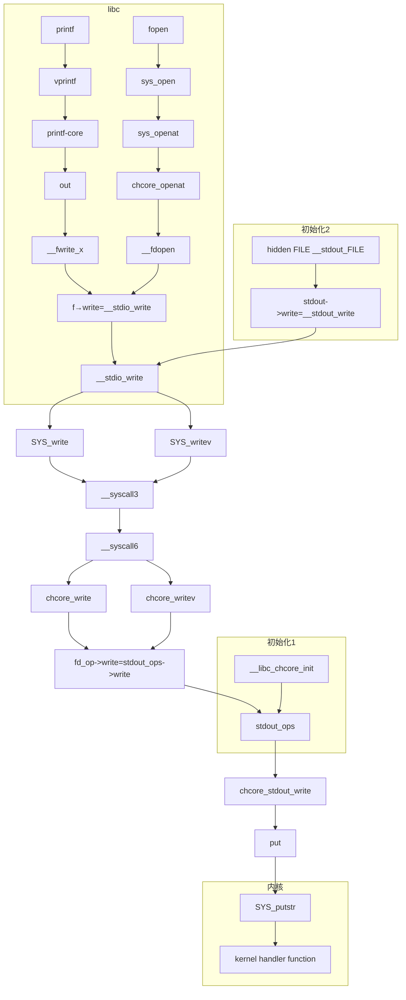

> 系统调用是系统为用户程序提供的高特权操作接口。在本实验中，用户程序通过 `svc` 指令进入内核模式。在内核模式下，首先操作系统代码和硬件将保存用户程序的状态。操作系统根据系统调用号码执行相应的系统调用处理代码，完成系统调用的实际功能，并保存返回值。最后，操作系统和硬件将恢复用户程序的状态，将系统调用的返回值返回给用户程序，继续用户程序的执行
>

书接上回，在异常管理的部分已经讲了系统调用的整体流程。本部分内容将讲解其实现细节，并以printf函数为例探究一次系统调用的逻辑关系链

# 系统调用流程

我们在异常管理部分已经分析了系统调用的大体流程：

- 保存上下文，即当前线程的各个寄存器值，该工作由 `exception_enter`  完成。结合上回分解我们知道它们是直接被保存在内核栈上的
- 切换到内核栈，即 `switch_to_cpu_stack` 宏，此时由用户态进入内核态
- 根据系统调用表进行跳转，并执行相应的函数
- 处理返回值，恢复上下文，该工作由 `exception_exit` 完成
- 结束系统调用

## 内核栈切换

这里重点再分析一下之前没有讲到的内核栈切换，先看源码：

```nasm
.macro switch_to_cpu_stack
 mrs     x24, TPIDR_EL1
 add x24, x24, #OFFSET_LOCAL_CPU_STACK
 ldr x24, [x24]
 mov sp, x24
.endm
```

注意到这个寄存器 `TPIDR_EL1` ，Lab文档告诉我们它可以读取到当前核的 `per_cpu_info` ，我们作更深一步的了解：

`TPIDR_EL1`（Thread Process ID Register for EL1）是ARM架构中一个特殊的寄存器，**用于存储当前执行线程或进程的上下文信息**。在操作系统内核中，这个寄存器经常被用来存储指向`per_cpu_data`结构的指针，该结构包含了特定于CPU的数据，比如CPU的局部变量和栈指针

实质上，这是个“保留寄存器”，硬件上没有对其的直接操作，留给操作系统实现者自行使用。具体的初始化和设置在 `smp` 之中，chcore将其设置为指向 `per_cpu_info` 结构体的指针，并且在之后不再变化

## CPU信息结构体

现在让我们来看看这个结构体是个什么东东：

```c
struct per_cpu_info {
 /* The execution context of current thread */
 u64 cur_exec_ctx;

 /* Per-CPU stack */
 char *cpu_stack;

 /* struct thread *fpu_owner */
 void *fpu_owner;
 u32 fpu_disable;

 char pad[pad_to_cache_line(sizeof(u64) +
       sizeof(char *) +
       sizeof(void *) +
       sizeof(u32))];
} __attribute__((packed, aligned(64)));
```

其中FPU指浮点运算单元，这个指针即表示当前使用FPU的线程，最后的pad以及结尾的编译器声明则旨在让结构体按照64字节大小对齐，从而避免多个CPU核心访问同一缓存行导致的性能问题

那么 `TPIDR_EL1` 又是在哪里被设置的呢？我们顺着看其init函数：

```c
void init_per_cpu_info(u32 cpuid)
{
 struct per_cpu_info *info;

 if (cpuid == 0)
  ctr_el0 = read_ctr();

 info = &cpu_info[cpuid];

 info->cur_exec_ctx = 0;

 info->cpu_stack = (char *)(KSTACKx_ADDR(cpuid) + CPU_STACK_SIZE);

 info->fpu_owner = NULL;
 info->fpu_disable = 0;
 // 寄存器在此处被初始化
 asm volatile("msr tpidr_el1, %0"::"r" (info));
}
```

这样一来，切换内核栈的那部分汇编代码就好理解了：系统直接按照结构体的大小读出CPU的栈指针，然后一把塞到 `sp`  寄存器里，即完成了栈的切换。那个 `#OFFSET_XXX` 宏的定义自然也能猜到是什么了，事实上，它就定义在 `smp.h` 中：

```c
/*
 * The offset in the per_cpu struct, i.e., struct per_cpu_info.
 * The base addr of this struct is stored in TPIDR_EL1 register.
 *
 * IMPORTANT: modify the following offset values after
 * modifying struct per_cpu_info.
 */
#define OFFSET_CURRENT_EXEC_CTX  0
#define OFFSET_LOCAL_CPU_STACK  8
#define OFFSET_CURRENT_FPU_OWNER 16
#define OFFSET_FPU_DISABLE  24
```

# 用户态libc支持

接下来我们尝试分析printf这个用户态函数，文档已经给出了他在musl-libc之中的调用链，而跟踪这个调用链，我们就可以一窥API和ABI的边界

## 从printf到__stdio_write

由Lab文档知，printf经过一系列调用，会来到 `__stdout_write` 函数，并进一步去到 `__stdio_write` 函数

```c
// user/system-services/chcore-libc/musl-libc/src/stdio/__stdout_write.c
size_t __stdout_write(FILE *f, const unsigned char *buf, size_t len)
{
 struct winsize wsz;
 f->write = __stdio_write;
 if (!(f->flags & F_SVB) && __syscall(SYS_ioctl, f->fd, TIOCGWINSZ, &wsz))
  f->lbf = -1;
 return __stdio_write(f, buf, len);
}

// user/system-services/chcore-libc/musl-libc/src/stdio/__stdio_write.c
size_t __stdio_write(FILE *f, const unsigned char *buf, size_t len)
{
 struct iovec iovs[2] = {
  { .iov_base = f->wbase, .iov_len = f->wpos-f->wbase },
  { .iov_base = (void *)buf, .iov_len = len }
 };
 struct iovec *iov = iovs;
 size_t rem = iov[0].iov_len + iov[1].iov_len;
 int iovcnt = 2;
 ssize_t cnt;
 for (;;) {
  // HERE!!!
  cnt = syscall(SYS_writev, f->fd, iov, iovcnt);
  // ...循环剩余内容
}
```

这里的 `SYS_writev` 是一个用户态中的宏，负责表示系统调用编号，从而和系统调用联系起来

## 用户态syscall宏展开

继续深究这里的 syscall 宏，其中暗藏大量玄机：

```cpp
#ifndef __scc
#define __scc(X) ((long) (X))
typedef long syscall_arg_t;
#endif

hidden long __syscall_ret(unsigned long),
 __syscall_cp(syscall_arg_t, syscall_arg_t, syscall_arg_t, syscall_arg_t,
              syscall_arg_t, syscall_arg_t, syscall_arg_t);

#define __syscall1(n,a) __syscall1(n,__scc(a))
#define __syscall2(n,a,b) __syscall2(n,__scc(a),__scc(b))
#define __syscall3(n,a,b,c) __syscall3(n,__scc(a),__scc(b),__scc(c))
#define __syscall4(n,a,b,c,d) __syscall4(n,__scc(a),__scc(b),__scc(c),__scc(d))
#define __syscall5(n,a,b,c,d,e) __syscall5(n,__scc(a),__scc(b),__scc(c),__scc(d),__scc(e))
#define __syscall6(n,a,b,c,d,e,f) __syscall6(n,__scc(a),__scc(b),__scc(c),__scc(d),__scc(e),__scc(f))
#define __syscall7(n,a,b,c,d,e,f,g) __syscall7(n,__scc(a),__scc(b),__scc(c),__scc(d),__scc(e),__scc(f),__scc(g))

#define __SYSCALL_NARGS_X(a,b,c,d,e,f,g,h,n,...) n
#define __SYSCALL_NARGS(...) __SYSCALL_NARGS_X(__VA_ARGS__,7,6,5,4,3,2,1,0,)
#define __SYSCALL_CONCAT_X(a,b) a##b
#define __SYSCALL_CONCAT(a,b) __SYSCALL_CONCAT_X(a,b)
#define __SYSCALL_DISP(b,...) __SYSCALL_CONCAT(b,__SYSCALL_NARGS(__VA_ARGS__))(__VA_ARGS__)

#define __syscall(...) __SYSCALL_DISP(__syscall,__VA_ARGS__)
#define syscall(...) __syscall_ret(__syscall(__VA_ARGS__))

```

这里循环套圈了很多，我们做一个拆解：

```c
// 原始调用
syscall(SYS_write, fd, buf, count);

// 1. 展开syscall宏
__syscall_ret(__syscall(SYS_write, fd, buf, count))

// 2. 展开__syscall宏
__syscall_ret(__SYSCALL_DISP(__syscall, SYS_write, fd, buf, count))

// 3. 确定参数数量（3个）并连接宏名
__syscall_ret(__syscall3(SYS_write, __scc(fd), __scc(buf), __scc(count)))

// 4. 类型转换
__syscall_ret(__syscall3(SYS_write, 
                         ((long)(fd)), 
                         ((long)(buf)), 
                         ((long)(count))))

// 5. 最终调用实际的系统调用函数并处理返回值
```

遵循这个链继续到 `syscall_dispatcher.c` 文件，会发现它先经历了 `__syscall3` 后到 `__syscall6` 的调用，并进入 `chcore_writev`

这个函数只有三个参数，但是为什么会调用到有6个参数的syscall呢？这里既可能是为了灵活性的考量，也可能是不同架构下的write对应的syscall参数不同，选了比较大的那个（例如pwrite就需要5个参数）

继续追踪，来到 chcore_write 函数，这里调用了stdout这一个初始化的fd的fd_ops的write函数

```c
ssize_t chcore_write(int fd, void *buf, size_t count)
{
        if (fd < 0 || fd_dic[fd] == 0)
                return -EBADF;
        return fd_dic[fd]->fd_op->write(fd, buf, count);
}
```

## 找寻chcore_stdout_write真身

诶，发现找不下去了！这是因为这时候我们并不知道这里的 `write` 函数是什么！于是我们考虑反向搜寻，从 `chcore_stdout_write` 函数往前找：

```c
// user/system-services/chcore-libc/libchcore/porting/overrides/src/chcore-port/stdio.c
static ssize_t chcore_stdout_write(int fd, void *buf, size_t count)
{
        /* TODO: stdout should also follow termios flags */
        char buffer[STDOUT_BUFSIZE];
        size_t size = 0;

        for (char *p = buf; p < (char *)buf + count; p++) {
                if (size + 2 > STDOUT_BUFSIZE) {
                        put(buffer, size);
                        size = 0;
                }

                if (*p == '\n') {
                        buffer[size++] = '\r';
                }
                buffer[size++] = *p;
        }

        if (size > 0) {
                put(buffer, size);
        }

        return count;
```

注意到这里使用了 `put` 函数，它则有了对syscall_table直接的调用，正式打破了用户态的边界：

```c
static void put(char buffer[], unsigned size)
{
        chcore_syscall2(CHCORE_SYS_putstr, (vaddr_t)buffer, size);
}
```

但是还有个问题：我们的 `chcore_stdout_write` 又是如何从 `printf` 调用到的呢？

继续反向追踪，我们可以发现如下的结构体定义：

```c
// user/system-services/chcore-libc/libchcore/porting/overrides/src/chcore-port/stdio.c
struct fd_ops stdout_ops = {
        .read = chcore_stdio_read,
        .write = chcore_stdout_write,
        .close = chcore_stdout_close,
        .poll = chcore_stdio_poll,
        .ioctl = chcore_stdio_ioctl,
        .fcntl = chcore_stdio_fcntl,
};
```

继续顺藤摸瓜，我们就能找到用这个结构体来初始化 `fd_dic` 的函数了：

```c
// user/system-services/chcore-libc/libchcore/porting/overrides/src/chcore-port/syscall_dispatcher.c
/*
 * This function is local to libc and it will
 * only be executed once during the libc init time.
 *
 * It will be executed in the dynamic loader (for dynamic-apps) or
 * just before calling user main (for static-apps).
 * Nevertheless, when loading a dynamic application, it will be invoked twice.
 * This is why the variable `initialized` is required.
 */
__attribute__((constructor(101))) void __libc_chcore_init(void)
{
        static int initialized = 0;
        int fd0, fd1, fd2;
        struct termios *ts;
        char *pidstr;
        size_t i;
        elf_auxv_t *auxv;

    // ......

        /* STDOUT */
        fd1 = alloc_fd();
        assert(fd1 == STDOUT_FILENO);
        fd_dic[fd1]->type = FD_TYPE_STDOUT;
        fd_dic[fd1]->fd = fd1;
        fd_dic[fd1]->fd_op = &stdout_ops; // 这里！！！！！

     // ......
}

```

这样一来，我们就打通了printf的整个调用函数链条，最终通过put函数向内核态调用syscall，从api过渡到abi

## 分析FILE*的write函数

上面是printf的整个流程，最终得到了 `chcore_stdout_write` 和内核交互。但是我们熟知的fopen等FILE*的write又在哪里呢

FILE 是 一个等效于 `_IO_FILE` 结构体的宏，而后者在 `user/system-services/chcore-libc/musl-libc/src/internal/stdio_impl.h` 中有着声明

```c
struct _IO_FILE {
 unsigned flags;
 unsigned char *rpos, *rend;
 int (*close)(FILE *);
 unsigned char *wend, *wpos;
 unsigned char *mustbezero_1;
 unsigned char *wbase;
 size_t (*read)(FILE *, unsigned char *, size_t);
 size_t (*write)(FILE *, const unsigned char *, size_t);
 off_t (*seek)(FILE *, off_t, int);
 unsigned char *buf;
 size_t buf_size;
 FILE *prev, *next;
 int fd;
 int pipe_pid;
 long lockcount;
 int mode;
 volatile int lock;
 int lbf;
 void *cookie;
 off_t off;
 char *getln_buf;
 void *mustbezero_2;
 unsigned char *shend;
 off_t shlim, shcnt;
 FILE *prev_locked, *next_locked;
 struct __locale_struct *locale;
};
```

实际上，这个 `_IO_FILE` 是OS实现者自己完成的，与POSIX对接只需要有 read, write, seek, close四个方法，它的实现可以用这个函数来说明

```c
FILE *__fdopen(int fd, const char *mode)
{
 FILE *f;
 struct winsize wsz;

 /* Check for valid initial mode character */
 if (!strchr("rwa", *mode)) {
  errno = EINVAL;
  return 0;
 }

 /* Allocate FILE+buffer or fail */
 if (!(f=malloc(sizeof *f + UNGET + BUFSIZ))) return 0;

 /* Zero-fill only the struct, not the buffer */
 memset(f, 0, sizeof *f);

 /* Impose mode restrictions */
 if (!strchr(mode, '+')) f->flags = (*mode == 'r') ? F_NOWR : F_NORD;

 /* Apply close-on-exec flag */
 if (strchr(mode, 'e')) __syscall(SYS_fcntl, fd, F_SETFD, FD_CLOEXEC);

 /* Set append mode on fd if opened for append */
 if (*mode == 'a') {
  int flags = __syscall(SYS_fcntl, fd, F_GETFL);
  if (!(flags & O_APPEND))
   __syscall(SYS_fcntl, fd, F_SETFL, flags | O_APPEND);
  f->flags |= F_APP;
 }

 f->fd = fd;
 f->buf = (unsigned char *)f + sizeof *f + UNGET;
 f->buf_size = BUFSIZ;

 /* Activate line buffered mode for terminals */
 f->lbf = EOF;
 if (!(f->flags & F_NOWR) && !__syscall(SYS_ioctl, fd, TIOCGWINSZ, &wsz))
  f->lbf = '\n';

 /* Initialize op ptrs. No problem if some are unneeded. */
 f->read = __stdio_read;
 f->write = __stdio_write;
 f->seek = __stdio_seek;
 f->close = __stdio_close;

 if (!libc.threaded) f->lock = -1;

 /* Add new FILE to open file list */
 return __ofl_add(f);
}

```

我们从write往回找可以看到，在调用 `__fdopen` 的时候，我们由一个fd，动态地生成了这个 `_IO_FILE` 结构体，并把他的方法用 `__stdio_xx` 赋值

在 `__stdio_xx` 内部是libc库实现的逻辑，但落到最后是调用SYS_readv, SYS_read的syscall

```c
size_t __stdio_read(FILE *f, unsigned char *buf, size_t len)
{
 struct iovec iov[2] = {
  { .iov_base = buf, .iov_len = len - !!f->buf_size },
  { .iov_base = f->buf, .iov_len = f->buf_size }
 };
 ssize_t cnt;

 cnt = iov[0].iov_len ? syscall(SYS_readv, f->fd, iov, 2)
  : syscall(SYS_read, f->fd, iov[1].iov_base, iov[1].iov_len);
 if (cnt <= 0) {
  f->flags |= cnt ? F_ERR : F_EOF;
  return 0;
 }
 if (cnt <= iov[0].iov_len) return cnt;
 cnt -= iov[0].iov_len;
 f->rpos = f->buf;
 f->rend = f->buf + cnt;
 if (f->buf_size) buf[len-1] = *f->rpos++;
 return len;
}

```

最后给到用户的就是fopen了

```c
FILE *fopen(const char *restrict filename, const char *restrict mode)
{
 FILE *f;
 int fd;
 int flags;

 /* Check for valid initial mode character */
 if (!strchr("rwa", *mode)) {
  errno = EINVAL;
  return 0;
 }

 /* Compute the flags to pass to open() */
 flags = __fmodeflags(mode);

 fd = sys_open(filename, flags, 0666);
 if (fd < 0) return 0;
 if (flags & O_CLOEXEC)
  __syscall(SYS_fcntl, fd, F_SETFD, FD_CLOEXEC);

 f = __fdopen(fd, mode);
 if (f) return f;

 __syscall(SYS_close, fd);
 return 0;
}
```

由此我们可以得出, 内核里面始终只维护fd, 而用户态的FILE*其实是libc做的一层包装，而如果想要自定义kernel, 只需要保证SYS_readv, SYS_writev, SYS_read, SYS_write这些宏存在，并处理对应参数的syscall就行

## 关于stdout

众所周知，stdout只是一个stdout文件的宏，而stdout文件就是FILE*类型的

```c
// user/system-services/chcore-libc/musl-libc/src/stdio/stdout.c
hidden FILE __stdout_FILE = {
 .buf = buf+UNGET,
 .buf_size = sizeof buf-UNGET,
 .fd = 1,
 .flags = F_PERM | F_NORD,
 .lbf = '\n',
 .write = __stdout_write,
 .seek = __stdio_seek,
 .close = __stdio_close,
 .lock = -1,
};
FILE *const stdout = &__stdout_FILE;
```

```c
// user/system-services/chcore-libc/musl-libc/src/stdio/__stdout_write.c
#include "stdio_impl.h"
#include <sys/ioctl.h>

size_t __stdout_write(FILE *f, const unsigned char *buf, size_t len)
{
 struct winsize wsz;
 f->write = __stdio_write;
 if (!(f->flags & F_SVB) && __syscall(SYS_ioctl, f->fd, TIOCGWINSZ, &wsz))
  f->lbf = -1;
 return __stdio_write(f, buf, len);
}
```

## 调用逻辑图

最后，我们用一张逻辑链条图来结束今天的旅程：



# 用户态程序编写

万事具备，现在我们可以尝试自己动手编写我们的用户态程序了：

```c
#include<stdio.h>

int main() {
    printf("Hello ChCore!\n");
    return 0;
}   
```

按照文档指示，用已经生成好的工具链编译

不要忘了结果放到build/ramdisk文件夹里面，这样内核启动时将自动运行

```bash
./build/chcore-libc/bin/musl-gcc ./user/apps/my-apps/hello.c -o ./build/ramdisk/hello-world.bin
```

然后 `./chbuild rambuild` 重新生成内核镜像，再 `./build/simulate.sh` 重新进入chcore

便可以看到我们编写的Hello-world!成功运行了

```bash
$ ./hello-world.bin
Hello ChCore!
```

至此，系统调用部分的源码解析到此为止
