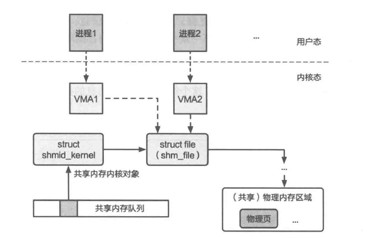

# 目录

- [1、多核处理器的调度机制](#1多核处理器的调度机制)
  - [运行队列](#1运行队列)
  - [负载均衡与负载追踪](#2负载均衡与负载追踪)
  - [处理器亲和性](#3处理器亲和性)
    - [基本概念](#1-基本概念)
    - [核心机制](#2-核心机制)
    - [系统调用接口](#3-系统调用接口)
    - [代码示例](#4-代码示例)

- [2、案例分析：Linux调度器](#2案例分析linux调度器)
  - [O(N)调度器](#1on调度器)
    - [工作原理](#工作原理)
    - [效率问题](#效率问题)
  - [O(1)调度器](#2o1调度器)
    - [工作原理](#工作原理-1)
    - [问题](#问题)
  - [完全公平调度器(CFS)](#3完全公平调度器completely-fair-scheduler-cfs)
    - [CFS的动态时间片](#1cfs的动态时间片)
    - [CFS使用红黑树作为运行队列](#2cfs使用红黑树作为运行队列)
    - [CFS阻塞任务唤醒](#3cfs阻塞任务唤醒)
  - [Linux的细粒度负载追踪(PELT)](#4linux的细粒度负载追踪调度实体粒度负载追踪pelt)
  - [Linux的NUMA感知调度](#5linux-的-numa-感知调度)

- [3、进程间通信](#2进程间通信)
  - [进程间通信基础知识](#1进程间通信基础知识)
    - [基本概念与设计选择](#1基本概念与设计选择)
    - [主要IPC机制](#2主要ipc机制)
    - [进阶](#3进阶)
  - [文件接口IPC：管道](#2文件接口ipc管道)
    - [管道的核心概念与工作机制](#1管道pipe的核心概念与工作机制)
    - [Linux中管道进程间通信的实现](#2linux中管道进程间通信的实现)
    - [命名管道和匿名管道](#3命名管道和匿名管道)
  - [内存接口IPC：共享内存](#3内存接口ipc共享内存)
    - [基础知识](#1基础知识)
    - [生产者-消费者问题实现](#2生产者-消费者问题实现)
  - [消息接口IPC：消息队列](#4消息接口ipc消息队列)
  - [L4微内核的IPC优化](#5l4微内核的ipc优化)
    - [L4消息传递](#1l4消息传递)
    - [L4控制流转移](#2l4控制流转移)
    - [L4通信连接](#3l4通信连接)
    - [L4通信控制](#4l4通信控制权限检查)
  - [LRPC的迁移线程模型](#6lrpc的迁移线程模型)
    - [核心知识点](#1核心知识点)
    - [与L4直接进程切换的对比](#2与-l4-直接进程切换的对比)
    - [LRPC数据传递机制](#3lrpc-数据传递机制)
    - [优势与适用场景](#4优势与适用场景)
  - [ChCore进程间通信机制](#7chcore进程间通信机制)
    - [ChCore的IPC用户态实现](#1chcore的ipc用户态实现)
    - [内核态系统调用接口](#2内核态系统调用接口)
    - [关键机制解析](#3关键机制解析)

---

# 1、多核处理器的调度机制

*在之前ICS课程的学习中，我们讨论了单核场景下的处理器调度策略，在该场景下，调度器只需要选择合适的任务让唯一的CPU核心执行即可。然而，在多核场景下，调度器不仅需要选取合适的任务，还需要分配合适的CPU核心用于执行任务。为了支持多核处理器调度，调度器机制也要进行对应的扩展。*

## 1、运行队列

如果让所有CPU核心共享一个全局的运行队列，一方面，多个CPU核心对全局运行队列的访问会产生锁竞争，随着CPU核心数量的上升，任务调度的开销会越来越大；另一方面，系统中的任务会在不同的CPU核心间来回切换，导致无法有效利用每个核心上的高速缓存，并对任务的执行效率产生影响。

为避免上述问题，现代操作系统常用的方式是**让每个CPU核心维护一个本地的运行队列**。如图所示。


当新任务到达系统时，会被分配到某一个 CPU 核心的本地队列，参与该 CPU 核心的单核调度。由于 CPU 核心在调度任务时只需要访问本地数据，且通常情况下任务不会被频繁跨核迁移，因此能够保证高效的任务调度与执行。

调度器通过将任务放到 CPU 核心的本地运行队列，避免了任务在多核间切换的性能开销，因而在多核调度时有良好的性能。然而，如果任务在它的生命周期中只在一个 CPU 核心上运行，则可能导致多核间的负载不均衡，例如某个 CPU 核心的利用率为 100%，而剩余 CPU 核心的利用率都为 0%。为了解决这一问题，多核处理器调度必须考虑**负载均衡**，通过追踪每个 CPU 核心当前的负载情况，将高负载 CPU 核心管理的任务迁移到低负载 CPU 核心上，尽可能地保证每个核心的负载大致相同。

## 2、负载均衡与负载追踪

1. **负载均衡**
    
    系统负载的一种定义是简化为每个 CPU 核心本地队列的长度，从而负载均衡的目标是尽可能使所有 CPU 核心的队列长度保持均匀。但不同负载定义可能衍生不同的均衡策略。
    
2. **负载均衡机制**
    - **工作窃取（Work Stealing）**：当某个 CPU 核心的本地队列任务执行完毕时，可从其他核心的队列中"窃取"待执行任务，避免核心空闲，从而实现全局负载均衡。

## 3、处理器亲和性

### **1. 基本概念**

处理器亲和性允许开发者指定任务（以线程为单位）只能在特定的 CPU 核心上执行。其目的是避免操作系统因负载均衡策略将任务迁移到其他核心，从而满足特定程序的性能需求或资源独占要求。

### **2. 核心机制**

- 通过 `cpu_set_t` 掩码表示允许运行的 CPU 核心集合，掩码中的每一位对应一个核心。
- 操作系统提供以下宏操作 `cpu_set_t`：
    - `CPU_ZERO(set)`：初始化集合为空。
    - `CPU_SET(cpu, set)`：将指定核心加入集合。
    - `CPU_CLR(cpu, set)`：从集合中移除指定核心。
    - `CPU_ISSET(cpu, set)`：检查核心是否在集合中。
    - `CPU_COUNT(set)`：返回集合中的核心数量。

### **3. 系统调用接口**

- `sched_setaffinity(pid, size, mask)`：设置线程的 CPU 亲和性（`pid=0` 表示当前线程）。
- `sched_getaffinity(pid, size, mask)`：获取线程的当前亲和性配置。

### **4. 代码示例**

```cpp
#include <sched.h>
#include <stdio.h>

int main() {
    cpu_set_t mask;
    CPU_ZERO(&mask);          // 初始化空集合
    CPU_SET(0, &mask);        // 添加 CPU 0
    CPU_SET(2, &mask);        // 添加 CPU 2
    sched_setaffinity(0, sizeof(mask), &mask); // 设置当前线程亲和性
    // 后续任务仅会在 CPU 0 和 2 上执行
    ...
    return 0;
}
```

- 操作系统调度时，会检查目标核心是否在亲和性集合内，若不在则禁止迁移。
- 亲和性以线程为粒度控制，需通过线程 ID（`pid`）操作。
- 适用于需要绑定核心的场景（如高性能计算、避免缓存失效、资源隔离等）。

# 2、案例分析：Linux调度器

Linux 调度器需平衡以下核心需求：

1. **公平性**：
    - 关注**任务的等待时间**，防止某些任务长时间未被执行。
2. **资源利用率优化**：
    - **I/O 密集型任务**：优先调度以提升整体资源利用率（避免 I/O 设备空闲）。
    - **计算密集型任务**：允许较长执行时间，但需避免独占 CPU。
3. **任务类型优先级**：
    - **实时任务**：必须优先于交互式和批处理任务执行。
    - **交互式任务**：需快速响应（如用户界面操作）。
    - **批处理任务**：后台任务，允许延迟执行。

4、此外，还需要考虑多核调度相关的因素。

## 1、O（N）调度器

### **工作原理**

- **动态优先级计算**：*O*(*N*)调度器在调度决策时，需要遍历运行队列中的所有任务，并重新计算它们的动态优先级，然后选取动态优先级最高的任务执行。
- **时间片分配**：为了保证公平性，Linux为非实时任务设置了时间片，避免任务饥饿。早期Linux倾向于为任务设置尽可能长的时间片，但过长的时间片会导致任务响应时间过长。因此，调度器将时间分为多个调度时间段（Epoch），每经过一个时间段，调度器会重新分配任务的时间片，避免所有任务全部执行一次的总时间片过长。

### **效率问题**

- **调度开销大**：随着任务数量的增加，*O*(*N*)调度器的调度开销显著增大，导致调度决策时间过长，浪费CPU资源。
- **时间片更新开销**：在所有任务执行完一个时间片后，*O*(*N*)调度器需要更新它们的时间片，这也会造成额外的调度开销。

## 2、O（1）调度器

### **工作原理**

- 通过限制任务优先级范围（实时任务[0, 100]，非实时任务[100, 140]）和使用多级队列结构来实现高效调度。具体来说，运行队列分为**激活队列**和**过期队列**，分别管理有剩余时间片和时间片耗尽的任务。当激活队列为空时，调度器会将过期队列中的任务重新加入激活队列，以确保任务能够及时调度。

### 问题

- 尽管O(1)调度器在调度开销上表现出色，但它也存在一些问题。
首先，交互式任务的判定算法较为复杂，可能导致在特定场景下无法及时响应用户操作。其次，时间片分配机制存在问题，高优先级任务的时间片过长，与实际需求不符。
此外，随着任务数量的增加，调度时延也会增加，影响系统的响应时间。

## 3、完全公平调度器（Completely Fair Scheduler, CFS）

CFS 是 Linux 中默认的调度器，基于公平共享调度策略，确保每个任务根据其分配的份额公平地共享 CPU 时间。CFS 简化了调度器的复杂性，只关注非实时任务的公平共享，避免了复杂的调度算法和调参。它通过动态设置任务的时间片来确保调度延迟不会过高，从而保持系统的响应性。


CFS运行队列示意图

CFS 的运行队列结构中，每个 CPU 核心分配一个运行队列结构（rq），其中 cfs 指针指向 CFS 专用的运行队列实现（cfs_rq）。每个任务由一个任务结构（task_struct）表示，包含一个调度实体（sched_entity）数据结构，维护调度任务所需的信息。

CFS 使用的调度策略类似于步幅调度，调度实体中维护了任务的虚拟运行时间（vruntime），选择虚拟运行时间最短的任务进行调度。CFS 静态设置了非实时任务的静态优先级与任务权重（Weight）的对应关系，静态优先级越高，任务的权重就越高，可以分配到更多的 CPU 时间。

### 1、CFS的动态时间片

- **调度周期（sched_period）**：CFS 通过动态调整调度周期解决静态时间片分配问题。默认周期为 6ms，确保每个可运行任务在一个周期内至少执行一次，避免调度延迟过长。
- **时间片权衡**：
    - 周期过长 → 公平性体现延迟，调度开销低；
    - 周期过短 → 调度开销增加，任务切换频繁。
- **最小时间片限制**：当任务数量过多时，调度周期调整为 `任务数 × 0.75ms`，确保每个任务分得的时间片不低于最小平均值（0.75ms），避免因时间片过小导致调度开销激增。
- **权重分配**：根据任务优先级（权重）动态调整每个任务在调度周期内的运行时间占比。

### 2、CFS使用红黑树作为运行队列

**CFS 使用红黑树的优势**

- **高效维护运行队列**：
    - **插入/删除复杂度**：红黑树为平衡二叉查找树，插入节点复杂度为 `O(logN)`，远优于普通队列的 `O(N)`。
    - **快速选取任务**：通过 `rb_leftmost` 指针直接获取虚拟时间最短的任务，调度决策复杂度为 `O(1)`。
- **结构设计**：
    - 红黑树仅维护可运行任务（`cfs_rq`），减少无效维护开销；
    - 节点关联任务数据结构（`task_struct`），支持快速调度操作。

### 3、CFS阻塞任务唤醒

当任务因阻塞或睡眠未运行时，其虚拟时间不会增加；一旦任务再次进入运行状态，调度器会重新计算该任务的优先级，以避免任务长期占用 CPU 时间。调度器会设置该任务的虚拟时间为该任务当前虚拟时间与运行队列中任务的最小虚拟时间中的较大值，从而确保任务能公平地获取 CPU 时间。

## 4、Linux的细粒度负载追踪——调度实体粒度负载追踪（PELT）

1. **PELT 机制核心**
    - **细粒度追踪**：以调度实体（单个任务）为粒度，记录任务历史执行状态。
    - **负载计算**：
        - 每 1024 微秒为一个周期，统计任务处于可运行状态的时间（`x` 微秒）。
        - 当前周期负载：`L = scale_cpu_capacity × (x/1024)`（`scale_cpu_capacity` 为 CPU 处理能力归一化参数）。
    - **累计负载计算**：
        - 引入衰减系数 `y`，通过公式 `L' = L_旧 × y + L_新` 动态更新累计负载，降低历史数据的权重，确保近期的负载贡献更大。
2. **优势**
    - 开销低（仅需维护累计值，无需存储所有历史数据）。
    - 提升负载均衡决策的精确性，帮助调度器选择合适的任务进行迁移。

## **5、Linux 的 NUMA 感知调度**

1. **核心矛盾**
    - 负载均衡需求与任务本地性（减少跨 NUMA 节点迁移的高开销）之间的权衡。
    
    
    
    NUMA系统的调度域
    
2. **调度域（Scheduling Domain）**
    - **分层结构**：根据硬件拓扑将 CPU 划分为多层调度域（树状结构）：
        - 底层：逻辑核调度域（共享 L1/L2 缓存，迁移开销最低）。
        - 向上依次为核调度域、处理器调度域、NUMA 节点调度域、全系统调度域。
    - **负载均衡策略**：
        - 越底层域（如逻辑核）负载均衡越频繁（迁移开销低）。
        - 高层域（如 NUMA 节点）负载均衡极少执行（避免高开销跨节点迁移）。
3. **优势**
    - 在保证一定程度负载均衡的同时，优先利用本地性（如缓存亲和性），显著降低任务迁移的开销。

# 2、进程间通信

## 1、进程间通信基础知识

### **1、基本概念与设计选择**

1. **通信方向性**：
    - **单向**：数据仅能单向传输（如管道、信号）。
    - **双向**：支持双向交互（如RPC）。
    - **混合模式**：根据配置支持单向或双向（如消息队列）。
2. **同步与异步**：
    - **同步**：发送者阻塞等待操作完成（如RPC），适用于简单逻辑。
    - **异步**：非阻塞操作，通过回调或轮询获取结果，适用于高并发场景（如Android Binder）。
3. **数据传递方式**：
    - **共享内存**：用户态实现，零拷贝高效，但需内核建立共享区域。
    
    
    
    - **操作系统辅助**：需内核介入（如管道、消息队列），通过两次内存拷贝完成传输，但安全性更高。
4. **通知机制**：
    - **轮询**：简单IPC中采用，但浪费CPU资源。
    - **内核唤醒**：通过进程状态切换（阻塞/唤醒）实现高效通知（如管道、消息队列）。

---

### **2、主要IPC机制**

| **机制** | **数据抽象** | **方向** | **内核介入** | **特点** |
| --- | --- | --- | --- | --- |
| **管道** | 字节流 | 单向 | 内核态 | 基于文件接口，匿名管道用于父子进程，命名管道支持多进程。 |
| **共享内存** | 内存区间 | 双向 | 用户态 | 高效但需同步机制（如信号量），适用于大数据传输。 |
| **消息队列** | 消息 | 单向/双向 | 内核态 | 支持多进程，按类型组织消息，可缓冲。 |
| **信号** | 事件编号 | 单向 | 内核态 | 轻量级，用于进程控制（如终止、挂起）。 |
| **信号量** | 计数器 | 双向 | 内核态 | 用于同步共享资源访问，通过PV操作管理临界区。 |
| **Socket** | 网络流 | 双向 | 内核态 | 支持跨网络通信，基于IP/端口或文件路径寻址。 |

---

### **3、进阶**

1. **超时机制**：
    - **目的**：防止恶意阻塞或长时间等待（如DoS攻击）。
    - **实现**：允许设置阻塞、立即返回或自定义超时时间（如Linux的`select`/`poll`）。
    - **挑战**：合理超时时间难以确定，需权衡功能与安全性。
2. **通信连接管理**：
    - **直接通信**：显式标识对方进程（如`Send(P, msg)`），适用于固定进程对。
    - **间接通信**：通过中间信箱（如管道、消息队列），支持多对多通信。
3. **权限检查**：
    - **System V IPC**：基于文件权限模型（`IPC_PERM`结构），检查用户/组权限。
    - **微内核**：通过Capability机制控制内核对象访问权限。
4. **命名服务**：
    - **作用**：全局协调服务注册与发现（如文件系统服务注册）。
    - **实现**：通常为用户态服务（如ROS、Android Binder），支持动态连接分发。

## 2、文件接口IPC：管道

### **1、管道（Pipe）的核心概念与工作机制**

1. **基本定义**
管道是一种**单向的进程间通信（IPC）机制**，由内核管理，允许两个进程通过一个通道进行单向数据传输（一端写入数据，另一端读取数据）。
2. **典型应用场景**
例如在 `ps aux | grep target` 命令中：
    - **`|` 符号作用**：通过管道将 `ps` 命令的**标准输出（stdout）连接到 `grep` 的标准输入（stdin）**。
    - **实现原理**：Shell 调用操作系统的 `pipe` 系统调用创建管道，分配**读写两端**文件描述符，并分别配置到两个进程的输入输出端。
3. **关键特性**
    - **单向性**：数据仅从管道写端流向读端，无法反向。
    - **字节流传输**：数据以无结构的字节流形式传输，需应用自行解析（如分割消息）。
    - **内核缓冲区**：内核为管道分配缓冲区暂存数据，平衡两端读写速度差异。
    - **两进程协作限制**：每个管道严格绑定**两个进程**（一个写进程，一个读进程）。
4. **实现细节**
    - 通过 Linux 的 `pipe()` 系统调用创建管道，返回读、写端文件描述符。
    - Shell 通过重定向命令的输入输出文件描述符（如 `stdout`→写端，`stdin`→读端）实现进程串联。

### 2、Linux中管道进程间通信的实现

### 1、管道的创建

管道的创建是由pipe系统调用完成的，这个系统调用会返回两个文件描述符，对应管道的两端。

```cpp
SYSCALL_DEFINE2(pipe2, int __user *, fildes, int, flags)
{
    struct file *files[2];
    int fd[2];
    int error;

    error = __do_pipe_flags(fd, files, flags);
    if (!error) {
        if (unlikely(copy_to_user(fildes, fd, sizeof(fd)))) {
            fput(files[0]);
            fput(files[1]);
            put_unused_fd(fd[0]);
            put_unused_fd(fd[1]);
            error = -EFAULT;
        } else {
            fd_install(fd[0], files[0]);
            fd_install(fd[1], files[1]);
        }
    }
    return error;
}
```

Linux 内核通过 `__do_pipe_flags` 创建管道的缓冲区，这个缓冲区是通过特殊的文件系统实现的。创建时，会生成两个文件描述符，一个是 `O_RDONLY`，另一个是 `O_WRONLY`，这样就确保了一个是写端，另一个是读端。文件描述符创建成功后，内核会通过 `copy_to_user` 和 `fd_install` 函数将它们返回给用户态程序。用户态程序拿到这两个文件描述符后，就可以通过文件接口来使用它们，实现进程间的通信。
那么这个管道真实的存储空间在哪里呢？Linux 中通过 pipe_inode_info 这个结构体来管理管道在内核中的信息，如代码片段所示。在这个结构体中，内核会维护 bufs 的管道缓冲区，由其来保存通信的数据。

```cpp
struct pipe_inode_info {
    struct mutex mutex;               // 保护管道
    wait_queue_head_t rd_wait, wr_wait; // 读者和写者的等待队列
    unsigned int head;                // 缓冲区头
    unsigned int tail;                // 缓冲区尾
    unsigned int readers;             // 并发读者数
    unsigned int writers;             // 并发写者数
    struct pipe_buffer *bufs;         // 管道缓冲区
};
```

在 Linux 中，管道的读写操作和普通的文件读写操作一样。用户程序通过 read 和 write 系统调用来读写管道内的数据。在 Linux 系统的设计中，这两个系统调用会最终调用到管道实现中注册的文件操作 pipe_read 和 pipe_write。管道读和管道写的实现十分类似，我们以管道读为例来进行介绍。

```cpp
static ssize_t
pipe_read(struct pipe_inode_info *pipe, struct user_buffer *to)
{
    // 获取用户态的缓冲区大小
    size_t total_len = buffer_count(to);
    ssize_t ret;

    // 如果缓冲区大小为 0，直接返回
    if (unlikely(total_len == 0))
        return 0;

    ret = 0;
    // 锁住管道，对应 pipe_inode_info 中的 mutex
    pipe_lock(pipe);

    for (;;) {
        unsigned int head = pipe->head;
        unsigned int tail = pipe->tail;
        unsigned int mask = pipe->ring_size - 1;

        if (!pipe_empty(head, tail)) {
            struct pipe_buffer *buf = &pipe->bufs[tail & mask];
            size_t chars = buf->len;

            if (chars > total_len) {
                chars = total_len;
            }

            copy_page_to_user_buffer(buf->page, buf->offset, chars, to);
            ret += chars;
            buf->offset += chars;
            buf->len -= chars;

            if (!buf->len) {
                release_pipe_buf(pipe, buf);
                tail++;
                pipe->tail = tail;
            }
            total_len -= chars;
            if (!total_len)
                break;
        } else {
            // 没有数据，阻塞等待（或直接返回错误信息）
            ...
        }
    }

    pipe_unlock(pipe); // 释放管道锁
    // ...
}
```

上面这段代码展示了 `pipe_read` 函数的实现。它首先获取用户态的缓冲区大小，然后检查缓冲区是否为零。如果为零，则直接返回。接下来，它锁住管道，进入一个循环，检查管道是否为空。如果不为空，它会从管道缓冲区中读取数据，并将其复制到用户态缓冲区。如果缓冲区中的数据被完全读取，它会释放该缓冲区并更新管道的尾指针。如果用户态缓冲区已满，它会退出循环。如果管道为空，它会阻塞等待或返回错误信息。最后，它会释放管道锁。

### 3、命名管道和匿名管道

在经典的 UNIX 系统中，管道分为命名管道和匿名管道，主要区别在于创建方式。

- 匿名管道通过 `pipe` 系统调用创建，进程会获得两个文件描述符，分别用于读写操作。由于没有全局名称，只能通过这两个文件描述符来使用。通常与 `fork` 结合使用，父进程创建管道后，通过 `fork` 创建子进程，子进程继承文件描述符，完成 IPC 权限的分配。父子进程可以通过管道通信，但需要主动关闭多余的端口，否则可能导致通信错误。这种方式适合父子进程等有创建关系的进程，但对关系较远的进程不太适用。
- 命名管道通过 `mkfifo` 命令创建，指定一个全局的文件名，如 `/tmp/namedpipe`，这个文件名代表一个具体的管道。只要两个进程通过相同的管道名创建，并且有访问权限，就可以在任意两个进程之间建立通信连接，解决了匿名管道在非父子进程间通信的局限性。

## 3、内存接口IPC：共享内存

### 1、基础知识

1. **共享内存的基本原理**
    - 共享内存允许多个进程将同一物理内存页映射到各自的虚拟地址空间，从而实现高效通信。
    - 内核通过全局共享内存队列（`shmid_kernel` 结构体）管理共享内存区域，每个区域与唯一的 IPC key 绑定，权限检查通过后进程可映射（`shmat`）或取消映射（`shmdt`）。
    
    !
    
2. **内核支持与实现细节**
    - 共享内存通过文件系统抽象管理物理内存页，支持动态分配（Demand Paging）和交换（Swap）。
    - 每个进程映射共享内存时会创建独立的 VMA（Virtual Memory Area），指向同一物理内存，但虚拟地址可不同。
    - 取消映射仅影响当前进程，其他进程仍可继续使用共享内存。
3. **性能优势**
    - 数据直接通过共享内存传输，无需内核参与后续通信，避免了消息队列、管道等机制中的多次数据拷贝和上下文切换。

### 2、生产者-消费者问题实现

**1. 共享数据结构**

共享内存中定义了一个环形缓冲区 `buffer`，用于存储生产者生成的消息（`item` 结构体），并通过以下全局变量协调生产者和消费者的操作：

```cpp
#define BUFFER_SIZE 10
typedef struct {
    struct msg_header header;
    char data[0];
} item;

item buffer[BUFFER_SIZE];          // 环形共享缓冲区
volatile int buffer_write_cnt = 0; // 生产者写入位置索引
volatile int buffer_read_cnt = 0;  // 消费者读取位置索引
volatile int empty_slot = BUFFER_SIZE; // 空闲槽位数
volatile int filled_slot = 0;      // 已填充槽位数
```

- **环形缓冲区**：通过 `% BUFFER_SIZE` 取模运算实现循环写入/读取。
- **计数器作用**：
    - `empty_slot` 和 `filled_slot`：标识缓冲区的空闲和已占用状态。
    - `buffer_write_cnt` 和 `buffer_read_cnt`：记录生产者和消费者的操作位置。

---

**2. 生产者逻辑**

生产者通过 `send` 函数向缓冲区写入消息：

```cpp
int send(item msg) {
    while (empty_slot == 0);       // 忙等待：直到有空闲槽位
    empty_slot--;                  // 占用一个空闲槽位
    buffer[buffer_write_cnt] = msg; // 写入消息
    buffer_write_cnt = (buffer_write_cnt + 1) % BUFFER_SIZE; // 环形索引更新
    filled_slot++;                 // 增加已填充槽位
    return 0;
}
```

- **忙等待**：通过 `while (empty_slot == 0)` 循环检查空闲槽位，若缓冲区满则持续等待。
- **写入与更新**：写入后更新 `buffer_write_cnt`（取模实现环形），并调整 `empty_slot` 和 `filled_slot`。

---

**3. 消费者逻辑**

消费者通过 `recv` 函数从缓冲区读取消息：

```cpp
item recv(void) {
    while (filled_slot == 0);      // 忙等待：直到有未处理消息
    filled_slot--;                 // 减少已填充槽位
    item msg = buffer[buffer_read_cnt]; // 读取消息
    buffer_read_cnt = (buffer_read_cnt + 1) % BUFFER_SIZE; // 环形索引更新
    empty_slot++;                  // 释放一个空闲槽位
    return msg;
}
```

## 4、消息接口IPC：消息队列

1. **消息队列的作用与特点**
    - 消息队列是内核提供的通信机制，以**消息**为数据抽象单位，支持多发送者与接收者。
    - 相比管道等字节流通信，消息队列更灵活，允许消息按类型分类处理（类型由用户程序定义语义）。
    - 适用于需要异步通信或选择性处理消息的场景。
2. **消息队列的结构**
    
    
    
    - 内核中通过**链表**实现队列结构，每个消息包含：
        - **类型字段**（用户自定义，内核仅存储和匹配）。
        - **数据字段**（类似管道中的字节流）。
        - 指向下一个消息的指针（链表连接）。
    - 消息队列对象包含权限信息、消息头指针等元数据。
3. **基本操作（System V 消息队列）**
    - **`msgget`**：创建或获取消息队列的标识符（类似信箱的地址）。
    - **`msgsnd`**：向队列发送消息（需指定类型和数据）。
    - **`msgrcv`**：从队列接收消息（可指定类型进行过滤）。
    - **`msgctl`**：管理队列（如修改权限、删除队列）。
4. **通信特性**
    - 默认**阻塞行为**：发送时队列满或接收时队列空会阻塞进程。
    - **非阻塞选项**：通过`NOWAIT`标志可避免阻塞，直接返回错误。
    - **多进程支持**：任意数量的进程可连接到同一队列（需权限）。

## 5、L4微内核的IPC优化

*在L4微内核中，内核只保留了基本的功能，包括地址空间、线程、进程间通信等，并且不考虑兼容性等要求，而是选择针对特定硬件做极致的性能优化。这样做的好处是内核的代码量非常少，可以为少量的功能提供尽可能完善的支持。*

### 1、L4消息传递

1. **L4 的设计目标**
    - **最小化内核接口**：通过单一通信接口（消息传递）支持丰富语义，如函数调用、数据缓冲区、字符串及 Capability 的传递。
    - **优化通信开销**：通过减少数据拷贝和上下文切换提升性能。

---

1. **短消息传输机制**
    - **寄存器直接传递**：
        - 消息较短时，直接通过**硬件寄存器**实现零拷贝传输。
        - **局限性**：数据量受硬件架构限制（如x86-32的寄存器数量有限）。
    
    
    
    - **虚拟消息寄存器（VMR）**：
        - **Pistachio 的优化**：将物理寄存器与内存虚拟寄存器解耦，允许自定义虚拟寄存器集合（如64字节）。
        - **实现方式**：部分虚拟寄存器映射到物理寄存器，其余存于固定地址的内存空间，用户态封装接口隐藏差异。
        - **优点**：扩展数据容量，降低移植复杂性，被后续系统（如sel4、Fiasco.OC）沿用。

---

1. **长消息传输机制**
    - **内核辅助传输**：
        - 默认需两次拷贝（发送者→内核缓冲区→接收者），但通过优化减少拷贝次数。
    - **优化手段**：
        - **临时映射区域**：内核在进程地址空间预留临时缓冲区，通过虚拟地址映射实现**单次拷贝**。
        
        
        
        - **多缓冲区支持**：单次通信可传输多个不连续缓冲区，减少上下文切换开销。
    - **兼容性与问题**：
        - 兼容POSIX等依赖缓冲区的接口，但可能触发**缺页异常**（需用户态页处理程序介入，增加内核复杂性）。
    - **后续改进**：
        - 采用**共享内存**替代长消息机制，由进程自行管理数据传输，简化内核逻辑。

### 2、L4控制流转移

### **1. 惰性调度（Lazy Scheduling）**

- **背景问题**：
    
    同步IPC操作中，线程状态频繁切换（就绪↔阻塞）导致**调度队列操作过多**（如频繁移入/移出），引发缓存/TLB不命中等开销。
    
- **核心思想**：
    - **延迟更新调度队列**：阻塞线程仍保留在就绪队列，仅更新其TCB（线程控制块）状态为`IPC_blocked`，由调度器动态选择跳过阻塞线程。
    - **避免队列操作**：减少了线程状态变更时的队列维护开销，通过TCB状态标记动态过滤可运行线程（见伪代码对比）。
- **优势与缺陷**：
    
    ✅ **减少调度开销**：避免线程频繁移入/移出队列的操作。
    
    ❌ **潜在问题**：
    
    - 就绪队列因阻塞线程积累可能增大调度时延。
    - 依赖假设"阻塞状态短暂"成立，不适用于实时性要求高的场景。

---

### **2. 直接进程切换（Direct Process Switching）**

- **背景问题**：
    
    微内核早期IPC控制流转移依赖调度程序，调度不确定性导致**IPC时延不可控**。
    
- **核心思想**：
    - **取消调度介入**：从调用者到被调用者的控制流切换直接完成，不触发调度程序。
    - **同步路径优化**：调用者发送消息后立即切换到接收者，无其他进程干扰（返回过程对称处理）。
- **优势与缺陷**：
    
    ✅ **降低时延**：避免调度路径的中断和上下文切换开销。
    
    ✅ **提升缓存效率**：接收者可直接操作调用者的地址空间数据，减少缓存污染。
    
    ✅ **缩短内核态时间**：减少内核干预，提高系统整体性能。
    
    ❌**破坏实时场景下任务的优先级：**如果只要调用者发起通信，被调用者就一定响应，那么在一些实时的场景下将无法保证对不同优先级任务的区别处理。
    

---

### 3、L4通信连接

- **早期直接通信**：
    - **目标**：以线程为通信目标，避免中间抽象（如端口）导致的性能开销（如缓存和 TLB 污染）。
    - **问题**：
        - **全局唯一线程 ID**：可能引发隐蔽信道（Covert Channel）风险，导致信息泄露。
        - **信息隐蔽性差**：服务需暴露内部线程结构（如线程数量和 ID），难以实现负载均衡。
- **转向间接通信**：
    - **原因**：现代硬件支持大页码机制，缓解了 TLB 污染问题。
    - **实现**：采用类似 Mach 的"信箱"或"端口"模型（如 sel4 和 Fiasco.OC），提升灵活性和安全性。

### 4、L4通信控制（权限检查）

1. **直接通信的权限问题**
    - **拒绝服务攻击**：恶意进程通过大量消息"轰炸"接收者，消耗其资源。
    - **早期解决方案：氏族与酋长机制**
        - **原理**：进程按"氏族"层次组织，每个氏族由"酋长"控制消息流向。
        - **限制**：
            - **性能开销**：消息需多次重定向，增加 IPC 调用次数。
            - **安全漏洞**：酋长成为攻击目标，可能被利用以阻断通信。
2. **现代权限控制：Capability 机制**
    - **核心思想**：
        - **Capability** 是内核对象的索引和权限凭证（如 IPC 连接、内存等）。
        - 通信需基于有效的 Capability，内核检查权限后建立连接。
    - **优势**：
        - **安全性**：阻止未授权通信和拒绝服务攻击。
        - **灵活性**：支持细粒度权限管理（如仅允许特定进程通信）。
    - **应用**：现代微内核（如 sel4）普遍采用 Capability 管理内核对象。

## 6、LRPC的迁移线程模型

### **1、核心知识点**

1. **迁移线程模型的核心思想**
    - **优化目标**：减少传统 IPC 的控制流切换和数据传输开销。
    - **关键设计**：将服务端代码"拉"到客户端线程中执行，避免线程切换和数据拷贝。
        - **类似函数调用**：跨进程调用转化为本地代码执行，仅切换必要状态（如页表、栈指针）。
        - **内核不参与调度**：不阻塞调用者线程，无完整上下文切换，避免调度器和优先级切换的开销。

---

### **2、与 L4 直接进程切换的对比**

| **特性** | **L4 直接进程切换** | **LRPC 迁移线程模型** |
| --- | --- | --- |
| **线程切换** | 完整上下文切换（寄存器、栈等） | **无线程切换**，仅切换地址空间等关键状态 |
| **性能开销** | 较高（涉及内核调度和状态保存） | 极低（类似函数调用，无调度开销） |
| **多核优化** | 需跨核通信（如 IPI 通知） | 单核执行，避免跨核通信开销 |
| **数据传递** | 通过寄存器或缓冲区拷贝 | **共享参数栈**，零拷贝传输 |

---

### **3、LRPC 数据传递机制**

1. **参数栈与寄存器共享**
    - **参数栈（Argument Stack）**：
        - 内核为每个 LRPC 连接预分配，**同时映射到客户端和服务端地址空间**。
        - 参数通过栈传递，无需内核拷贝（类似函数调用参数准备）。
    - **寄存器**：优先使用通用寄存器传递参数，不足时补充参数栈。
2. **通信连接建立**
    - **服务描述符**：服务端注册处理函数等信息到内核。
    - **内核资源分配**：
        - **参数栈**：用于跨进程参数传递。
        - **连接记录（Linkage Record）**：保存调用者返回地址、栈指针等信息，支持嵌套调用。
        - **绑定对象（Binding Object）**：客户端通过此对象发起通信，需内核验证权限。

---

```cpp
//**通信过程源码解析**
int ipc_call (A_stack, ...) {
    verify_binding(A_stack);                   // 验证参数栈合法性
    service_descriptor = get_desc_from_A(A_stack);
    save_ctx_to_linkage_record();              // 保存调用者上下文到连接记录
    switch_PT();                               // 切换页表（地址空间）
    switch_sp();                               // 切换栈指针到服务端运行栈
    ctx_restore_with_args(ret);                // 恢复上下文并执行服务端代码
}
```

**关键步骤**：

1. **验证参数栈**：确保通信连接的合法性。
2. **切换状态**：仅修改页表、栈指针等必要状态，避免完整上下文切换。
3. **执行服务端代码**：直接在客户端线程中运行服务端处理函数。

---

### **4、优势与适用场景**

- **优势**：
    - **极低延迟**：减少内核调度和数据拷贝，性能接近本地函数调用。
    - **高并发支持**：避免全局共享数据结构，减少锁竞争。
- **适用场景**：
    - 高频同步调用（如微服务、分布式系统）。
    - 对延迟敏感的实时系统。

## 7、ChCore进程间通信机制

*在ChCore的通信机制中，消息的传递和通知基于LRPC中的迁移线程技术和L4系列微内核中的直接进程切换技术，而数据的传输则是基于灵活的用户态共享内存。*

### 1、ChCore的IPC用户态实现

ChCore 的 IPC 用户态实现，分为**服务端**和**客户端**两部分：

---

1. **服务端代码**
    - **注册服务**：
        
        ```cpp
        ipc_register_server(ipc_dispatcher);
        ```
        
        - 服务端调用 `ipc_register_server`，向内核注册服务，核心参数是逻辑处理函数 `ipc_dispatcher`。
    - **请求处理**：
        
        ```cpp
        void ipc_dispatcher(ipc_msg_t *ipc_msg) {
            char* data = ipc_get_msg_data(ipc_msg);  // 获取消息数据
            ...                                      // 执行业务逻辑
            ipc_return(ret);                        // 返回结果给客户端
        }
        ```
        
        - `ipc_get_msg_data`：从 IPC 消息中提取数据指针（可能是共享内存地址）。
        - `ipc_return`：通过系统调用 `sys_ipc_return` 将结果返回客户端。

---

1. **客户端代码**
    - **注册客户端连接**：
        
        ```cpp
        ipc_register_client(server_process_cap, &client_ipc_struct);
        ```
        
        - `server_process_cap`：通过 Capability 子系统获取服务端的权限标识符。
        - `client_ipc_struct`：客户端通信结构体，保存连接信息。
    - **发起 IPC 调用**：
        
        ```cpp
        u64 ret = ipc_call(&client_ipc_struct, ipc_msg);
        ```
        
        - `ipc_msg`：消息结构体，可传递**数据**和**Capability**（如共享内存的权限）。

### 2、内核态系统调用接口

ChCore 的 IPC 核心逻辑通过两个系统调用实现：

1. **`sys_ipc_call`（客户端→服务端）**
    
    ```cpp
    u64 sys_ipc_call(u32 conn_cap, ipc_msg_t *ipc_msg) {
        struct ipc_connection *conn = get_connection(conn_cap); // 获取连接对象
        ...
        thread_migrate_to_server(conn, arg);                    // 控制流迁移到服务端
        BUG("This function should never return\n");             // 迁移后不再返回
    }
    ```
    
    - **关键操作**：
        - `get_connection`：通过 Capability 验证连接的合法性。
        - `thread_migrate_to_server`：将**客户端线程的控制流直接迁移到服务端**，类似 LRPC 的迁移线程模型。
            - **无完整上下文切换**：仅切换页表、栈指针等必要状态，保留寄存器内容。
            - **内核不调度**：避免调度器介入，减少性能开销。

---

1. **`sys_ipc_return`（服务端→客户端）**
    
    ```cpp
    void sys_ipc_return(u64 ret) {
        struct ipc_connection *conn = get_current_connection();
        ...
        thread_migrate_to_client(conn, ret);  // 控制流迁移回客户端
        BUG("This function should never return\n");
    }
    ```
    
    - **关键操作**：
        - `thread_migrate_to_client`：将控制流从服务端迁移回客户端，并携带返回值 `ret`。

### **3、关键机制解析**

1. **Capability 子系统**
    - **作用**：管理内核对象（如 IPC 连接、内存区域）的权限。
    - **实现**：
        - 客户端通过 `ipc_register_client` 获取服务端的 Capability，建立合法连接。
        - 内核通过验证 Capability 确保通信的安全性（防止未授权访问）。
2. **数据传递与共享内存**
    - **`ipc_msg_t` 结构**：
    
    ```cpp
    typedef struct {
        void *data;         // 数据缓冲区指针
        capability_t cap;   // 可传递的 Capability（如共享内存权限）
    } ipc_msg_t;
    ```
    
    - **共享内存建立**：
        - 服务端和客户端通过传递内存 Capability，将同一物理内存映射到双方地址空间，实现零拷贝数据传输。
3. **控制流迁移（LRPC 与 L4 的对比）**
    
    
    | **特性** | **ChCore** | **LRPC** | **L4 直接切换** |
    | --- | --- | --- | --- |
    | **上下文切换** | 仅切换页表、栈指针等关键状态 | 类似，无线程切换 | 完整线程上下文切换 |
    | **调度器介入** | 否 | 否 | 是 |
    | **性能优化** | 高（类似函数调用） | 高 | 中 |
    | **多核支持** | 单核执行，避免跨核通信 | 单核执行 | 需跨核通信（如 IPI） |