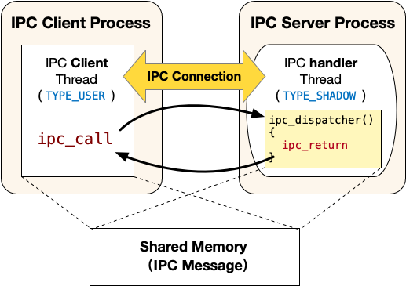
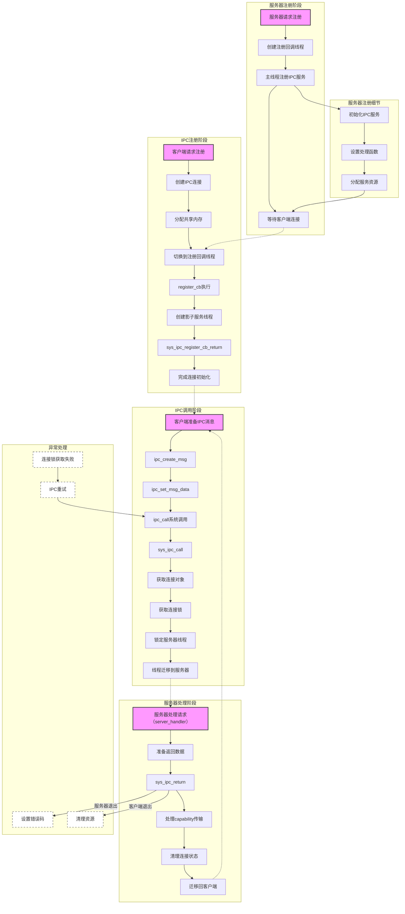

# 目录

- [进程间通信（IPC）](#进程间通信ipc)
- [IPC服务端注册](#ipc服务端注册)
  - [创建Client注册回调线程](#创建client注册回调线程)
  - [通过系统调用注册Server端](#通过系统调用注册server端)
- [IPC客户端注册](#ipc客户端注册)
  - [外层代码与整体逻辑](#外层代码与整体逻辑)
  - [客户端注册的syscall](#客户端注册的syscall)
  - [注册回调函数](#注册回调函数)
- [IPC Call](#ipc-call)
  - [向共享内存填充数据](#向共享内存填充数据)
  - [ipc_call](#ipc_call)
- [IPC Return](#ipc-return)
- [逻辑流程图](#逻辑流程图)

# 进程间通信（IPC）

 本节内容讲解ChCore关于进程间通信（IPC）部分的源码

教材为我们讲解了IPC机制的历史演化：从简单IPC机制到共享内存/内核辅助，再到后来的LRPC，L4等进程间通信等模型。而ChCore的设计则是"择优取之"：

- **消息传递与通知**：基于LRPC的迁移线程技术+L4微内核的直接进程切换技术
- **数据传输**：基于用户态共享内存

整体上看，便是将IPC的两端进程分为Client和Server，注册IPC服务后通过能力组机制建立连接，之后的通信过程则通过syscall来进行，而具体实现则通过上述机制



下面以一次完整的IPC注册-调用的过程，来讲解IPC源码的设计与其机制的实现

## IPC服务端注册

要使用IPC功能，首先需要进行服务器端的注册。对于扮演服务器端的进程来说，它需要调用  `ipc_register_server` 来声明自己为IPC的服务器端。先来看它的API接口：

```c
int ipc_register_server(server_handler server_handler,
                       void *(*client_register_handler)(void *))
```

其接受两个参数，分别是两个函数，其作用为

- `client_register_handler` ：为服务端提供的用于注册的回调函数，用于处理client注册。例如校验发出注册请求的client是否具有相应的capability等
- `server_handler` ：服务器端的服务回调函数，在成功注册之后处理LRPC调用，也就是处理迁移线程模型之中，服务器端提供的"被迁移的"代码段

这里的 server_handler 定义如下：

```c
typedef void (*server_handler)(
    void *shm_ptr,              // 共享内存的起始地址
    unsigned int max_data_len,   // 共享内存的总长度
    unsigned int send_cap_num,   // 客户端发送的capability数量
    badge_t client_badge        // 客户端的身份标识
);
```

然后再来看注册函数的代码：

```c
int ipc_register_server(server_handler server_handler,
                        void *(*client_register_handler)(void *))
{
        return ipc_register_server_with_destructor(
                server_handler, client_register_handler, DEFAULT_DESTRUCTOR);
}

/*
 * Currently, a server thread can only invoke this interface once.
 * But, a server can use another thread to register a new service.
 */
int ipc_register_server_with_destructor(server_handler server_handler,
                                        void *(*client_register_handler)(void *),
                                        server_destructor server_destructor)
{
        cap_t register_cb_thread_cap;
        int ret;

/*
 * Create a passive thread for handling IPC registration.
 * - run after a client wants to register
 * - be responsible for initializing the ipc connection
 */
#define ARG_SET_BY_KERNEL 0
        pthread_t handler_tid;
        register_cb_thread_cap =
                chcore_pthread_create_register_cb(&handler_tid,
                                                  NULL,
                                                  client_register_handler,
                                                  (void *)ARG_SET_BY_KERNEL);
        BUG_ON(register_cb_thread_cap < 0);
        /*
         * Kernel will pass server_handler as the argument for the
         * register_cb_thread.
         */
        ret = usys_register_server((unsigned long)server_handler,
                                   (unsigned long)register_cb_thread_cap,
                                   (unsigned long)server_destructor);
        if (ret != 0) {
                printf("%s failed (retval is %d)\n", __func__, ret);
        }
        return ret;
}
```

此处做了一个带destructor的包装，不过这里传入的默认的destructor是个NULL，暂时先不用管

这里实际上做了两件事，调用了两个函数：

- 创建Client注册回调线程：通过 `chcore_pthread_create_register_cb` 函数实现，返回值为创造的线程的能力
  - 该线程是被动线程，负责处理Client端端IPC注册请求
  - 线程类型为 `TYPE_REGISTER` ，平时不会被调度执行
  - 只有当IPC客户端需要注册时该线程才运行，负责初始化IPC连接
- 通过系统调用注册Server端：即 `usys_register_server` 函数，它实际上就是系统调用

下面分别展开讲解

### 创建Client注册回调线程

核心便是 `chcore_pthread_create_register_cb` 函数，源代码200多行这里就不放了，主要做的还是创建线程那一套：

- 分配线程栈空间
- 设置线程TLS
- 设置线程的回调特性
- 将线程添加到线程链表

关键便在于第三点，我们将回调函数作为参数传入了 `chcore_pthread_create_register_cb` ，而它直接被设置为新线程的entry：

```c
struct thread_args _args;
_args.cap_group_cap = 0;  // SELF_CAP_GROUP
_args.stack = (unsigned long)stack;
// 关键：注册回调线程直接使用entry作为入口点
_args.pc = (type != TYPE_USER ? (unsigned long)entry : 
           (unsigned long)(c11 ? start_c11 : start));
_args.arg = (type != TYPE_USER ? (unsigned long)arg : (unsigned long)args);
_args.prio = attr._a_sched? attr._a_prio: CHILD_THREAD_PRIO;
_args.tls = (unsigned long)TP_ADJ(new);
_args.type = type;
_args.clear_child_tid = (int *)&__thread_list_lock;

ret = new->tid = usys_create_thread((unsigned long)&_args);
```

忘了这是什么东西？回忆一下结构体组成即可：

```c
struct thread_args {
        /* specify the cap_group in which the new thread will be created */
        cap_t cap_group_cap;
        vaddr_t stack;
        vaddr_t pc;
        unsigned long arg;
        vaddr_t tls;
        unsigned int prio;
        unsigned int type;
        int *clear_child_tid;
};
```

随后便用传入的参数通过系统调用创建线程了

### 通过系统调用注册Server端

直接看 `usys_register_server` ：

```c
int usys_register_server(unsigned long callback,
                         cap_t register_thread_cap,
                         unsigned long destructor)
{
        return chcore_syscall3(CHCORE_SYS_register_server,
                               callback,
                               register_thread_cap,
                               destructor);
}
```

顺藤摸瓜找到真正被调用的syscall `sys_register_server` ：

```c
int sys_register_server(unsigned long ipc_routine, cap_t register_thread_cap,
                        unsigned long destructor)
{
        return register_server(
                current_thread, ipc_routine, register_thread_cap, destructor);
}

static int register_server(struct thread *server, unsigned long ipc_routine,
                           cap_t register_thread_cap, unsigned long destructor)
```

这里已经嵌套多层了，注意各个参数：

- `server` ：代表服务器线程，在这里即为 `current_thread` ，指的是服务器进程端的主线程（可以参考Lab文档）
- `ipc_routine` ：服务回调函数，即为前面的 `server_handler`
- `register_thread_cap` ：注册回调线程的能力
- `destructor` ：析构函数，这里还是null

接下来就看看这个函数做了什么：

```c
/**
 * @param server 要注册为IPC服务器的线程
 * @param ipc_routine IPC服务例程的入口点地址
 * @param register_thread_cap 注册回调线程的capability
 * @param destructor 连接关闭时的清理函数地址
 * @return int 0表示成功，负值表示错误码
 */
static int register_server(struct thread *server, unsigned long ipc_routine,
                           cap_t register_thread_cap, unsigned long destructor)
{
        struct ipc_server_config *config;
        struct thread *register_cb_thread;
        struct ipc_server_register_cb_config *register_cb_config;

        /* 确保服务器线程存在 */
        BUG_ON(server == NULL);
        
        /* 检查服务器线程是否已经注册过IPC服务 */
        if (server->general_ipc_config != NULL) {
                kdebug("A server thread can only invoke **register_server** once!\n");
                return -EINVAL;
        }

        /*
         * 获取并验证注册回调线程
         * 该线程用于处理客户端的注册请求，必须是TYPE_REGISTER类型
         */
        register_cb_thread =
                obj_get(current_cap_group, register_thread_cap, TYPE_THREAD);
        if (!register_cb_thread) {
                kdebug("A register_cb_thread is required.\n");
                return -ECAPBILITY;
        }

        /* 验证回调线程类型 */
        if (register_cb_thread->thread_ctx->type != TYPE_REGISTER) {
                kdebug("The register_cb_thread should be TYPE_REGISTER!\n");
                obj_put(register_cb_thread);
                return -EINVAL;
        }

        /* 为服务器分配配置结构 */
        config = kmalloc(sizeof(*config));
        if (!config) {
                obj_put(register_cb_thread);
                return -ENOMEM;
        }

        /*
         * 设置IPC服务例程入口点
         * 注：不检查地址合法性，如果地址非法服务器会自行终止
         */
        config->declared_ipc_routine_entry = ipc_routine;

        /* 记录注册回调线程 */
        config->register_cb_thread = register_cb_thread;

        /* 为注册回调线程分配配置结构 */
        register_cb_config = kmalloc(sizeof(*register_cb_config));
        if (!register_cb_config) {
                kfree(config);
                obj_put(register_cb_thread);
                return -ENOMEM;
        }
        register_cb_thread->general_ipc_config = register_cb_config;

        /*
         * 初始化注册锁
         * 该锁用于确保同一时间只有一个客户端可以进行注册
         * 即注册过程是串行的，避免并发注册可能带来的问题
         */
        lock_init(&register_cb_config->register_lock);

        /* 
         * 记录注册回调线程的关键信息
         * 包括：入口点地址(PC)、初始栈指针(SP)和析构函数
         */
        register_cb_config->register_cb_entry =
                arch_get_thread_next_ip(register_cb_thread);
        register_cb_config->register_cb_stack =
                arch_get_thread_stack(register_cb_thread);
        register_cb_config->destructor = destructor;
        obj_put(register_cb_thread);

#if defined(CHCORE_ARCH_AARCH64)
        /* 
         * ARM架构需要内存屏障
         * 确保在设置server->general_ipc_config之前
         * 所有配置相关的数据（如register_lock）都已经正确初始化并可见
         */
        smp_mb();
#else
        /* x86等使用TSO内存模型的架构不需要内存屏障 */
#endif

        /*
         * 最后一步：设置服务器的IPC配置
         * 这个字段同时也标志着该服务器线程已声明IPC服务
         * 只有设置了这个字段，服务才算真正就绪
         */
        server->general_ipc_config = config;

        return 0;
}
```

注册的过程就是配置 `config` ，这里一共配置了两个线程的 `config` ，分别是主线程和注册回调线程。看看结构体的成员：

```c
/**
 * 当服务器线程调用"register_server"时会创建此配置。
 * 该线程在服务器进程中声明IPC服务，并对客户端可见。
 * 客户端可以通过"register_client"与此服务器线程建立连接。
 */
struct ipc_server_config {
        /**
         * 这个线程专门用于处理新客户端的注册请求
         * 一个服务器只能有一个注册回调线程
         * 该线程会被阻塞直到有新的客户端请求注册
         */
        struct thread *register_cb_thread;

        /**
         * 记录服务器提供的IPC处理函数的地址
         * 当客户端发起IPC请求时，处理线程会跳转到此地址执行
         * 这个地址在服务器注册时由服务器线程提供
         */
        unsigned long declared_ipc_routine_entry;
};

/**
 * 存储处理客户端注册请求的线程的相关信息
 * 这个线程专门用于处理IPC注册过程
 */
struct ipc_server_register_cb_config {
        /**
         * 用于序列化客户端的注册请求
         * 确保同一时间只处理一个客户端的注册
         * 防止并发注册可能导致的竞态条件
         */
        struct lock register_lock;

        /**
         * 记录处理注册请求的函数地址
         * 当有新的注册请求时，线程从这个地址开始执行
         */
        vaddr_t register_cb_entry;

        /* 记录线程的栈顶地址 */
        vaddr_t register_cb_stack;

        /**
         * 当连接被关闭时调用的清理函数
         * 用于释放连接相关的资源
         */
        vaddr_t destructor;

        /**
         * 以下三个字段用于临时存储正在建立的连接相关的capability
         * 这些字段只在连接建立过程中有效
         */
        /* 客户端中的连接capability */
        cap_t conn_cap_in_client;
        /* 服务器中的连接capability（当前未使用，预留给未来扩展）*/
        cap_t conn_cap_in_server;
        /* 服务器中的共享内存capability */
        cap_t shm_cap_in_server;
};
```

对服务器主线程来说，注册的过程为其config配置了注册回调线程和服务线程的入口函数，即前面的 server_handler ；对注册回调线程来说，它需要保存自己的PC和SP等信息，为后面的线程迁移做准备。最后处理TLB，并设置server主线程的相应字段，结束注册过程

这时候Server端注册已经完成，下一步是注册客户端并建立IPC连接

## IPC客户端注册

### 外层代码与整体逻辑

上述注册服务端的操作皆在服务器进程上完成，而之后则进行IPC的客户端注册与连接，是在IPC客户端线程上执行函数  完成的，我们先看源码：

```c
/**
 * @brief 注册IPC客户端
 * 
 * 该函数负责将当前线程注册为指定服务器的IPC客户端。
 * 注册过程包括：创建共享内存、建立连接、初始化IPC结构。
 * 一个客户端线程可以多次注册，与不同的服务器建立连接。
 *
 * @param server_thread_cap 目标服务器线程的capability
 * @return ipc_struct_t* 成功返回IPC结构体指针，失败返回NULL
 * @note 返回的结构体是从堆上分配的，使用完需要调用者释放
 */
ipc_struct_t *ipc_register_client(cap_t server_thread_cap)
{
        /* 连接的capability */
        cap_t conn_cap;
        /* 客户端IPC结构体 */
        ipc_struct_t *client_ipc_struct;
        /* 共享内存配置 */
        struct client_shm_config shm_config;
        /* 共享内存的capability */
        cap_t shm_cap;

        /* 为IPC结构体分配内存 */
        client_ipc_struct = malloc(sizeof(ipc_struct_t));
        if (client_ipc_struct == NULL) {
                return NULL;
        }

        /*
         * 在向服务器注册之前，客户端需要先分配共享内存
         * 这块内存后续会与服务器共享
         *
         * 注意：这里使用PMO_DATA而不是PMO_SHM的原因是：
         * - 当前IPC共享内存(IPC_PER_SHM_SIZE)只有一页大小
         * - 在这种情况下PMO_DATA更加高效
         *
         * 如果将来共享内存需要更大，可以切换回PMO_SHM
         * 两种类型都经过测试，都能正常工作
         */
        shm_cap = usys_create_pmo(IPC_PER_SHM_SIZE, PMO_DATA);
        if (shm_cap < 0) {
                printf("usys_create_pmo ret %d\n", shm_cap);
                goto out_free_client_ipc_struct;
        }

        /* 配置共享内存参数 */
        shm_config.shm_cap = shm_cap;
        shm_config.shm_addr = chcore_alloc_vaddr(IPC_PER_SHM_SIZE);

        /* 循环尝试注册，直到成功或出错 */
        while (1) {
                /* 向服务器发起注册请求 */
                conn_cap = usys_register_client(server_thread_cap,
                                                (unsigned long)&shm_config);

                if (conn_cap == -EIPCRETRY) {
                        /* 
                         * 服务器IPC可能还未就绪
                         * 让出CPU并重试
                         */
                        usys_yield();
                } else if (conn_cap < 0) {
                        /* 注册失败，打印错误信息 */
                        printf("client: %s failed (return %d), server_thread_cap is %d\n",
                               __func__,
                               conn_cap,
                               server_thread_cap);
                        goto out_free_vaddr;
                } else {
                        /* 注册成功，跳出循环 */
                        break;
                }
        }

        /* 初始化IPC结构体 */
        client_ipc_struct->lock = 0;                        // 初始化锁
        client_ipc_struct->shared_buf = shm_config.shm_addr;// 设置共享内存地址
        client_ipc_struct->shared_buf_len = IPC_PER_SHM_SIZE;// 设置共享内存大小
        client_ipc_struct->conn_cap = conn_cap;             // 保存连接capability

        return client_ipc_struct;

        /* 错误处理路径 */
out_free_vaddr:
        /* 撤销共享内存capability并释放虚拟地址 */
        usys_revoke_cap(shm_cap, false);
        chcore_free_vaddr(shm_config.shm_addr, IPC_PER_SHM_SIZE);

out_free_client_ipc_struct:
        /* 释放IPC结构体 */
        free(client_ipc_struct);

        return NULL;
}
```

这部分要干的活就多了：

- 通过syscall申请一块共享内存
- 执行另一个syscall，完成客户端共享内存的映射，这里还会进入之前创建好的注册回调线程，创建服务线程，处理服务端的相应信息
- 最后设置IPC结构体的字段并返回之

和之前服务器端的注册函数一样，这里的 `usys_create_pmo` 和 `usys_register_client` 也是系统调用的一层包装，我们需要重点关注的是后者，它将进一步涉及到注册回调线程的相关操作

### 客户端注册的syscall

源码如下所示，可以参考注释理解函数内容

```c
/**
 * @brief 注册IPC客户端的系统调用
 * 
 * 该函数处理客户端的IPC注册请求，建立客户端与服务器之间的IPC连接。
 * 整个注册过程包括：共享内存设置、连接创建、线程迁移等步骤。
 *
 * @param server_cap 服务器线程的capability
 * @param shm_config_ptr 指向用户空间共享内存配置的指针
 * @return 成功返回连接的capability，失败返回负数错误码
 */
cap_t sys_register_client(cap_t server_cap, unsigned long shm_config_ptr)
{
        struct thread *client;
        struct thread *server;

        /* 
         * 共享内存配置结构体
         * 注：实际无需初始化，但fbinfer静态分析工具会因无法识别copy_from_user而报警
         */
        struct client_shm_config shm_config = {0};
        int r;
        struct client_connection_result res;

        /* 获取当前线程作为客户端 */
        client = current_thread;

        /* 通过capability获取服务器线程对象 */
        server = obj_get(current_cap_group, server_cap, TYPE_THREAD);
        if (!server) {
                r = -ECAPBILITY;
                goto out_fail;
        }

        /* 获取服务器的IPC配置 */
        server_config =
                (struct ipc_server_config *)(server->general_ipc_config);
        if (!server_config) {
                /* 服务器未完成IPC初始化 */
                r = -EIPCRETRY;
                goto out_fail;
        }

        /*
         * 首先定位注册回调线程
         * 之后会直接将控制流转移给该线程以完成注册
         *
         * 完整的注册流程：
         * 客户端线程 -> 服务器注册回调线程 -> 客户端线程
         */
        register_cb_thread = server_config->register_cb_thread;
        register_cb_config =
                (struct ipc_server_register_cb_config
                         *)(register_cb_thread->general_ipc_config);

        /* 
         * 获取注册锁以避免并发注册
         *
         * 使用try_lock而不是lock的原因：
         * ChCore不支持互斥锁，unlock操作由另一个线程完成
         * 如果使用lock可能导致死锁
         */
        if (try_lock(&register_cb_config->register_lock) != 0) {
                r = -EIPCRETRY;
                goto out_fail;
        }

        /* 在访问用户空间数据前验证地址合法性 */
        if (check_user_addr_range(shm_config_ptr, sizeof(shm_config) != 0)) {
                r = -EINVAL;
                goto out_fail_unlock;
        }

        /* 从用户空间复制共享内存配置 */
        r = copy_from_user((void *)&shm_config,
                           (void *)shm_config_ptr,
                           sizeof(shm_config));
        if (r) {
                r = -EINVAL;
                goto out_fail_unlock;
        }

        /* 在当前cap组中映射共享内存PMO */
        r = map_pmo_in_current_cap_group(
                shm_config.shm_cap, shm_config.shm_addr, VMR_READ | VMR_WRITE);

        if (r != 0) {
                goto out_fail_unlock;
        }

        /* 创建IPC连接对象 */
        r = create_connection(
                client, server, shm_config.shm_cap, shm_config.shm_addr, &res);

        if (r != 0) {
                goto out_fail_unlock;
        }

        /* 记录客户端进程的连接capability */
        register_cb_config->conn_cap_in_client = res.client_conn_cap;
        register_cb_config->conn_cap_in_server = res.server_conn_cap;
        /* 记录当前连接的服务器端共享内存capability */
        register_cb_config->shm_cap_in_server = res.server_shm_cap;

        /* 将当前线程标记为阻塞状态 */
        thread_set_ts_blocking(current_thread);

        /* 设置目标线程的栈指针、程序计数器和参数 */
        arch_set_thread_stack(register_cb_thread,
                              register_cb_config->register_cb_stack);
        arch_set_thread_next_ip(register_cb_thread,
                                register_cb_config->register_cb_entry);
        arch_set_thread_arg0(register_cb_thread,
                             server_config->declared_ipc_routine_entry);
        obj_put(server);

        /* 传递调度上下文 */
        register_cb_thread->thread_ctx->sc = current_thread->thread_ctx->sc;

        /* 成功后：切换到服务器的回调线程 */
        sched_to_thread(register_cb_thread);

        /* 永远不会返回到这里 */
        BUG_ON(1);

        /* 错误处理路径 */
out_fail_unlock:
        /* 解锁注册锁 */
        unlock(&register_cb_config->register_lock);
out_fail: /* 可能返回EAGAIN */
        /* 清理服务器线程对象引用 */
        if (server)
                obj_put(server);
        return r;
}
```

这个注册函数的大体流程即为

- 在客户端映射共享内存
  - 从当前thread的 `cap_group` 里面找到传入的 `server_cap` 对应的slot，进而得到server线程对象
  - 从server获取它的 `ipc_config`
  - 拿锁，避免并发问题
  - 检查client声明的共享内存地址，并将之拷贝到内核态，再建立共享内存上的映射
- 创建 `ipc_connection` 对象，并把cap给到server和client
- 切换到注册回调线程
  - 设置好调用参数，栈寄存器，异常处理寄存器
    - 这一部分用到了注册server时配置好的config
  - 调用sched切换控制权给server的注册回调线程，并进入设置好的注册回调函数

关于创建 `ipc_connection` 的过程，可以参考 `create_connection` 函数，配置好的结构体如下：

```c
struct ipc_connection *conn = {
        /*
         * 当前使用此连接的客户端线程
         * 在create_connection时设置为发起注册的客户端线程
         */
        .current_client_thread = client_thread,

        /*
         * 服务器处理线程
         * 在create_connection时为NULL
         * 将在sys_ipc_register_cb_return中由服务器设置
         * 这里还没设置
         */
        .server_handler_thread = NULL,

        /*
         * 客户端标识信息
         * badge: 用于在IPC过程中标识不同的客户端进程
         * pid: 客户端进程ID，用于资源管理
         */
        .client_badge = current_cap_group->badge,
        .client_pid = current_cap_group->pid,

        /*
         * 共享内存配置
         * 包含了客户端和服务器端的地址和capability信息
         */
        .shm = {
                .client_shm_uaddr = shm_addr_client,    // 客户端映射地址
                .server_shm_uaddr = 0,                  // 服务器映射地址（尚未设置）
                .shm_size = shm_size,                   // 共享内存大小
                .shm_cap_in_client = shm_cap_client,    // 客户端的共享内存capability
                .shm_cap_in_server = shm_cap_server     // 服务器的共享内存capability
        },

        /*
         * 资源回收相关字段
         */
        .ownership = LOCK_INIT_VAL,                    // 初始化的锁
        .conn_cap_in_client = conn_cap,                // 客户端的连接capability
        .conn_cap_in_server = server_conn_cap,         // 服务器的连接capability
        .state = CONN_INCOME_STOPPED,                  // 初始状态：停止接收

        /*
         * capability传输缓冲区
         * 用于在IPC过程中传输capability
         * 初始状态下都是空的
         */
        .server_cap_buf = {
                [0 ... MAX_CAP_TRANSFER-1] = {
                        .valid = false,
                        .cap = 0,
                        .mask = 0,
                        .rest = 0
                }
        },
        .client_cap_buf = {
                [0 ... MAX_CAP_TRANSFER-1] = {
                        .valid = false,
                        .cap = 0,
                        .mask = 0,
                        .rest = 0
                }
        }
};
```

然后 `sys_register_client` 的历史使命就结束了，它把尚未完成的任务交给了注册回调线程

### 注册回调函数

> 注册回调线程运行的入口函数为主线程调用`ipc_register_server`是提供的client_register_handler参数，一般会使用默认的`DEFAULT_CLIENT_REGISTER_HANDLER`宏定义的入口函数，即定义在`../Thirdparty/musl-libc/src/chcore-port/ipc.c`中的`register_cb`
>

根据Lab文档的指引我们来到 `register_cb` 的地盘，还记得这个 `client_register_handler` 是干啥的不？它在服务端主线程创建注册回调线程的时候被设置为了注册回调线程的入口。那么在注册客户端函数将线程切换过来的时候（注意这里用的切换函数是 `sched_to_thread` ），便会执行 `register_cb` 的代码

那么它又会肩负怎样的IPC使命呢？且看代码（注意现在已经是server端进程下的注册回调线程了）：

```c
/*
 * @param ipc_handler 服务器的IPC处理函数，就是我们之前传进来的server_handler
 * 这里我们需要用它来注册server进程下的服务线程，用于之后具体处理client发来的IPC请求
 * @return void* 总是返回NULL
 */
void *register_cb(void *ipc_handler)
{
        /* 服务器处理线程的capability */
        cap_t server_thread_cap = 0;
        /* 服务器端共享内存地址 */
        unsigned long shm_addr;

        /* 为服务器分配共享内存的虚拟地址空间 */
        shm_addr = chcore_alloc_vaddr(IPC_PER_SHM_SIZE);

        /*
         * 创建服务器处理线程（影子线程）
         * 这个线程将负责处理来自该客户端的所有IPC请求
         */
        pthread_t handler_tid;
        server_thread_cap = chcore_pthread_create_shadow(
                &handler_tid,    // 存储线程ID
                NULL,           // 线程属性（使用默认值）
                ipc_handler,    // IPC处理函数
                (void *)NO_ARG  // 无参数
        );
        BUG_ON(server_thread_cap < 0);

        /* 调用系统调用完成注册过程 */
#ifndef CHCORE_ARCH_X86_64
        ipc_register_cb_return(
                server_thread_cap,
                (unsigned long)ipc_shadow_thread_exit_routine,
                shm_addr
        );
#else
        ipc_register_cb_return(
                server_thread_cap,
                (unsigned long)ipc_shadow_thread_exit_routine_naked,
                shm_addr
        );
#endif

        return NULL;
}
```

创建线程的部分和之前如出一辙，只是注意这里的服务线程同样是没有调度上下文的影子线程

忘记什么是服务线程了？回看Lab文档：

> ChCore的IPC接口不是传统的send/recv接口。其更像客户端/服务器模型，其中IPC请求接收者是服务器，而IPC请求发送者是客户端。 服务器进程中包含三类线程:
>
> - 主线程：该线程与普通的线程一样，类型为`TYPE_USER`。该线程会调用`ipc_register_server`将自己声明为一个IPC的服务器进程，调用的时候会提供两个参数:服务连接请求的函数client_register_handler和服务真正IPC请求的函数server_handler（即图中的`ipc_dispatcher`），调用该函数会创建一个注册回调线程;
> - 注册回调线程：该线程的入口函数为上文提到的client_register_handler，类型为`TYPE_REGISTER`。正常情况下该线程不会被调度执行，仅当有Client发起建立IPC连接的请求时，该线程运行并执行client_register_handler，为请求建立连接的Client创建一个服务线程（即图中的IPC handler thread）并在服务器进程的虚拟地址空间中分配一个可以用来映射共享内存的虚拟地址。
> - 服务线程：当Client发起建立IPC连接请求时由注册回调线程创建，入口函数为上文提到的server_handler，类型为`TYPE_SHADOW`。正常下该线程不会被调度执行，仅当有Client端线程使用`ipc_call`发起IPC请求时，该线程运行并执行server_handler（即图中的`ipc_dispatcher`），执行结束之后会调用`ipc_return`回到Client端发起IPC请求的线程。

还记得 `sys_register_client` 尚未完成的历史使命吗？现在共享内存还只是在client端做好了映射，server端目前仅有一个申请好的虚拟地址；同时 `struct ipc_connection` 也还有部分关于server的字段没有填写，于是这里的 `ipc_register_cb_return` 将接过IPC的接力棒：

```c
/**
 * 向内核发起注册完成请求，该函数是用户态库函数，将注册完成请求传递给内核。
 * 在注册回调线程创建完服务器处理线程后调用。
 *
 * @param server_thread_cap 服务器处理线程的capability
 * @param server_thread_exit_routine 处理线程的退出例程
 * @param server_shm_addr 服务器端共享内存地址
 */
void ipc_register_cb_return(
        cap_t server_thread_cap,
        unsigned long server_thread_exit_routine,
        unsigned long server_shm_addr)
{
        /* 直接调用系统调用完成注册 */
        usys_ipc_register_cb_return(
                server_thread_cap,
                server_thread_exit_routine,
                server_shm_addr
        );
}
```

虚晃一枪，原来是syscall套壳，我们继续前进：

```c
/**
 * 该函数在内核中完成IPC注册的最后阶段，包括：
 * 1. 设置服务器端共享内存
 * 2. 初始化服务器处理线程
 * 3. 完成连接建立
 * 4. 返回客户端
 *
 * @param server_handler_thread_cap 服务器处理线程的capability
 * @param server_thread_exit_routine 处理线程的退出例程地址
 * @param server_shm_addr 服务器端共享内存地址
 * @return 成功返回0，失败返回负数错误码
 */
int sys_ipc_register_cb_return(
        cap_t server_handler_thread_cap,
        unsigned long server_thread_exit_routine,
        unsigned long server_shm_addr)
{
        struct ipc_server_register_cb_config *config;
        struct ipc_connection *conn;
        struct thread *client_thread;
        struct thread *ipc_server_handler_thread;
        struct ipc_server_handler_config *handler_config;
        int r = -ECAPBILITY;

        /* 获取当前线程（注册回调线程）的IPC配置 */
        config = (struct ipc_server_register_cb_config *)
                         current_thread->general_ipc_config;
        if (!config)
                goto out_fail;

        /* 获取IPC连接对象 */
        conn = obj_get(
                current_cap_group,
                config->conn_cap_in_server,
                TYPE_CONNECTION
        );
        if (!conn)
                goto out_fail;

        /* 获取服务器处理线程（即服务线程）对象 */
        ipc_server_handler_thread = (struct thread *)obj_get(
                current_cap_group,
                server_handler_thread_cap,
                TYPE_THREAD
        );
        if (!ipc_server_handler_thread)
                goto out_fail_put_conn;

        /* 在服务器地址空间映射共享内存 */
        r = map_pmo_in_current_cap_group(
                config->shm_cap_in_server,
                server_shm_addr,
                VMR_READ | VMR_WRITE
        );
        if (r != 0)
                goto out_fail_put_thread;

        /* 获取发起注册的客户端线程 */
        client_thread = conn->current_client_thread;
        /* 设置客户端的返回值（连接capability） */
        arch_set_thread_return(client_thread, config->conn_cap_in_client);

        /*
         * 初始化服务线程的IPC配置
         * 如果配置已存在（线程重用），则跳过初始化
         */
        if (!ipc_server_handler_thread->general_ipc_config) {
                handler_config = (struct ipc_server_handler_config *)kmalloc(
                        sizeof(*handler_config));
                if (!handler_config) {
                        r = -ENOMEM;
                        goto out_fail_put_thread;
                }
                ipc_server_handler_thread->general_ipc_config = handler_config;
                lock_init(&handler_config->ipc_lock);

                /* 记录处理线程的执行上下文，包括PC和SP等 */
                handler_config->ipc_routine_entry =
                        arch_get_thread_next_ip(ipc_server_handler_thread);
                handler_config->ipc_routine_stack =
                        arch_get_thread_stack(ipc_server_handler_thread);
                handler_config->ipc_exit_routine_entry =
                        server_thread_exit_routine;
                handler_config->destructor = config->destructor;
        }
        obj_put(ipc_server_handler_thread);

        /* 更新连接对象的服务器信息 */
        conn->shm.server_shm_uaddr = server_shm_addr;
        conn->server_handler_thread = ipc_server_handler_thread;
        conn->state = CONN_VALID;  // 标记连接为有效
        conn->current_client_thread = NULL;
        conn->conn_cap_in_client = config->conn_cap_in_client;
        conn->conn_cap_in_server = config->conn_cap_in_server;
        obj_put(conn);

        thread_set_ts_waiting(current_thread);
        unlock(&config->register_lock);
        current_thread->thread_ctx->sc = NULL;
        sched_to_thread(client_thread);

        /* 错误处理 */
out_fail_put_thread:
        obj_put(ipc_server_handler_thread);
out_fail_put_conn:
        obj_put(conn);
out_fail:
        return r;
}
```

最后返回一个连接信息的 `ipc_struct` ，即IPC控制块（后文的ICB），并将线程切换回client线程，结束注册过程

总体来说，干了三件事：

- 完成共享内存的创建以及在两边进程的映射
- 创建存储信息的相关结构体并完善其内容
- 通过注册回调线程创建了第一个待命的服务线程

至此IPC的准备工作结束，下面开始正式的 `ipc_call`

## IPC Call

### 向共享内存填充数据

首先，client会调用 `ipc_create_msg` 和 `ipc_set_msg_data` 向共享内存（前面注册时候和server"沟通完毕"）填充数据，之后将前面注册过程的 `ipc_struct` 和 `ipc_create_msg` 得到的msg作为参数，调用 `ipc_call`

向共享内存填写数据的代码如下：

```c
// 下面的函数是在创建需要发送的消息
ipc_msg_t *ipc_create_msg(ipc_struct_t *icb, unsigned int data_len)
{
        /* 调用完整版本，cap数量为0 */
        return ipc_create_msg_with_cap(icb, data_len, 0);
}

/**
 * @param icb IPC控制块
 * @param data_len 消息数据长度
 * @param send_cap_num 要发送的capability数量
 * @return ipc_msg_t* 创建的IPC消息，失败则退出程序
 */
ipc_msg_t *ipc_create_msg_with_cap(ipc_struct_t *icb, unsigned int data_len,
                          unsigned int send_cap_num)
{
        /* 编译时检查：确保消息结构体不会超过缓冲区大小 */
        BUILD_BUG_ON(sizeof(ipc_msg_t) > SERVER_IPC_MSG_BUF_SIZE);
        ipc_msg_t *ipc_msg;
        unsigned long buf_len;

        if (unlikely(icb->conn_cap == 0)) {
                if (connect_system_server(icb) != 0) {
                        printf("connect ipc server failed!\n");
                        exit(-1);
                }
        }

        /* 获取IPC锁，保护消息设置过程 */
        chcore_spin_lock(&(icb->lock));
        buf_len = icb->shared_buf_len;

        if (data_len > buf_len) {
                printf("%s failed: too long msg (the usable shm size is 0x%lx)\n",
                       __func__,
                       buf_len);
                goto out_unlock;
        }

        /* 分配IPC消息结构体 */
        ipc_msg = (ipc_msg_t *)malloc(sizeof(ipc_msg_t));
        if (!ipc_msg) {
                goto out_unlock;
        }

        /* 初始化IPC消息 */
        ipc_msg->data_ptr = SHM_PTR_TO_CUSTOM_DATA_PTR(icb->shared_buf);  // 设置数据指针
        ipc_msg->max_data_len = buf_len;                                   // 设置最大长度
        ipc_msg->send_cap_num = send_cap_num;                             // 设置capability数量
        ipc_msg->response_hdr = (struct ipc_response_hdr *)icb->shared_buf;// 设置响应头
        ipc_msg->icb = icb;                                               // 关联IPC控制块
        ipc_msg->thread_type = THREAD_CLIENT;                             // 标记为客户端消息
                  
        return ipc_msg;

out_unlock:
        /* 错误处理：释放锁并退出 */
        chcore_spin_unlock(&(icb->lock));
        printf("ipc create msg failed!\n");
        exit(-1);
}

// 将消息填写到共享内存里
/**
 * 该函数将数据写入到IPC消息的共享内存中。
 * 消息结构示意图：
 * 
 * 共享内存布局：
 * +------------------------+
 * |         响应头          |  <-- ipc_msg->response_hdr
 * +------------------------+
 * |         数据区          |  <-- ipc_msg->data_ptr
 * |      (可写入的区域)      |
 * +------------------------+
 *
 * @param ipc_msg IPC消息对象（由ipc_create_msg创建）
 * @param data 要写入的数据
 * @param offset 写入位置的偏移量
 * @param len 要写入的数据长度
 * @return 成功返回0，失败返回-1
 */
int ipc_set_msg_data(ipc_msg_t *ipc_msg, void *data, unsigned int offset,
                     unsigned int len)
{
        /* 
         * 检查是否发生溢出：
         * 1. offset + len < offset：加法溢出
         * 2. offset + len > max_data_len：超出缓冲区范围
         */
        if ((offset + len < offset) || (offset + len > ipc_msg->max_data_len)) {
                printf("%s failed due to overflow.\n", __func__);
                return -1;
        }

        /* 
         * 将数据复制到消息缓冲区
         * ipc_get_msg_data(ipc_msg)：获取数据区起始地址
         * + offset：定位到写入位置
         */
        memcpy(ipc_get_msg_data(ipc_msg) + offset, data, len);
        return 0;
}
```

### ipc_call

整个 `ipc_call` 也是一层系统调用的包装：

```c
long ipc_call(ipc_struct_t *icb, ipc_msg_t *ipc_msg)
{
        long ret;

        /* 按需创建IPC连接 */
        if (unlikely(icb->conn_cap == 0)) {
                if ((ret = connect_system_server(icb)) != 0)
                        return ret;
        }

        /* 
         * 循环尝试发起系统调用
         * 当返回-EIPCRETRY时重试（表示暂时无法获取锁）
         */
        do {
                ret = usys_ipc_call(
                    icb->conn_cap,                         // 连接capability
                    ipc_get_msg_send_cap_num(ipc_msg)     // 要传输的capability数量
                );
        } while (ret == -EIPCRETRY);

        return ret;
}
```

继续前进找到系统调用的实现：

```c
/**
 * @param conn_cap 连接capability
 * @param cap_num 要传输的capability数量
 * @return 调用结果
 */
unsigned long sys_ipc_call(cap_t conn_cap, unsigned int cap_num)
{
        struct ipc_connection *conn;
        int r = 0;

        /* 检查capability数量 */
        if (cap_num > MAX_CAP_TRANSFER) {
                return -EINVAL;
        }

        /* 获取连接对象 */
        conn = obj_get(current_cap_group, conn_cap, TYPE_CONNECTION);
        if (unlikely(!conn)) {
                return -ECAPBILITY;
        }

        /* 尝试获取连接所有权锁 */
        if (try_lock(&conn->ownership) == 0) {
                if (conn->state != CONN_VALID) {
                        unlock(&conn->ownership);
                        obj_put(conn);
                        return -EINVAL;
                }
        } else {
                obj_put(conn);
                r = check_if_exiting();
                return r;
        }
        if ((r = lock_ipc_handler_thread(conn)) != 0)
                goto out_obj_put;

        /* 清空服务器cap缓冲区 */
        for (int i = 0; i < MAX_CAP_TRANSFER; i++) {
                conn->server_cap_buf[i].valid = false;
        }

        /* 
         * 迁移到服务器线程
         * 注意：共享内存在客户端和服务器可能映射到不同地址
         */
        ipc_thread_migrate_to_server(
                conn,                       // 连接对象
                conn->shm.server_shm_uaddr, // 服务器端共享内存地址
                conn->shm.shm_size,         // 共享内存大小
                cap_num                     // capability数量
        );

        BUG("should not reach here\n");

out_obj_put:
        unlock(&conn->ownership);
        obj_put(conn);
        return r;
}
```

整体上就是由cap找到具体的conn对象，随后以此发起线程迁移（LRPC中的技术），可参考Lab文档

> 该系统调用将设置服务器端的服务线程的栈地址、入口地址、各个参数，然后迁移到该服务器端服务线程继续运行。由于当前的客户端线程需要等待服务器端的服务线程处理完毕，因此需要更新其状态为TS_WAITING，且不要加入等待队列
>

```c
static void ipc_thread_migrate_to_server(
        struct ipc_connection *conn,      // IPC连接对象
        unsigned long shm_addr,           // 服务器端共享内存地址
        size_t shm_size,                 // 共享内存大小
        unsigned int cap_num)            // 要传输的capability数量
{
        /* 1. 获取目标线程和配置 */
        struct thread *target = conn->server_handler_thread;
        struct ipc_server_handler_config *handler_config =
                (struct ipc_server_handler_config *)target->general_ipc_config;

        /* 
         * 2. 记录活动连接
         * 因为一个服务器处理线程可能服务多个连接
         * 需要记录当前正在处理哪个连接
         */
        handler_config->active_conn = conn;

        /* 
         * 3. 记录活动客户端线程
         * 因为多个客户端线程可能共享同一个连接
         * 需要记录当前服务的是哪个客户端线程
         */
        conn->current_client_thread = current_thread;

        /* 4. 设置客户端线程状态为阻塞 */
        thread_set_ts_blocking(current_thread);

        /* 
         * 5. 传递调度上下文
         * 服务器线程将使用客户端线程的调度配额
         */
        target->thread_ctx->sc = current_thread->thread_ctx->sc;

        /* 
         * 6. 设置目标线程的执行上下文
         * - 设置栈指针
         * - 设置程序计数器（入口点）
         */
        arch_set_thread_stack(target, handler_config->ipc_routine_stack);
        arch_set_thread_next_ip(target, handler_config->ipc_routine_entry);

        /* 
         * 7. 设置IPC参数
         * arg0: 共享内存地址
         * arg1: 共享内存大小
         * arg2: capability数量
         * arg3: 客户端标识（badge）
         */
        arch_set_thread_arg0(target, shm_addr);
        arch_set_thread_arg1(target, shm_size);
        arch_set_thread_arg2(target, cap_num);
#ifdef CHCORE_OPENTRUSTEE
        /* OpenTrustee环境下的特殊处理 */
        arch_set_thread_arg3(
                target, pid_to_taskid(current_thread->cap, conn->client_badge));
#else
        arch_set_thread_arg3(target, conn->client_badge);
#endif

        /* 8. 设置架构特定的IPC状态 */
        set_thread_arch_spec_state_ipc(target);

        /* 9. 切换到目标线程 */
        sched_to_thread(target);

        /* 到这里说明完蛋了 */
        BUG_ON(1);
}
```

总结一下干了四件事：

- 更新状态为 `TS_WAITING`
- 设置conn为active（避免并发问题）
- 设置A-stack，寄存器
- 调用 `sched_to_thread` 切换控制流

切换到服务线程之后便会执行我们的 `server_handler` ，即LRPC的线程迁移技术中提到的"把代码拉过来执行"中被执行的部分，随后就是server端的处理操作了

## IPC Return

最后，IPC的服务端在操作完成后会使用 `ipc_return` 返回，毕竟这时候还是在server中

- `ipc_return` 会发起 `sys_ipc_return` 系统调用，该系统调用会迁移回到IPC客户端线程继续运行，IPC客户端线程从 `ipc_call` 中返回
- 也就是正常 `return` 需要替换成 `ipc_return`
- 在 `server_handler` 之中，根据req的信息完成dispatch的工作

```c
// ipc server示例：文件系统handler
DEFINE_SERVER_HANDLER(fsm_dispatch)
{
        int ret = 0;
        struct fsm_request *fsm_req;
        bool ret_with_cap = false;

        if (ipc_msg == NULL) {
                ipc_return(ipc_msg, -EINVAL);
        }
        // ...
}
```

```c
/* Server uses **ipc_return** to finish an IPC request */
void ipc_return(ipc_msg_t *ipc_msg, long ret)
{
        if (ipc_msg != NULL) {
                ipc_set_msg_return_cap_num(ipc_msg, 0);
        }
        usys_ipc_return((unsigned long)ret, 0);
}

```

层层抽丝剥茧，来到我们最后的 `sys_ipc_return` ，这个syscall的源码很长，但是主要是在处理edge case。概括的说它主要干了：

- 如果server线程退出，需要回收资源，并设置错误码
- 如果client线程退出，需要区分是普通线程还是影子线程（例如client线程也是ipc调用的server, 即链式ipc调用），普通线程应该立刻回收，触发调度（做正常return的工作），影子线程的话就顺着调用链条，只做控制转移，让上层回收
- 能力等其他资源的清理
- 最后简单 `thread_migrate_to_client(client, ret);` 交换控制权，切换线程，完成整个调用，将ret值传回

带注释的源码如下，感兴趣者可作学习参考：

```c
/**
 * @brief IPC返回系统调用，处理服务器完成IPC请求后返回客户端的过程
 * @param ret 返回给客户端的值
 * @param cap_num 要传输的capability数量
 * @return 成功返回0，失败返回负数错误码
 */
int sys_ipc_return(unsigned long ret, unsigned int cap_num)
{
        struct ipc_server_handler_config *handler_config;
        struct ipc_connection *conn;
        struct thread *client;

        /* 获取当前活动的IPC连接 */
        handler_config = (struct ipc_server_handler_config *)
                                 current_thread->general_ipc_config;
        conn = handler_config->active_conn;

        if (!conn)
                return -EINVAL;

        /*
         * 获取发起此IPC请求的客户端线程
         *
         * 注意：无需将conn->current_client_thread设置为NULL
         * i.e., conn->current_client_thread = NULL.
         */
        client = conn->current_client_thread;

        /* 步骤1：检查服务器处理线程(current_thread)是否正在退出
         *     -> 是：设置server_handler_thread为NULL，然后继续步骤2
         *     -> 否：直接继续步骤2
         */
        if (thread_is_exiting(current_thread)) {
                kdebug("%s:%d Step-1\n", __func__, __LINE__);

                /* 停止接收新的IPC请求 */
                conn->state = CONN_INCOME_STOPPED;

                /* 标记服务器线程为已退出状态 */
                thread_set_exited(current_thread);

                /* 返回错误码给客户端 */
                ret = -ESRCH;
        }

        /* 步骤2：检查客户端线程是否正在退出
         *     -> 是：设置current_client_thread为NULL
         *        然后检查客户端是否为影子线程
         *           -> 否：设置客户端为已退出状态并重新调度
         *           -> 是：返回给客户端（它将在下一次ipc_return时自行回收）
         *     -> 否：正常返回
         */
        if (thread_is_exiting(client)) {
                kdebug("%s:%d Step-2\n", __func__, __LINE__);

                /*
                 * 当前假设连接属于客户端进程
                 * 因此，如果客户端正在退出，则连接也将无效
                 * Currently, a connection is assumed to belong to the client process.
                 */
                conn->state = CONN_INCOME_STOPPED;

                /* 如果客户端不是影子线程，则直接标记为已退出并重新调度
                 * 否则，客户端是链式IPC(A:B:C)中的B，current_thread是C
                 * 因此，C返回给B，之后B会返回给A
                 */
                if (client->thread_ctx->type != TYPE_SHADOW) {
                        kdebug("%s:%d Step-2.0\n", __func__, __LINE__);
                        handler_config->active_conn = NULL;

                        /* 设置服务器线程状态为等待 */
                        thread_set_ts_waiting(current_thread);

                        /* 清除调度上下文 */
                        current_thread->thread_ctx->sc = NULL;

                        /* 释放锁和引用 */
                        unlock(&handler_config->ipc_lock);
                        unlock(&conn->ownership);
                        obj_put(conn);

                        /* 标记客户端为已退出并重新调度 */
                        thread_set_exited(client);
                        sched();
                        eret_to_thread(switch_context());
                        /* 控制流不会到达这里 */
                }
        }

        /* 处理capability传输 */
        if (cap_num != 0) {
                /* 重置客户端capability缓冲区 */
                for (int i = 0; i < MAX_CAP_TRANSFER; i++) {
                        conn->client_cap_buf[i].valid = false;
                }
                /* 从服务器向客户端发送capability */
                int r = ipc_send_cap(current_cap_group,
                                     conn->current_client_thread->cap_group,
                                     conn->server_cap_buf,
                                     conn->client_cap_buf,
                                     0,
                                     cap_num);
                if (r < 0)
                        return r;
        }

        /* IPC即将完成，清除活动连接 */
        handler_config->active_conn = NULL;

        /*
         * 准备返回控制流（调度上下文）
         * 将当前线程状态重新设置为等待
         */
        thread_set_ts_waiting(current_thread);

        /*
         * 影子线程不应再使用客户端的调度上下文
         * 注意：必须在解锁之前将服务器线程的sc设置为NULL
         * 否则，后续的客户端线程可能会在此操作之前转移其sc
         */
        current_thread->thread_ctx->sc = NULL;

        /*
         * 释放IPC锁，表示服务器处理线程可以处理其他请求*/
        unlock(&handler_config->ipc_lock);
        unlock(&conn->ownership);
        obj_put(conn);

        /* 返回到客户端 */
        thread_migrate_to_client(client, ret);

        BUG("should not reach here\n");
        __builtin_unreachable();
}
```

这样便成功返回了Client进程，继续做它该做的事情

## 逻辑流程图



至此，IPC部分的源码解析到此结束，希望能对你的学习有所帮助
