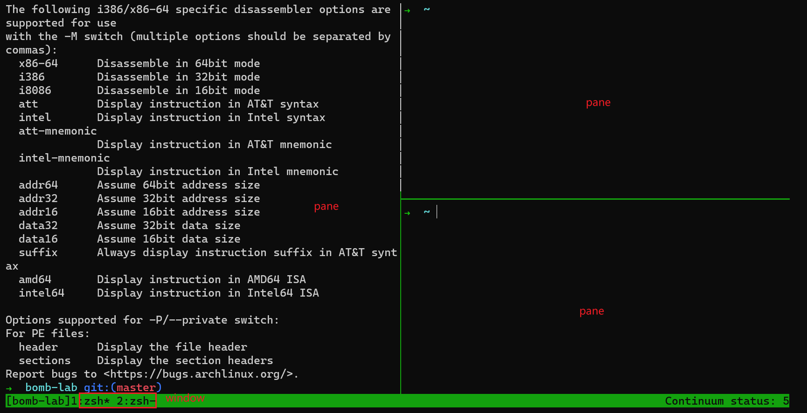

# TMUX

<!-- toc -->

## 简介

如今大部分同学开始使用电脑接触的就是Windows与GUI（图形用户界面）。在GUI下，我们可以通过
桌面和窗口的方式，管理显示器上的二维空间（桌面空间）。许多情况下，桌面空间对于单个应用程序
来说，有些太大了，只使用一个应用程序不能有效地利用显示空间；又或者，我们想要同时处理多个任
务，比如在写文档或者论文时，希望能非常方便地看到自己的参考资料……部分同学可能已经掌握如何使
用分屏以及虚拟桌面来解决这些问题。的确，不论Windows10/11还是macOS抑或是Linux下的桌面环
境，甚至众多基于Android的操作系统，分屏与虚拟桌面已经成为构建高效的GUI工作环境的基本功能。
分屏解决的是如何有效利用桌面空间的问题。通过分屏功能的辅助，我们可以快速将多个应用程序的窗
口紧密排列在桌面空间上，且可以更方便地调整这些窗口所占据的区域，避免自己手动排列带来的混乱
和不便，让我们可以同时使用多个相关的应用程序，最大化利用桌面空间与提高效率。

虚拟桌面则解决的是如何有效隔离多种使用场景的问题，它是分屏功能的进一步衍生。我们经常需要同
时处理几种不同性质的任务，例如，一边在编写文档或论文，一边还可能需要看QQ、微信和回复消息。
如果只有一个桌面空间，要么不时切出和最小化QQ微信的窗口，要么把它们也使用分屏与文档窗口排列
在一起，但这两种使用方式，或多或少都会影响需要专注的文档编写任务。此时，我们可以使用虚拟桌
面。虚拟桌面是在物理桌面空间上“虚拟”出多个互不相干的桌面空间，每个桌面空间内都可以有自己的
窗口布局。虽然同时只能使用一个虚拟桌面，但我们可以在多个虚拟桌面间快速切换。使用虚拟桌面
后，我们可以将比较相关的一类程序的窗口放在同一个虚拟桌面中，其余不相干的程序则放在其他虚拟
桌面中，如此，可以有效减少其他程序对于当前工作任务的干扰，同时又能在多种不同工作环境中快速
切换。

分屏与虚拟桌面有效提高了GUI下的窗口管理效率。但是，窗口和桌面的概念，并非只能局限于GUI中。
利用除了字母数字外的各种字符和颜色，我们同样可以在命令行用户界面（CLI）下“绘制”窗口，相较于
通过命令行参数，窗口这种交互方式对用户更友好，更直观。同样地，在CLI下的窗口中，分屏和虚拟桌
面需要解决的这些效率问题同样是存在的，也一样有着解决这些问题的需求。tmux（terminal
multiplexer）项目则是目前在CLI环境下这些问题的主要解决方案。顾名思义，它是一个“终端多路复用
器”，如果说分屏和虚拟桌面是有效利用GUI中的桌面空间，tmux则主要是有效利用终端中的空间。这里
的终端，可以是GUI下的终端模拟器，比如Windows Terminal，iTerm2等，也可以是运行在命令行模
式下的Linux的显示器空间等等。

## tmux vs 多个终端模拟器窗口

- 同一窗口内部布局自由构建（部分终端模拟器也可实现）
- 统一管理多个窗口、便捷切换（开多个终端容易混淆，不便于随意切换）
- tmux可以在不使用时将进程保持在后台继续运行（detach，而终端模拟器一旦关闭就会杀死其中所有进程）
- tmux还是一个服务器，可以通过网络连接，如果有需要，可以允许其他人通过网络连接到你的
- tmux界面中，实现网络协作（终端模拟器不支持）
- tmux支持高度自定义的配置，且有丰富的插件生态

## Session/Window/Pane

> [!NOTE]
> 在理解了GUI下为什么需要有分屏和虚拟桌面后，类比GUI下的概念，可以很容易地理解tmux中的相关概念。

### Pane

pane相当于GUI下的一个窗口。只不过相较于GUI下窗口可以自行自由移动，也可以使用分屏辅助
排列，CLI下窗口还是基于字符的，所以tmux下的pane只能实现类似于GUI分屏的紧密排列，不能
自由移动，也不能实现pane之间的重叠。

### Window

window则相当于GUI下的虚拟桌面。一个window是一组pane的集合，不同的window拥有独立的pane以及pane的布局，且可以在多个window间通过快捷键快速切换。

### Session

session是tmux特有的概念，它是一组window的集合，代表一个完整的工作环境。一般来说，不
论我们通过显示器、Linux桌面环境下的终端模拟器、Windows或macOS上的终端模拟器+ssh……
等方式访问Linux命令行，首先都是进入一个shell中，而并不能直接进入tmux。因此，在tmux
中，相较于“打开”和“关闭” tmux，我们更常说"attach","detach"到session。attach指的是从当前
运行的shell进入一个tmux session的过程，而detach则是从tmux session离开，回到单个shell的
过程。相较于“打开”和“关闭”，session+attach/detach有下列好处：

- 在同一个终端中，也可以方便切换不同工作环境（这是最基础的功能）
- 避免同一个session中有过多不相干的window，降低切换效率
- detach不是关闭session，detach后，session中运行的所有程序会在后台继续运行，且tmux会负责收集它们产生的输出，我们随时可以重新attach到某一个session，就可以看到其中程序最新的运行情况和历史输出，这对于某些需要长时间后台运行的任务是非常方便的。
- 可以有多个终端同时attach到一个session，搭配tmux的服务器功能，可以实现向他人共享你的工作界面和环境，以及协作工作。

### 常用快捷键与子命令

tmux支持丰富的快捷键，同时，也可以通过tmux命令的一组子命令来与tmux进行交互。事实上，如果研究tmux的配置文件，可以看到其中重要的一项内容就是将快捷键绑定到相应的子命令上。

- 前缀(prefix table)快捷键与根(root table)快捷键
  - 许多CLI应用程序都会定义自己的快捷键。作为更底层的程序，tmux需要尽可能避免自己的快
  - 捷键和上层应用程序的快捷键冲突。前缀键就是为了解决这个问题引入的。
  - 前缀快捷键：需要先按下前缀键（默认是 Ctrl+b ），然后再按下相应的快捷键。
  - Root快捷键：直接按下对应的快捷键，不需要前缀键。这些通常是一些不与通常使用的终端快捷键冲突的键。

- 命令行模式
  - `<prefix>` : ，可以进入tmux的内部命令行。在该命令行中可以直接输入tmux子命令（而不是 tmux `<子命令>` ），可以用于使用未绑定快捷键的命令。

- pane 管理
  - 切换pane： `<prefix>` 方向键，tmux命令版本是 select-pane -[UDLR] ，U代表上，D代表下，L代表左，R代表右。同时只能有一个pane接收输入，利用这个命令可以切换当前接收输入的pane。分割当前pane，创建两个新的pane： `<prefix>"` (上下分割)， `<prefix>%` (左右分割)，tmux命令版本是 split-window (默认是上下分割)， split-window -h (左右分割)。在初始情况下，每个window只有一个占满整个window的pane，使用这个命令可以分割当前接收输入的pane，创建两个pane，类似于GUI下的分屏功能。
  - 关闭pane： `<prefix>` x ，然后按 y 确认。tmux命令版本是 kill-pane 。

- window管理
  - 创建Window： `<prefix>c` ，tmux命令版本是 new-window 。
  - 切换Window： `<prefix>n` (下一个Window)， `<prefix> p` (上一个Window)， `<prefix> l` (最后一个活跃Window)，tmux命令版本是 next-window ， previous-window ， last-window 。
  - 切换到指定Window： `<prefix>`窗口序号 ，tmux命令版本是 select-window -t :窗口序号。

- session管理（部分命令没有快捷键，因为不是在session内部进行操作）

  - 创建新session： tmux new-session -s mysession ， mysession 是新session的名字。
  - 列出所有session： tmux list-sessions 。
  - attach到一个session： tmux attach -t mysession ， mysession 是目标session的名字。
  - detach当前session： `<prefix>d` ，tmux命令版本是 detach 。
  - 终止某个session： tmux kill-session -t mysession ， mysession 是你想要终止的session的名字。

- 在某些GUI终端模拟器中，还可以通过鼠标与tmux交互，例如可以通过鼠标拖拽pane的边界来调整各个pane的大小，点击window的名字来切换到指定window等。

## 拓展阅读

- <http://man.openbsd.org/OpenBSD-current/man1/tmux.1>
- <https://github.com/rothgar/awesome-tmux>
- <https://github.com/gpakosz/.tmux>
- 如果你希望通过tmux提高自己的工作效率，我们强烈建议你编写适合自己使用习惯的tmux配置文件。
