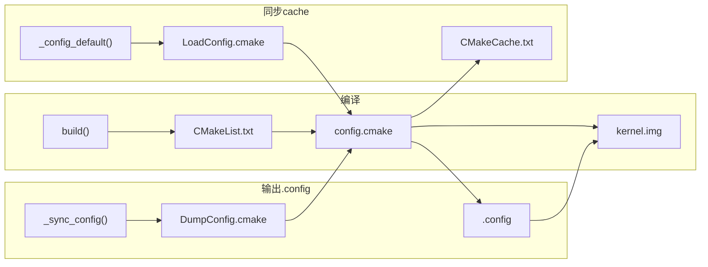
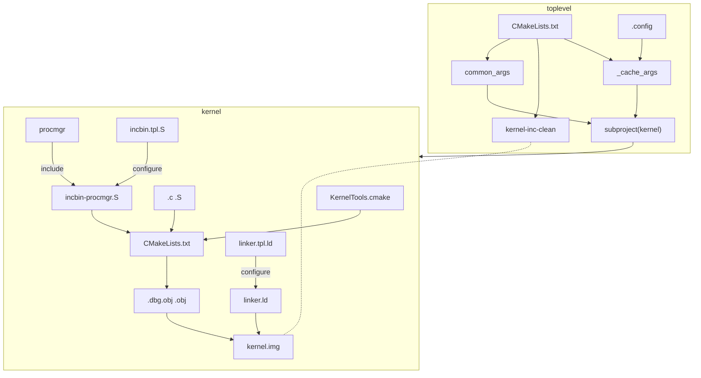

# RTFSC(1)

> [!IMPORTANT]
> RTFSC = Read the FRIENDLY Source Code

Lab1的代码很多，在第一部分的代码架构解析的部分我们主要来讲解内核镜像是如何构建产生，以及评分基础设施是如何工作的。

---

<!-- toc -->

## 构建系统

### Makefile

> [!QUESTION] Makefile
> 如果你对Makefile的语法有疑问的话，你可以参考这个网站的教程熟悉Makefile的写法。[^Makefile]

原有的Chcore的构建系统仅围绕着`Scripts/chbuild`这个脚本进行构建，但是由于`OS Course Lab`需要增加评分的设施，
我们为此在`chbuild`之外添加了Makefile的基础结构，以下为`Lab1/Makefile`的内容

```Makefile
{{ #include ../../Lab1/Makefile }}

```

注意到我们我们仅仅我们定义了Lab的标识符，然后使用`include`将上层`Scripts/lab.mk`导入到当前的`Makefile`中。

```Makefile
{{ #include ../../Scripts/lab.mk }}

```

而`lab.mk`主要针对Lab环境进行检查，同时定义一些关键的变量，最终根据当前的`$(LAB)`的序号，再去导入不同的定义，在此处由于
我们的`$(LAB)`变量为1，所以我们真正使用的Makefile定义为`kernel.mk`

```Makefile
{{ #include ../../Scripts/kernel.mk }}

```

这里简述一下用法，其中我们定义了一个变量`V`，当我们运行例如`make V=1`时会将`Q`的定义重新设置，`Q`的目的主要是为了做
字符串的拼接。

> [!NOTE] Makefile怎么工作？
> 在Makefile中，其主要分为两种定义，全局定义以及规则定义。全局定义主要是定义变量以及Makefile宏或者是函数，规则定义则是根据变量或者字面字符串定义进行拼接，然后使用shell执行拼接后的命令，例如此处的Q在V不处于Verbose模式时就会被视作@，此时Make就不会打印下面的命令。

当我们在Lab1运行`make build`，其就会转到`kernel.mk`的`build`这个规则下，此时`Make`会调用cmake完成进一步的构建

### CMake

> [!NOTE] 现代CMake教程
> IPADS的前成员[RC](https://github.com/stdrc)在Bilibili上分享过现代Cmake的pre，有兴趣的同学可以在这个链接进行观看[^Cmake]。

#### 镜像定义生成

当我们运行`make build`之后，我们便进到了`chbuild`脚本中了，当开始时我们会使用`chbuild defconfig`这个bash函数调用cmake的其他脚本来生成镜像配置文件`.config`，由于我们默认使用`raspi3`配置，我们会将`Scripts/defconfigs/raspi3.config`复制到当前Lab的根目录下，这个是chcore的平台定义文件，之后则会调用`Scripts/build/cmake`添加到Lab当中，之后则会运行`_config_default`这个函数主要负责递归读入Lab目录下的`config.cmake`文件并按照默认设置将平台无关的镜像配置文件，之后运行`_sync_config_with_cache`将镜像定义设置`.config`同步到CMakeCache中进行缓存，并返回到`Make`当中，之后`Make`继续运行`chbuild build`，按照`.config`定义进行构建镜像脚本。

```bash
{{ #include ../../Scripts/chbuild:60:77 }}

{{ #include ../../Scripts/chbuild:123:126}}

{{ #include ../../Scripts/chbuild:133:135}}

```

#### 定义多态设计

Chcore通过`config.cmake`这个文件来定义规则的，但是我们单独去看的时候它使用了`chcore_config`这个宏，但是这个指令是不存在，实际上
所有的`config.cmake`也是通过`include`指令来导入的，所以`chbuild`的每个指令都是去定义了`cmake`的`chcore_config`来执行不同的行为。
大致的过程图如下, `DumpConfig.cmake`主要是将`chcore_config`中的内容进行提取，并全部添加到`defconfig`生成的`.conifg`文件中，而`CMakeList.txt`构建时的`chcore_config`则是根据`.config`中的内容定向的配置子项目的编译选项。如果感兴趣你可以阅读`Scripts/build/cmake/`下的`cmake`脚本文件。



#### 镜像编译

Chcore的编译是从`CMakelists.txt`的上层开始的，总的来说经过了如下的编译过程



首先上层的`CMakeLists.txt`会根据`.config`的内容构造`_cache_args`以及`_common_args`分别对应的是下层`CMake`的子项目的`CMake`构建参数以及变量参数，然后
创建`kernel-incclean`用于删除`kernel.img`构建时的副产物，对应到最上层`chbuild clean`以及`make clean`时的清理选项，然后会递归进入`kernel`这个子项目。
进入子项目后，`CMake` 首先会去导入`KernelTools.cmake`这个脚本去定义一些关键函数以及关键宏，同时会定义关键的工具链选项以及包含路径，最后再逐步地将每个子目录的`CMakeLists.txt`进行导入，对于源文件进行编译，对于预编译文件则是按照调试选项对应添加`.dbg.obj`或者是`.obj`文件进入文件列表，之后则是将`user/procmgr`这个文件利用`incbin.tpl.S`去生成对应的二进制汇编进行编译，最后使用`linker.tpl.ld`所生成的`linker.ld`的`linker script`进行链接最后得到`kernel.img`的镜像。

> [!NOTE] Linker Script
> 如果你对链接脚本感兴趣，你可以参考这个附录[^linker].

## QEMU

当kernel构建完成后，我们将使用`qemu-system-aarch64`进行模拟，当我们运行`make qemu`或者是`make qemu-gdb`时我们会进入如下的规则，

```Makefile
{{#include ../../Scripts/kernel.mk:9:12}}
{{#include ../../Scripts/kernel.mk:32:37}}
```

此时`Make` 会将`QEMU_OPTS`以及可能`QEMU_GDB_PORT`进行字符串的拼接，然后将参数传入`qemu_wrapper.sh`转到`qemu`程序中。

## 评分系统

我们使用`make grade`时会将`TIMEOUT`参数以及评分定义`scores.json`以及被评分的指令传入`grader.sh`，

```bash
{{ #include ../../Scripts/grader.sh }}

```

在备份`.config`之后，其会调用`capturer.py`的内容，去动态捕捉命令的输出，并按照顺序与`scores.json`的内容进行比对，
从而计算评分，如果提前退出或者接收到`SIGINT`信号，则整个程序会直接退出并返回`0分`。

> [!BUG]
> 请注意我们是根据capturer.py的返回值来进行评分，如果有问题欢迎提交issues!

---

[^Makefile]: [Makefile Tutorial](https://makefiletutorial.com)
[^Cmake]: [Modern CMake](https://www.bilibili.com/video/BV14h41187FZ/?spm_id_from=333.337.search-card.all.click)
[^linker]: [Kernel: Linker Script](../Appendix/linker.html)
