# 页表映射

<!-- toc -->

## AArch64 地址翻译

在配置内核启动页表前，我们首先回顾实验涉及到的体系结构知识。这部分内容课堂上已经学习过，如果你已熟练掌握则可以直接跳过这里的介绍（但不要跳过思考题）。

在 AArch64 架构的 EL1 异常级别存在两个页表基址寄存器：`ttbr0_el1`[^ttbr0_el1] 和 `ttbr1_el1`[^ttbr1_el1]，分别用作虚拟地址空间低地址和高地址的翻译。那么什么地址范围称为“低地址”，什么地址范围称为“高地址”呢？这由 `tcr_el1` 翻译控制寄存器[^tcr_el1]控制，该寄存器提供了丰富的可配置性，可决定 64 位虚拟地址的高多少位为 `0` 时，使用 `ttbr0_el1` 指向的页表进行翻译，高多少位为 `1` 时，使用 `ttbr1_el1` 指向的页表进行翻译[^ttbr-sel]。一般情况下，我们会将 `tcr_el1` 配置为高低地址各有 48 位的地址范围，即，`0x0000_0000_0000_0000`～`0x0000_ffff_ffff_ffff` 为低地址，`0xffff_0000_0000_0000`～`0xffff_ffff_ffff_ffff` 为高地址。

[^ttbr0_el1]: Arm Architecture Reference Manual, D13.2.144
[^ttbr1_el1]: Arm Architecture Reference Manual, D13.2.147
[^tcr_el1]: Arm Architecture Reference Manual, D13.2.131
[^ttbr-sel]: Arm Architecture Reference Manual, D5.2 Figure D5-13

了解了如何决定使用 `ttbr0_el1` 还是 `ttbr1_el1` 指向的页表，再来看地址翻译过程如何进行。通常我们会将系统配置为使用 4KB 翻译粒度、4 级页表（L0 到 L3），同时在 L1 和 L2 页表中分别允许映射 2MB 和 1GB 大页（或称为块）[^huge-page]，因此地址翻译的过程如下图所示：

[^huge-page]: 操作系统：原理与实现

其中，当映射为 1GB 块或 2MB 块时，图中 L2、L3 索引或 L3 索引的位置和低 12 位共同组成块内偏移。

每一级的每一个页表占用一个 4KB 物理页，称为页表页（Page Table Page），其中有 512 个条目，每个条目占 64 位。AArch64 中，页表条目称为描述符（descriptor）[^descriptor]，最低位（bit[0]）为 `1` 时，描述符有效，否则无效。有效描述符有两种类型，一种指向下一级页表（称为表描述符），另一种指向物理块（大页）或物理页（称为块描述符或页描述符）。在上面所说的地址翻译配置下，描述符结构如下（“Output address”在这里即物理地址，一些地方称为物理页帧号（Page Frame Number，PFN））：

**L0、L1、L2 页表描述符**

**L3 页表描述符**

[^descriptor]: Arm Architecture Reference Manual, D5.3

> [!QUESTION] 思考题 8
> 请思考多级页表相比单级页表带来的优势和劣势（如果有的话），并计算在 AArch64 页表中分别以 4KB 粒度和 2MB 粒度映射 0～4GB 地址范围所需的物理内存大小（或页表页数量）。

页表描述符中除了包含下一级页表或物理页/块的地址，还包含对内存访问进行控制的属性（attribute）。这里涉及到太多细节，本文档限于篇幅只介绍最常用的几个页/块描述符中的属性字段：

字段 | 位 | 描述
--- | --- | ---
UXN | bit[54] | 置为 `1` 表示非特权态无法执行（Unprivileged eXecute-Never）
PXN | bit[53] | 置为 `1` 表示特权态无法执行（Privileged eXecute-Never）
nG | bit[11] | 置为 `1` 表示该描述符在 TLB 中的缓存只对当前 ASID 有效
AF | bit[10] | 置为 `1` 表示该页/块在上一次 AF 置 `0` 后被访问过
SH | bits[9:8] | 表示可共享属性[^mem-attr]
AP | bits[7:6] | 表示读写等数据访问权限[^mem-access]
AttrIndx | bits[4:2] | 表示内存属性索引，间接指向 `mair_el1` 寄存器中配置的属性[^mair_el1]，用于控制将物理页映射为正常内存（normal memory）或设备内存（device memory），以及控制 cache 策略等

[^mem-attr]: Arm Architecture Reference Manual, D5.5
[^mem-access]: Arm Architecture Reference Manual, D5.4
[^mair_el1]: Arm Architecture Reference Manual, D13.2.97

## 配置内核启动页表

有了关于页表配置的前置知识，我们终于可以开始配置内核的启动页表了。

操作系统内核通常运行在虚拟内存的高地址（如前所述，`0xffff_0000_0000_0000` 之后的虚拟地址）。通过对内核页表的配置，将虚拟内存高地址映射到内核实际所在的物理内存，在执行内核代码时，PC 寄存器的值是高地址，对全局变量、栈等的访问都使用高地址。在内核运行时，除了需要访问内核代码和数据等，往往还需要能够对任意物理内存和外设内存（MMIO）进行读写，这种读写同样通过高地址进行。

因此，在内核启动时，首先需要对内核自身、其余可用物理内存和外设内存进行虚拟地址映射，最简单的映射方式是一对一的映射，即将虚拟地址 `0xffff_0000_0000_0000 + addr` 映射到 `addr`。需要注意的是，在 ChCore 实验中我们使用了 `0xffff_ff00_0000_0000` 作为内核虚拟地址的开始（注意开头 `f` 数量的区别），不过这不影响我们对知识点的理解。

在树莓派 3B+ 机器上，物理地址空间分布如下[^bcm2836]：

[^bcm2836]: [bcm2836-peripherals.pdf](https://datasheets.raspberrypi.com/bcm2836/bcm2836-peripherals.pdf) & [Raspberry Pi Hardware - Peripheral Addresses](https://www.raspberrypi.com/documentation/computers/raspberry-pi.html#peripheral-addresses)

物理地址范围 | 对应设备
--- | ---
`0x00000000`~`0x3f000000` | 物理内存（SDRAM）
`0x3f000000`~`0x40000000` | 共享外设内存
`0x40000000`~`0xffffffff` | 本地（每个 CPU 核独立）外设内存

现在将目光转移到 `kernel/arch/aarch64/boot/raspi3/init/mmu.c` 文件，我们需要在 `init_kernel_pt` 为内核配置从 `0x00000000` 到 `0x80000000`（`0x40000000` 后的 1G，ChCore 只需使用这部分地址中的本地外设）的映射，其中 `0x00000000` 到 `0x3f000000` 映射为 normal memory，`0x3f000000` 到 `0x80000000`映射为 device memory，其中 `0x00000000` 到 `0x40000000` 以 2MB 块粒度映射，`0x40000000` 到 `0x80000000` 以 1GB 块粒度映射。

> [!QUESTION] 思考题 9
> 请结合上述地址翻译规则，计算在练习题 10 中，你需要映射几个 L2 页表条目，几个 L1 页表条目，几个 L0 页表条目。页表页需要占用多少物理内存？

> [!CODING] 练习题 10
> 在 `init_kernel_pt` 函数的 `LAB 1 TODO 5` 处配置内核高地址页表（`boot_ttbr1_l0`、`boot_ttbr1_l1` 和 `boot_ttbr1_l2`），以 2MB 粒度映射。

> [!HINT]
> 你只需要将 `addr`(`0x00000000` 到 `0x80000000`) 按照要求的页粒度一一映射到 `KERNEL_VADDR + addr`(`vaddr`) 上。`vaddr` 对应的物理地址是 `vaddr - KERNEL_VADDR`. Attributes 的设置请参考给出的低地址页表配置。

> [!QUESTION] 思考题11
> 请思考在 `init_kernel_pt` 函数中为什么还要为低地址配置页表，并尝试验证自己的解释。

完成 `init_kernel_pt` 函数后，ChCore 内核便可以在 `el1_mmu_activate` 中将 `boot_ttbr1_l0` 等物理地址写入实际寄存器(如 `ttbr1_el1` )，随后启用 MMU 后继续执行，并通过 `start_kernel` 跳转到高地址，进而跳转到内核的 `main` 函数（位于 `kernel/arch/aarch64/main.c`, 尚未发布，以 binary 提供）。

> [!QUESTION] 思考题12
> 在一开始我们暂停了三个其他核心的执行，根据现有代码简要说明它们什么时候会恢复执行。思考为什么一开始只让 0 号核心执行初始化流程？

> [!HINT]
> `secondary_boot_flag` 将在 main 函数执行完时钟，调度器，锁的初始化后被设置。

---

> [!SUCCESS]
> 以上为Lab1 Part2 的内容
> 如果顺利的话　运行make grade你会得到100/100
