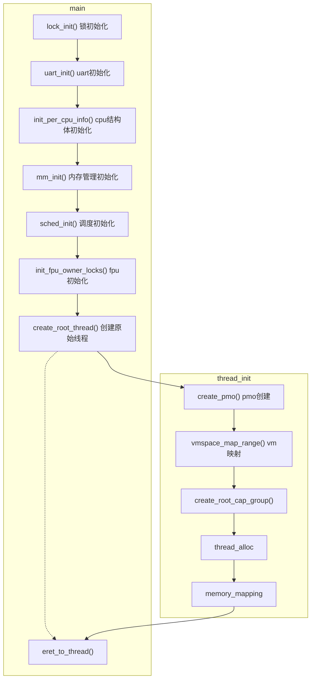
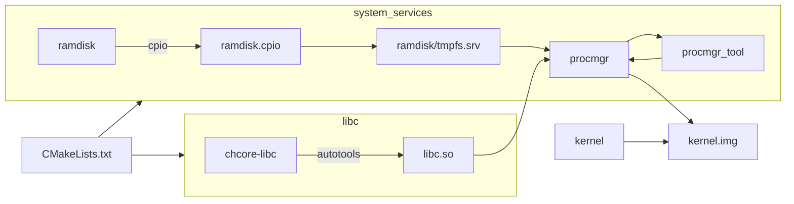
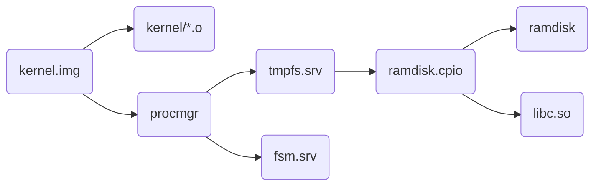

# RTFSC (3)

> [!NOTE]
> 此为代码导读的第三部分，请仔细阅读。同之前的章节相同，本节不包含习题。

---

本次代码导读主要聚焦从main函数开始自上而下讲解Lab2 Lab3内核态的资源管理机制以及用户态和内核态的互相调用

> [!HINT]
> 你可能需要重新结合Lab2/Lab3的开放代码来理解本章

## 内核初始化

```c
{{#include ../../Lab2/kernel/arch/aarch64/main.c:47:132}}
```

以下为Chcore内核初始化到运行第一个用户线程的主要流程图



我们在`Lab2`中主要完成mm_init以及内存管理器与vmspace和pmo的互联，现在我们再从第一个线程创建的数据流来梳理并分析
Chcore微内核的资源管理模式。

### 内核对象管理

在Chcore中所有的系统资源都叫做object（对象），用面向对象的方法进行理解的话，object即为不同内核对象例如vmspace, pmo, thread(等等)的父类，
Chcore通过能力组机制管理所有的系统资源，能力组本身只是一个包含指向object的指针的数组

1. 所有进程/线程都有一个独立的能力组，拥有一个全局唯一ID (**Badge**)
2. 所有对象（包括进程或**能力组**本身）都属于一个或多个能力组当中，也就是说子进程与线程将属于父进程的能力组当中，在某个能力组的对象拥有一个能力组内的能力ID(**cap**)。
3. 对象可以共享，即单个对象可以在多个能力组中共存，同时在不同cap_group中可以有不同的**cap**
4. 对所有对象的取用和返还都使用引用计数进行追踪。当引用计数为0后，当内核垃圾回收器唤醒后，会自动回收.
5. 能力组内的能力具有权限，表明该能力是否能被共享(CAP_RIGHT_COPY)以及是否能被删除(CAP_RIGHT_REVOKE)


```c
{{#include ../../Lab3/kernel/include/object/object.h:22:40}}
{{#include ../../Lab3/kernel/object/capability.c:32:46}}
{{#include ../../Lab3/kernel/object/capability.c:56:78}}
{{#include ../../Lab3/kernel/object/capability.c:172:188}}

```

所有的对象都有一个公共基类，并定义了虚构函数列表，当引用计数归零即完全被能力组移除后内核会执行deinit代码完成销毁工作。

> [!NOTE]
> 你可以根据上述的描述来梳理根进程创建以及普通进程创建的异同，最后梳理出创建进程的标准模式。


### 用户态构建

我们在`Lab1`的代码导读阶段说明了`kernel`目录下的代码是如何被链接成内核镜像的，我们在内核镜像链接中引入了`procmgr`这个预先构建的二进制文件。在`Lab3`中，我们引入了用户态的代码构建，所以我们将`procmgr`的依赖改为使用用户态的代码生成。下图为具体的构建规则图。


`procmgr`是一个自包含的`ELF`程序，其代码在`procmgr`中列出，其主要包含一个`ELF`执行器以及作为Chcore微内核的`init`程序启动，其构建主要依赖于`fsm.srv`以及`tmpfs.srv`，其中`fsm.srv`为文件系统管理器其扮演的是虚拟文件系统的角色用于桥接不同挂载点上的文件系统的实现，而`tmpfs.srv`则是`Chcore`的根文件系统其由`ramdisk`下面的所有文件以及构建好`libc.so`所打包好的`ramdisk.cpio`构成。当构建完`tmpfs.srv`后其会跟`libc.so`进行动态链接，最终`tmpfs.srv`以及`fsm.srv`会以incbin脚本的形式以二进制的方式被连接至`procmgr`的最后。在构建`procmgr`的最后一步，`cmake`会调用`read_procmgr_elf_tool`将`procmgr`这个`ELF`文件的缩略信息粘贴至`procmgr`之前。此后`procmgr`也会以二进制的方式进一步嵌套进入内核镜像之后，最终会在`create_root_thread`的阶段通过其`elf`符号得以加载。 最终，Chcore的Kernel镜像的拓扑结构如下


