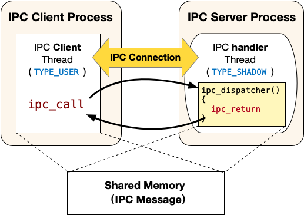

# 进程间通信（IPC）

<!-- toc -->

在本部分，我们将实现ChCore的进程间通信，从而允许跨地址空间的两个进程可以使用IPC进行信息交换。

## 进程间通讯概览

ChCore的IPC接口不是传统的send/recv接口。其更像客户端/服务器模型，其中IPC请求接收者是服务器，而IPC请求发送者是客户端。 服务器进程中包含三类线程:

* 主线程：该线程与普通的线程一样，类型为`TYPE_USER`。该线程会调用`ipc_register_server`将自己声明为一个IPC的服务器进程，调用的时候会提供两个参数:服务连接请求的函数client_register_handler和服务真正IPC请求的函数server_handler（即图中的`ipc_dispatcher`），调用该函数会创建一个注册回调线程;

* 注册回调线程：该线程的入口函数为上文提到的client_register_handler，类型为`TYPE_REGISTER`。正常情况下该线程不会被调度执行，仅当有Client发起建立IPC连接的请求时，该线程运行并执行client_register_handler，为请求建立连接的Client创建一个服务线程（即图中的IPC handler thread）并在服务器进程的虚拟地址空间中分配一个可以用来映射共享内存的虚拟地址。

* 服务线程：当Client发起建立IPC连接请求时由注册回调线程创建，入口函数为上文提到的server_handler，类型为`TYPE_SHADOW`。正常情况下该线程不会被调度执行，仅当有Client端线程使用`ipc_call`发起IPC请求时，该线程运行并执行server_handler（即图中的`ipc_dispatcher`），执行结束之后会调用`ipc_return`回到Client端发起IPC请求的线程。

> [!IMPORTANT] 注意
> 注册回调线程和服务线程都不再拥有调度上下文（Scheduling Context），也即不会主动被调度器调度到。其在客户端申请建立IPC连接或者发起IPC请求的时候才会被调度执行。为了实现该功能，这两种类型的线程会继承IPC客户端线程的调度上下文（即调度时间片budget），从而能被调度器正确地调度。

## 具体流程

为了实现ChCore IPC的功能，首先需要在Client与Server端创建起一个一对一的IPC Connection。该Connection保存了IPC Server的服务线程（即上图中IPC handler Thread）、Client与Server的共享内存（用于存放IPC通信的内容）。同一时刻，一个Connection只能有一个Client接入，并使用该Connection切换到Server的处理流程。ChCore提供了一系列机制，用于创建Connection以及创建每个Connection对应的服务线程。下面将以具体的IPC注册到调用的流程，详细介绍ChCore的IPC机制：

1. IPC服务器的主线程调用: `ipc_register_server` (`../Thirdparty/musl-libc/src/chcore-port/ipc.c`中)来声明自己为IPC的服务器端。

    * 参数包括server_handler和client_register_handler，其中server_handler为服务端用于提供服务的回调函数（比如上图中IPC handler Thread的入口函数`ipc_dispatcher`）；client_register_handler为服务端提供的用于注册的回调函数，该函数会创建一个注册回调线程。

    * 随后调用ChCore提供的的系统调用：`sys_register_server`。该系统调用实现在`kernel/ipc/connection.c`当中，该系统调用会分配并初始化一个`struct ipc_server_config`和一个`struct ipc_server_register_cb_config`。之后将调用者线程（即主线程）的general_ipc_config字段设置为创建的`struct ipc_server_config`，其中记录了注册回调线程和IPC服务线程的入口函数（即图中的`ipc_dispatcher`）。将注册回调线程的general_ipc_config字段设置为创建的`struct ipc_server_register_cb_config`，其中记录了注册回调线程的入口函数和用户态栈地址等信息。

2. IPC客户端线程调用`ipc_register_client`（定义在`../Thirdparty/musl-libc/src/chcore-port/ipc.c`中）来申请建立IPC连接。

    * 该函数仅有一个参数，即IPC服务器的主线程在客户端进程cap_group中的capability。该函数会首先通过系统调用申请一块物理内存作为和服务器的共享内存（即图中的Shared Memory）。

    * 随后调用`sys_register_client`系统调用。该系统调用实现在`kernel/ipc/connection.c`当中，该系统调用会将刚才申请的物理内存映射到客户端的虚拟地址空间中，然后调用`create_connection`创建并初始化一个`struct ipc_connection`类型的内核对象，该内核对象中的shm字段会记录共享内存相关的信息（包括大小，分别在客户端进程和服务器进程当中的虚拟地址和capability）。

    * 之后会设置注册回调线程的栈地址、入口地址和第一个参数，并切换到注册回调线程运行。
3. 注册回调线程运行的入口函数为主线程调用`ipc_register_server`是提供的client_register_handler参数，一般会使用默认的`DEFAULT_CLIENT_REGISTER_HANDLER`宏定义的入口函数，即定义在`../Thirdparty/musl-libc/src/chcore-port/ipc.c`中的`register_cb`。

    * 该函数首先分配一个用来映射共享内存的虚拟地址，随后创建一个服务线程。

    * 随后调用`sys_ipc_register_cb_return`系统调用进入内核，该系统调用将共享内存映射到刚才分配的虚拟地址上，补全`struct ipc_connection`内核对象中的一些元数据之后切换回客户端线程继续运行，客户端线程从`ipc_register_client`返回，完成IPC建立连接的过程。

4. IPC客户端线程调用`ipc_create_msg`和`ipc_set_msg_data`向IPC共享内存中填充数据，然后调用`ipc_call`（`../Thirdparty/musl-libc/src/chcore-port/ipc.c`中）发起IPC请求。

    * `ipc_call`中会发起`sys_ipc_call`系统调用（定义在`kernel/ipc/connection.c`中），该系统调用将设置服务器端的服务线程的栈地址、入口地址、各个参数，然后迁移到该服务器端服务线程继续运行。由于当前的客户端线程需要等待服务器端的服务线程处理完毕，因此需要更新其状态为TS_WAITING，且不要加入等待队列。

5. IPC服务器端的服务线程在处理完IPC请求之后使用`ipc_return`返回。
    * `ipc_return`会发起`sys_ipc_return`系统调用，该系统调用会迁移回到IPC客户端线程继续运行，IPC客户端线程从`ipc_call`中返回。

> [!CODING] 练习题 7
> 在`../Thirdparty/musl-libc/src/chcore-port/ipc.c与kernel/ipc/connection.c`中实现了大多数IPC相关的代码，请根据注释补全`kernel/ipc/connection.c`中的代码。之后运行ChCore可以看到 “[TEST] Test IPC finished!” 输出，你可以通过 Test IPC 测试点。

> [!WARNING]
> 由于用户文件系统管理器(FSM) 与 服务管理器 (Procmgr) 需要通过IPC来进行数据传输，故如果IPC链路实现错误则无法运行`test_ipc.bin`以及`Chcore_Shell`

> [!HINT]
> 由于你已经在Lab3中了解到Printf的实现是系统调用并不经过IPC，所以你可以在所有的暴露代码(IPC链路上)中插入Printf/Printk指令进行Debug打印。

---

> [!SUCCESS]
> 以上为Lab4 Part3的所有内容
