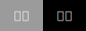
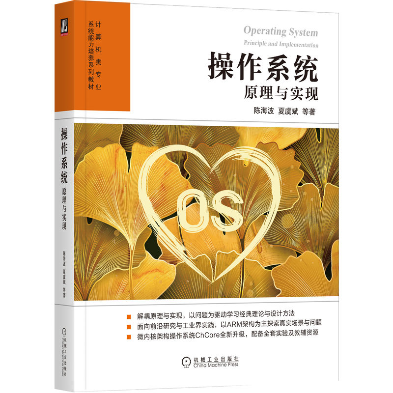

# IPADS OS Course Lab Manual

本仓库包含上海交通大学IPADS实验室设计的操作系统课程系列实验。每个实验位于独立的目录，附有详细的[实验说明](https://sjtu-ipads.github.io/OS-Course-Lab/)和[源码解析](https://sjtu-ipads.github.io/OS-Course-Lab/Appendix/source-code/Lab1/booting.html)。

课程教材:

> [!NOTE]
> 如果你有任何建议或更正意见，欢迎提交 Pull Requests 或 Issues。让我们一起合作改进实验

## Lab0: 拆炸弹 (ARM 汇编)

该实验受到CSAPP课程启发，CSAPP课程设计了一个针对x86/x86-64汇编的拆炸弹实验。
不同之处在于，本实验目标是熟悉ARM汇编语言，并为后续的ARM/树莓派内核实验做好准备。

Tutorial: <https://www.bilibili.com/video/BV1q94y1a7BF/?vd_source=63231f40c83c4d292b2a881fda478960>

## Lab1: 内核启动

该实验的主要内容是关于如何在内核启动过程中设置CPU异常级别、配置内核页表并启用MMU。
在内核实验系列中，我们将使用 [ChCore 微内核](https://www.usenix.org/conference/atc20/presentation/gu) 的基础版本，并使用 Raspi3b+作为实验平台（无论是使用QEMU树莓派模拟器还是树莓派开发板都可以）。

Tutorial: <https://www.bilibili.com/video/BV1gj411i7dh/?spm_id_from=333.337.search-card.all.click>

## Lab2: 内存管理

该实验主要内容是关于内核中的伙伴系统和slab分配器的实现，并为应用程序设置页表。

Tutorial: <https://www.bilibili.com/video/BV1284y1Q7Jc/?vd_source=316867e8ad2c56f50fa94e8122dd7d38>

## Lab3: 进程与线程

该实验主要内容包括创建第一个用户态进程和线程，完善异常处理流程和系统调用，编写一个Hello-World在实验内核上运行。

Tutorial: <https://www.bilibili.com/video/BV11N411j7bR/>

## Lab4：多核调度与IPC

该实验中可以看到多核是如何启动的、多线程如何调度、基于capability权限管控的进程间通信机制。

Tutorial: <https://www.bilibili.com/video/BV1AS421N7rU/>

## Lab5：虚拟文件系统

该实验关注虚拟文件系统（Virtual File System，VFS）, VFS抽象层使得不同类型的文件系统可以在应用程序层面以统一的方式进行访问。

## Lab6：GUI (Optional)

该实验将详细介绍ChCore上基于Wayland的GUI系统的运行原理，包括Wayland通信协议和Wayland Compositor，并且要求读者在了解基于Wayland的GUI系统运行原理的基础上，基于ChCore的GUI框架编写自己的具有GUI界面的APP。

完成实验后，你可以在ChCore上运行带GUI的宝可梦游戏

https://github.com/user-attachments/assets/00804575-bc97-4594-b09e-2d20e1d69509

