# 实验 1：机器启动

本实验作为 ChCore 操作系统课程实验的第一个实验，分为两个部分：第一部分介绍实验所需的基础知识，第二部分熟悉 ChCore 内核的启动过程。

实验中的“思考题”，请在实验报告中用文字或示意图简述，“练习题”则需在 ChCore 代码中填空，并在实验报告阐述实现过程，“挑战题”为难度稍高的练习题，此后的实验也类似，不再重复说明。

本实验代码包含了完整的 ChCore 操作系统，除了练习题相关部分的源码以外，其余部分通过二进制格式提供。
完成本实验的练习题之后，你可以进入 ChCore shell，体验 ChCore 的功能。
例如，可以在 shell 中输入 `/hello_world.bin` 运行一个简单的用户态程序。

```
 ______     __  __     ______     __  __     ______     __         __        
/\  ___\   /\ \_\ \   /\  ___\   /\ \_\ \   /\  ___\   /\ \       /\ \       
\ \ \____  \ \  __ \  \ \___  \  \ \  __ \  \ \  __\   \ \ \____  \ \ \____  
 \ \_____\  \ \_\ \_\  \/\_____\  \ \_\ \_\  \ \_____\  \ \_____\  \ \_____\ 
  \/_____/   \/_/\/_/   \/_____/   \/_/\/_/   \/_____/   \/_____/   \/_____/ 


Welcome to ChCore shell!
$ 
```

## 第一部分：基础知识

### 构建系统

在 ChCore 根目录运行下面命令可以构建并运行 ChCore：

```sh
$ make build # 构建 ChCore
$ make qemu # 使用 QEMU 运行 ChCore（初始时运行不会有任何输出），按 Ctrl-A 再按 X 退出
```

ChCore 采用 CMake 编写的构建系统管理其构建过程，并通过 Shell 脚本 `./chbuild` 对 CMake 的配置（configure）、构建（build）和清理（clean）的操作进行管理，另外，为了同学们更方便地进行实验，在 ChCore 实验中又添加了 Makefile 进一步对 `./chbuild` 脚本进行封装。

具体地，在根目录的 `CMakeLists.txt` 中，通过 `chcore_add_subproject` 命令（实际上就是 CMake 内置的 [`ExternalProject_Add`](https://cmake.org/cmake/help/latest/module/ExternalProject.html)）添加了 kernel 子项目，并传入根级 `CMakeLists.txt` 在 configure 步骤后获得的配置（CMake cache 变量）；在 kernel 子项目中，通过各级子目录共同构建了 `kernel.img` 文件，并放在 ChCore 根目录的 `build` 目录下。

关于 CMake 的更多信息请参考 [IPADS 新人培训：CMake](https://www.bilibili.com/video/BV14h41187FZ)。

### AArch64 汇编

AArch64 是 ARMv8 ISA 的 64 位执行状态。在 ChCore 实验中需要理解 AArch64 架构的一些特性，并能看懂和填写 AArch64 汇编代码，因此请先参考 [Arm Instruction Set Reference Guide](https://developer.arm.com/documentation/100076/0100) 的 [Overview of the Arm Architecture](https://developer.arm.com/documentation/100076/0100/instruction-set-overview/overview-of-the-arm-architecture) 和 [Overview of AArch64 state](https://developer.arm.com/documentation/100076/0100/instruction-set-overview/overview-of-aarch64-state) 章节以对 AArch64 架构有基本的认识，[A64 Instruction Set Reference](https://developer.arm.com/documentation/100076/0100/a64-instruction-set-reference) 章节则是完整的指令参考手册。

除此之外，可以阅读 [A Guide to ARM64 / AArch64 Assembly on Linux with Shellcodes and Cryptography](https://modexp.wordpress.com/2018/10/30/arm64-assembly/) 的第 1、2 部分，以快速熟悉 AArch64 汇编。

### QEMU 和 GDB

在本实验中常常需要对 ChCore 内核和用户态代码进行调试，因此需要开启 QEMU 的 GDB server，并使用 GDB（在 x86-64 平台的 Ubuntu 系统上应使用 `gdb-multiarch` 命令）连接远程目标来进行调试。

ChCore 根目录提供了 `.gdbinit` 文件来对 GDB 进行初始化，以方便使用。

要使用 GDB 调试 ChCore，需打开两个终端页面，并在 ChCore 根目录分别依次运行：

```sh
# 终端 1
$ make qemu-gdb # 需要先确保已运行 make build

# 终端 2
$ make gdb
```

不出意外的话，终端 1 将会“卡住”没有任何输出，终端 2 将会进入 GDB 调试界面，并显示从 `0x80000` 内存地址开始的一系列指令。此时在 GDB 窗口输入命令可以控制 QEMU 中 ChCore 内核的运行，例如：

- `ni` 可以执行到下一条指令
- `si` 可以执行到下一条指令，且会跟随 `bl` 进入函数
- `break [func]`/`b [func]` 可以在函数 `[func]` 开头打断点
- `break *[addr]` 可以在内存地址 `[addr]` 处打断点
- `info reg [reg]`/`i r [reg]` 可以打印 `[reg]` 寄存器的值
- `continue`/`c` 可以继续 ChCore 的执行，直到出发断点或手动按 Ctrl-C

更多常用的 GDB 命令和用法请参考 [GDB Quick Reference](https://users.ece.utexas.edu/~adnan/gdb-refcard.pdf) 和 [Debugging with GDB](https://sourceware.org/gdb/onlinedocs/gdb/)。

## 第二部分：内核启动过程

### 树莓派启动过程

在树莓派 3B+ 真机上，通过 SD 卡启动时，上电后会运行 ROM 中的特定固件，接着加载并运行 SD 卡上的 `bootcode.bin` 和 `start.elf`，后者进而根据 `config.txt` 中的配置，加载指定的 kernel 映像文件（纯 binary 格式，通常名为 `kernel8.img`）到内存的 `0x80000` 位置并跳转到该地址开始执行。

而在 QEMU 模拟的 `raspi3b`（旧版 QEMU 为 `raspi3`）机器上，则可以通过 `-kernel` 参数直接指定 ELF 格式的 kernel 映像文件，进而直接启动到 ELF 头部中指定的入口地址，即 `_start` 函数（实际上也在 `0x80000`，因为 ChCore 通过 linker script 强制指定了该函数在 ELF 中的位置，如有兴趣请参考附录）。

### 启动 CPU 0 号核

`_start` 函数（位于 `kernel/arch/aarch64/boot/raspi3/init/start.S`）是 ChCore 内核启动时执行的第一块代码。由于 QEMU 在模拟机器启动时会同时开启 4 个 CPU 核心，于是 4 个核会同时开始执行 `_start` 函数。而在内核的初始化过程中，我们通常需要首先让其中一个核进入初始化流程，待进行了一些基本的初始化后，再让其他核继续执行。

> 思考题 1：阅读 `_start` 函数的开头，尝试说明 ChCore 是如何让其中一个核首先进入初始化流程，并让其他核暂停执行的。
>
> 提示：可以在 [Arm Architecture Reference Manual](https://documentation-service.arm.com/static/61fbe8f4fa8173727a1b734e) 找到 `mpidr_el1` 等系统寄存器的详细信息。

### 切换异常级别

AArch64 架构中，特权级被称为异常级别（Exception Level，EL），四个异常级别分别为 EL0、EL1、EL2、EL3，其中 EL3 为最高异常级别，常用于安全监控器（Secure Monitor），EL2 其次，常用于虚拟机监控器（Hypervisor），EL1 是内核常用的异常级别，也就是通常所说的内核态，EL0 是最低异常级别，也就是通常所说的用户态。

QEMU `raspi3b` 机器启动时，CPU 异常级别为 EL3，我们需要在启动代码中将异常级别降为 EL1，也就是进入内核态。具体地，这件事是在 `arm64_elX_to_el1` 函数（位于 `kernel/arch/aarch64/boot/raspi3/init/tools.S`）中完成的。

为了使 `arm64_elX_to_el1` 函数具有通用性，我们没有直接写死从 EL3 降至 EL1 的逻辑，而是首先判断当前所在的异常级别，并根据当前异常级别的不同，跳转到相应的代码执行。

> 练习题 2：在 `arm64_elX_to_el1` 函数的 `LAB 1 TODO 1` 处填写一行汇编代码，获取 CPU 当前异常级别。
>
> 提示：通过 `CurrentEL` 系统寄存器可获得当前异常级别。通过 GDB 在指令级别单步调试可验证实现是否正确。

无论从哪个异常级别跳到更低异常级别，基本的逻辑都是：

- 先设置当前级别的控制寄存器（EL3 的 `scr_el3`、EL2 的 `hcr_el2`、EL1 的 `sctlr_el1`），以控制低一级别的执行状态等行为
- 然后设置 `elr_elx`（异常链接寄存器）和 `spsr_elx`（保存的程序状态寄存器），分别控制异常返回后执行的指令地址，和返回后应恢复的程序状态（包括异常返回后的异常级别）
- 最后调用 `eret` 指令，进行异常返回

> 练习题 3：在 `arm64_elX_to_el1` 函数的 `LAB 1 TODO 2` 处填写大约 4 行汇编代码，设置从 EL3 跳转到 EL1 所需的 `elr_el3` 和 `spsr_el3` 寄存器值。具体地，我们需要在跳转到 EL1 时暂时屏蔽所有中断、并使用内核栈（`sp_el1` 寄存器指定的栈指针）。

练习完成后，可使用 GDB 跟踪内核代码的执行过程，由于此时不会有任何输出，可通过是否正确从 `arm64_elX_to_el1` 函数返回到 `_start` 来判断代码的正确性。

### 跳转到第一行 C 代码

降低异常级别到 EL1 后，应尽快从汇编跳转到 C 代码，以便提高代码的可复用性和可读性。因此在 `_start` 函数从 `arm64_elX_to_el1` 返回后，立即设置启动所需的栈，并跳转到第一个 C 函数 `init_c`。

> 思考题 4：结合此前 ICS 课的知识，并参考 `kernel.img` 的反汇编（通过 `aarch64-linux-gnu-objdump -S` 可获得），说明为什么要在进入 C 函数之前设置启动栈。如果不设置，会发生什么？

进入 `init_c` 函数后，第一件事首先通过 `clear_bss` 函数清零了 `.bss` 段，该段用于存储未初始化的全局变量和静态变量（具体请参考附录）。

> 思考题 5：在实验 1 中，其实不调用 `clear_bss` 也不影响内核的执行，请思考不清理 `.bss` 段在之后的何种情况下会导致内核无法工作。

### 初始化串口输出

到目前为止我们仍然只能通过 GDB 追踪内核的执行过程，而无法看到任何输出，这无疑是对我们写操作系统的积极性的一种打击。因此在 `init_c` 中，我们应该尽快启用某个可以输出字符的东西，而这个“东西”在树莓派上叫做 UART 串口。

在 `kernel/arch/aarch64/boot/raspi3/peripherals/uart.c` 已经给出了 `early_uart_init` 和 `early_uart_send` 函数，分别用于初始化 UART 和发送单个字符（也就是输出字符）。

> 练习题 6：在 `kernel/arch/aarch64/boot/raspi3/peripherals/uart.c` 中 `LAB 1 TODO 3` 处实现通过 UART 输出字符串的逻辑。

恭喜！我们终于在内核中输出了第一个字符串！

### 启用 MMU

在内核的启动阶段，还需要配置启动页表（`init_kernel_pt` 函数），并启用 MMU（`el1_mmu_activate` 函数），使可以通过虚拟地址访问内存，从而为之后跳转到高地址作准备（内核通常运行在虚拟地址空间 `0xffffff0000000000` 之后的高地址）。

关于配置启动页表的内容由于包含关于页表的细节，将在本实验下一部分实现，目前直接启用 MMU。

在 EL1 异常级别启用 MMU 是通过配置系统寄存器 `sctlr_el1` 实现的（Arm Architecture Reference Manual D13.2.118）。具体需要配置的字段主要包括：

- 是否启用 MMU（`M` 字段）
- 是否启用对齐检查（`A` `SA0` `SA` `nAA` 字段）
- 是否启用指令和数据缓存（`C` `I` 字段）

> 练习题 7：在 `kernel/arch/aarch64/boot/raspi3/init/tools.S` 中 `LAB 1 TODO 4` 处填写一行汇编代码，以启用 MMU。

由于没有配置启动页表，在启用 MMU 后，内核会立即发生地址翻译错误（Translation Fault），进而尝试跳转到异常处理函数（Exception Handler），
该异常处理函数的地址为异常向量表基地址（`vbar_el1` 寄存器）加上 `0x200`。
此时我们没有设置异常向量表，因此执行流会来到 `0x200` 地址，此处的代码为非法指令，会再次触发异常并跳转到 `0x200` 地址。
使用 GDB 调试，在 GDB 中输入 `continue` 后，待内核输出停止后，按 Ctrl-C，可以观察到在 `0x200` 处无限循环。

## 第三部分：内核启动页表

### AArch64 地址翻译

在配置内核启动页表前，我们首先回顾实验涉及到的体系结构知识。这部分内容课堂上已经学习过，如果你已熟练掌握则可以直接跳过这里的介绍（但不要跳过思考题）。

在 AArch64 架构的 EL1 异常级别存在两个页表基址寄存器：`ttbr0_el1`[^ttbr0_el1] 和 `ttbr1_el1`[^ttbr1_el1]，分别用作虚拟地址空间低地址和高地址的翻译。那么什么地址范围称为“低地址”，什么地址范围称为“高地址”呢？这由 `tcr_el1` 翻译控制寄存器[^tcr_el1]控制，该寄存器提供了丰富的可配置性，可决定 64 位虚拟地址的高多少位为 `0` 时，使用 `ttbr0_el1` 指向的页表进行翻译，高多少位为 `1` 时，使用 `ttbr1_el1` 指向的页表进行翻译[^ttbr-sel]。一般情况下，我们会将 `tcr_el1` 配置为高低地址各有 48 位的地址范围，即，`0x0000_0000_0000_0000`～`0x0000_ffff_ffff_ffff` 为低地址，`0xffff_0000_0000_0000`～`0xffff_ffff_ffff_ffff` 为高地址。

[^ttbr0_el1]: Arm Architecture Reference Manual, D13.2.144
[^ttbr1_el1]: Arm Architecture Reference Manual, D13.2.147
[^tcr_el1]: Arm Architecture Reference Manual, D13.2.131
[^ttbr-sel]: Arm Architecture Reference Manual, D5.2 Figure D5-13

了解了如何决定使用 `ttbr0_el1` 还是 `ttbr1_el1` 指向的页表，再来看地址翻译过程如何进行。通常我们会将系统配置为使用 4KB 翻译粒度、4 级页表（L0 到 L3），同时在 L1 和 L2 页表中分别允许映射 2MB 和 1GB 大页（或称为块）[^huge-page]，因此地址翻译的过程如下图所示：

[^huge-page]: 现代操作系统：原理与实现，4.3.5 大页



其中，当映射为 1GB 块或 2MB 块时，图中 L2、L3 索引或 L3 索引的位置和低 12 位共同组成块内偏移。

每一级的每一个页表占用一个 4KB 物理页，称为页表页（Page Table Page），其中有 512 个条目，每个条目占 64 位。AArch64 中，页表条目称为描述符（descriptor）[^descriptor]，最低位（bit[0]）为 `1` 时，描述符有效，否则无效。有效描述符有两种类型，一种指向下一级页表（称为表描述符），另一种指向物理块（大页）或物理页（称为块描述符或页描述符）。在上面所说的地址翻译配置下，描述符结构如下（“Output address”在这里即物理地址，一些地方称为物理页帧号（Page Frame Number，PFN））：

**L0、L1、L2 页表描述符**


**L3 页表描述符**


[^descriptor]: Arm Architecture Reference Manual, D5.3

> 思考题 8：请思考多级页表相比单级页表带来的优势和劣势（如果有的话），并计算在 AArch64 页表中分别以 4KB 粒度和 2MB 粒度映射 0～4GB 地址范围所需的物理内存大小（或页表页数量）。

页表描述符中除了包含下一级页表或物理页/块的地址，还包含对内存访问进行控制的属性（attribute）。这里涉及到太多细节，本文档限于篇幅只介绍最常用的几个页/块描述符中的属性字段：

字段 | 位 | 描述
--- | --- | ---
UXN | bit[54] | 置为 `1` 表示非特权态无法执行（Unprivileged eXecute-Never）
PXN | bit[53] | 置为 `1` 表示特权态无法执行（Privileged eXecute-Never）
nG | bit[11] | 置为 `1` 表示该描述符在 TLB 中的缓存只对当前 ASID 有效
AF | bit[10] | 置为 `1` 表示该页/块在上一次 AF 置 `0` 后被访问过
SH | bits[9:8] | 表示可共享属性[^mem-attr]
AP | bits[7:6] | 表示读写等数据访问权限[^mem-access]
AttrIndx | bits[4:2] | 表示内存属性索引，间接指向 `mair_el1` 寄存器中配置的属性[^mair_el1]，用于控制将物理页映射为正常内存（normal memory）或设备内存（device memory），以及控制 cache 策略等

[^mem-attr]: Arm Architecture Reference Manual, D5.5
[^mem-access]: Arm Architecture Reference Manual, D5.4
[^mair_el1]: Arm Architecture Reference Manual, D13.2.97

### 配置内核启动页表

有了关于页表配置的前置知识，我们终于可以开始配置内核的启动页表了。

操作系统内核通常需要“运行在”虚拟内存的高地址（如前所述，`0xffff_0000_0000_0000` 之后的虚拟地址），这里“运行在”的意思是，通过对内核页表的配置，将虚拟内存高地址映射到内核所在的物理内存，在执行内核代码时，PC 寄存器的值是高地址，对全局变量、栈等的访问都使用高地址。在内核运行时，除了需要访问内核代码和数据等，往往还需要能够对任意物理内存和外设内存（MMIO）进行读写，这种读写同样通过高地址进行。

因此，在内核启动时，首先需要对内核自身、其余可用物理内存和外设内存进行虚拟地址映射，最简单的映射方式是一对一的映射，即将虚拟地址 `0xffff_0000_0000_0000 + addr` 映射到 `addr`。需要注意的是，在 ChCore 实验中我们使用了 `0xffff_ff00_0000_0000` 作为内核虚拟地址的开始（注意开头 `f` 数量的区别），不过这不影响我们对知识点的理解。

在树莓派 3B+ 机器上，物理地址空间分布如下[^bcm2836]：

[^bcm2836]: [bcm2836-peripherals.pdf](https://datasheets.raspberrypi.com/bcm2836/bcm2836-peripherals.pdf) & [Raspberry Pi Hardware - Peripheral Addresses](https://www.raspberrypi.com/documentation/computers/raspberry-pi.html#peripheral-addresses)

物理地址范围 | 对应设备
--- | ---
`0x00000000`~`0x3f000000` | 物理内存（SDRAM）
`0x3f000000`~`0x40000000` | 共享外设内存
`0x40000000`~`0xffffffff` | 本地（每个 CPU 核独立）外设内存

现在将目光转移到 `kernel/arch/aarch64/boot/raspi3/init/mmu.c` 文件，我们需要在 `init_kernel_pt` 为内核配置从 `0x00000000` 到 `0x80000000`（`0x40000000` 后的 1G，ChCore 只需使用这部分地址中的本地外设）的映射，其中 `0x00000000` 到 `0x3f000000` 映射为 normal memory，`0x3f000000` 到 `0x80000000`映射为 device memory，其中 `0x00000000` 到 `0x40000000` 以 2MB 块粒度映射，`0x40000000` 到 `0x80000000` 以 1GB 块粒度映射。

> 练习题 9：请在 `init_kernel_pt` 函数的 `LAB 1 TODO 5` 处配置内核高地址页表（`boot_ttbr1_l0`、`boot_ttbr1_l1` 和 `boot_ttbr1_l2`），以 2MB 粒度映射。

> 思考题 10：请思考在 `init_kernel_pt` 函数中为什么还要为低地址配置页表，并尝试验证自己的解释。

完成 `init_kernel_pt` 函数后，ChCore 内核便可以在 `el1_mmu_activate` 启用 MMU 后继续执行，并通过 `start_kernel` 跳转到高地址，进而跳转到内核的 `main` 函数（位于 `kernel/arch/aarch64/main.c`）。

## 附录

### ELF 文件格式

如第一部分所看到的，ChCore 的构建系统将会构建出 `build/kernel.img` 文件，该文件是一个 ELF 格式的“可执行目标文件”，和我们平常在 Linux 系统中见到的可执行文件如出一辙。ELF 可执行文件以 ELF 头部（ELF header）开始，后跟几个程序段（program segment），每个程序段都是一个连续的二进制块，其中又包含不同的分段（section），加载器（loader）将它们加载到指定地址的内存中并赋予指定的可读（R）、可写（W）、可执行（E）权限，并从入口地址（entry point）开始执行。

可以通过 `aarch64-linux-gnu-readelf` 命令查看 `build/kernel.img` 文件的 ELF 元信息（比如通过 `-h` 参数查看 ELF 头部、`-l` 参数查看程序头部、`-S` 参数查看分段头部等）：

```sh
$ aarch64-linux-gnu-readelf -h build/kernel.img
ELF Header:
  Magic:   7f 45 4c 46 02 01 01 00 00 00 00 00 00 00 00 00 
  Class:                             ELF64
  Data:                              2's complement, little endian
  Version:                           1 (current)
  OS/ABI:                            UNIX - System V
  ABI Version:                       0
  Type:                              EXEC (Executable file)
  Machine:                           AArch64
  Version:                           0x1
  Entry point address:               0x80000
  Start of program headers:          64 (bytes into file)
  Start of section headers:          271736 (bytes into file)
  Flags:                             0x0
  Size of this header:               64 (bytes)
  Size of program headers:           56 (bytes)
  Number of program headers:         4
  Size of section headers:           64 (bytes)
  Number of section headers:         15
  Section header string table index: 14
```

更多关于 ELF 格式的细节请参考 [ELF - OSDev Wiki](https://wiki.osdev.org/ELF)。

### Linker Script

在构建的最后一步，即链接产生 `build/kernel.img` 时，ChCore 构建系统中指定了使用从 `kernel/arch/aarch64/boot/linker.tpl.ld` 模板产生的 linker script 来精细控制 ELF 加载后程序各分段在内存中布局。

具体地，将 `${init_objects}`（即 `kernel/arch/aarch64/boot/raspi3` 中的代码编成的目标文件）放在了 ELF 内存的 `TEXT_OFFSET`（即 `0x80000`）位置，`.text`（代码段）、 `.data`（数据段）、`.rodata`（只读数据段）和 `.bss`（BSS 段）依次紧随其后。

这里对这些分段所存放的内容做一些解释：

- `init`：内核启动阶段代码和数据，因为此时还没有开启 MMU，内核运行在低地址，所以需要特殊处理
- `.text`：内核代码，由一条条的机器指令组成
- `.data`：已初始化的全局变量和静态变量
- `.rodata`：只读数据，包括字符串字面量等
- `.bss`：未初始化的全局变量和静态变量，由于没有初始值，因此在 ELF 中不需要真的为该分段分配空间，而是只需要记录目标内存地址和大小，在加载时需要初始化为 0

除了指定各分段的顺序和对齐，linker script 中还指定了它们运行时“认为自己所在的内存地址”和加载时“实际存放在的内存地址”。例如前面已经说到 `init` 段被放在了 `TEXT_OFFSET` 即 `0x80000` 处，由于启动时内核运行在低地址，此时它“认为自己所在的地址”也应该是 `0x80000`，而后面的 `.text` 等段则被放在紧接着 `init` 段之后，但它们在运行时“认为自己在” `KERNEL_VADDR + init_end` 也就是高地址。

更多关于 linker script 的细节请参考 [Linker Scripts](https://sourceware.org/binutils/docs/ld/Scripts.html)。
