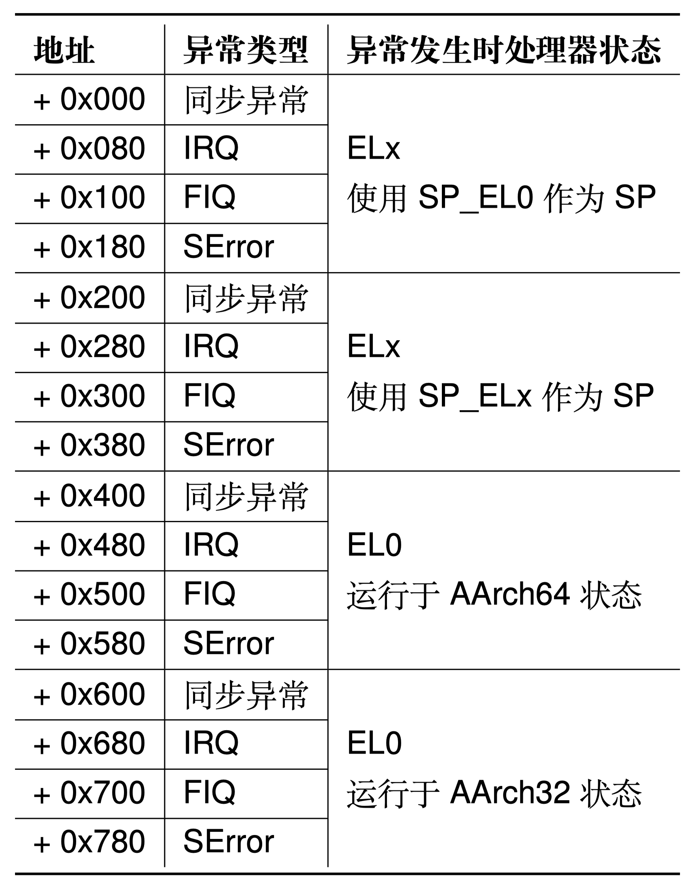

Tutorial视频链接：https://www.bilibili.com/video/BV11N411j7bR/

# 实验 3：进程与线程

用户进程是操作系统对在用户模式运行中的程序的抽象。在实验 1 和实验 2 中，已经完成了内核的启动和物理内存的管理，以及一个可供用户进程使用的页表实现。现在，我们将一步一步支持用户态程序的运行。

本实验包括四个部分：

1. 使用对应的数据结构，支持创建第一个用户态进程和线程，分析代码如何从内核态切换到用户态。
2. 完善异常处理流程，为系统添加必要的异常处理的支持。
3. 正确处理部分系统调用，保证用户程序的正常输出。
4. 编写一个简单用户程序，使用提供的 ChCore libc 进行编译，并加载至内核镜像中。

本实验代码包含了基础的 ChCore 操作系统镜像，除了练习题相关部分的源码以外（指明需要阅读的代码），其余部分通过二进制格式提供。
正确完成本实验的练习题之后，你可以在树莓派3B+QEMU或开发板上进入 ChCore shell。

本实验（以及之后的实验）使用 `expect` 工具进行自动化评分，你可能需要先在你的环境中安装 `expect`，具体方法因你使用的环境而异。例如，在Ubuntu上，你可以执行：

```bash
sudo apt install expect
```

## Preparation

实验 3 相较于实验 1 和实验 2 开放了部分用户态程序的代码，`user` 文件夹下提供了 `chcore-libc` 及 `system-services` 文件夹，并在根目录下添加了 `ramdisk` 文件夹，下面逐个介绍其作用。

- `ramdisk`。所有在 `ramdisk` 目录下的文件将被放入内核镜像的文件系统中。完成本实验后，可以在 shell 中使用 `ls` 命令查看文件。在 `ramdisk` 中预置了一些必要的系统服务程序(包括 shell、lwip、shared memory 等)以及测试程序(userland.bin)，请勿将其删除。
- `chcore-libc`。libc 是 C 语言标准库(C Standard Library)的缩写，它是一组提供了基本功能和操作的函数的库，用于支持 C 语言的标准。libc 中包含了很多标准的 C 函数，这些函数提供了许多基本的操作，如字符串处理、内存管理、输入输出等(来自 GPT)。`chcore-libc` 基于 `musl-libc` 进行修改以配合内核进行管理及系统调用，所有对 `musl-libc` 的修改均在 `chcore-libc/libchcore`中，实际编译时将使用脚本进行覆盖或打补丁。本实验也将在此处设置测试点。
- `system-services`。其中存放一些基本的系统服务，除了在 `ramdisk` 中已经包含的，还有 `tmpfs` 和 `procmgr`。`tmpfs` 是 ChCore 基本的内存文件系统，后续实验中将会有所涉及，本实验中无需关注。`procmgr` 是 ChCore 的进程管理器，所有代码均以源代码形式给出，其中包含了创建进程、加载 elf 文件等操作，感兴趣的同学可以阅读。

> 练习 0: 在项目根目录下运行以下命令以拉取 `musl-libc` 代码。
>```bash
> git submodule update --init --recursive
>```
> 使用 `make build` 检查是否能够正确项目编译。
>
> 注意：请确保成功拉取`musl-libc`代码后再尝试进行编译。若未成功拉取`musl-libc`就进行编译将会自动创建`musl-libc`文件夹，这可能导致无法成功拉取`musl-libc`代码，也无法编译成功。出现此种情况可以尝试将`user/chcore-libc/musl-libc`文件夹删除，并运行以上指令重新拉取代码。

## 第一部分：用户进程和线程

本实验的 OS 运行在 AArch64 体系结构，该体系结构采用“异常级别”这一概念定义程序执行时所拥有的特权级别。从低到高分别是 EL0、EL1、EL2 和 EL3。每个异常级别的具体含义和常见用法已在课程中讲述。

ChCore 中仅使用了其中的两个异常级别：EL0 和 EL1。其中，EL1 是内核模式，`kernel` 目录下的内核代码运行于此异常级别。EL0 是用户模式，`user` 目录下的用户库与用户程序代码运行在用户模式下。

在 ChCore 中，内核提供给用户的一切资源均采用 **Capability** 机制进行管理，所有的内核资源（如物理内存等）均被抽象为了**内核对象（kernel object）**。Capability 可以类比 Linux 中的文件描述符（File Descriptor）。在 Linux 中，文件描述符即相当于一个整型的 Capability，而文件本身则相当于一个内核对象。ChCore 的一个进程是一些对特定内核对象享有相同的 Capability 的线程的集合。ChCore 中的每个进程至少包含一个主线程，也可能有多个子线程，而每个线程则从属且仅从属于一个进程。

在实现中，一个 `cap_group` 作为一个进程的抽象，具体定义可以参见 `kernel/include/object/cap_group.h`。线程结构的定义可参见 `kernel/include/object/thread.h`。

关于 `cap_group` 的知识，可以参阅代码以及文档。

进程和线程相关的概念已经介绍完毕。在 ChCore 中，第一个被创建的进程是 `procmgr`，是 ChCore 核心的系统服务。本实验将以创建 `procmgr` 为例探索在 ChCore 中如何创建进程，以及成功创建第一个进程后如何实现内核态向用户态的切换。

创建用户程序至少需要包括创建对应的 `cap_group`、加载用户程序镜像并且切换到程序。在内核完成必要的初始化之后，内核将会跳转到创建第一个用户程序的操作中，该操作通过调用 `create_root_thread` 函数完成，本函数完成第一个用户进程的创建，其中的操作包括从`procmgr`镜像中读取程序信息，调用`create_root_cap_group`创建第一个 `cap_group` 进程，并在 `root_cap_group` 中创建第一个线程，线程加载着信息中记录的 elf 程序（实际上就是`procmgr`系统服务）。此外，用户程序也可以通过 `sys_create_cap_group` 系统调用创建一个全新的 `cap_group`。

由于 `cap_group` 也是一个内核对象，因此在创建 `cap_group` 时，需要通过 `obj_alloc` 分配全新的 `cap_group` 和 `vmspace` 对象（`TYPE_CAP_GROUP` 与 `TYPE_VMSPACE`）。对分配得到的 `cap_group` 对象，需要通过 `cap_group_init` 函数初始化并且设置必要的参数(Tip: size 参数已定义好 `BASE_OBJECT_NUM`)。对分配得到的 `vmspace` 对象则需要调用 `cap_alloc` 分配对应的槽（slot）。

> 练习 1: 在 `kernel/object/cap_group.c` 中完善 `sys_create_cap_group`、`create_root_cap_group` 函数。在完成填写之后，你可以通过 Cap create pretest 测试点。
>
> 提示：
> 可以阅读 `kernel/object/capability.c` 中各个与 cap 机制相关的函数以及参考文档。

然而，完成 `cap_group` 的分配之后，用户程序并没有办法直接运行，因为`cap_group`只是一个资源集合的概念。线程才是内核中的调度执行单位，因此还需要进行线程的创建，将用户程序 ELF 的各程序段加载到内存中。(此为内核中 ELF 程序加载过程，用户态进行 ELF 程序解析可参考`user/system-services/system-servers/procmgr/libs/libchcoreelf/libchcoreelf.c`，如何加载程序可以对`user/system-services/system-servers/procmgr/srvmgr.c`中的`procmgr_launch_process`函数进行详细分析)

> 练习 2: 在 `kernel/object/thread.c` 中完成 `create_root_thread` 函数，将用户程序 ELF 加载到刚刚创建的进程地址空间中。
>
> 提示：
>
> - 程序头可以参考`kernel/object/thread_env.h`。
> - 内存分配操作使用 `create_pmo`，可详细阅读`kernel/object/memory.c`了解内存分配。
> - 本练习并无测试点，请确保对 elf 文件内容读取及内存分配正确。否则有可能在后续切换至用户态程序运行时出错。

完成用户程序的内存分配后，用户程序代码实际上已经被映射在`root_cap_group`的虚拟地址空间中。接下来需要对创建的线程进行初始化，以做好从内核态切换到用户态线程的准备。

> 练习 3: 在 `kernel/arch/aarch64/sched/context.c` 中完成 `init_thread_ctx` 函数，完成线程上下文的初始化。

至此，我们完成了第一个用户进程与第一个用户线程的创建。接下来就可以从内核态向用户态进行跳转了。

回到`kernel/arch/aarch64/main.c`，在`create_root_thread()`
完成后，分别调用了`sched()`与`eret_to_thread(switch_context())`。

`sched()`的作用是进行一次调度，在此场景下我们创建的第一个线程将被选择。

`switch_context()`函数的作用则是进行线程上下文的切换，包括vmspace、fpu、tls等。并且将`cpu_info`中记录的当前CPU线程上下文记录为被选择线程的上下文（完成后续实验后对此可以有更深的理解）。`switch_context()` 最终返回被选择线程的`thread_ctx`地址，即`target_thread->thread_ctx`。

`eret_to_thread`最终调用了`kernel/arch/aarch64/irq/irq_entry.S`中的 `__eret_to_thread` 函数。其接收参数为`target_thread->thread_ctx`，将 `target_thread->thread_ctx` 写入`sp`寄存器后调用了 `exception_exit` 函数，`exception_exit` 最终调用 eret 返回用户态，从而完成了从内核态向用户态的第一次切换。

注意此处因为尚未完成`exception_exit`函数，因此无法正确切换到用户态程序，在后续完成`exception_exit`后，可以通过 gdb 追踪 pc 寄存器的方式查看是否正确完成内核态向用户态的切换。

> 思考题 4: 思考内核从完成必要的初始化到第一次切换到用户态程序的过程是怎么样的？尝试描述一下调用关系。

然而，目前任何一个用户程序并不能正常退出，也不能正常输出结果。这是由于程序中包括了 `svc #0` 指令进行系统调用。由于此时 ChCore 尚未配置从用户模式（EL0）切换到内核模式（EL1）的相关内容，在尝试执行 `svc` 指令时，ChCore 将根据目前的配置（尚未初始化，异常处理向量指向随机位置）执行位于随机位置的异常处理代码，进而导致触发错误指令异常。同样的，由于错误指令异常仍未指定处理代码的位置，对该异常进行处理会再次出发错误指令异常。ChCore 将不断重复此循环，并最终表现为 QEMU 不响应。后续的练习中将会通过正确配置异常向量表的方式，对这一问题进行修复。

## 第二部分：异常向量表

由于 ChCore 尚未对用户模式与内核模式的切换进行配置，一旦 ChCore 进入用户模式执行就再也无法正常返回内核模式使用操作系统提供其他功能了。在这一部分中，我们将通过正确配置异常向量表的方式，为 ChCore 添加异常处理的能力。

在 AArch64 架构中，异常是指低特权级软件（如用户程序）请求高特权软件（例如内核中的异常处理程序）采取某些措施以确保程序平稳运行的系统事件，包含**同步异常**和**异步异常**：

- 同步异常：通过直接执行指令产生的异常。同步异常的来源包括同步中止（synchronous abort）和一些特殊指令。当直接执行一条指令时，若取指令或数据访问过程失败，则会产生同步中止。此外，部分指令（包括 `svc` 等）通常被用户程序用于主动制造异常以请求高特权级别软件提供服务（如系统调用）。
- 异步异常：与正在执行的指令无关的异常。异步异常的来源包括普通中 IRQ、快速中断 FIQ 和系统错误 SError。IRQ 和 FIQ 是由其他与处理器连接的硬件产生的中断，系统错误则包含多种可能的原因。本实验不涉及此部分。

发生异常后，处理器需要找到与发生的异常相对应的异常处理程序代码并执行。在 AArch64 中，存储于内存之中的异常处理程序代码被叫做异常向量（exception vector），而所有的异常向量被存储在一张异常向量表（exception vector table）中。可参考`kernel/arch/aarch64/irq/irq_entry.S`中的图表。

<div align=center></div>


AArch64 中的每个异常级别都有其自己独立的异常向量表，其虚拟地址由该异常级别下的异常向量基地址寄存器（`VBAR_EL3`，`VBAR_EL2` 和 `VBAR_EL1`）决定。每个异常向量表中包含 16 个条目，每个条目里存储着发生对应异常时所需执行的异常处理程序代码。以上表格给出了每个异常向量条目的偏移量。

在 ChCore 中，仅使用了 EL0 和 EL1 两个异常级别，因此仅需要对 EL1 异常向量表进行初始化即可。在本实验中，ChCore 内除系统调用外所有的同步异常均交由 `handle_entry_c` 函数进行处理。遇到异常时，硬件将根据 ChCore 的配置执行对应的汇编代码，将异常类型和当前异常处理程序条目类型作为参数传递，对于 sync_el1h 类型的异常，跳转 `handle_entry_c` 使用 C 代码处理异常。对于 irq_el1t、fiq_el1t、fiq_el1h、error_el1t、error_el1h、sync_el1t 则跳转 `unexpected_handler` 处理异常。

> 练习 5: 按照前文所述的表格填写 `kernel/arch/aarch64/irq/irq_entry.S` 中的异常向量表，并且增加对应的函数跳转操作。

## 第三部分：系统调用

系统调用是系统为用户程序提供的高特权操作接口。在本实验中，用户程序通过 `svc` 指令进入内核模式。在内核模式下，首先操作系统代码和硬件将保存用户程序的状态。操作系统根据系统调用号码执行相应的系统调用处理代码，完成系统调用的实际功能，并保存返回值。最后，操作系统和硬件将恢复用户程序的状态，将系统调用的返回值返回给用户程序，继续用户程序的执行。

通过异常进入到内核后，需要保存当前线程的各个寄存器值，以便从内核态返回用户态时进行恢复。保存工作在`exception_enter` 中进行，恢复工作则由`exception_exit`完成。可以参考`kernel/include/arch/aarch64/arch/machine/register.h`中的寄存器结构，保存时在栈中应准备`ARCH_EXEC_CONT_SIZE`大小的空间。

完成保存后，需要进行内核栈切换，首先从`TPIDR_EL1`寄存器中读取到当前核的`per_cpu_info`（参考`kernel/include/arch/aarch64/arch/machine/smp.h`）,从而拿到其中的`cpu_stack`地址。

> 练习 6: 填写 `kernel/arch/aarch64/irq/irq_entry.S` 中的 `exception_enter` 与 `exception_exit`，实现上下文保存的功能，以及 `switch_to_cpu_stack` 内核栈切换函数。如果正确完成这一部分，可以通过 Userland 测试点。这代表着程序已经可以在用户态与内核态间进行正确切换。显示如下结果
>
> ```
> Hello userland!
> ```

在本实验中新加入了 `libc` 文件，用户态程序可以链接其编译生成的`libc.so`,并通过 `libc` 进行系统调用从而进行向内核态的异常切换。在实验提供的 `libc` 中，尚未实现 `printf` 的系统调用，因此用户态程序无法进行正常输出。实验接下来将对 `printf` 函数的调用链进行分析与探索。

`printf` 函数调用了 `vfprintf`，其中文件描述符参数为 `stdout`。这说明在 `vfprintf` 中将使用 `stdout` 的某些操作函数。

在 `user/chcore-libc/musl-libc/src/stdio/stdout.c`中可以看到 `stdout` 的 `write` 操作被定义为 `__stdout_write`，之后调用到 `__stdio_write` 函数。

最终 `printf` 函数将调用到 `chcore_stdout_write`。

> 思考 7: 尝试描述 `printf` 如何调用到 `chcore_stdout_write` 函数。
>
> 提示：`chcore_write` 中使用了文件描述符，`stdout` 描述符的设置在`user/chcore-libc/musl-libc/src/chcore-port/syscall_dispatcher.c` 中。

`chcore_stdout_write` 中的核心函数为 `put`，此函数的作用是向终端输出一个字符串。

> 练习 8: 在其中添加一行以完成系统调用，目标调用函数为内核中的 `sys_putstr`。使用 `chcore_syscallx` 函数进行系统调用。

至此，我们完成了对 `printf` 函数的分析及完善。从 `printf` 的例子我们也可以看到从通用 api 向系统相关 abi 的调用过程，并最终通过系统调用完成从用户态向内核态的异常切换。

## 第四部分：Hello ChCore

我们完成了内核态向用户态的切换，以及用户态向内核态的异常切换。同时，我们拥有了一个完整的 `libc`，可以帮助我们进行系统调用。接下来，我们将尝试使用 ChCore 的 `libc` 及编译器进行简单的程序编译，并将其加载到内核镜像中运行。

> 练习 9: 尝试编写一个简单的用户程序，其作用至少包括打印以下字符(测试将以此为得分点)。
>```
> Hello ChCore!
>```
> 使用 chcore-libc 的编译器进行对其进行编译，编译输出文件名命名为 `hello_chcore.bin`，并将其放入 ramdisk 加载进内核运行。内核启动时将自动运行 文件名为 `hello_chcore.bin` 的可执行文件。
>
> 提示:
> 
> - ChCore 的编译工具链在 `build/chcore-libc/bin` 文件夹中。 
> - 如使用 cmake 进行编译，可以将工具链文件指定为 `build/toolchain.cmake`，将默认使用 ChCore 编译工具链。

到这里，你的程序应该可以通过所有的测试点并且获得满分。你可以编写一些更复杂的程序并尝试放入 ChCore 中运行。


