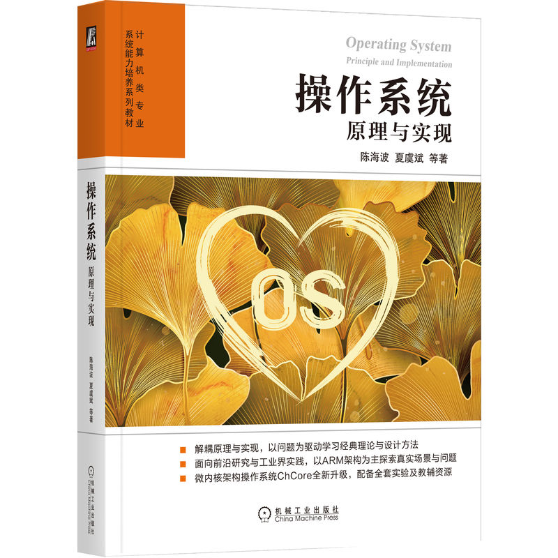

# 实验概述

本仓库包含上海交通大学IPADS实验室设计的操作系统课程系列实验。每个实验放在独立分支。

课程教材:

**如果你有任何建议或更正意见，欢迎提交 Pull Requests 或 Issues。让我们一起合作改进实验~**

## Lab0: 拆炸弹（ARM汇编）
该实验受到CSAPP课程启发，CSAPP课程设计了一个针对x86/x86-64汇编的拆炸弹实验。
不同之处在于，本实验目标是熟悉ARM汇编语言，并为后续的ARM/树莓派内核实验做好准备。

分支: bomb-lab

链接: https://github.com/SJTU-IPADS/OS-Course-Lab/tree/bomb-lab

Tutorial: https://www.bilibili.com/video/BV1q94y1a7BF/?vd_source=63231f40c83c4d292b2a881fda478960

## Lab1: 内核启动
该实验的主要内容是关于如何在内核启动过程中设置CPU异常级别、配置内核页表并启用MMU。
在内核实验系列中，我们将使用 [ChCore 微内核](https://www.usenix.org/conference/atc20/presentation/gu) 的基础版本，并使用 Raspi3b+作为实验平台（无论是使用QEMU树莓派模拟器还是树莓派开发板都可以）。

分支: ChCore-Lab1

链接: https://github.com/SJTU-IPADS/OS-Course-Lab/tree/ChCore-Lab1

Tutorial: [https://www.bilibili.com/video/BV1gj411i7dh/](https://www.bilibili.com/video/BV1gj411i7dh/?spm_id_from=333.337.search-card.all.click)

## Lab2: 内存管理
该实验主要内容是关于内核中的伙伴系统和slab分配器的实现，并为应用程序设置页表。

分支: ChCore-Lab2

链接: https://github.com/SJTU-IPADS/OS-Course-Lab/tree/ChCore-Lab2

Tutorial: https://www.bilibili.com/video/BV1284y1Q7Jc/?vd_source=316867e8ad2c56f50fa94e8122dd7d38

## Lab3: 进程与线程
该实验主要内容包括创建第一个用户态进程和线程，完善异常处理流程和系统调用，编写一个Hello-World在实验内核上运行。

分支: ChCore-Lab3

链接: https://github.com/SJTU-IPADS/OS-Course-Lab/tree/ChCore-Lab3

Tutorial: TBD

## 仓库建设者
### 教师
古金宇

夏虞斌

### 助教
周淳威

叶瑜超

苏浩然

史嘉成

闻天麟
