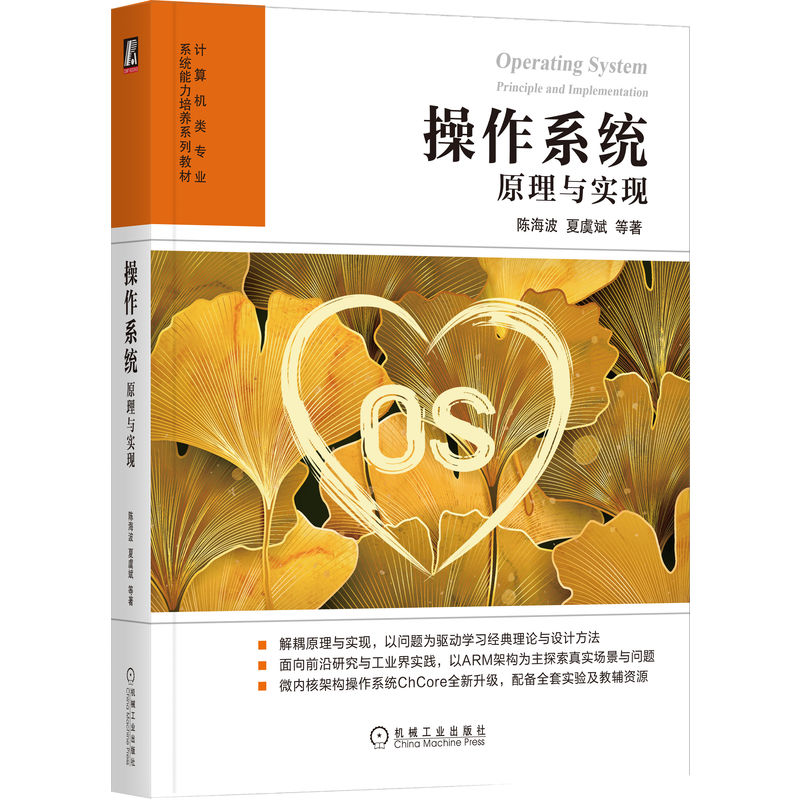

<div align="center">

# IPADS OS Course Lab

**以操作系统开发者的视角，自底向上理解计算机系统**

[](https://sjtu-ipads.github.io/OS-Course-Lab/)
[](https://github.com/SJTU-IPADS/OS-Course-Lab/releases/latest)
[](OS-Labs/LICENSE)
[](https://github.com/SJTU-IPADS/OS-Course-Lab/stargazers)
[](https://github.com/SJTU-IPADS/OS-Course-Lab/issues)


**[📖 在线实验手册](https://sjtu-ipads.github.io/OS-Course-Lab/)** ·
[🧭 我们的出发点](#-我们的出发点) ·
[📂 仓库内容](#-仓库内容) ·
[🚀 快速开始](#-快速开始) ·
[🤝 参与贡献](#-参与贡献)

</div>

<br>

> **操作系统不只是一门需要记住的课，更是一个可以亲手搭建起来的系统。**
>
> 这里是上海交通大学 IPADS 实验室的计算机系统课程材料。我们想介绍操作系统，更想以一位**操作系统开发者的视角**，带你走进它的内部。

## 🧭 我们的出发点

说起操作系统，很多人最先想到的是一串名词：进程、虚拟内存、调度、文件系统……它们出现在每一本教材里，却很少被真正“看见”。

我们想换一种方式：**不把操作系统当作需要背诵的黑盒，而是请你坐到开发者的位置上。**

你将从机器上电后执行的第一条指令出发，一步步让一个真实的微内核运转起来：它如何接管硬件，如何管理内存，如何让程序在多个核心上并发执行，又如何让彼此隔离的进程相互协作。每向前一步，你面对的都是操作系统开发者真实会遇到的问题：

- **这一层要向上提供什么抽象？** 进程、地址空间、文件，都是为上层精心设计的“假象”。
- **它又依赖下层的哪些机制？** 异常级别、页表、中断，抽象从来不是凭空而来的。
- **出了问题怎么办？** 读源码、下断点、看寄存器，像开发者一样调试。

<table>
  <tr>
    <td width="25%" align="center" valign="top">
      <h3>🔧</h3>
      <b>从机制出发</b><br>
      <sub>不止于“是什么”，更追问“如何实现”，答案就在真实内核的源码里</sub>
    </td>
    <td width="25%" align="center" valign="top">
      <h3>🧱</h3>
      <b>自底向上</b><br>
      <sub>从位与字节、指令与处理器，一直到内核与上层应用，每一层都建立在下一层之上</sub>
    </td>
    <td width="25%" align="center" valign="top">
      <h3>🐞</h3>
      <b>像开发者一样调试</b><br>
      <sub>QEMU、GDB、objdump 是日常工具，读源码（RTFSC）是基本功</sub>
    </td>
    <td width="25%" align="center" valign="top">
      <h3>🍓</h3>
      <b>跑在真实硬件上</b><br>
      <sub>面向 AArch64 架构，既能在 QEMU 中模拟，也能在树莓派开发板上运行</sub>
    </td>
  </tr>
</table>

### 一条路径，两门课程

- **计算机系统基础（ICS）是地基。** 以 CS:APP 为蓝本，先弄清程序如何在机器上运行：数据如何表示、指令如何执行、内存如何分配、机器之间如何通信。我们也会用同样的系统视角，去审视大模型推理、AI Agent 这样的现代负载。
- **操作系统（OS）是主角。** 基于 IPADS 自研的 [ChCore 微内核](https://www.usenix.org/conference/atc20/presentation/gu)，你会亲手补全一个能在 AArch64 上启动、管理内存、调度线程、进行进程间通信并提供文件系统的操作系统。

> [!TIP]
> 走完这条路，你可以在树莓派上用自己 DIY 的 ChCore 内核运行宝可梦游戏、调用 DeepSeek、在本地运行 Qwen-1.5B……

## 📂 仓库内容

<table>
  <tr>
    <td width="33%" valign="top">
      <h3>💻 <a href="OS-Labs"><code>OS-Labs/</code></a></h3>
      操作系统课程实验，基于 ChCore 微内核；同时包含在线实验手册源码 <a href="OS-Labs/Pages"><code>Pages/</code></a> 与课程讲义 <a href="OS-Labs/Slides"><code>Slides/</code></a>
    </td>
    <td width="33%" valign="top">
      <h3>🧮 <a href="ICS-Labs"><code>ICS-Labs/</code></a></h3>
      前置课程“计算机系统基础”（ICS / CS:APP）的实验，为操作系统打下地基
    </td>
    <td width="33%" valign="top">
      <h3>🎬 <a href="ICS-PPT"><code>ICS-PPT/</code></a></h3>
      ICS 课件：用 Python 编写讲义，一份源码可渲染为网页幻灯片、PowerPoint 与 LaTeX 教材章节
    </td>
  </tr>
</table>

### 配套资源

<table>
  <tr>
    <td valign="top">

- 📖 **[在线实验手册](https://sjtu-ipads.github.io/OS-Course-Lab/)**：环境搭建、实验说明与思考题
- 🔍 **[源码解析](https://sjtu-ipads.github.io/OS-Course-Lab/Appendix/source-code/Lab1/booting.html)**：逐段解读 ChCore 的关键代码
- 🛠️ **[工具教程](https://sjtu-ipads.github.io/OS-Course-Lab/Appendix/toolchains.html)**：tmux、GDB、objdump、make、QEMU
- 🎞️ **[课程讲义](OS-Labs/Slides)**：操作系统课程幻灯片（PDF）
- 📚 **配套教材**：《操作系统：原理与实现》，陈海波、夏虞斌等著，机械工业出版社

</td>
    <td width="200" align="center">
      
    </td>
  </tr>
</table>

## 🚀 快速开始

OS 实验依赖 Docker。推荐使用 VS Code 打开 `OS-Labs/` 目录并进入 Dev Container，即可获得预装好的完整工具链。

```bash
git clone https://github.com/SJTU-IPADS/OS-Course-Lab.git
cd OS-Course-Lab/OS-Labs/Lab1

make build   # 编译内核
make qemu    # 在 QEMU 模拟的树莓派上运行
make grade   # 本地评分
```

> [!IMPORTANT]
> Windows 用户请先开启开发者模式，并使用 `git clone -c core.symlinks=true ...` 克隆仓库。更多平台相关的注意事项见手册中的[如何开始实验](https://sjtu-ipads.github.io/OS-Course-Lab/Getting-started.html)。

ICS 实验的要求与评测方式请参阅 [`ICS-Labs/`](ICS-Labs) 下各实验目录中的说明文档。

## 🤝 参与贡献

如果你有任何建议或更正意见，欢迎提交 [Issue](https://github.com/SJTU-IPADS/OS-Course-Lab/issues) 或 [Pull Request](https://github.com/SJTU-IPADS/OS-Course-Lab/pulls)，让我们一起把实验做得更好。提交前请先阅读[贡献指南](https://sjtu-ipads.github.io/OS-Course-Lab/Contribute.html)：

- 提交信息遵循 [Conventional Commits](https://www.conventionalcommits.org/zh-hans/) 规范（允许的类型见 [`.commitlintrc.json`](OS-Labs/.commitlintrc.json)），例如 `fix(lab2): ...`、`docs: ...`
- 实验手册经 markdownlint 检查，合入 `main` 后由 GitHub Actions 自动构建并发布到 [GitHub Pages](https://sjtu-ipads.github.io/OS-Course-Lab/)

<a href="https://github.com/SJTU-IPADS/OS-Course-Lab/graphs/contributors">
  
</a>

## 📜 许可证

- 代码采用[木兰宽松许可证第 2 版（Mulan PSL v2）](OS-Labs/LICENSE)。
- ICS 实验中源自 CS:APP 的实验框架版权归 R. Bryant 与 D. O'Hallaron 所有，经 David O'Hallaron 教授授权使用；IPADS 修改的部分采用 Mulan PSL v2。
- OS 实验文档采用 [CC BY-NC-SA 4.0](https://creativecommons.org/licenses/by-nc-sa/4.0/) 协议。

<br>

<div align="center">

<sub>Made with ❤️ by <a href="https://ipads.se.sjtu.edu.cn/">IPADS</a>, Shanghai Jiao Tong University</sub>
<br>
<sub>如果这些材料对你有帮助，欢迎点亮一颗 ⭐</sub>

</div>
